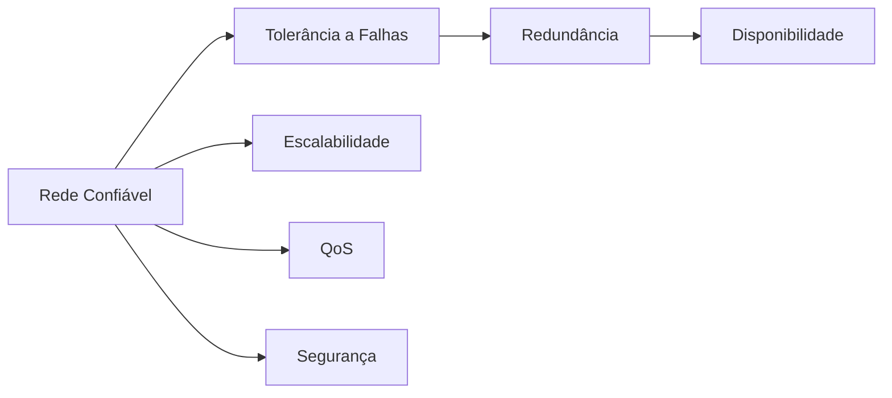
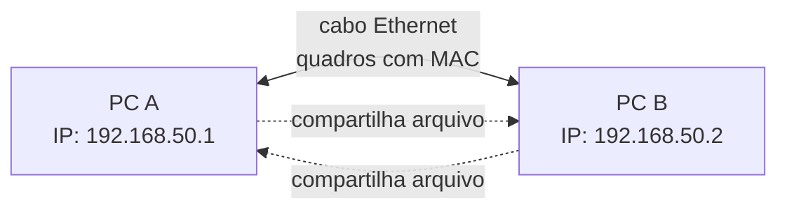
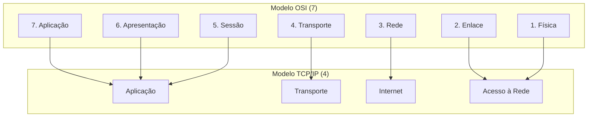
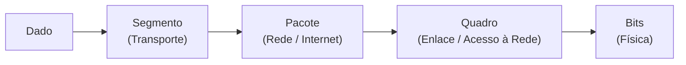
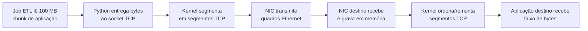
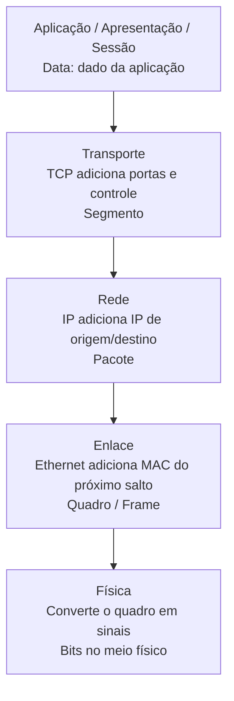

# Aprendizados — Redes e Cloud

👋 Bem-vindo ao teu caderno de revisão de **Redes e Cloud**! Aqui estão, de forma resumida e visual, os conceitos que a gente foi aprendendo nas aulas. A ideia é que este doc seja teu **parceiro de provas**: direto, com diagramas e tabelas pra fixar rápido. Vamos lá? 🚀

---

## 1. Requisitos de uma rede confiável

### 1.1 Os quatro requisitos

Uma rede confiável atende a quatro requisitos. Cada um resolve um problema diferente:

| Requisito | O que resolve | Como funciona |
|-----------|---------------|---------------|
| **Tolerância a falhas** | Falha de dispositivos/caminhos | Limita os dispositivos afetados; se um caminho falha, as mensagens são desviadas por outro enlace (redundância) |
| **Escalabilidade** | Crescimento sem degradar | Suporta novos usuários/aplicações sem perder desempenho, seguindo padrões e protocolos aceitos |
| **QoS** | Congestionamento de tráfego | Prioriza o tráfego sensível ao atraso; importa o **tipo** de tráfego, não o conteúdo |
| **Segurança** | Acesso não autorizado | Protege fisicamente os dispositivos e impede acesso não autorizado; baseia-se na tríade CIA |



### 1.2 Tolerância a falhas, redundância e disponibilidade

A **tolerância a falhas** e a **disponibilidade** andam juntas: uma rede de **alta disponibilidade** é a que permanece operacional e acessível quase o tempo todo, mesmo diante de falhas — isso se alcança por **redundância** de caminhos e equipamentos.

### 1.3 Segurança e tríade CIA

A **segurança** se apoia na tríade CIA:

| Pilar | Significado |
|-------|-------------|
| **C** — Confidencialidade | Só autorizados acessam os dados |
| **I** — Integridade | Dados não são alterados no caminho |
| **A** — Disponibilidade | O serviço está acessível quando precisar |

> 🧠 **Dica para memorizar:** "Rede confiável tem **T-E-S-Q** (**T**olerância a falhas, **E**scalabilidade, **S**egurança, **Q**oS). Traduzindo pro seu mundo de dados: **tolerância a falhas** é o seu pipeline que **retenta e desvia** quando um job falha (redundância → alta disponibilidade); **escalabilidade** é a tabela que **cresce em partições** sem travar; **QoS** é dar **prioridade ao job do dashboard executivo** quando o cluster congestiona; **segurança** é **só quem tem permissão no warehouse** acessa os dados de RH."

### 1.4 Exemplo de alta disponibilidade em cloud

**Exemplo com código (Terraform)** — redundância e alta disponibilidade, na prática:

```hcl
# Duas réplicas do banco de RH em zonas/AZs diferentes.
# Se uma zona cair, a outra continua servindo (tolerância a falhas).

resource "google_sql_database_instance" "rh" { # declara um recurso: uma instância de banco do GCP
  name             = "rh-db"                    # dá um nome pra essa instância: "rh-db"
  database_version = "POSTGRES_15"              # diz qual versão do banco usar (Postgres 15)
  region           = "us-central1"              # define a região onde o banco vai ficar

  settings {                                    # abre o bloco de configurações da instância
    tier              = "db-custom-2-7680"       # define o tamanho da máquina (2 vCPU, 7,5 GB RAM)
    availability_type = "REGIONAL"              # ATENÇÃO: cria réplica automática em OUTRA zona (redundância!)
    backup_configuration {                      # configura o backup automático do banco
      enabled                        = true     # liga o backup (deve estar ligado pra restaurar se algo der errado)
      point_in_time_recovery_enabled = true     # permite restaurar em qualquer minuto (PITR), não só no horário do backup
    }
  }
}

# Releitura da aplicação: se o job de RH não achar a instância primária,
# ele faz autofailover pra réplica — o "desvio de caminho" da rede confiável.
```

---

## 2. Conexão com a Internet: ISPs e meios de acesso

### 2.1 ISP e CSP

A conexão dos usuários com a Internet é feita por **ISPs** (Internet Service Providers). As WANs são gerenciadas por **CSPs** (operadoras tradicionais) ou ISPs.


### 2.2 Meios de acesso residenciais e pequenos escritórios

| Meio | Como funciona | Característica |
|------|---------------|----------------|
| Dial-up | Linha telefônica + modem | Banda pequena (kbits/s), econômico |
| DSL | Linha telefônica | Maior banda e disponibilidade; conexão sempre ativa; ADSL é assimétrico (download > upload) |
| Cable Modem | Mesmo cabo da TV a cabo | Maior banda e disponibilidade |
| Celular | Rede de telefonia celular | Limitado pela tecnologia da rede |
| Satélite | Antena parabólica | Útil em áreas de difícil implantação; precisa de visada direta |

### 2.3 Meios de acesso empresariais

- **Linhas dedicadas**: circuitos alugados que conectam escritórios geograficamente separados
- **Metro Ethernet**: estende a tecnologia de LAN para a MAN
- **Business DSL**: como o SDSL, simétrico (upload = download)

### 2.4 Comparativo: residencial vs. empresarial

| Critério | Residencial/pequenos escritórios | Empresas |
|----------|----------------------------------|----------|
| Exemplos | Dial-up, DSL, cable modem, celular, satélite | Linhas dedicadas, Metro Ethernet, Business DSL |
| Simetria | Em geral assimétrico (ADSL: download > upload) | Pode ser simétrico (SDSL: upload = download) |
| Foco | Custo e praticidade pro dia a dia | Confiabilidade e ligação entre sedes |

### 2.5 Enlace direto entre dois PCs e peer-to-peer

Ligar uma interface Ethernet de um PC diretamente à de outro cria um **enlace físico ponto a ponto** entre dois hosts, sem switch ou roteador no meio. Isso **não transforma automaticamente** a conexão em uma rede peer-to-peer: peer-to-peer é uma arquitetura em que os dois computadores podem atuar como cliente e servidor um do outro. Se os dois compartilharem arquivos, por exemplo, e cada um puder solicitar/oferecer recursos, então a rede direta estará sendo usada de modo par-a-par.



| Pergunta | Resposta |
|----------|----------|
| O cabo sozinho cria uma rede funcional? | Cria o enlace físico; ainda é preciso configurar/obter IPs compatíveis e permitir o tráfego no firewall |
| Vira peer-to-peer automaticamente? | Não. Vira P2P quando ambos os PCs oferecem e consomem serviços/recursos diretamente |
| Tem Internet automaticamente? | Não. Sem roteador/gateway, a comunicação fica restrita aos dois PCs; um deles teria de compartilhar sua conexão para fornecer Internet ao outro |
| Precisa de switch? | Não para apenas dois PCs; o cabo liga as duas interfaces diretamente |
| Cabo comum funciona? | Em NICs modernas, normalmente sim, por Auto MDI-X; equipamentos antigos podem exigir cabo crossover |

**Fluxo real após conectar:** o link Ethernet negocia a conexão física; os dois PCs precisam estar na mesma sub-rede (por exemplo, `192.168.50.1/24` e `192.168.50.2/24`); então cada um descobre o MAC do outro na rede local e envia quadros diretamente. Não há roteador no meio para encaminhar pacotes a outras redes.

**Exemplo com código (Linux)** — atribuir IPs estáticos temporários ao enlace direto:

```bash
# Execute estas duas linhas no PC A; substitua enp0s31f6 pelo nome da interface Ethernet real.
sudo ip addr add 192.168.50.1/24 dev enp0s31f6  # atribui ao PC A o IP 192.168.50.1 na rede 192.168.50.0/24
sudo ip link set enp0s31f6 up                   # liga a interface para que ela comece a transmitir e receber sinais

# Execute estas duas linhas no PC B; use o nome da interface Ethernet real desse PC.
sudo ip addr add 192.168.50.2/24 dev enp0s31f6  # atribui ao PC B o IP 192.168.50.2 na mesma rede local do PC A
sudo ip link set enp0s31f6 up                   # liga a interface Ethernet do PC B

# Execute esta linha no PC A depois de configurar os dois lados.
ping 192.168.50.2                               # envia pacotes ICMP ao PC B para confirmar que o enlace e os IPs funcionam
```

---

## 3. Protocolos de rede

### 3.1 Definição e papel

Definição (KUROSE e ROSS, 2016): um protocolo define o **formato** e a **ordem** das mensagens trocadas entre duas ou mais entidades comunicantes, bem como as **ações** realizadas na transmissão e/ou no recebimento de uma mensagem. Em resumo: o protocolo define **como** as mensagens são trocadas entre origem e destino.

> 🧠 **Dica para memorizar:** "Um protocolo é tipo o **schema do ponto de entrada da sua API de folha de pagamento**: define em que **ordem** os campos entram, o **formato** (JSON/campos), e **o que o serviço faz** ao receber (valida, responde). Não define se você roda em **on-premise ou cloud** (hardware) — mesmo schema vale pra qualquer integração (LAN) ou pra outra empresa (WAN)."

### 3.2 O que protocolos fazem e não fazem

Pontos importantes:

- São implementados por dispositivos finais e intermediários em **software, hardware ou ambos**
- Cada protocolo tem sua **própria camada**, função, formato e regras de comunicação
- Funcionam tanto em redes locais quanto remotas

O que protocolos **NÃO** fazem (pegadinhas de prova):

- Não definem o tipo de hardware usado
- Não funcionam apenas em uma camada (ex.: só no acesso à rede)
- Não se restringem a redes locais ou remotas

### 3.3 Tipos de protocolos

| Tipo | O que faz | Exemplos |
|------|-----------|----------|
| **Comunicação** | Permitem a troca de dados entre dispositivos | IP, TCP, HTTP |
| **Segurança** | Protegem a comunicação (criptografia, acesso) | SSH, SSL, TLS |
| **Roteamento** | Escolhem o melhor caminho pela rede | RIP, OSPF, BGP |
| **Descoberta de serviço** | "Descobrem"/atribuem recursos (IP, nomes) | DHCP, DNS |

---

## 4. Modelos de referência: OSI e TCP/IP

### 4.1 Equivalência entre OSI e TCP/IP

As redes são organizadas em camadas. Os dois modelos principais conversam mesmo com quantidades diferentes de camadas:



No modelo TCP/IP, a camada **Acesso à Rede** reúne as funções das camadas **Física** e **Enlace** do modelo OSI. A camada OSI Física trata dos sinais e meios de transmissão; a camada OSI Enlace trata dos quadros e endereços MAC. O TCP/IP agrupa essas duas responsabilidades em uma única camada.

| Modelo OSI | Modelo TCP/IP | Responsabilidade principal |
|------------|---------------|----------------------------|
| Física (1) | Acesso à Rede | Transmitir bits como sinais no meio físico |
| Enlace (2) | Acesso à Rede | Montar e entregar quadros usando MAC |
| Rede (3) | Internet | Encaminhar pacotes usando IP |
| Transporte (4) | Transporte | Comunicação entre aplicações usando portas |
| Sessão, Apresentação e Aplicação (5-7) | Aplicação | Serviços e dados das aplicações |

### 4.2 Funções das camadas TCP/IP

Função de cada camada do **TCP/IP**:

- **Aplicação**: representa os dados para o usuário, além de codificação e controle de diálogo
- **Transporte**: suporta a comunicação entre vários dispositivos em diversas redes
- **Internet**: **determina o melhor caminho pela rede** — é onde acontece o roteamento, feito pelo protocolo **IP**
- **Acesso à Rede**: controla os dispositivos de hardware e mídia

### 4.3 Roteamento na camada Internet/Rede

> **Roteamento**: no TCP/IP é a camada **Internet**; no OSI corresponde à camada **Rede** (3). É o protocolo IP, usado pelos roteadores, que encaminha as mensagens por uma internetwork.


### 4.4 Exemplo de roteamento em cloud

**Exemplo com código (Terraform)** — a camada de rede decidindo o caminho (roteamento):

```hcl
# A camada Internet/Redes "decide o melhor caminho" — aqui, via tabela de rotas.

resource "google_compute_network" "rh" { # cria uma rede (VPC) chamada "vpc-rh"
  name                    = "vpc-rh"     # nome da rede no GCP
  auto_create_subnetworks = false        # NÃO cria sub-redes automaticamente; a gente cria manual
}

# Rota padrão: tudo que não é local vai pro gateway da internet
resource "google_compute_route" "default" {    # cria uma rota (regra de caminho) na rede
  name             = "rota-internet"           # nome dessa rota: "rota-internet"
  network          = google_compute_network.rh.name # qual rede essa rota pertence (a vpc-rh criada acima)
  dest_range       = "0.0.0.0/0"               # para QUALQUER destino (0.0.0.0/0 = todo endereço) — "rota padrão"
  next_hop_gateway = "default-internet-gateway" # sai pelo gateway da internet (o "portão" da rede pro mundo)
}

# Rota específica: tráfego pro datacenter de RH vai pelo túnel VPN (caminho preferido)
# = "roteamento dinâmico escolhe o melhor caminho" (aula: camada de rede / roteamento)
resource "google_compute_route" "to_dc" {          # cria outra rota específica
  name             = "rota-datacenter-rh"          # nome dessa rota: "rota-datacenter-rh"
  network          = google_compute_network.rh.name # mesma rede da anterior (vpc-rh)
  dest_range       = "10.20.0.0/16"                # só para a rede interna do datacenter de RH (10.20.x.x)
  next_hop_vpn_tunnel = google_compute_vpn_tunnel.rh.id # manda por um túnel VPN (caminho privado e seguro) p/ o datacenter
}
# Resumo: roteamento = "qual caminho cada pacote segue" — a camada de rede decide isso
```

---

## 5. Encapsulamento, pacotes e frames

### 5.1 PDUs e encapsulamento

Cada camada acrescenta seu cabeçalho à **PDU** (Protocol Data Unit) recebida da camada superior. As PDUs mudam de nome conforme a camada:

O processo de colocar uma PDU dentro de outra PDU é chamado de **encapsulamento**. Durante o envio, a camada inferior recebe a PDU da camada superior, acrescenta suas próprias informações de controle e cria uma nova PDU. No destino, ocorre o processo inverso, chamado **desencapsulamento**: cada camada remove e interpreta seu cabeçalho até entregar os dados à aplicação.



| PDU | Camada | Endereço usado | Alcance |
|-----|--------|----------------|---------|
| **Data** | Aplicação/Apresentação/Sessão (7/6/5) | — | O dado do usuário como entra na pilha |
| **Segmento** | Transporte (4) | **Porta** (qual aplicação no destino) | Processo a processo — conversas individuais |
| **Pacote** | Rede (3) | **IP** (destino final) | Internetwork — viaja de roteador a roteador |
| **Quadro (Frame)** | Enlace (2) | **MAC** (próximo salto) | Mesma mídia — vai de vizinho a vizinho |
| **Bits** | Física (1) | — | Transmissão pelo meio físico |

**Exemplo com código (Scapy)** — visualizar uma PDU carregada dentro de outra:

```python
from scapy.all import Ether, IP, TCP, Raw  # importa as camadas usadas para montar a comunicação
dados = Raw(load=b"consulta de colaboradores")  # cria os dados da aplicação como bytes
segmento = TCP(sport=50000, dport=443) / dados  # coloca os dados dentro de um segmento TCP com portas
pacote = IP(src="192.168.50.10", dst="10.20.0.15") / segmento  # coloca o segmento dentro de um pacote IP
quadro = Ether(src="00:11:22:33:44:55", dst="aa:bb:cc:dd:ee:ff") / pacote  # coloca o pacote dentro de um quadro Ethernet
quadro.show()  # exibe a estrutura para visualizar o encapsulamento camada por camada
```

Neste exemplo, `dados` está dentro de `segmento`, que está dentro de `pacote`, que está dentro de `quadro`. O `/` do Scapy representa essa composição das camadas; em uma comunicação real, o kernel e a NIC fazem esse trabalho.

Quando a NIC recebe os sinais físicos, a camada física recupera os bits e reorganiza esses bits em um **quadro (frame)**. Esse quadro é então entregue à camada de enlace para que ela possa verificar e interpretar os endereços MAC. Portanto, a PDU que chega à camada de enlace depois da recepção física é o **frame** (`04-comunicacao-e-camada-fisica.md:109-111`).

**OSI ↔ TCP/IP ↔ PDU ↔ protocolo, numa tacada só:**

| OSI | TCP/IP | PDU | Protocolo exemplo | Endereço |
|-----|--------|-----|-------------------|----------|
| Aplicação, Apresentação, Sessão (5-7) | Aplicação | Data | HTTP | — |
| Transporte (4) | Transporte | Segmento | TCP | Porta |
| Rede (3) | Internet | Pacote | IP | Endereço IP |
| Enlace (2) | Acesso à Rede | Quadro | Ethernet | MAC |
| Física (1) | Acesso à Rede | Bits | — | — |

### 5.2 Segmentação e remontagem

A mensagem longa é quebrada em pedaços (segmentos) que cabem nos limites de tamanho do quadro. Cada segmento é numerado (sequenciamento) para o destino conseguir remontar a mensagem original mesmo se chegarem fora de ordem.

### 5.3 Segmentação TCP vs. chunks de ETL

Os dois processos quebram dados em partes, mas resolvem problemas diferentes e ocorrem em camadas diferentes. Quando um job lê um CSV de 20 GB em chunks de 100 MB, essa é uma decisão da **sua aplicação** para limitar memória, controlar paralelismo e facilitar retentativas. Depois que o job envia esses 100 MB por uma conexão TCP, o sistema operacional ainda divide esse fluxo em segmentos menores, adequados à rede, sem o código Python precisar controlar o tamanho de cada pacote.

| Aspecto | Chunk de ETL | Segmentação TCP |
|---------|--------------|-----------------|
| Camada | Aplicação | Transporte (4) |
| Quem decide | Seu código/job | Sistema operacional e pilha TCP |
| Unidade típica | Arquivo, lote de registros, partição de tabela | Segmento de rede, limitado pelo caminho/enlace |
| Objetivo | Não estourar memória; paralelizar; retomar processamento | Transmitir dados com controle de fluxo e remontar corretamente |
| Retentativa | Seu pipeline precisa ser idempotente | TCP retransmite o trecho perdido da conexão |

Em uma conexão TCP, a aplicação entrega um **fluxo de bytes**, não uma lista de pacotes: os limites de uma chamada `send()` ou de um chunk de ETL não são preservados como limites de pacote. Vários segmentos podem ficar "em voo" ao mesmo tempo; se chegarem fora de ordem, o TCP os ordena antes de entregar os bytes ao processo de destino. Vários workers/threads podem abrir várias conexões e gerar fluxos concorrentes, mas isso é diferente de o TCP usar um "ID de núcleo" para enviar dados.



### 5.4 Fluxo de encapsulamento: a descida obrigatória pela pilha

Para enviar dados pela rede, a mensagem desce pelas camadas. Cada camada acrescenta informações de controle próprias; por isso a PDU muda de nome. No destino, o caminho é o inverso: as camadas removem seus cabeçalhos até entregar os dados à aplicação.



| Etapa | O que a camada acrescenta | PDU após a etapa |
|-------|----------------------------|------------------|
| Aplicação, apresentação e sessão | Dados e regras da aplicação | Data |
| Transporte | Portas, controle de fluxo, sequenciamento e confiabilidade (TCP) | Segmento |
| Rede | IP de origem e destino para encaminhar entre redes | Pacote |
| Enlace | MAC de origem e do próximo salto para entrega no enlace local | Quadro/Frame |
| Física | Representação dos bits como sinal elétrico, luz ou ondas de rádio | Bits/sinais |

**A regra geral está certa:** em uma comunicação de rede, os serviços necessários de cada camada participam do envio e do recebimento; não se entrega um dado HTTP diretamente no cabo sem transporte, endereçamento e enlace. Mas há três detalhes importantes:

1. O modelo **OSI é conceitual**. Na pilha TCP/IP real, apresentação e sessão não aparecem como camadas separadas: suas responsabilidades ficam dentro da camada de aplicação.
2. Nem todo transporte é TCP. Com **UDP**, a PDU da camada de transporte é um **datagrama**, não um segmento, e não há a mesma garantia de entrega/ordem do TCP.
3. Na camada física, não trafegam "zeros e uns" abstratos: os bits são codificados em **sinais elétricos** (cabo), **pulsos de luz** (fibra) ou **ondas de rádio** (Wi-Fi). O receptor interpreta esses sinais de volta como bits.

**Eletricidade não é protocolo.** Ela é um dos meios físicos que pode transportar um sinal. Um protocolo/padrão define as regras de como o sinal deve ser gerado e interpretado: níveis ou transições de tensão, velocidade, sincronização, tipo de cabo e conectores. Em uma rede Ethernet cabeada, por exemplo, o equipamento transforma bits em sinais elétricos no cabo; em fibra, transforma bits em pulsos de luz; no Wi-Fi, em ondas de rádio. O padrão físico permite que os dois lados leiam o mesmo sinal com o mesmo significado.

| Conceito | O que é | Exemplo |
|----------|---------|---------|
| Meio físico | Por onde o sinal viaja | Cabo de cobre, fibra óptica, ar no Wi-Fi |
| Sinal | A representação física de bits | Variação de tensão, pulso de luz, onda de rádio |
| Protocolo/padrão físico | Regras para codificar e interpretar o sinal | Ethernet/IEEE 802.3, Wi-Fi/IEEE 802.11 |

### 5.5 CPU, NIC e endereçamento

**Ponto que confunde (e costuma cair em prova): a CPU e seus núcleos NÃO têm "ID" usado no endereçamento da rede — mas a CPU É quem executa o software que segmenta/remonta.** Há dois papéis diferentes: o de **processamento** (executar o código) e o de **endereçamento** (identificar na rede).

| Quem | Qual papel | O que faz |
|------|-----------|-----------|
| CPU / núcleos | **Processamento** | Executa o código dos protocolos (segmentar/remontar); **não vira endereço** na rede |
| NIC (placa de rede) | Enlace local | Coloca/lê o quadro com MAC no trecho físico; não administra a entrega à CPU destino |
| IP | **Endereçamento** | Identifica a máquina destino |
| Porta | **Endereçamento** | Identifica a aplicação dentro da máquina |

> O software de transporte **precisa de CPU para rodar** (todo programa precisa), mas o **endereço na rede é IP + porta** — nunca o "número do núcleo".

### 5.6 Exemplo de encapsulamento com Scapy

**Exemplo com código (Scapy)** — montar um pacote camada a camada e ver o encapsulamento:

```python
from scapy.all import Ether, IP, TCP  # importa as "camadas" que iremos empilhar

# CONCEITO: cada linha abaixo é UMA camada embrulhando a anterior.
# É exatamente o "cada camada adiciona seu cabeçalho" da teoria.

pacote = Ether()                  # camada 2 (Enlace): cria um quadro Ethernet vazio
pacote = Ether()/IP()             # embrulha o quadro dentro de um pacote IP (camada 3 / Rede)
pacote = Ether()/IP()/TCP()       # embrulha o pacote IP num segmento TCP (camada 4 / Transporte)

# Agora preenchemos os endereços que "cada camada sabe" (que vimos na tabela de PDUs):
pacote[Ether].dst = "aa:bb:cc:dd:ee:ff"  # MAC de destino (o próximo salto no enlace) — Ethernet responde pelo MAC
pacote[Ether].src = "00:11:22:33:44:55"  # MAC de origem (minha placa de rede)
pacote[IP].dst    = "8.8.8.8"            # IP de destino (a máquina final) — camada de Rede responde pelo IP
pacote[IP].src    = "192.168.1.10"       # IP de origem (meu computador)
pacote[TCP].dport = 443                  # porta de destino (HTTPS) — camada de Transporte responde pela porta
pacote[TCP].sport = 50000                # porta de origem (aleatória, pra resposta chegar de volta)

# Repare: cada camada só conhece o "endereço" dela (MAC / IP / porta).
# Empilhadas, elas formam uma PDU com cabeçalhos de enlace, rede e transporte.

# Para ver o resultado encapsulado (mostra os cabeçalhos hexadecimais na ordem):
# pacote.show()   # descomente p/ exibir a estrutura em texto
```

> ⚙️ **Por baixo dos panos:** esse "empilhamento" que o Scapy monta pra você é, no mundo real, feito em **baixo nível** — o kernel grava esses cabeçalhos direto na memória usando **raw sockets / eBPF (XDP)** em C, e a placa de rede (NIC) transmite os bytes. O Scapy só **revela** o conceito de forma legível; a implementação de verdade é low-level.

### 5.7 Aplicabilidade para engenharia de dados

Em um time de dados que apenas consome recursos gerenciados pela plataforma, normalmente não é responsabilidade do engenheiro de dados configurar VPCs, VPNs, regras de firewall, roteamento ou investigar pacotes com Scapy. Esse trabalho tende a ficar com as equipes de plataforma, cloud/SRE e segurança. Ainda assim, entender redes ajuda a separar um defeito do pipeline de um problema de infraestrutura: um timeout do Airflow ao acessar o warehouse pode ser DNS, rota, firewall, endpoint privado ou porta bloqueada — não necessariamente falha no código ou no SQL.

| Situação | Profundidade de redes esperada para dados | Time normalmente responsável |
|----------|--------------------------------------------|-----------------------------|
| Consumir API, banco, bucket ou fila | Saber endpoint, DNS, porta, TLS, timeout, retry e limites de conexão | Engenharia de dados |
| Diagnosticar timeout/intermitência | Coletar logs, identificar se o erro é de rede e acionar o time certo com evidências | Engenharia de dados + plataforma |
| Configurar VPC, VPN, firewall, rotas ou balanceador | Entender o impacto, mas não necessariamente implementar | Plataforma/cloud/SRE ou segurança |
| Analisar pacotes ou usar Scapy | Usar apenas em laboratório, testes controlados ou investigação especializada | Segurança, rede ou plataforma |

O conhecimento de camadas, IP, portas, DNS, controle de fluxo, disponibilidade e retries continua valioso para projetar pipelines resilientes e conversar objetivamente com as equipes que gerenciam a infraestrutura. Em uma empresa mais híbrida, com dados on-premise, redes privadas, alta escala ou responsabilidade de data platform, essa fronteira pode mudar e esses conceitos passam a aparecer muito mais no trabalho diário.

### 5.8 Comunicação web de ponta a ponta

O processo completo, do clique no navegador até a resposta do servidor:

```mermaid
sequenceDiagram
    participant App as Aplicação (HTTP)
    participant Transp as Transporte (TCP)
    participant Net as Internet (IP)
    participant Link as Acesso à Rede (Ethernet)
    participant Srv as Servidor

    Note over App: Usuário pede uma página<br>no navegador
    App->>Transp: Dado (requisição HTTP)
    Note over Transp: + cabeçalho TCP<br>(entrega confiável,<br>controle de fluxo)
    Transp->>Net: Segmento TCP
    Note over Net: + cabeçalho IP<br>(endereço do destino final)
    Net->>Link: Pacote IP
    Note over Link: + cabeçalho Ethernet<br>(MAC do próximo salto)
    Link->>Srv: Quadro vira bits<br>pelo meio físico
    Note over Srv: Processo inverso:<br>remove os cabeçalhos<br>de cada camada até a aplicação
    Srv-->>App: Resposta HTTP (página)
```

Na **ida**, cada camada "embrulha" o dado com seu cabeçalho (encapsulamento); na **chegada**, o servidor "desembrulha" camada por camada até chegar à aplicação. Na volta, o mesmo processo se repete com a resposta.

> 🧠 **Dica para memorizar (encapsulamento):** "Enviar dados pela rede é como **ligar seu pipeline de dados via fila (Kafka)**: a mensagem grande é dividida em **partes numeradas** (segmentação); cada parte ganha o **tema/partição do tópico** (IP — pra onde vai); e, dentro do cluster, cada pedaço trafega de **broker a broker** (MAC — vizinho a vizinho). No consumer, **agrupa-se pelo número da partição** e remonta na ordem — exatamente como o destino remonta os segmentos."

### 5.9 Papel dos protocolos em uma comunicação web

| Protocolo | Camada | Papel |
|-----------|--------|-------|
| **HTTP** | Aplicação | Governa a interação cliente-servidor web |
| **TCP** | Transporte | Gerencia as conversas, garante entrega confiável e controla o fluxo |
| **IP** | Internet/Rede | Entrega as mensagens; os roteadores o usam para encaminhar |
| **Ethernet** | Acesso à Rede/Enlace | Entrega o quadro de um NIC a outro na mesma mídia |

---

## 6. MAC vs IP: a diferença essencial

### 6.1 Conceitos e glossário

É na **camada de enlace (2)** que o endereço MAC de destino é adicionado ao pacote, transformando-o em **quadro**. O roteador olha o **IP** para decidir o caminho, mas quem entrega o dado ao próximo vizinho é o **frame com o MAC**.

**Glossário:**

| Termo | O que é |
|-------|---------|
| **NIC** | Placa de rede; a interface física do dispositivo |
| **MAC** | Endereço físico gravado de fábrica no NIC, único, usado na camada de enlace |
| **IP** | Endereço lógico da camada de rede, muda conforme a rede |
| **Vizinho** | Dispositivo diretamente conectado na mesma mídia (próximo salto) |
| **Roteador** | Dispositivo intermediário que roteia o pacote pelo melhor caminho |

### 6.2 Como MAC e IP atuam na prática

Quando você manda uma mensagem, o dispositivo de origem monta o quadro com **dois endereços**: o **MAC de destino** (gravado de fábrica no NIC do equipamento que está fisicamente na mesma rede — o próximo salto) e o **IP de destino** (o endereço lógico da máquina, que muda conforme a rede onde ela está). Como o MAC vem de fábrica e é único por interface, ele serve pra entrega local (mesmo enlace); o IP, por mudar com a rede, é o que viaja entre redes. Ex.: um notebook com **Wi-Fi e cabo** tem **dois MACs** (um por placa), e pela internet é encontrado pelo seu **IP**, não pelo MAC.

| | MAC | IP |
|--|-----|-----|
| Natureza | Físico (de fábrica no NIC) | Lógico (atribuído pela rede) |
| Camada | Enlace (2) | Rede (3) |
| Onde é usado | Mesmo enlace (vizinho próximo) | Entre redes (internetwork) |
| Muda de rede? | Não | Sim |

### 6.3 Comparativo: porta, IP e MAC

| Informação | Camada | PDU | Identifica | Alcance |
|------------|--------|-----|------------|---------|
| Porta | Transporte (4) | Segmento | Serviço/aplicação no destino | Processo a processo |
| IP | Rede (3) | Pacote | Máquina destino | Entre redes |
| MAC | Enlace (2) | Quadro | Próximo salto no enlace | Rede local/enlace |

> 🧠 **Dica para memorizar (os 3 endereços):** "Pense numa consulta ao seu warehouse: a **porta** (camada 4) indica *qual serviço*, tipo a **conexão do Airflow pro Postgres na porta 5432**; o **IP** (camada 3) indica *qual servidor*, tipo o **endpoint da instância de banco**; o **MAC** (camada 2) indica o *nó físico vizinho*, tipo o **MAC do switch dentro do cluster**. Cada camada etiqueta a mensagem com um desses dados conforme ela desce a pilha."

---

## 7. Resumão rápido (colinha final)

### 7.1 Perguntas essenciais

| Pergunta | Resposta |
|----------|----------|
| Requisitos de rede confiável? | Tolerância a falhas, Escalabilidade, QoS, Segurança |
| Qual lida com acesso não autorizado? | Segurança (tríade CIA) |
| Qual prioriza tráfego? | QoS |
| Alta disponibilidade se alcança com? | Redundância |
| Quem fornece acesso à Internet? | ISPs |
| Roteamento no TCP/IP / OSI? | Internet / Rede (3) |
| PDU da camada 4 / 3 / 2? | Segmento / Pacote / Quadro |
| Quadro recebe qual endereço? | MAC (enlace) |
| Segmento recebe qual endereço? | Porta (transporte) |
| Pacote recebe quais endereços? | IP de origem e destino (rede) |
