# Aprendizados — Redes e Cloud

📧 **Índice de Analogias da Logística dos Correios** — Este caderno usa a analogia da central de correios (cartas, envelopes, carteiros, agências e centros de distribuição) para explicar conceitos de redes computacionais. Use este índice para navegar rapidamente:

| Seção | Conceito Explicado pela Analogia dos Correios |
|-------|---------------------------------------------|
| 1.1 | 4 requisitos de rede (tolerância a falhas, escalabilidade, QoS, segurança) |
| 3.1 | Definição e papel de protocolos |
| 4.1 | Modelo OSI vs TCP/IP (estações de trabalho dos correios) |
| 5.1 | Encapsulamento (envelopando cartas em envelopes) |
| 5.3 | Segmentação TCP vs chunks de ETL |
| 5.4 | Fluxo de encapsulamento (descida pela pilha) |
| 5.8 | Comunicação web ponta a ponta (ida e volta pelos correios) |
| 5.9 | Papel dos protocolos (HTTP=carta, TCP=envelope, IP=CEP, Ethernet=rótulo) |
| 6.2 | MAC vs IP (rótulo da agência vs CEP de entrega) |
| 6.3 | Comparativo porta, IP e MAC (tipo de serviço, CEP, rótulo da agência) |
| 6.4 | Frame destinatário em comunicação remota (rótulo da agência vs destino final) |
| 8.1 | Largura de banda (capacidade da frota de caminhões) |
| 8.2 | Gargalo e caminho completo (trecho estreito da rota) |
| 8.3 | Cálculo de tempo de transferência (tempo da entrega pelos correios) |
| 8.4 | Conversão bits por 8 (caixas de 8 cartas) |

---

👋 Bem-vindo ao teu caderno de revisão de **Redes e Cloud**! Aqui estão, de forma resumida e visual, os conceitos que a gente foi aprendendo nas aulas. A ideia é que este doc seja teu **parceiro de provas**: direto, com diagramas e tabelas pra fixar rápido. Vamos lá? 🚀

---

## 1. Requisitos de uma rede confiável

### 1.1 Os quatro requisitos

Uma rede confiável atende a quatro requisitos. Cada um resolve um problema diferente:

| Requisito | O que resolve | Como funciona | **Analogística dos Correios** |
|-----------|---------------|---------------|--------------------------------|
| **Tolerância a falhas** | Falha de dispositivos/caminhos | Limita os dispositivos afetados; se um caminho falha, as mensagens são desviadas por outro enlace (redundância) | **Uma agência dos correios danificada** — se uma agência pegar fogo, o serviço de entrega desvia cartas por outra agência próxima. O endereço de entrega (IP) permanece o mesmo, só muda o rótulo da agência intermediária (MAC). |
| **Escalabilidade** | Crescimento sem degradar | Suporta novos usuários/aplicações sem perder desempenho, seguindo padrões e protocolos aceitos | **Rede de agências crescendo** — à medida que mais casas são adicionadas ao território de entrega, novas agências são abertas ou existentes expandem. O sistema continua funcionando porque o protocolo (formato do endereço) é padronizado. |
| **QoS** | Congestionamento de tráfego | Prioriza o tráfego sensível ao atraso; importa o **tipo** de tráfego, não o conteúdo | **Cartas prioritárias** — o serviço de correios oferece "mail class": Priority Mail (entrega rápida), First Class (entrega padrão), Media Mail (lento, barato). O conteúdo da carta não muda, apenas o tipo de serviço/rótulo colado. |
| **Segurança** | Acesso não autorizado | Protege fisicamente os dispositivos e impede acesso não autorizado; baseia-se na tríade CIA | **Selos e franqueadores seguros** — assim como cartas seladas com lacres de segurança, os dados na rede têm proteções. A tríade CIA mapeia-se: Confidencialidade = carta selada apenas para destinatário; Integridade = carta sem rasuras; Disponibilidade = serviço de correios funcionando sempre. |

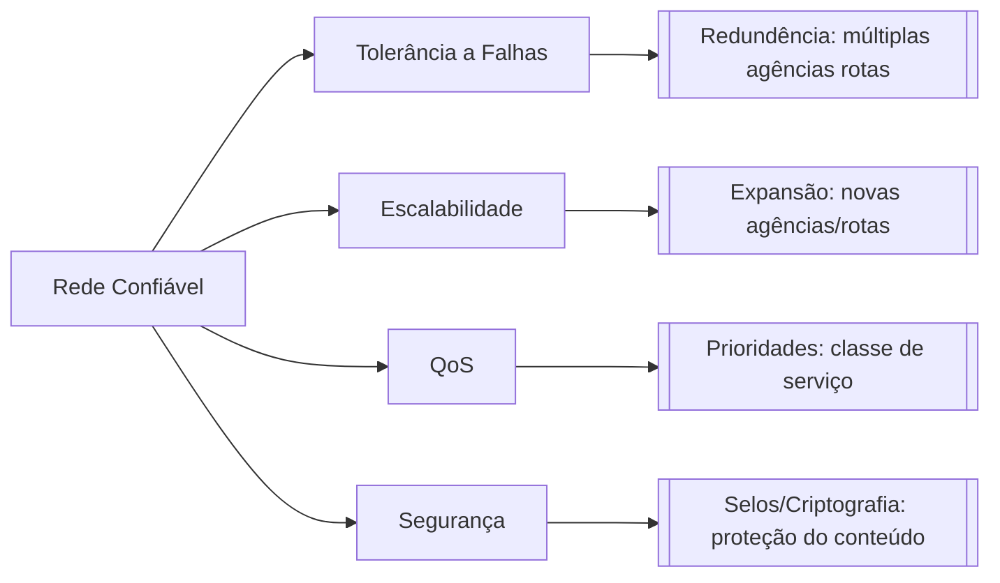

> 🧠 **Dica para memorizar (estilo caderno):** "Pense nos 4 requisitos da rede como serviços dos correios: **tolerância a falhas** = se uma agência cair, entrega por outra; **escalabilidade** = mais agências surgindo; **QoS** = classe de serviço (priority mail vs. comum); **segurança** = carta selada e lacrada."

### 1.2 Tolerância a falhas, redundância e disponibilidade

A **tolerância a falhas** e a **disponibilidade** andam juntas: uma rede de **alta disponibilidade** é a que permanece operacional e acessível quase o tempo todo, mesmo diante de falhas — isso se alcança por **redundância** de caminhos e equipamentos.

### 1.3 Segurança e tríade CIA

A **segurança** se apoia na tríade CIA:

| Pilar | Significado |
|-------|-------------|
| **C** — Confidencialidade | Só autorizados acessam os dados |
| **I** — Integridade | Dados não são alterados no caminho |
| **A** — Disponibilidade | O serviço está acessível quando precisar |

> 🧠 **Dica para memorizar (estilo caderno com correios):** "Rede confiável tem **T-E-S-Q** (**T**olerância a Falhas, **E**scalabilidade, **S**egurança, **Q**oS). Traduzindo pro mundo dos correios: **tolerância a falhas** = se uma agência cair, a entrega desvia para outra agência (redundância → alta disponibilidade); **escalabilidade** = mais agências surgindo pelo território atendido; **QoS** = classe de serviço (Priority Mail vs. First Class vs. Sedex); **segurança** = carta selada e lacrada, só o destinatário aberto.

No seu mundo de dados: **tolerância a falhas** é o seu pipeline que retenta e desvia quando um job falha (redundância → alta disponibilidade); **escalabilidade** é a tabela que cresce em partições sem travar; **QoS** é dar prioridade ao job do dashboard executivo quando o cluster congestiona; **segurança** é só quem tem permissão no warehouse acessa os dados de RH."

### 1.4 Exemplo de alta disponibilidade em cloud

**Exemplo com código (Terraform)** — redundância e alta disponibilidade, na prática:


**Verificação com Bash** — consultar o estado da instância criada:

```bash
gcloud sql instances describe rh-db  # consulta no GCP a configuração e o estado atual da instância de banco
```

O Terraform declara a redundância; o comando Bash ajuda a verificar o que foi realmente provisionado no ambiente.

---

## 2. Conexão com a Internet: ISPs e meios de acesso

### 2.1 ISP e CSP

A conexão dos usuários com a Internet é feita por **ISPs** (Internet Service Providers). As WANs são gerenciadas por **CSPs** (operadoras tradicionais) ou ISPs.


### 2.2 Meios de acesso residenciais e pequenos escritórios

| Meio | Como funciona | Característica |
|------|---------------|----------------|
| Dial-up | Linha telefônica + modem | Banda pequena (kbits/s), econômico |
| DSL | Linha telefônica | Maior banda e disponibilidade; conexão sempre ativa; ADSL é assimétrico (download > upload) |
| Cable Modem | Mesmo cabo da TV a cabo | Maior banda e disponibilidade |
| Celular | Rede de telefonia celular | Limitado pela tecnologia da rede |
| Satélite | Antena parabólica | Útil em áreas de difícil implantação; precisa de visada direta |

### 2.3 Meios de acesso empresariais

- **Linhas dedicadas**: circuitos alugados que conectam escritórios geograficamente separados
- **Metro Ethernet**: estende a tecnologia de LAN para a MAN
- **Business DSL**: como o SDSL, simétrico (upload = download)

### 2.4 Comparativo: residencial vs. empresarial

| Critério | Residencial/pequenos escritórios | Empresas |
|----------|----------------------------------|----------|
| Exemplos | Dial-up, DSL, cable modem, celular, satélite | Linhas dedicadas, Metro Ethernet, Business DSL |
| Simetria | Em geral assimétrico (ADSL: download > upload) | Pode ser simétrico (SDSL: upload = download) |
| Foco | Custo e praticidade pro dia a dia | Confiabilidade e ligação entre sedes |

### 2.5 Enlace direto entre dois PCs e peer-to-peer

Ligar uma interface Ethernet de um PC diretamente à de outro cria um **enlace físico ponto a ponto** entre dois hosts, sem switch ou roteador no meio. Isso **não transforma automaticamente** a conexão em uma rede peer-to-peer: peer-to-peer é uma arquitetura em que os dois computadores podem atuar como cliente e servidor um do outro. Se os dois compartilharem arquivos, por exemplo, e cada um puder solicitar/oferecer recursos, então a rede direta estará sendo usada de modo par-a-par.

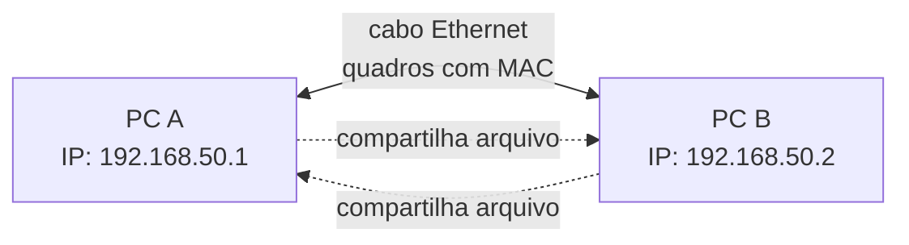

| Pergunta | Resposta |
|----------|----------|
| O cabo sozinho cria uma rede funcional? | Cria o enlace físico; ainda é preciso configurar/obter IPs compatíveis e permitir o tráfego no firewall |
| Vira peer-to-peer automaticamente? | Não. Vira P2P quando ambos os PCs oferecem e consomem serviços/recursos diretamente |
| Tem Internet automaticamente? | Não. Sem roteador/gateway, a comunicação fica restrita aos dois PCs; um deles teria de compartilhar sua conexão para fornecer Internet ao outro |
| Precisa de switch? | Não para apenas dois PCs; o cabo liga as duas interfaces diretamente |
| Cabo comum funciona? | Em NICs modernas, normalmente sim, por Auto MDI-X; equipamentos antigos podem exigir cabo crossover |

**Fluxo real após conectar:** o link Ethernet negocia a conexão física; os dois PCs precisam estar na mesma sub-rede (por exemplo, `192.168.50.1/24` e `192.168.50.2/24`); então cada um descobre o MAC do outro na rede local e envia quadros diretamente. Não há roteador no meio para encaminhar pacotes a outras redes.

**Exemplo com código (Linux)** — atribuir IPs estáticos temporários ao enlace direto:

```bash
# Execute estas duas linhas no PC A; substitua enp0s31f6 pelo nome da interface Ethernet real.
sudo ip addr add 192.168.50.1/24 dev enp0s31f6  # atribui ao PC A o IP 192.168.50.1 na rede 192.168.50.0/24
sudo ip link set enp0s31f6 up                   # liga a interface para que ela comece a transmitir e receber sinais

# Execute estas duas linhas no PC B; use o nome da interface Ethernet real desse PC.
sudo ip addr add 192.168.50.2/24 dev enp0s31f6  # atribui ao PC B o IP 192.168.50.2 na mesma rede local do PC A
sudo ip link set enp0s31f6 up                   # liga a interface Ethernet do PC B

# Execute esta linha no PC A depois de configurar os dois lados.
ping 192.168.50.2                               # envia pacotes ICMP ao PC B para confirmar que o enlace e os IPs funcionam
```

---

### 2.6 Intranet, Internet e Extranet

Uma **intranet** é o conjunto privado de LANs e enlaces WAN pertencentes a uma organização. Ela usa tecnologias semelhantes às da Internet, como TCP/IP, mas o acesso é restrito à empresa e aos usuários autorizados. A aula 01 define a intranet como uma conexão privada de LANs e WANs que pertence a uma organização (`01-introducao-as-redes.md:102`).

| Termo | Escopo | Quem pode acessar | Exemplo em engenharia de dados |
|-------|--------|-------------------|----------------------------|
| **Internet** | Rede mundial pública de redes | Usuários conforme os controles de cada serviço | Acessar a documentação pública de um provedor cloud |
| **Intranet** | LANs e WANs privadas da organização | Funcionários e sistemas autorizados | Airflow, warehouse e APIs internas de RH |
| **Extranet** | Parte controlada da rede privada exposta a externos | Parceiros/clientes autorizados | Provedor de benefícios acessando uma API específica |

**Exemplo com código (Terraform)** — representar uma rede privada interna:


Esse código representa a infraestrutura privada, mas uma intranet completa também depende de conexões entre redes, controles de acesso, DNS interno, VPN ou Interconnect e regras de firewall.

**Verificação com Bash** — testar o caminho até um serviço interno:

```bash
ip route get 10.30.0.10  # mostra qual interface e qual rota o sistema usaria para alcançar um endereço privado
nc -vz 10.30.0.10 5432  # testa se a porta 5432 do banco está acessível a partir desta máquina
```

O Terraform cria a rede privada; os comandos Bash ajudam a investigar se um worker realmente consegue chegar ao serviço.

---

## 3. Protocolos de rede

### 3.1 Definição e papel

Definição (KUROSE e ROSS, 2016): um protocolo define o **formato** e a **ordem** das mensagens trocadas entre duas ou mais entidades comunicantes, bem como as **ações** realizadas na transmissão e/ou no recebimento de uma mensagem. Em resumo: o protocolo define **como** as mensagens são trocadas entre origem e destino.

> 🧠 **Dica para memorizar (versão correios):** "Um protocolo de rede é como o **regulamento da agência dos correios** que dita: (1) **formato** da carta (tamanho do envelope, tipo de papel), (2) **ordem** em que os campos devem ser preenchidos (endereço do remetente antes do destinatário), e (3) **ações** ao receber/entregar (verificar selo, registrar chegada). Não define se o carteiro usa carro ou bicicleta (esse é o meio físico)."

A analogia se estende: assim como diferentes tipos de correspondência seguem regulamentos diferentes (uma carta padronizada vs. um envelope expresso vs. um pacote registado), diferentes protocolos de rede têm suas próprias regras de formatação e troca de mensagens.

### 3.2 O que protocolos fazem e não fazem

Pontos importantes:

- São implementados por dispositivos finais e intermediários em **software, hardware ou ambos**
- Cada protocolo tem sua **própria camada**, função, formato e regras de comunicação
- Funcionam tanto em redes locais quanto remotas

O que protocolos **NÃO** fazem (pegadinhas de prova):

- Não definem o tipo de hardware usado
- Não funcionam apenas em uma camada (ex.: só no acesso à rede)
- Não se restringem a redes locais ou remotas

### 3.3 Tipos de protocolos

| Tipo | O que faz | Exemplos |
|------|-----------|----------|
| **Comunicação** | Permitem a troca de dados entre dispositivos | IP, TCP, HTTP |
| **Segurança** | Protegem a comunicação (criptografia, acesso) | SSH, SSL, TLS |
| **Roteamento** | Escolhem o melhor caminho pela rede | RIP, OSPF, BGP |
| **Descoberta de serviço** | "Descobrem"/atribuem recursos (IP, nomes) | DHCP, DNS |

---

## 4. Modelos de referência: OSI e TCP/IP

### 4.1 Equivalência entre OSI e TCP/IP

As redes são organizadas em camadas. Os dois modelos principais conversam mesmo com quantidades diferentes de camadas:

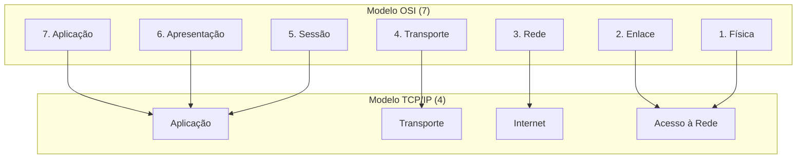

No modelo TCP/IP, a camada **Acesso à Rede** reúne as funções das camadas **Física** e **Enlace** do modelo OSI. Para entender por meio da analogia dos correios:

> **Modelo OSI** = Um serviço de correios completo com 7 estações de trabalho:
> 1. **Estação de Redação** (Aplicação) — onde a carta é escrita
> 2. **Estação de Embalagem** (Apresentação) — onde a carta é colocada no envelope adequado
> 3. **Estação de Registro** (Sessão) — onde a carta é registrada para rastreamento
> 4. **Estação de Pesagem e Cobrança** (Transporte) — onde o peso e custo são calculados
> 5. **Central de Triagem Regional** (Rede) — onde o roteamento entre cidades ocorre
> 6. **Estação de Carteiro Local** (Enlace) — onde a carta é preparada para entrega no bairro
> 7. **Mochila de Correios** (Física) — o transporte físico pelos correios

> **Modelo TCP/IP** = Um serviço de correios simplificado com 4 estações:
> 1. **Mostruário de Envios** (Aplicação) — onde tudo começa
> 2. **Cálculo de Frete** (Transporte) — peso e custo
> 3. **Central de Roteamento** (Internet) — o núcleo que decide o caminho
> 4. **Entrega Final** (Acesso à Rede) — entrega na caixa do destinatário

No modelo TCP/IP, a camada **Acesso à Rede** reúne as funções das camadas **Física** e **Enlace** do modelo OSI. A camada OSI Física trata dos **carros e caminhões dos correios** (meios de transmissão); a camada OSI Enlace trata do **manuseio de envelopes e rótulos** (quadros e endereços MAC). O TCP/IP agrupa essas duas responsabilidades em uma única camada: **"Deixar a carta pronta para ser entregue"**.

| Modelo OSI | Modelo TCP/IP | Responsabilidade principal | Analogística dos Correios |
|------------|---------------|----------------------------|---------------------------|
| Física (1) | Acesso à Rede | Transmitir bits como sinais no meio físico | O **caminhão dos correios** que transporta as cartas |
| Enlace (2) | Acesso à Rede | Montar e entregar quadros usando MAC | O **carteiro** que manuseia envelope e coloca o rótulo de entrega |
| Rede (3) | Internet | Encaminhar pacotes usando IP | A **central de triagem** que decide qual caminho a carta toma |
| Transporte (4) | Transporte | Comunicação entre aplicações usando portas | O **gerente de expediente** que organiza o que vai para cada caixa/serviço |
| Sessão, Apresentação e Aplicação (5-7) | Aplicação | Serviços e dados das aplicações | Diferentes **tipos de correspondência**: carta, pacote, expresso |

> 🧠 **Dica para memorizar (estilo caderno):** "No serviço de correios: **Física = caminhão**, **Enlace = carteiro**, **Rede = central de triagem**, **Transporte = gerente de frete**. No TCP/IP, o caminhão e o carteiro ficam num só bloco 'Acesso à Rede', enquanto o OSI os mantém separados. O IP é o endereço de destino que a central de triagem usa para encaminhar."

### 4.2 Funções das camadas TCP/IP

Função de cada camada do **TCP/IP**:

- **Aplicação**: representa os dados para o usuário, além de codificação e controle de diálogo
- **Transporte**: suporta a comunicação entre vários dispositivos em diversas redes
- **Internet**: **determina o melhor caminho pela rede** — é onde acontece o roteamento, feito pelo protocolo **IP**
- **Acesso à Rede**: controla os dispositivos de hardware e mídia

### 4.3 Roteamento na camada Internet/Rede

> **Roteamento**: no TCP/IP é a camada **Internet**; no OSI corresponde à camada **Rede** (3). É o protocolo IP, usado pelos roteadores, que encaminha as mensagens por uma internetwork.


### 4.4 Exemplo de roteamento em cloud

**Exemplo com código (Terraform)** — a camada de rede decidindo o caminho (roteamento):


**Verificação com Bash** — consultar a rota escolhida pelo host:

```bash
ip route get 10.20.0.15  # mostra a interface, o próximo salto e a rota usada para chegar ao datacenter de RH
traceroute 10.20.0.15  # lista os saltos percorridos até o destino, quando a rede permite essa descoberta
```

O Terraform descreve a rota desejada na infraestrutura cloud; o Bash mostra o caminho que o sistema está usando de fato a partir daquele host.

---

## 5. Encapsulamento, pacotes e frames

### 5.1 PDUs e encapsulamento

Cada camada acrescenta seu cabeçalho à **PDU** (Protocol Data Unit) recebida da camada superior. As PDUs mudam de nome conforme a camada:

O processo de colocar uma PDU dentro de outra PDU é chamado de **encapsulamento**. Durante o envio, a camada inferior recebe a PDU da camada superior, acrescenta suas próprias informações de controle e cria uma nova PDU. No destino, ocorre o processo inverso, chamado **desencapsulamento**: cada camada remove e interpreta seu cabeçalho até entregar os dados à aplicação.

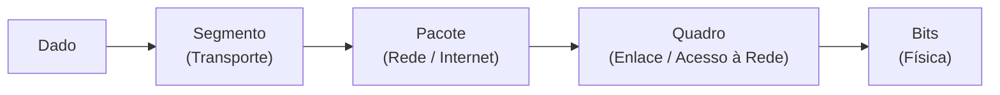

| PDU | Camada | Endereço usado | Alcance | **Analogística dos Correios** |
|-----|--------|----------------|---------|--------------------------------|
| **Data** | Aplicação/Apresentação/Sessão (7/6/5) | — | O dado do usuário como entra na pilha | A **carta escrita** pelo remetente, com a história que será enviada |
| **Segmento** | Transporte (4) | **Porta** (qual aplicação no destino) | Processo a processo — conversas individuais | O **rótulo de classe de serviço**: "Priority Mail", "First Class", indicando qual serviço será usado |
| **Pacote** | Rede (3) | **IP** (destino final) | Internetwork — viaja de roteador a roteador | O **envelope endereçado** com o CEP (destino final), que permanecerá igual durante toda a jornada |
| **Quadro (Frame)** | Enlace (2) | **MAC** (próximo salto) | Mesma mídia — vai de vizinho a vizinho | O **rótulo da agência de destino** colado no envelope naquele momento (será trocado ao passar de agência) |
| **Bits** | Física (1) | — | Transmissão pelo meio físico | Os **sinais no caminhão/carro** dos correios que levam o envelope de um lugar a outro |

**Exemplo com código (Scapy)** — visualizar uma PDU carregada dentro de outra:


Neste exemplo, `dados` está dentro de `segmento`, que está dentro de `pacote`, que está dentro de `quadro`. O `/` do Scapy representa essa composição das camadas; em uma comunicação real, o kernel e a NIC fazem esse trabalho.

> 🧠 **Dica visual para memorizar (estilo caderno):** "Pense no encapsulamento como **encher envelopes na cadeia logística dos correios**: 
> 1. Você começa com a **carta** (Data) — sua mensagem original
> 2. Aplica-se o **rótulo da classe de serviço** (Segmento) — indica o tipo de entrega
> 3. Coloca-se a carta dentro do **envelope** (Pacote/IP) — com o endereço de destino final escrito
> 4. Na parte de fora do envelope, cola-se o **rótulo da agência local** (Quadro/MAC) — indica onde entregar naquele trecho
> 5. O carteiro (NIC) transporta o envelope (Bits) pelo caminhão
> 
> No destino, o processo é inverso: abre-se o envelope, retira-se a carta, e se descarta o rótulo da agência local."

---

### 5.2 Segmentação e remontagem

A mensagem longa é quebrada em pedaços (segmentos) que cabem nos limites de tamanho do quadro. Cada segmento é numerado (sequenciamento) para o destino conseguir remontar a mensagem original mesmo se chegarem fora de ordem.

> 🧠 **Dica para memorizar (estilo caderno):** "Semelhante a uma ** carta muito grande que precisa ser dobrada para caber no envelope**: se a carta não couber, ela é dobrada em partes numeradas. No destino, as partes são reestruturadas na ordem correta antes de ser entregue ao destinatário."

### 5.2 Segmentação e remontagem

A mensagem longa é quebrada em pedaços (segmentos) que cabem nos limites de tamanho do quadro. Cada segmento é numerado (sequenciamento) para o destino conseguir remontar a mensagem original mesmo se chegarem fora de ordem.

### 5.3 Segmentação TCP vs. chunks de ETL

Os dois processos quebram dados em partes, mas resolvem problemas diferentes e ocorrem em camadas diferentes. Quando um job lê um CSV de 20 GB em chunks de 100 MB, essa é uma decisão da **sua aplicação** para limitar memória, controlar paralelismo e facilitar retentativas. Depois que o job envia esses 100 MB por uma conexão TCP, o sistema operacional ainda divide esse fluxo em segmentos menores, adequados à rede, sem o código Python precisar controlar o tamanho de cada pacote.

| Aspecto | Chunk de ETL | Segmentação TCP |
|---------|--------------|-----------------|
| Camada | Aplicação | Transporte (4) |
| Quem decide | Seu código/job | Sistema operacional e pilha TCP |
| Unidade típica | Arquivo, lote de registros, partição de tabela | Segmento de rede, limitado pelo caminho/enlace |
| Objetivo | Não estourar memória; paralelizar; retomar processamento | Transmitir dados com controle de fluxo e remontar corretamente |
| Retentativa | Seu pipeline precisa ser idempotente | TCP retransmite o trecho perdido da conexão |

Em uma conexão TCP, a aplicação entrega um **fluxo de bytes**, não uma lista de pacotes: os limites de uma chamada `send()` ou de um chunk de ETL não são preservados como limites de pacote. Vários segmentos podem ficar "em voo" ao mesmo tempo; se chegarem fora de ordem, o TCP os ordena antes de entregar os bytes ao processo de destino. Vários workers/threads podem abrir várias conexões e gerar fluxos concorrentes, mas isso é diferente de o TCP usar um "ID de núcleo" para enviar dados.

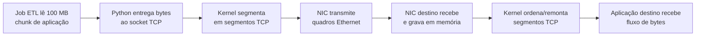

### 5.4 Fluxo de encapsulamento: a descida obrigatória pela pilha

Para enviar dados pela rede, a mensagem desce pelas camadas. Cada camada acrescenta informações de controle próprias; por isso a PDU muda de nome. No destino, o caminho é o inverso: as camadas removem seus cabeçalhos até entregar os dados à aplicação.

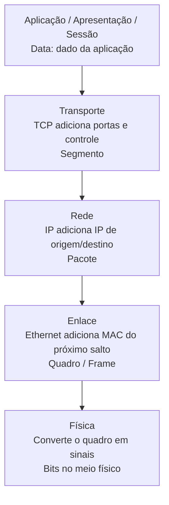

| Etapa | O que a camada acrescenta | PDU após a etapa |
|-------|----------------------------|------------------|
| Aplicação, apresentação e sessão | Dados e regras da aplicação | Data |
| Transporte | Portas, controle de fluxo, sequenciamento e confiabilidade (TCP) | Segmento |
| Rede | IP de origem e destino para encaminhar entre redes | Pacote |
| Enlace | MAC de origem e do próximo salto para entrega no enlace local | Quadro/Frame |
| Física | Representação dos bits como sinal elétrico, luz ou ondas de rádio | Bits/sinais |

**A regra geral está certa:** em uma comunicação de rede, os serviços necessários de cada camada participam do envio e do recebimento; não se entrega um dado HTTP diretamente no cabo sem transporte, endereçamento e enlace. Mas há três detalhes importantes:

1. O modelo **OSI é conceitual**. Na pilha TCP/IP real, apresentação e sessão não aparecem como camadas separadas: suas responsabilidades ficam dentro da camada de aplicação.
2. Nem todo transporte é TCP. Com **UDP**, a PDU da camada de transporte é um **datagrama**, não um segmento, e não há a mesma garantia de entrega/ordem do TCP.
3. Na camada física, não trafegam "zeros e uns" abstratos: os bits são codificados em **sinais elétricos** (cabo), **pulsos de luz** (fibra) ou **ondas de rádio** (Wi-Fi). O receptor interpreta esses sinais de volta como bits.

**Eletricidade não é protocolo.** Ela é um dos meios físicos que pode transportar um sinal. Um protocolo/padrão define as regras de como o sinal deve ser gerado e interpretado: níveis ou transições de tensão, velocidade, sincronização, tipo de cabo e conectores. Em uma rede Ethernet cabeada, por exemplo, o equipamento transforma bits em sinais elétricos no cabo; em fibra, transforma bits em pulsos de luz; no Wi-Fi, em ondas de rádio. O padrão físico permite que os dois lados leiam o mesmo sinal com o mesmo significado.

| Conceito | O que é | Exemplo |
|----------|---------|---------|
| Meio físico | Por onde o sinal viaja | Cabo de cobre, fibra óptica, ar no Wi-Fi |
| Sinal | A representação física de bits | Variação de tensão, pulso de luz, onda de rádio |
| Protocolo/padrão físico | Regras para codificar e interpretar o sinal | Ethernet/IEEE 802.3, Wi-Fi/IEEE 802.11 |

### 5.5 CPU, NIC e endereçamento

**Ponto que confunde (e costuma cair em prova): a CPU e seus núcleos NÃO têm "ID" usado no endereçamento da rede — mas a CPU É quem executa o software que segmenta/remonta.** Há dois papéis diferentes: o de **processamento** (executar o código) e o de **endereçamento** (identificar na rede).

| Quem | Qual papel | O que faz |
|------|-----------|-----------|
| CPU / núcleos | **Processamento** | Executa o código dos protocolos (segmentar/remontar); **não vira endereço** na rede |
| NIC (placa de rede) | Enlace local | Coloca/lê o quadro com MAC no trecho físico; não administra a entrega à CPU destino |
| IP | **Endereçamento** | Identifica a máquina destino |
| Porta | **Endereçamento** | Identifica a aplicação dentro da máquina |

> O software de transporte **precisa de CPU para rodar** (todo programa precisa), mas o **endereço na rede é IP + porta** — nunca o "número do núcleo".

### 5.6 Exemplo de encapsulamento com Scapy

**Exemplo com código (Scapy)** — montar um pacote camada a camada e ver o encapsulamento:


> ⚙️ **Por baixo dos panos:** esse "empilhamento" que o Scapy monta pra você é, no mundo real, feito em **baixo nível** — o kernel grava esses cabeçalhos direto na memória usando **raw sockets / eBPF (XDP)** em C, e a placa de rede (NIC) transmite os bytes. O Scapy só **revela** o conceito de forma legível; a implementação de verdade é low-level.

### 5.7 Aplicabilidade para engenharia de dados

Em um time de dados que apenas consome recursos gerenciados pela plataforma, normalmente não é responsabilidade do engenheiro de dados configurar VPCs, VPNs, regras de firewall, roteamento ou investigar pacotes com Scapy. Esse trabalho tende a ficar com as equipes de plataforma, cloud/SRE e segurança. Ainda assim, entender redes ajuda a separar um defeito do pipeline de um problema de infraestrutura: um timeout do Airflow ao acessar o warehouse pode ser DNS, rota, firewall, endpoint privado ou porta bloqueada — não necessariamente falha no código ou no SQL.

| Situação | Profundidade de redes esperada para dados | Time normalmente responsável |
|----------|--------------------------------------------|-----------------------------|
| Consumir API, banco, bucket ou fila | Saber endpoint, DNS, porta, TLS, timeout, retry e limites de conexão | Engenharia de dados |
| Diagnosticar timeout/intermitência | Coletar logs, identificar se o erro é de rede e acionar o time certo com evidências | Engenharia de dados + plataforma |
| Configurar VPC, VPN, firewall, rotas ou balanceador | Entender o impacto, mas não necessariamente implementar | Plataforma/cloud/SRE ou segurança |
| Analisar pacotes ou usar Scapy | Usar apenas em laboratório, testes controlados ou investigação especializada | Segurança, rede ou plataforma |

O conhecimento de camadas, IP, portas, DNS, controle de fluxo, disponibilidade e retries continua valioso para projetar pipelines resilientes e conversar objetivamente com as equipes que gerenciam a infraestrutura. Em uma empresa mais híbrida, com dados on-premise, redes privadas, alta escala ou responsabilidade de data platform, essa fronteira pode mudar e esses conceitos passam a aparecer muito mais no trabalho diário.

### 5.8 Comunicação web de ponta a ponta

O processo completo, do clique no navegador até a resposta do servidor:

```mermaid
sequenceDiagram
    participant App as Aplicação (HTTP)
    participant Transp as Transporte (TCP)
    participant Net as Internet (IP)
    participant Link as Acesso à Rede (Ethernet)
    participant Srv as Servidor

    Note over App: Usuário pede uma página<br>no navegador
    App->>Transp: Dado (requisição HTTP)
    Note over Transp: + cabeçalho TCP<br>(entrega confiável,<br>controle de fluxo)
    Transp->>Net: Segmento TCP
    Note over Net: + cabeçalho IP<br>(endereço do destino final)
    Net->>Link: Pacote IP
    Note over Link: + cabeçalho Ethernet<br>(MAC do próximo salto)
    Link->>Srv: Quadro vira bits<br>pelo meio físico
    Note over Srv: Processo inverso:<br>remove os cabeçalhos<br>de cada camada até a aplicação
    Srv-->>App: Resposta HTTP (página)
```

Na **ida**, cada camada "embrulha" o dado com seu cabeçalho (encapsulamento); na **chegada**, o servidor "desembrulha" camada por camada até chegar à aplicação. Na volta, o mesmo processo se repete com a resposta.

**Analogística completa dos Correios (ida e volta):**

> **📤 Ida (Enviando a carta):**
> 1. **Você escreve a carta** (Aplicação/HTTP) — seu pedido de página web
> 2. **O sistema coloca a carta num envelope da classe de serviço** (Transporte/TCP) — adiciona confiabilidade e controle de fluxo, tipo "Priority Mail"
> 3. **Escreve-se o endereço completo do destinatário no envelope** (Internet/IP) — o CEP/endereço final que não mudará
> 4. **Na parte de fora do envelope, cola-se um rótulo "Agência de Origem"** (Enlace/Ethernet) — o próximo salto, tipo "Agência Centro"
> 5. **O carteiro (NIC) coloca o envelope no caminhão** (Física) — transmite os bits pelo meio físico
> 6. **O caminhão chega na central de triagem** (Roteador 1) — remove o rótulo "Agência de Origem" e cola um novo: "Agência de Rota"
> 7. **Segue para a próxima central** (Roteador 2) — novamente remove e cola um novo rótulo
> 8. **Finalmente, entrega na caixa do destinatário** (Servidor) — após desencapsulamento completo

> **📥 Volta (Resposta do servidor):**
> O mesmo processo se repete: o servidor embala a resposta HTTP, o TCP adiciona o segmento, o IP o pacote, o Ethernet o quadro, e os bits voltam pelo caminho inverso, com cada roteador trocando os rótulos MAC a cada salto.

> 🧠 **Dica para memorizar (estilo caderno):** "Enviar dados pela rede é como **enviar uma carta pelos correios com entrega confirmada**: 
> - **HTTP** = o conteúdo da carta (o que você quer pedir ou receber)
> - **TCP** = o envelope selado com número de rastreamento (garante que tudo chegue junto e na ordem certa)
> - **IP** = o endereço de entrega escrito no envelope (fica do início ao fim, não importa quantas agências o pacote passe)
> - **Ethernet/MAC** = o rótulo colado na parte de fora do envelope (muda a cada agência/roteador que o pacote passa)
> - **Bits** = o caminhão que transporta o envelope pelo país"

---

### 5.9 Papel dos protocolos em uma comunicação web

| Protocolo | Camada | Papel | **Analogística dos Correios** |
|-----------|--------|-------|--------------------------------|
| **HTTP** | Aplicação | Governa a interação cliente-servidor web | A **carta em si** — o conteúdo da sua solicitação ou resposta |
| **TCP** | Transporte | Gerencia as conversas, garante entrega confiável e controla o fluxo | O **envelope selado com número de rastreamento** — garante que nenhuma página se perca no correio |
| **IP** | Internet/Rede | Entrega as mensagens; os roteadores o usam para encaminhar | O **endereço de entrega (CEP)** escrito no envelope — o destino final, que permanece igual durante toda a jornada |
| **Ethernet** | Acesso à Rede/Enlace | Entrega o quadro de um NIC a outro na mesma mídia | O **rótulo da agência de destino** colado no envelope no momento — indica onde entregar o próximo trecho |

> 🧠 **Dica para memorizar (estilo caderno):** "Na comunicação web: **HTTP = a carta**, **TCP = o envelope com rastreamento**, **IP = o endereço de entrega**, **Ethernet = o rótulo da agência**. A carta sai com o endereço do destinatário escrito, mas com o rótulo da agência local — e a cada agência que passa, o carteiro cola um novo rótulo, mas o endereço de destino final não muda."

---

## 6. MAC vs IP: a diferença essencial

### 6.1 Conceitos e glossário

É na **camada de enlace (2)** que o endereço MAC de destino é adicionado ao pacote, transformando-o em **quadro**. O roteador olha o **IP** para decidir o caminho, mas quem entrega o dado ao próximo vizinho é o **frame com o MAC**.

**Glossário:**

| Termo | O que é |
|-------|---------|
| **NIC** | Placa de rede; a interface física do dispositivo |
| **MAC** | Endereço físico gravado de fábrica no NIC, único, usado na camada de enlace |
| **IP** | Endereço lógico da camada de rede, muda conforme a rede |
| **Vizinho** | Dispositivo diretamente conectado na mesma mídia (próximo salto) |
| **Roteador** | Dispositivo intermediário que roteia o pacote pelo melhor caminho |

### 6.2 Como MAC e IP atuam na prática

Quando você manda uma mensagem, o dispositivo de origem monta o quadro com **dois endereços**: o **MAC de destino** (gravado de fábrica no NIC do equipamento que está fisicamente na mesma rede — o próximo salto) e o **IP de destino** (o endereço lógico da máquina, que muda conforme a rede onde ela está). 

> 🧠 **Analogística dos Correios (versão prática):** "Pense que você está enviando uma carta:
> - O **IP de destino** é o **CEP completo da casa do destinatário** (rua, número, bairro, cidade, estado). Esse endereço fica igual do início ao fim da jornada — ele está escrito no envelope do início ao fim.
> - O **MAC de destino** é o **rótulo da agência de destino** colado no envelope naquele momento. Cada vez que a carta passa por uma agência dos correios, o funcionário remove o rótulo antigo e cola um novo rótulo com a agência do próximo trecho.

Por isso: o MAC serve para entrega local (vizinho próximo), enquanto o IP é o que viaja entre redes. Ex.: um notebook com **Wi-Fi e cabo** tem **dois MACs** (um por placa — um rótulo por agência local), e pela internet é encontrado pelo seu **IP** (o CEP fixo), não pelo MAC (o rótulo da agência)."

| | MAC | IP |
|--|-----|-----|
| **Natureza** | Físico (de fábrica no NIC) | Lógico (atribuído pela rede) |
| **Camada** | Enlace (2) | Rede (3) |
| **Onde é usado** | Mesmo enlace (vizinho próximo) | Entre redes (internetwork) |
| **Muda de rede?** | **Sim** — cada roteador troca o rótulo | **Não** — o endereço final permanece o mesmo |
| **Analogística dos Correios** | Rótulo da agência atual | CEP de entrega definitivo |

### 6.3 Comparativo: porta, IP e MAC

| Informação | Camada | PDU | Identifica | Alcance | **Analogística dos Correios** |
|------------|--------|-----|------------|---------|--------------------------------|
| **Porta** | Transporte (4) | Segmento | Serviço/aplicação no destino | Processo a processo | **"Tipo de serviço de correios"**: Priority Mail, First Class, Sedex. Indica qual "classe" de entrega aquela conversa usará. |
| **IP** | Rede (3) | Pacote | Máquina destino | Entre redes | **CEP de entrega definitivo**: o endereço completo da casa/máquina destino, que permanece idêntico do remetente ao destinatário final, atravessando todas as agências. |
| **MAC** | Enlace (2) | Quadro | Próximo salto no enlace | Rede local/enlace | **Rótulo da agência corrente**: colado no envelope naquele momento, será removido e substituído por um novo rótulo na próxima agência/roteador. |

> 🧠 **Dica para memorizar (estilo caderno):** "Pense num envio de documentos pro seu warehouse:
> - A **porta** (camada 4) indica *qual serviço*, tipo **'Sedex'** ou **'Priority Mail'** — define a classe de entrega.
> - O **IP** (camada 3) indica *qual servidor*, tipo o **CEP do warehouse** (ex.: `10.20.0.10`) — esse endereço está no envelope do início ao fim, não muda nunca.
> - O **MAC** (camada 2) indica o *nó físico vizinho*, tipo o **rótulo da agência dos correios** na frente do envelope — é trocado a cada agência que o carteiro passa.

Cada camada etiqueta a mensagem com um desses dados conforme ela desce a pilha: a porta define o tipo de serviço, o IP define onde a carta deve ser entregue no final, e o MAC indica qual agência deve recebê-la no trecho atual."

### 6.4 Frame destinatário em comunicação remota (ex.: SA → HB)

Quando um host envia dados para outro host em rede **remota** (em outro subnet ou VLAN), o frame Ethernet que ele gera tem como destino **o MAC do gateway/router padrão**, não o MAC do host final. Isso ocorre porque:

> 🧠 **Analogística dos Correios:** "Igual a querer enviar uma carta pro cliente de outro escritório: você não cola um rótulo direto na casa do cliente final (ele fica em outra cidade). Em vez disso, você cola o **rótulo da agência dos correios do seu bairro** (gateway/roteador). O carteiro pega a carta naquela agência, remove o rótulo do bairro e cola um novo rótulo com a agência da próxima cidade, e assim por diante até chegar próximo ao destino.

> **Detalhe crucial (já registrado no caderno):** O endereço de entrega final (o CEP/IP) **nunca muda** — ele permanece escrito no envelope do início ao fim. Só o rótulo da agência corrente (o MAC) é trocado a cada salto."

- O host não conhece o endereço MAC do destino final (ele está em outra rede)
- O ARP é usado apenas para descobrir o MAC do próximo salto (gateway)
- O router então encaminha o pacote para a próxima rede

| Cenário | Endereço MAC de destino do frame Ethernet | **Analogística dos Correios** |
|---------|-------------------------------------------|--------------------------------|
| **Mesma rede (local)** | MAC do host destinatário direto | **Carta entregue diretamente** na caixa do destinatário, usando o CEP dele. Não passa por agência intermediária. |
| **Rede remota** | MAC do **gateway/roteador padrão** | **Rótulo da agência do seu bairro** colado no envelope. O carteiro da sua agência pegará e encaminhará adiante. |
| **Após router** | O router troca o MAC e encaminha para a próxima rede | O carteiro da agência remove o rótulo do bairro e cola um **novo rótulo** com a agência da próxima região. O CEP da casa do destinatário (IP) permanece escrito no envelope o tempo todo. |

| | MAC de destino do frame SA |
|---|---|
| SA → HB (mesma rede) | MAC do HB |
| SA → HB (rede remota) | MAC do **Router 1** (gateway/rótulo da agência do bairro) |
| Router 1 → HB (próximo salto) | MAC do **Router 2** (próximo rótulo da agência) |

**Exemplo prático (engenheiro de dados):**
No Airflow acessando um warehouse GCP: o worker gera o "envelope" (frame) com:
- **IP de destino:** O endpoint do warehouse (`10.20.0.15`) — **esse endereço fica no envelope do início ao fim, nunca muda**
- **MAC de destino:** O gateway da VPC (rótulo da agência da VPC) — **será removido e substituído por novos rótulos** a cada roteador que o pacote passar até chegar na subnet da instância de banco

> **Resumo da analogística:** O IP é o **CEP definitivo** da entrega (igual do início ao fim). O MAC é o **rótulo da agência corrente** (muda a cada roteador). A porta é a **classe de serviço** (Priority Mail, Sedex, etc.).

### 6.5 Analogia da Central dos Correios (Cartas e Envelopes)

Essa é uma das analogias mais usadas e eficazes para entender a diferença entre IP e MAC em redes de computadores. Pense no processo de enviar uma carta física:

| Campo da Carta | Analogia de Rede | O que representa |
|----------------|------------------|------------------|
| **Endereço completo de entrega** (Rua, Número, Bairro, Cidade, CEP) escrito no envelope | **Endereço IP de destino** | É o endereço lógico final da máquina destinatária. Esse endereço permanece **igual do início ao fim** da jornada, independentemente de quantos roteadores o pacote passar. |
| **Rótulo da agência de destino deste trecho** colado no envelope no momento da postagem | **Endereço MAC de destino** (do próximo salto) | Indica **qual agência/roteador** deve receber/encaminhar aquela carta no próximo trecho físico. Quando a carta chega em uma agência, o funcionário remove o rótulo antigo e coloca um novo rótulo (próxima agência) para o próximo trecho. |

---

### Fluxo da analogia: carta SA → HB (em rede remota)

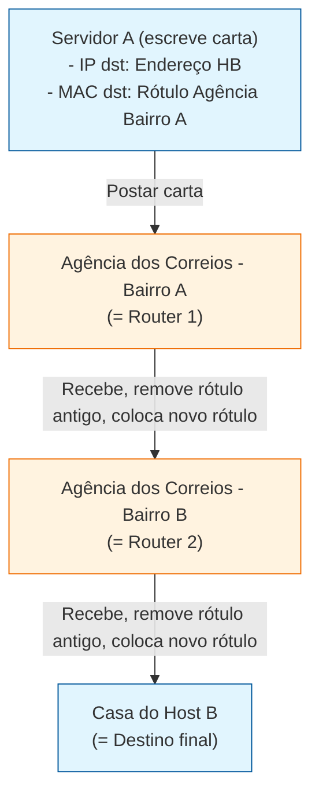

---

### Detalhe do processo em cada "agência" (roteador):

| Etapa | O que acontece com a carta | O que acontece no pacote de rede |
|-------|----------------------------|-----------------------------------|
| **1. SA envia** | Carta sai com: <br>• Endereço completo HB (IP) <br>• Rótulo "Agência Bairro A" (MAC) | Pacote sai de SA com: <br>• IP dst = HB <br>• MAC dst = Router 1 |
| **2. Router 1 recebe** | Remove o rótulo "Agência Bairro A" e cola um **novo rótulo**: "Agência Bairro B" | Remove o MAC dst = Router 1 e coloca o MAC dst = Router 2. **O IP continua sendo o do HB.** |
| **3. Router 2 recebe** | Remove o rótulo "Agência Bairro B" e cola um **novo rótulo**: "Casa HB" | Remove o MAC dst = Router 2 e coloca o MAC dst = HB (ou da porta Switch final). **O IP continua sendo o do HB.** |
| **4. Entrega final** | Carta é entregue na casa do HB usando o endereço completo | Aplica o desencapsulamento: remove os cabeçalhos de camada 2 até entregar os dados à aplicação do HB. |

---

### 🧠 Dica para memorizar (estilo "caderno de revisão")

> **"IP = Endereço completo de entrega na carta (nunca muda). MAC = Rótulo da agência de destino deste trecho (muda a cada agência)."**
>
> Pense assim no seu dia a dia de engenheiro de dados:
> - Quando um **worker Airflow** acessa um **warehouse GCP**, o worker gera o "envelope" (packet) com:
>   - **IP de destino:** O endpoint do warehouse (ex.: `10.20.0.15`) — **fica igual do início ao fim**
>   - **MAC de destino:** O gateway da VPC (endereço do próximo salto) — **é trocado a cada roteador** até chegar na subnet da instância de banco

---

### 🔄 Comparação resumida: IP vs MAC na jornada da carta

| Pergunta | Resposta (Analogia dos Correios) | Resposta (Rede Computer) |
|----------|----------------------------------|--------------------------|
| O endereço de entrega muda de agência para agência? | **Não** — o endereço completo da cidade permanece o mesmo | **Não** — o IP de destino permanece o mesmo |
| O rótulo da agência muda de agência para agência? | **Sim** — cada agência posta um novo rótulo para o próximo trecho | **Sim** — cada roteador substitui o MAC dst pelo próximo salto |
| Quem define o endereço de entrega final? | Quem escreveu a carta (o remetente) | O protocolo IP e o software de aplicação |
| Quem define o rótulo da agência corrente? | O carteiro no momento da postagem | A pilha de rede (ARP, tabela MAC do switch, configuração do gateway) |

---

### 💡 Exemplo prático Engenheiro de Dados

Imagine um job do **Airflow** rodando em um worker que precisa consultar um banco de dados no **Google Cloud Warehouse**:

1. **O worker gera o pacote IP** com:
   - `src_ip = 10.30.0.50` (IP do worker)
   - `dst_ip = 10.20.0.10` (IP do warehouse) ← **esse IP nunca muda**

2. **A pilha de rede do worker adiciona o frame Ethernet** com:
   - `src_mac = AA:BB:CC:DD:EE:FF` (MAC da NIC do worker)
   - `dst_mac = 10.30.0.1` (MAC do gateway/roteador da VPC) ← **esse MAC será trocado**

3. **O gateway da VPC recebe, troca o MAC dst** pelo próximo salto (MAC do roteador de egresso da VPC), e encaminha o pacote IP para a internet da Google.

4. **O pacote chega na instância do Cloud SQL** com o IP de destino original (`10.20.0.10`), e o sistema operacional do destino entrega os dados à aplicação usando esse IP.

> **Resumo:** O IP é o **endereço da cidade** onde o warehouse está localizado. O MAC é o **rótulo da agência** onde o carteiro (roteador) deve entregar o próximo trecho. A carta (pacote) sai do remetente com o endereço da cidade escrito, mas com o rótulo da agência local — e a cada agência que passa, o roteador cola um novo rótulo, mas o endereço da cidade destino permanece o mesmo do início ao fim.

---

## 7. Sistemas de numeração e endereçamento de rede

### 7.1 Bases numéricas usadas em redes

Os dispositivos processam **binário** (base 2), mas os humanos representam endereços de formas mais curtas. Cada base tem um papel específico em redes:

| Base | Nome | Símbolos | Uso principal em redes |
|------|------|----------|------------------------|
| **2** | Binário | `0`, `1` | Idioma real dos endereços IP e MAC dentro da máquina |
| **10** | Decimal | `0` a `9` | Representação dos octetos do IPv4 para humanos |
| **16** | Hexadecimal | `0` a `9`, `A` a `F` | Representação dos endereços MAC e IPv6 |

> O sistema é **posicional**: o valor de cada algarismo depende da posição que ocupa. Em binário, cada posição vale uma potência de 2; em hexadecimal, uma potência de 16.

### 7.2 IPv4: decimal na tela, binário na máquina

Um **IPv4** tem **32 bits**, divididos em **4 octetos** de 8 bits cada. Nós escrevemos cada octeto em **decimal**, mas o computador interpreta e processa tudo em **binário**:

```text
Decimal:  192.168.11.10
Binário:  11000000.10101000.00001011.00001010
```

Cada ponto separa **8 bits** (um octeto), não um número qualquer. Por isso cada octeto só pode ir de `0` a `255` — é o intervalo de 8 bits (`00000000` a `11111111`).

### 7.3 IPv6: 128 bits em hexadecimal

O **IPv6** tem **128 bits**, muito grande para escrever em decimal ou binário. Para encurtar, cada grupo de **4 bits** vira **um dígito hexadecimal**, totalizando **32 dígitos hexadecimais**. Esses 32 dígitos são agrupados em **8 hextetos** de 16 bits cada, separados por `:`:

```text
2001:0DB8:0000:0000:0000:FF00:0042:8329
```

Pode ser encurtado omitindo zeros à esquerda e blocos consecutivos de zeros (`::`), desde que haja apenas uma omissão por endereço.

### 7.4 MAC: endereço físico em hexadecimal

O **endereço MAC** (ou endereço físico) identifica a **NIC** (*Network Interface Card*) de fábrica. Ele tem **48 bits**, divididos em **6 octetos** de 8 bits. Cada octeto é representado por **dois dígitos hexadecimais**, totalizando **12 dígitos hexadecimais**, normalmente separados por `:` ou `-`:

```text
00:1A:2B:3C:4D:5E
```

- Os **primeiros 24 bits** (3 octetos / 6 dígitos hex) identificam o **fabricante** (OUI).
- Os **últimos 24 bits** identificam a interface específica.

### 7.5 Tabela comparativa: IPv4, IPv6 e MAC

| Característica | IPv4 | IPv6 | MAC |
|----------------|------|------|-----|
| **Tamanho** | 32 bits | 128 bits | 48 bits |
| **Divisão** | 4 octetos de 8 bits | 8 hextetos de 16 bits | 6 octetos de 8 bits |
| **Base de exibição humana** | Decimal | Hexadecimal | Hexadecimal |
| **Base real da máquina** | Binário | Binário | Binário |
| **Tipo de endereço** | Lógico (camada 3) | Lógico (camada 3) | Físico (camada 2) |
| **Muda de rede?** | Sim | Sim | Não |
| **Exemplo** | `192.168.1.10` | `2001:db8::ff00:42:8329` | `00:1A:2B:3C:4D:5E` |

### 7.6 Análise das afirmativas do ENADE 2021

A questão traz três afirmativas sobre sistemas numéricos em redes. Vamos checar uma a uma:

| Afirmativa | Avaliação | Justificativa |
|------------|-----------|---------------|
| **I** — "IPv4 é expresso na base decimal, mas dividido em conjuntos de oito bits e interpretado pelo computador usando a base octal" | ❌ **Errada** | A primeira parte é verdadeira (decimal na tela, octetos de 8 bits), mas o computador interpreta em **binário**, não em octal. Octal (base 8) não é a base usada internamente para IPv4. |
| **II** — "IPv6 são compostos de 128 bits e para facilitar sua representação é utilizado o sistema hexadecimal" | ✅ **Correta** | IPv6 tem 128 bits e é representado em hexadecimal para encurtar a notação. |
| **III** — "Endereços físicos são compostos de 6 octetos representados por 12 dígitos no sistema hexadecimal" | ✅ **Correta** | MAC tem 48 bits = 6 octetos = 12 dígitos hexadecimais. |

**Resposta correta:** **Apenas II e III estão corretas.**

### 7.7 Conversão prática: decimal ↔ binário para IPv4

Para converter um octeto decimal para binário, basta decompor em potências de 2. Por exemplo, `168`:

```text
128 + 32 + 8 = 168
 1   0   1   0   1   0   0   0
128  64  32  16   8   4   2   1
```

Resultado: `10101000`.

### 7.8 Exemplo com código (Python) — converter IPv4 entre decimal e binário


> ⚙️ **Por baixo dos panos:** quando você pinga `192.168.11.10`, o sistema operacional não envia "192" para a placa de rede. Ele converte cada octeto para 8 bits e monta o pacote IP com essa sequência binária. A placa Ethernet, por sua vez, lê e transmite bits — sejam eles de IPv4, IPv6 ou MAC.

### 7.9 O que é um octeto? É 8 bits? É 1 byte?

Resposta curta: **octeto = 8 bits**. Na prática, **1 byte também vale 8 bits** na grande maioria dos sistemas modernos, então octeto e byte são frequentemente tratados como sinônimos — especialmente em redes.

| Termo | Definição | Observação |
|-------|-----------|------------|
| **bit** | Menor unidade de informação: `0` ou `1` | Base de tudo na computação |
| **octeto** | Grupo de **8 bits** | Termo técnico comum em redes e telecomunicações |
| **byte** | Unidade de 8 bits na maioria das arquiteturas atuais | Em alguns contextos históricos, byte podia ter tamanhos diferentes; hoje é padronizado como 8 bits |

#### Por que redes preferem dizer "octeto" em vez de "byte"?

Porque **byte** já teve tamanhos diferentes em arquiteturas antigas (7, 8, 9, 12 bits...). O termo **octeto** deixa claro que são **exatamente 8 bits**, sem ambiguidade. Por isso os protocolos de rede — como IPv4 e MAC — usam "octeto" nas especificações técnicas.

```text
1 octeto  = 8 bits
2 octetos = 16 bits
4 octetos = 32 bits
6 octetos = 48 bits
```

#### Octeto na prática: IPv4 e MAC

No IPv4 `192.168.1.10`, cada número entre os pontos é um octeto:

```text
192  →  11000000   (8 bits)
168  →  10101000   (8 bits)
1    →  00000001   (8 bits)
10   →  00001010   (8 bits)
```

Total: 4 octetos × 8 bits = **32 bits**.

No MAC `00:1A:2B:3C:4D:5E`, cada par de dígitos hexadecimais representa um octeto:

```text
00 → 00000000  (8 bits)
1A → 00011010  (8 bits)
2B → 00101011  (8 bits)
3C → 00111100  (8 bits)
4D → 01001101  (8 bits)
5E → 01011110  (8 bits)
```

Total: 6 octetos × 8 bits = **48 bits**.

#### Exemplo com código (Python) — explorar bits, octetos e bytes


> ⚙️ **Por baixo dos panos:** quando você transfere um arquivo CSV de 100 MB, o "B" maiúsculo significa **bytes**. Como cada byte tem 8 bits, o arquivo tem 800 milhões de bits. Quando a rede diz "link de 1 Gbit/s", ela mede em bits. Dividir por 8 é o que converte a capacidade da rede na mesma unidade do arquivo.

### 7.10 Tipos de Endereçamento MAC: Unicast, Broadcast e Multicast

Na camada de enlace (Ethernet), os quadros são direcionados com base em três tipos fundamentais de endereços MAC (KUROSE e ROSS, 2016; TANENBAUM e WETHERALL, 2011):

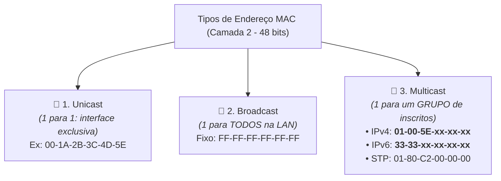

| Tipo de MAC | Prefixo / Formato Hexadecimal | Destinatários | Exemplo Real |
| :--- | :--- | :--- | :--- |
| **Unicast** | OUI do fabricante + ID da placa (bit I/G = 0) | Um único dispositivo receptor exclusivo. | `00-1A-2B-3C-4D-5E` |
| **Broadcast** | Fixo: **`FF-FF-FF-FF-FF-FF`** (todos os 48 bits em 1) | **Todos** os hosts da rede local / LAN. | `FF-FF-FF-FF-FF-FF` (usado em requisição ARP e DHCP Discover) |
| **Multicast** | **`01-00-5E-xx-xx-xx`** (IPv4)<br>**`33-33-xx-xx-xx-xx`** (IPv6) | Apenas os hosts pertencentes ao **grupo multicast**. | **`01-00-5E-00-00-03`** (mapeado para IPv4 `224.0.0.3`) |

#### 7.10.1 Mapeamento IPv4 Multicast $\rightarrow$ MAC Multicast (`01-00-5E`)

1. A IANA reservou o intervalo de endereços MAC **`01-00-5E-00-00-00` até `01-00-5E-7F-FF-FF`** exclusivamente para tráfego multicast IPv4.
2. Os primeiros **24 bits** são fixos em **`01-00-5E`**, o bit 25 é sempre `0`, e os últimos **23 bits** do endereço IP de grupo (de `224.0.0.0` a `239.255.255.255`) são copiados diretamente para os 23 bits inferiores do endereço MAC.
3. Logo, qualquer endereço MAC iniciado por **`01-00-5E`** (como `01-00-5E-00-00-03`) é categoricamente um **endereço MAC Multicast**.

#### 7.10.2 Tabela Comparativa das Alternativas da Questão: Endereço `01-00-5E-00-00-03`

| Alternativa | Tipo de Endereço Real | Camada OSI | Avaliação |
| :--- | :--- | :---: | :---: |
| **`Multicast.`** | **Endereço MAC de grupo IPv4 reservado pela IANA (`01-00-5E-xx-xx-xx`).** | **Camada 2 (Enlace)** | **CORRETA** |
| `Unicast.` | Endereço individual exclusivo atribuído a uma placa de rede específica (bit I/G = 0). | Camada 2 (Enlace) | Incorreta |
| `Broadcast.` | Endereço de difusão geral para todos os hosts (`FF-FF-FF-FF-FF-FF`). | Camada 2 (Enlace) | Incorreta |
| `Loopback.` | Endereço lógico de teste da pilha TCP/IP (`127.0.0.1` ou `::1`). **Não existe MAC de loopback.** | Camada 3 (Rede) | Incorreta |
| `Experimental.` | Bloco IPv4 Classe E reservado para pesquisas (`240.0.0.0/4`). **Não existe MAC experimental.** | Camada 3 (Rede) | Incorreta |

---

### 7.11 Dica para memorizar


> **"IP decimal é a máscara de maquiagem; binário é o rosto real da máquina."** IPv4 usa decimal só pra gente não enlouquecer, mas por baixo tudo é binário. IPv6 e MAC usam hexadecimal porque são grandes demais pra decimal — cada dígito hex resume 4 bits. No seu dia a dia de dados: quando você vê um bucket S3 `s3://rh-dados-prod` ou um endpoint `10.30.0.10:5432`, lembre que o DNS resolve o nome, o IP viaja no pacote e o MAC entrega o quadro ao vizinho. O binário está lá, mesmo que você nunca precise digitá-lo.

> 🧠 **Versão correios:** "Think of IP addresses like the **full delivery address on a letter** (street, number, city, state, CEP) — you see the short version (the 'mask' in decimal) every day, but behind the scenes it's all binary binary just like the binary code the postal workers use to sort letters in the distribution center. IPv6 and MAC addresses are like special delivery codes that use hexadecimal (base-16) because they're too long for decimal — each hex digit covers 4 'bits of sorting information,' like each section of a postal code narrowing down the delivery area. In your data day: when you see `s3://rh-dados-prod` or `10.30.0.10:5432`, remember: the DNS name is like the friendly nickname for the post office, the IP is the full delivery address, and the MAC is the inner envelope label the carrier uses for each sorting step."

---

## 8. Largura de banda e desempenho

### 8.1 O que é largura de banda

**Largura de banda** é a capacidade máxima de um meio ou enlace de transportar dados em determinado intervalo de tempo. Ela é normalmente medida em **bits por segundo**: Kbit/s, Mbit/s ou Gbit/s. A aula 04 define a largura de banda como a capacidade de um meio transportar dados entre dois pontos (`04-comunicacao-e-camada-fisica.md:142-148`).

> 🧠 **Analogística dos Correios:** "Pense na **largura de banda** como a **capacidade dos caminhões/avioes dos correios** de transportar cartas por hora. Um link de 1 Gbit/s é como um frota de caminhões que pode carregar 1 gigabit de dados (equivalente a 125 MB de conteúdo de cartas) por hora, antes de considerar o espaço que os cabeçalhos ocupam."

Uma conexão de **1 Gbit/s** tem capacidade teórica de transportar 1 bilhão de bits por segundo. Como 8 bits formam 1 byte, isso equivale teoricamente a cerca de **125 MB/s**, antes de descontar cabeçalhos, confirmações, retransmissões, latência e outras limitações.

No seu contexto, se um worker precisa enviar um arquivo Parquet de 10 GB para o warehouse por um enlace de 1 Gbit/s, os 125 MB/s são um limite teórico do caminho — é o tamanho máximo que a "frota de caminhões dos correios" pode carregar por hora. O tempo real pode ser maior por causa do tráfego concorrente (outros caminhões na mesma estrada), do limite do storage (capacidade do galpão de destinos), da CPU (processamento do carteiro), da criptografia (selo criptografado na carta), da latência (tempo que o caminhão fica na estrada) e de algum enlace mais lento no caminho.

| Conceito | O que significa | **Analogística dos Correios** | Exemplo no pipeline de dados |
|----------|-----------------|--------------------------------|-----------------------------|
| **Largura de banda** | Capacidade máxima teórica do enlace | **Capacidade da frota de caminhões/avioes** dos correios por hora | Link de 1 Gbit/s entre worker e serviço cloud |
| **Throughput** | Taxa efetivamente transferida pelo meio | **Quantidade de cartas que realmente saíram dos caminhões** e seguiram rumo ao destino | Job consegue transferir 700 Mbit/s |
| **Goodput** | Taxa de dados úteis, descontando overhead e retransmissões | **Quantidade de cartas que chegaram ao destinatário final com o conteúdo completo** (sem letras danificadas ou endereços errados) | Registros úteis gravados no destino por segundo |
| **Latência** | Tempo para os dados viajarem entre origem e destino | **Tempo que a carta está em trânsito**: do momento em que você entrega no correio até a entrega final | Tempo de ida até o warehouse e retorno da resposta |

### 8.2 Gargalo e caminho completo

O throughput de uma comunicação não pode superar o enlace mais lento do caminho. Se o worker tem uma interface de 10 Gbit/s, mas existe um trecho de 100 Mbit/s entre ele e o warehouse, esse trecho vira o **gargalo**.

> 🧠 **Analogística dos Correios:** "Igual a uma **rota de entrega dos correios** com múltiplos trechos: se o worker tem um caminhão de 10 Gbit/s, mas existe apenas um trecho de linha de 100 Mbit/s entre o centro de distribuição e o warehouse final, esse trecho estreito vira o **gargalo** da rota. Não importa quão rápido seja o caminhão do worker; ele terá que reduzir a velocidade no trecho estreito."

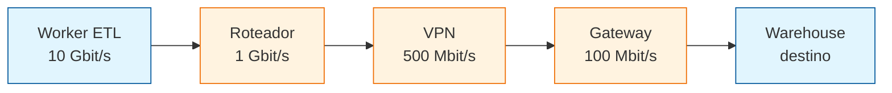

| Trecho | Capacidade | **Analogística dos Correios** |
|--------|------------|--------------------------------|
| Worker → roteador | 10 Gbit/s | **Caminhão grande do worker** cheio de cartas |
| Roteador → VPN | 1 Gbit/s | **Primera central de triagem** com boa capacidade |
| VPN → gateway | 500 Mbit/s | **Segunda central de triagem** com capacidade média |
| Gateway → warehouse | **100 Mbit/s — gargalo** | **Trecho final estreito**: apenas uma agência pequena no final da rota |

| Conceito | O que significa | Analogística dos Correios |
|----------|-----------------|---------------------------|
| **Gargalo** | O enlace mais lento do caminho que limita toda a comunicação | O **trecho estreito da rota de entrega** que todos os pacotes precisam passar, reduzindo a velocidade geral |
| **Solução** | Aumentar a capacidade do gargalo ou contorná-lo | **Criar uma nova rota de entrega** (novo roteador/gateway) ou **consolidar os dados** em lotes maiores para o trecho lento |

### 8.3 Exemplo prático de cálculo


> 🧠 **Analogística dos Correios:** "Esse cálculo é como **calcular quanto tempo levará para uma carta viajar do Rio de Janeiro para São Paulo** considerando a velocidade média do caminhão. O resultado é apenas uma estimativa: pode demorar mais se houver greve dos correios (concorrência), se o caminhão quebrar (gargalo), se a carta precisar ser reenviada (retransmissão), ou se houver atraso na triagem (latência)."

Esse cálculo é apenas uma estimativa. Em produção, ferramentas como `iperf3`, métricas do storage, logs do job e observabilidade cloud ajudam a medir o throughput real. A largura de banda informa o **limite de capacidade**; ela não garante que o pipeline atingirá esse valor.

### 8.4 Por que dividir bits por 8

Um **byte** é formado por **8 bits**. O bit é a menor unidade binária (`0` ou `1`); o byte é um grupo de 8 bits usado para representar um valor ou, frequentemente, um caractere. Por isso, dividir uma taxa em bits por segundo por 8 apenas converte a unidade:

```text
1 Gbit/s = 1.000.000.000 bits/s
1.000.000.000 bits/s ÷ 8 = 125.000.000 bytes/s
125.000.000 bytes/s = 125 MB/s
```

> 🧠 **Analogística dos Correios:** "Essa conversão por 8 é como **converter o volume de cartas de 'unidades de papel' para 'caixas de transporte'**: cada caixa comporta 8 cartas. Redes costumam anunciar a capacidade em **bits por segundo** porque a comunicação física transmite uma sequência de bits e o setor de telecomunicações padronizou essa medida para enlaces. Aplicações, arquivos, memória e storage normalmente usam **bytes**, então um engenheiro de dados frequentemente converte a banda para estimar o tempo de transferência de um arquivo — tipo calcular quantas **caixas de correio** serão necessárias para transportar todo o arquivo."

| Unidade | Significado | **Analogística dos Correios** | Uso comum |
|---------|-------------|--------------------------------|-----------|
| **bit (b)** | `0` ou `1` | **Sinal de entrega**: cada marca de tinta ou cada lacre no caminho | Transmissão de rede |
| **byte (B)** | 8 bits | **1 caixa de cartas** contendo 8 marcas/sinais | Arquivos, memória e storage |
| **Mbit/s** | Milhões de bits por segundo | **Milhões de sinais por segundo** — capacidade da frota por segundo | Velocidade anunciada de rede |
| **MB/s** | Milhões de bytes por segundo | **Milhões de caixas de cartas por segundo** — taxa observada | Taxa observada em arquivos/storage |

A conversão por 8 não representa a velocidade real da aplicação. Depois dela ainda podem existir cabeçalhos, confirmações, retransmissões, criptografia, latência e gargalos. Por isso, um enlace de 1 Gbit/s oferece no máximo cerca de 125 MB/s teóricos, e o goodput de um pipeline tende a ser menor.

> **Dica para memorizar (estilo caderno):** "No envio de um arquivo de RH pelo serviço de correios:
> - **Largura de banda** = a capacidade da frota de caminhões (quantas caixas por hora o sistema aguenta)
> - **Throughput** = quantas caixas realmente saíram dos caminhões e seguiram rumo ao destino
> - **Goodput** = quantas caixas chegaram ao destinatário final com o conteúdo correto e legível
> - **Latência** = o tempo que o caminhão ficou na estrada da origem ao destino"

---

## 9. Cabeamento de fibra óptica

### 9.1 Características da fibra

A fibra óptica transmite dados como **pulsos de luz**, geralmente infravermelha. Por não usar corrente elétrica para transportar os dados, ela é **imune a EMI** (interferência eletromagnética) e **RFI** (interferência de radiofrequência). Também apresenta baixa atenuação e alta capacidade de transmissão, sendo usada em backbones, WANs, FTTH e interconexões de alta velocidade (`05-cabeamentos-e-conexoes.md:114-118`).

| Alternativa | Está correta? | Motivo |
|-------------|---------------|--------|
| Não é afetado por EMI ou RFI | **Sim** | A fibra transmite pulsos de luz, não sinais elétricos |
| Cada par é envolvido em folha metálica | Não | Descreve blindagem de cabos metálicos, não fibra |
| Combina cancelamento, blindagem e torção | Não | Técnicas usadas em cabos de cobre, especialmente para reduzir interferência |
| Contém 4 pares de fios | Não | Essa é uma característica comum do UTP; fibra usa núcleo, casca e revestimento |
| É mais barato que UTP | Não | Em geral, fibra e seus componentes têm custo maior que UTP |

| Característica | Fibra óptica | Cobre/UTP |
|----------------|--------------|-----------|
| Sinal | Pulsos de luz | Pulsos elétricos |
| Interferência EMI/RFI | Imune | Suscetível |
| Capacidade e distância | Muito altas, especialmente em longas distâncias | Menores e limitadas pela atenuação/interferência |
| Estrutura | Núcleo, casca e revestimento | Pares de fios de cobre trançados |
| Uso comum | Backbone, WAN, FTTH e links de alta velocidade | LANs e conexões de menor distância |

**Glossário de siglas:**

| Sigla | Nome completo | Significado |
|-------|---------------|-------------|
| **EMI** | *Electromagnetic Interference* | Interferência eletromagnética que pode distorcer sinais elétricos |
| **RFI** | *Radio-Frequency Interference* | Interferência de radiofrequência que pode afetar sinais em cabos de cobre |
| **UTP** | *Unshielded Twisted Pair* | Par trançado não blindado, comum em redes LAN |
| **FTTH** | *Fiber To The Home* | Fibra óptica instalada até a residência ou pequeno escritório |
| **LAN** | *Local Area Network* | Rede local em uma área geográfica limitada |
| **WAN** | *Wide Area Network* | Rede de longa distância que interliga redes locais |

**Exemplo prático (Linux `ethtool`)** — verificar se uma interface está usando uma porta óptica:

```bash
sudo ethtool eth0  # exibe as características físicas e a velocidade negociada pela interface eth0
```

Na saída, procure campos como `Port: FIBRE` e `Speed: 10000Mb/s`. O comando apenas identifica a interface e o link; ele não transforma um cabo UTP em fibra.

### 9.2 Exemplo no contexto de dados

Um link de fibra entre o cluster de processamento e o storage pode transportar grandes volumes de dados com alta taxa de bits e sem sofrer interferência de motores, lâmpadas ou cabos elétricos próximos. Isso é útil para pipelines que movimentam grandes tabelas, arquivos Parquet ou dados entre regiões e datacenters.

### 9.3 Especificações físicas de redes sem fio

As especificações da camada física wireless definem como os bits serão transformados em sinais de rádio. Elas abrangem a **codificação do sinal**, frequência, potência de transmissão, requisitos de recepção/decodificação e projeto da antena (`05-cabeamentos-e-conexoes.md:224-226`).

| Função | Camada responsável | Exemplo |
|--------|--------------------|---------|
| Codificar bits em sinal de rádio | Física | Modulação e frequência do Wi-Fi |
| Identificar a interface no enlace | Enlace | Endereço MAC |
| Identificar a rede/dispositivo | Rede | Endereço IP |
| Escolher o caminho dos pacotes | Rede | Roteamento IP |
| Controlar acesso ao meio compartilhado | Enlace | CSMA/CA no Wi-Fi |

**Exemplo prático (Linux `iw`)** — consultar informações físicas da interface wireless:

```bash
iw phy  # mostra os recursos físicos da rádio Wi-Fi, como bandas, frequências e taxas suportadas
```

O comando ajuda a observar a camada física; ele não mostra a rota IP nem substitui a configuração de endereços MAC/IP.

### 9.4 Categorias de cabo UTP e taxa de transmissão

A **Categoria 8** é a que oferece suporte a até **40 Gbit/s**, conforme a aula 05 (`05-cabeamentos-e-conexoes.md:88-94`). A categoria indica a capacidade de transmissão prevista pelo padrão do cabo, mas a taxa realmente alcançada também depende das interfaces, conectores, distância, instalação e equipamentos nas duas pontas.

| Categoria UTP | Uso ou capacidade citada na aula |
|---------------|-----------------------------------|
| Categoria 3 | Originalmente comunicação de voz |
| Categoria 5 | Até 100 Mbit/s |
| Categoria 5E | Até 1 Gbit/s |
| Categoria 6 | Até 10 Gbit/s |
| Categoria 7 | Até 10 Gbit/s |
| **Categoria 8** | **Até 40 Gbit/s** |

**Exemplo prático (Linux `ethtool`)** — verificar a velocidade negociada pela interface:

```bash
sudo ethtool eth0  # mostra a velocidade que a placa e o equipamento do outro lado negociaram na interface eth0
```

Esse comando mostra a velocidade do link atual, mas não identifica sozinho a categoria física do cabo. Para confirmar a categoria, é necessário consultar a marcação do cabo, a documentação ou testar a instalação com equipamentos compatíveis.

### 9.5 Acesso ao canal no Wi-Fi

O Wi-Fi, baseado no padrão **IEEE 802.11**, usa o **CSMA/CA** (*Carrier Sense Multiple Access with Collision Avoidance*) para controlar o acesso ao canal sem fio (`05-cabeamentos-e-conexoes.md:230-235`). Antes de transmitir, a NIC verifica se o canal está livre. Se o canal estiver ocupado, o dispositivo espera um tempo aleatório antes de tentar novamente. O objetivo é **evitar colisões**, porque vários dispositivos compartilham o mesmo meio sem fio.

| Protocolo | Expansão | Uso principal |
|-----------|----------|---------------|
| **CSMA/CA** | *Carrier Sense Multiple Access with Collision Avoidance* | Wi-Fi; evita colisões em meio sem fio |
| **CSMA/CD** | *Carrier Sense Multiple Access with Collision Detection* | Ethernet antigo compartilhado; detectava colisões |
| **TDMA** | *Time Division Multiple Access* | Divide o acesso em intervalos de tempo |
| **GSM** | *Global System for Mobile Communications* | Padrão de comunicação celular |
| **CDMA** | *Code Division Multiple Access* | Separa transmissões por códigos diferentes |

**Exemplo prático (Linux `iw`)** — consultar informações da interface Wi-Fi:

```bash
iw dev wlan0 info  # mostra detalhes da interface wireless, que usa o mecanismo de acesso definido pelo padrão Wi-Fi
```

O comando consulta a interface, mas a espera pelo canal e a prevenção de colisões são executadas pela combinação da NIC, do driver e do padrão IEEE 802.11.

### 9.6 Cabo crossover entre roteadores sem Auto-MDIX

Dois roteadores são dispositivos do mesmo tipo. Em portas Fast Ethernet antigas, a porta de um roteador transmite por um par de pinos e recebe por outro. Para conectar dois dispositivos do mesmo tipo, o cabo precisa cruzar os pares de transmissão e recepção. Por isso, quando os roteadores **não possuem Auto-MDIX**, uma ponta deve seguir a norma **EIA/TIA-568A** e a outra deve seguir a norma **EIA/TIA-568B**. A resposta correta da questão é a terceira alternativa (`05-cabeamentos-e-conexoes.md:99-105`).

| Situação | Cabo esperado sem Auto-MDIX |
|----------|-----------------------------|
| PC → switch | Direto: mesma norma nas duas pontas |
| Switch → roteador | Direto: mesma norma nas duas pontas |
| Roteador → roteador | **Crossover: uma ponta 568A e outra 568B** |
| PC → PC | Crossover: uma ponta 568A e outra 568B |

Em Fast Ethernet, os pinos 1 e 2 formam um par de transmissão e os pinos 3 e 6 formam um par de recepção. Um cabo direto conecta transmissão com transmissão e recepção com recepção quando dois dispositivos iguais são ligados. O cabo crossover troca esses pares, conectando transmissão de um roteador à recepção do outro.

| Pino usado em Fast Ethernet | Ponta T568A | Ponta T568B |
|-----------------------------|-------------|-------------|
| 1 | Branco/verde — transmissão | Branco/laranja — recepção |
| 2 | Verde — transmissão | Laranja — recepção |
| 3 | Branco/laranja — recepção | Branco/verde — transmissão |
| 6 | Laranja — recepção | Verde — transmissão |

**Glossário de siglas:**

| Sigla | Nome completo | Significado |
|-------|---------------|-------------|
| **EIA** | *Electronic Industries Alliance* | Organização associada a padrões de cabeamento e conectores |
| **TIA** | *Telecommunications Industry Association* | Organização que participa da definição de padrões de telecomunicações e cabeamento |
| **MDIX** | *Medium-Dependent Interface Crossover* | Função que identifica/adapta automaticamente os pares de transmissão e recepção |
| **Auto-MDIX** | *Automatic Medium-Dependent Interface Crossover* | Recurso que permite usar cabo direto ou crossover sem montagem manual específica |
| **Cat5E** | *Category 5 Enhanced* | Categoria de cabo UTP com suporte citado de até 1 Gbit/s |
| **Cat6** | *Category 6* | Categoria de cabo UTP com suporte citado de até 10 Gbit/s |

**Exemplo prático (Linux `ethtool`)** — verificar se o enlace negociou conexão:

```bash
sudo ethtool eth0  # mostra se a interface detectou o cabo e qual velocidade foi negociada
```

Se os roteadores não tiverem Auto-MDIX e o cabo estiver montado incorretamente, normalmente o link não sobe. O problema não é resolvido escolhendo Cat5E ou Cat6: a categoria define desempenho, enquanto 568A/568B define a ordem dos fios e o cruzamento dos pares.

---

## 10. Camada de enlace de dados (Data Link Layer)

### 10.1 Propósito e papel na pilha OSI/TCP-IP

A **camada de enlace de dados** (camada 2 do modelo OSI ou parte da camada de Acesso à Rede do TCP/IP) prepara os pacotes da camada de rede (IP) para serem transmitidos pela mídia física (cabo elétrico, fibra óptica ou ondas de rádio no Wi-Fi).

Sua principal função é **abstrair o meio físico** para as camadas superiores: a camada IP não precisa saber se o dado vai trafegar por fibra, cabo de cobre UTP ou Wi-Fi. A camada de enlace aceita o pacote IP (camada 3), adiciona o cabeçalho de enlace (com o endereço MAC do próximo nó) e um trailer de verificação de erros (CRC), gerando a PDU chamada **quadro (frame)**. Na recepção, ela lê o quadro, valida se houve corrupção pelo CRC (descartando se houver erro) e entrega o pacote desencapsulado para a camada de rede.

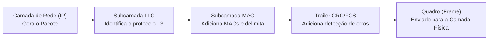

### 10.2 As duas subcamadas (LLC e MAC)

Padrões como o IEEE 802 dividem a camada de enlace de dados em duas subcamadas bem definidas:

| Subcamada | Nome Completo | Papel e Responsabilidades |
|-----------|---------------|---------------------------|
| **LLC** | *Logical Link Control* | Faz a ponte com as camadas superiores em software. Insere no quadro a informação de qual protocolo de camada 3 (IPv4, IPv6) está sendo transportado. |
| **MAC** | *Media Access Control* | Gerencia a Placa de Interface de Rede (NIC) e o hardware. Cuida do encapsulamento (delimitadores, endereçamento físico MAC) e do controle de acesso ao meio físico compartilhado. |

### 10.3 Estrutura do quadro (Frame)

Diferente de todas as outras camadas que adicionam apenas um cabeçalho no início da PDU, a camada de enlace adiciona um **cabeçalho (Header)** no início e um **trailer** no final do pacote IP:

```text
+---------------------+-------------------+-------------------+-------------------+-------------------+
| Cabeçalho Enlace    | Cabeçalho IP      | Cabeçalho TCP     | Dados Aplicação   | Trailer Enlace    |
| (MAC Origem/Destino)| (IP Origem/Destino)| (Portas Orig/Dest)| (Mensagem HTTP)   | (CRC / FCS)       |
+---------------------+-------------------+-------------------+-------------------+-------------------+
|<--------------------------------------- QUADRO (FRAME) ------------------------------------------>|
```

- **Delimitação de quadro**: Marcadores binários que indicam início e fim do quadro para sincronizar transmissor e receptor.
- **Endereçamento local (MAC)**: Indica a NIC de origem e a NIC de destino na mesma rede local/enlace.
- **Detecção de erros (CRC)**: Cálculo matemático no trailer. Se os bits forem alterados pelo ruído no cabo/ar, o receptor detecta a divergência e descarta o quadro imediatamente.

### 10.4 Modos de comunicação e controle de acesso ao meio

Em redes multiacesso (vários computadores disputando a mesma mídia), o meio precisa de regras para evitar interferência ou colisões:

| Conceito / Método | Como funciona passo a passo | Exemplo prático / Tecnologia |
|-------------------|----------------------------|------------------------------|
| **Half-Duplex** | Um dispositivo transmite de cada vez. Transmite e recebe, mas **nunca simultaneamente**. | Hubs Ethernet antigos, redes Wi-Fi (802.11) |
| **Full-Duplex** | Transmite e recebe **simultaneamente** sem colisões. A mídia fica disponível a todo momento. | Switches Ethernet modernos em cabo UTP/Fibra |
| **CSMA/CD** (*Collision Detection*) | Dispositivo "escuta" a rede. Se estiver livre, transmite. Se dois transmitirem juntos, ocorre colisão (alteração na voltagem); ambos detectam, cancelam e esperam um tempo aleatório antes de retransmitir. | Ethernet em barramento/hub (meio com fio legado) |
| **CSMA/CA** (*Collision Avoidance*) | Dispositivo "escuta" o meio sem fio. Como não consegue detectar colisão no ar, ele envia a duração desejada da transmissão. Outros dispositivos aguardam esse tempo acabar antes de tentar enviar. | Wi-Fi residencial/corporativo (meio sem fio) |
| **Acesso Controlado** | Cada nó espera estritamente a sua vez em uma fila/token determinístico para transmitir. | Token Ring / FDDI (legados) |

#### 10.4.1 O porquê do tempo aleatório (Exponential Backoff)

- **Quebrar a sincronia**: Se duas placas de rede colidissem e aguardassem um tempo fixo (ex.: exatamente 10 ms), ambas tentariam retransmitir no exato mesmo milissegundo, gerando um **loop infinito de colisões**.
- **Descongestionamento adaptativo**: O algoritmo escolhe um tempo aleatório em um intervalo. A cada colisão consecutiva, o limite máximo desse intervalo **dobra** (*Exponential Backoff*).
- **Relação com Cibersegurança**: O tempo aleatório não tem a ver com criptografia ou autenticação, mas evita um estado de **Negação de Serviço (DoS) não intencional** que travaria a rede local.

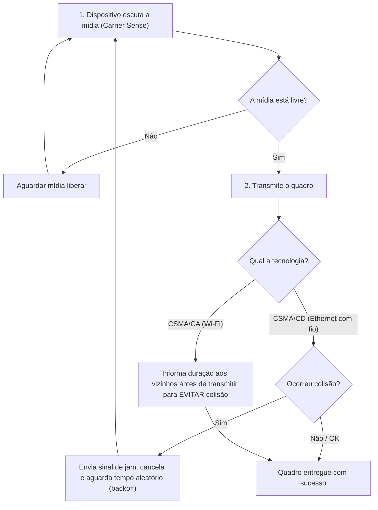

### 10.5 Transição de quadros a cada salto (Hop-by-Hop)

Enquanto o **endereço IP de destino permanece o mesmo** do cliente até o servidor final em toda a Internet, o **quadro da camada de enlace é destruído e recriado a cada roteador** pelo caminho:

1. O Roteador A recebe o quadro Ethernet do cabo local na interface de entrada.
2. O Roteador A desencapsula o quadro, descartando os cabeçalhos de enlace do trecho anterior.
3. O Roteador A lê o pacote IP (Camada 3) e consulta sua tabela de rotas para decidir a interface de saída.
4. O Roteador A encapsula o mesmo pacote IP em um **novo quadro** com o endereço MAC de saída e o MAC da interface do Roteador B (próximo salto).

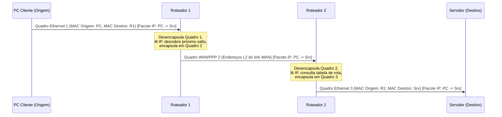

### 10.6 Topologias físicas e lógicas

- **Topologia Física**: Refere-se à disposição física de cabos, placas e equipamentos na rede.
- **Topologia Lógica**: Refere-se à forma como os quadros trafegam internamente de nó para nó pela camada de enlace.

| Topologia Física | Definição e Funcionamento |
| :--- | :--- |
| **Estrela (*Star*)** | Todos os dispositivos finais se conectam diretamente a um único dispositivo intermediário central (switch). |
| **Estrela Estendida (*Extended Star*)** | Os dispositivos finais se conectam a um dispositivo intermediário central (switch de acesso), que por sua vez se conecta a outro dispositivo intermediário central (switch core/distribuição). |
| **Barramento (*Bus*)** | Todos os sistemas finais são encadeados em um cabo compartilhado (coaxial) com terminadores nas pontas. |
| **Anel (*Ring*)** | Os dispositivos são conectados em formato de círculo/anel com seus vizinhos diretos (Token Ring). |
| **Ponto a Ponto** | Conexão direta e exclusiva entre apenas dois endpoints. |
| **Hub-and-Spoke** | Topologia WAN em estrela onde um site central conecta várias filiais (filiais não se falam diretamente sem passar pelo centro). |
| **Malha (*Mesh*)** | Todos os nós se conectam a todos os outros (alta disponibilidade e alto custo). |

### 10.7 Glossário de siglas da camada de enlace

| Sigla | Termo em Inglês | Significado e Explicação |
|-------|-----------------|--------------------------|
| **LLC** | *Logical Link Control* | Subcamada de controle de enlace lógico (padrão IEEE 802.2). |
| **MAC** | *Media Access Control* | Subcamada de controle de acesso ao meio e endereço físico gravado na placa de rede. |
| **NIC** | *Network Interface Card* | Placa de interface de rede (física ou virtual) onde habita o endereço MAC. |
| **CRC** | *Cyclic Redundancy Check* | Checagem de redundância cíclica usada no trailer do quadro para detectar corrupção de bits. |
| **FCS** | *Frame Check Sequence* | Sequência de verificação de quadro, o campo do trailer onde o valor do CRC é armazenado. |
| **CSMA/CD** | *Carrier Sense Multiple Access with Collision Detection* | Protocolo de acesso ao meio com detecção de colisão usado em redes Ethernet half-duplex. |
| **CSMA/CA** | *Carrier Sense Multiple Access with Collision Avoidance* | Protocolo de acesso ao meio com prevenção de colisão usado em Wi-Fi (IEEE 802.11). |
| **PPP** | *Point-to-Point Protocol* | Protocolo de enlace camada 2 para links diretos de longa distância (WAN). |
| **HDLC** | *High-Level Data Link Control* | Protocolo síncrono de camada de enlace para conexões ponto a ponto WAN. |

#### 10.7.1 Análise de questão ENADE 2017 (Padrões IEEE 802.3 vs 802.11)

- **IEEE 802.3 (Ethernet)**: Padroniza redes locais cabeadas e utiliza o método de acesso ao meio **CSMA/CD** (*Collision Detection*).
- **IEEE 802.11 (Wi-Fi)**: Padroniza redes locais sem fio e utiliza o método de acesso ao meio **CSMA/CA** (*Collision Avoidance*).
- **Frequências do Wi-Fi**: 802.11a opera em 5 GHz; 802.11b e 802.11g operam em 2.4 GHz (não usam a mesma frequência).
- **Coexistência**: Padrões 802.3 e 802.11 coexistem na mesma rede local em harmonia (ex.: um notebook Wi-Fi acessando um servidor via cabo Ethernet).

### 10.8 Exemplo real em engenharia de dados

Imagine um pipeline de dados em engenharia de dados onde um worker Python em container Kubernetes extrai um grande volume de dados de uma API e insere no PostgreSQL/BigQuery:

1. Quando seu job Python faz um `INSERT` em lote com 50.000 registros, ele gera bytes no nível da aplicação.
2. O sistema operacional agrupa esses bytes em **segmentos TCP** e **pacotes IP** destinados ao banco (`10.30.0.10`).
3. Ao enviar para a placa de rede da máquina virtual, a **camada de enlace** adiciona o cabeçalho Ethernet com o endereço MAC da interface da VM e o MAC do switch/gateway virtual do cluster.
4. Se o cabo ou a rede virtual sofresse ruído e alterasse um bit dos dados transmitidos, o cálculo de **CRC** na camada de enlace do destino falharia e o quadro corrompido seria **descartado imediatamente pelo hardware da placa de rede**, sem deixar chegar dado truncado ao seu banco.

### 10.9 Exemplo de código em Terraform (Infraestrutura de Rede e Interfaces L2/L3)

O exemplo abaixo em Terraform demonstra a criação de uma interface de rede virtual (vNIC) onde a camada de enlace opera, associando o endereço MAC virtual à máquina do worker de dados:


**Verificação no terminal Linux (Bash)** — inspecionar a camada de enlace (endereços MAC, estatísticas de CRC/erros) na placa de rede do worker:

```bash
# Exibe todas as interfaces de rede com seus endereços MAC (link/ether) e estado da camada de enlace
ip link show

# Exibe estatísticas detalhadas de transmissão/recepção, incluindo quadros descartados (dropped) e erros de CRC
ip -s link show eth0
```

### 10.10 Resolução de Endereços: ARP (IPv4) vs. Neighbor Discovery ICMPv6 (IPv6)

Para que um quadro Ethernet seja transmitido na rede local, o emissor conhece o IP de destino (Camada 3), mas precisa descobrir o **endereço MAC físico da placa de rede** (Camada 2). Esse mapeamento é chamado de **resolução de endereços**.

#### 10.10.1 Como o IPv4 Resolve: Protocolo ARP

- **ARP Request (Solicitação)**: O host transmissor envia uma mensagem em **Broadcast** (`FF:FF:FF:FF:FF:FF`) para todos os dispositivos do segmento de rede perguntando: *"Quem possui o IPv4 X.X.X.X? Responda com seu MAC para o meu IP/MAC"*.
- **ARP Reply (Resposta)**: O host que possui o IP solicitado responde em **Unicast** diretamente ao transmissor: *"Eu possuo esse IP e meu MAC é AA:BB:CC:DD:EE:FF"*.
- **Cache ARP**: O resultado é salvo temporariamente na memória RAM para evitar novas consultas a cada pacote enviado.

#### 10.10.2 Como o IPv6 Resolve: ICMPv6 Neighbor Discovery (ND / NDP)

No IPv6, **o Broadcast NÃO existe**. Em seu lugar, a resolução de endereços utiliza o protocolo **Neighbor Discovery (NDP)** baseado em mensagens do protocolo **ICMPv6**:

1. **Neighbor Solicitation (NS)**: Mensagem enviada pelo host emissor para descobrir o MAC de um nó vizinho cujo IPv6 é conhecido (equivalente direto ao **ARP Request**). É enviada via **Solicited-Node Multicast**, garantindo que apenas os nós com terminação de endereço compatível processem o pacote no hardware da NIC, economizando processamento de todos os outros dispositivos da rede.
2. **Neighbor Advertisement (NA)**: Mensagem de resposta enviada em **Unicast** pelo nó detentor do IPv6 contendo seu endereço MAC (equivalente direto ao **ARP Reply**).
3. **Router Solicitation (RS)**: Mensagem do host para roteadores solicitando informações de autoconfiguração de rede (SLAAC).
4. **Router Advertisement (RA)**: Mensagem do roteador anunciando prefixos e parâmetros da rede aos hosts.
5. **Redirect Message**: Mensagem do roteador informando ao host um caminho de próximo salto mais eficiente.

| Função de Rede | IPv4 (Mecanismo Tradicional) | IPv6 (Protocolo ICMPv6 NDP) | Tipo de Envio |
| :--- | :--- | :--- | :--- |
| **Requisitar MAC de um nó (Pergunta)** | **ARP Request** | **`Neighbor Solicitation (NS)`** | IPv4: Broadcast (`FF:FF:...`) / IPv6: *Solicited-Node Multicast* |
| **Informar MAC ao requisitante (Resposta)** | **ARP Reply** | **`Neighbor Advertisement (NA)`** | Unicast |
| **Requisitar parâmetros de roteador** | DHCP / Rota Estática | **`Router Solicitation (RS)`** | Multicast (`ff02::2`) |
| **Anunciar parâmetros aos hosts** | DHCP / Anúncio de Rota | **`Router Advertisement (RA)`** | Multicast (`ff02::1`) |
| **Informar rota de melhor salto** | ICMP Redirect | **`ICMPv6 Redirect`** | Unicast |

#### 10.10.3 Comparativo das Alternativas da Questão

| Alternativa da Questão | Definição Técnica | Equivale a *Neighbor Solicitation* do IPv6? | Avaliação |
| :--- | :--- | :---: | :---: |
| **`ARP`** | **Protocolo do IPv4 para resolução de endereços IP em endereços MAC na rede local.** | **SIM (Equivalente direto)** | **CORRETA** |
| `Broadcast` | Modo de transmissão para todos os nós da LAN (eliminado no IPv6). | Não (é um método de entrega, não um protocolo de resolução) | Incorreta |
| `Unicast` | Modo de transmissão direcionado a um único destinatário exclusivo. | Não (é um método de entrega) | Incorreta |
| `ToS` (*Type of Service*) | Campo de 8 bits do cabeçalho IPv4 destinado à priorização e qualidade de serviço (QoS). | Não (campo de QoS) | Incorreta |
| `DiffServ` (*Differentiated Services*) | Arquitetura de Camada 3 para classificação de pacotes e QoS baseada nos campos ToS (IPv4) / Traffic Class (IPv6). | Não (arquitetura de QoS) | Incorreta |


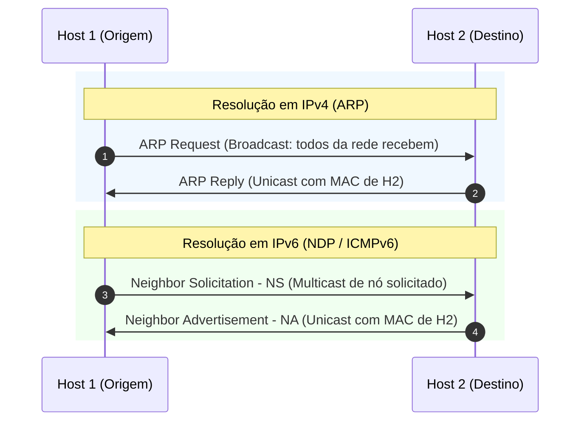

#### 10.10.4 Comandos Linux para Tabela de Vizinhos IPv6

No Linux moderno, a tabela ARP do IPv4 e a tabela de vizinhos IPv6 são gerenciadas pelo utilitário `ip neigh`:

```bash
# Exibe a tabela de resolução de vizinhos IPv6 (tabela NDP / equivalente à tabela ARP do IPv6)
ip -6 neigh show

# Envia manualmente uma mensagem Neighbor Solicitation (NS) para descobrir o MAC de um IP IPv6
ndisc6 2001:db8::50 eth0
```

#### 10.10.5 Protocolos de Descoberta e Resolução de Endereços

| Protocolo | Nome Completo | Camada / Escopo | Função Principal |
| :--- | :--- | :---: | :--- |
| **ARP** | *Address Resolution Protocol* | Camada 2 / 3 | **Descobre o endereço MAC físico associado a um endereço IPv4 lógico conhecido na rede local.** |
| **RARP** | *Reverse Address Resolution Protocol* | Camada 2 / 3 | Protocolo legado que permitia a computadores sem disco (*diskless*) descobrirem seu próprio IP a partir do seu MAC (substituído por BOOTP e DHCP). |
| **CDP** | *Cisco Discovery Protocol* | Camada 2 | Protocolo proprietário da Cisco para que switches e roteadores descubram informações sobre dispositivos vizinhos diretamente conectados. |
| **LLDP** | *Link Layer Discovery Protocol* | Camada 2 (IEEE 802.1AB) | Padrão aberto neutro de fabricante equivalente ao CDP para mapeamento de topologia de dispositivos vizinhos na rede. |
| **LLTD** | *Link Layer Topology Discovery* | Camada 2 (Microsoft) | Protocolo proprietário da Microsoft usado pelo Windows para diagnóstico e desenho gráfico do mapa de rede local. |

#### 10.10.6 Tabela Comparativa das Alternativas da Questão: Descoberta de MAC na LAN

| Alternativa da Questão | Função Real | Descobre o MAC de um Host a partir do IP? | Avaliação |
| :--- | :--- | :---: | :---: |
| **`ARP`** | **Mapeia endereço lógico IPv4 para endereço físico MAC na rede local.** | **SIM** | **CORRETA** |
| `RARP` | Mapeava MAC para IP (função inversa e obsoleta; substituída pelo DHCP). | Não (faz o inverso) | Incorreta |
| `CDP` | Descobre informações de hardware/firmware de switches/roteadores Cisco vizinhos. | Não (descoberta de vizinhos de rede) | Incorreta |
| `LLDP` | Descobre capacidades e portas de equipamentos de rede vizinhos (padrão aberto). | Não (descoberta de vizinhos de rede) | Incorreta |
| `LLTD` | Mapeia topologia gráfica de computadores no Windows. | Não (mapeamento de mapa de rede) | Incorreta |

---


## 11. Endereçamento IPv4, Máscaras e Segmentação de Redes


### 11.1 Conceito de CIDR e Cálculo de Hosts
O roteamento inter-domínios sem classe (CIDR - *Classless Inter-Domain Routing*) substituiu o antigo sistema de classes fixas (A, B, C), permitindo alocar blocos IP com tamanhos flexíveis definidos por um prefixo (ex: `/24` ou `/20`).
- O número após a barra indica quantos bits (da esquerda para a direita) pertencem à **porção de rede** (*Network ID*).
- O restante ($32 - \text{prefixo}$) pertence à **porção de host** (*Host ID*).
- O total de endereços IP em um bloco é $2^{\text{bits de host}}$. Destes, 2 são reservados:
  - O **primeiro endereço** (todos os bits de host zerados `0`) identifica a **própria rede**.
  - O **último endereço** (todos os bits de host preenchidos com `1`) é o endereço de **broadcast** da rede.
  - Endereços utilizáveis para máquinas/servidores: $2^{\text{bits de host}} - 2$.

### 11.2 Propriedades de Configuração IPv4 em um Servidor

Quando configuramos a pilha TCP/IP manualmente (estática) ou via DHCP em uma máquina ou servidor, cada parâmetro desempenha um papel específico e independente:

| Propriedade de Configuração | O que é e para que serve | Identifica Rede vs Host? | Exemplo Típico |
|-----------------------------|--------------------------|---------------------------|----------------|
| **Máscara de Sub-rede (*Subnet Mask*)** | Sequência de 32 bits (composta por `1`s contínuos seguidos de `0`s contínuos) que delimita matematicamente onde termina a porção de rede e onde começa a porção de host em um endereço IP. | **SIM (Exclusiva desta propriedade)** | `255.255.255.0` (`/24`) |
| **Endereço IPv4 (*Host IP*)** | Identificador lógico exclusivo de 32 bits atribuído à interface de rede do dispositivo. | Não sozinho (precisa da máscara para saber a divisão) | `192.168.1.50` |
| **Gateway Padrão (*Default Gateway*)** | Endereço IP da interface do roteador local que dá saída para outras redes/Internet quando o destino não está na sub-rede local. | Não (é apenas o IP de próximo salto) | `192.168.1.1` |
| **Servidor DNS (*Domain Name System*)** | Servidor responsável por traduzir nomes de domínio legíveis por humanos (FQDN, ex.: `banco-rh.interno`) no endereço IP correspondente. | Não (serviço de resolução de nomes na Camada 7) | `8.8.8.8` ou `10.0.0.2` |
| **Servidor DHCP (*Dynamic Host Config Protocol*)** | Servidor que distribui automaticamente parâmetros de rede (IP, máscara, gateway, DNS) para clientes; não é utilizado na configuração manual/estática. | Não (serviço de autoconfiguração de rede) | `192.168.1.254` |
| **Servidor FTP (*File Transfer Protocol*)** | Servidor de aplicação destinado à transferência de arquivos; não faz parte das configurações de pilha IP/roteamento do host. | Não (serviço de aplicação da Camada 7) | `192.168.1.100` (porta 21) |

### 11.3 Mecanismo Real: Como a Máscara de Sub-rede Funciona (Operação Bitwise AND)

A palavra **máscara** vem do mecanismo de "filtragem" bit a bit: ela mascara (oculta) os bits do host para revelar apenas o endereço da rede.

1. **Separação matemática**:
   O sistema operacional pega o endereço IP do host (`192.168.1.50`) e a Máscara de Sub-rede (`255.255.255.0`) em formato binário e executa uma operação lógica **AND bit a bit** (*Bitwise AND*):
   - `1 AND 1 = 1`
   - `1 AND 0 = 0`
   - `0 AND 0 = 0`
   O resultado dessa operação revela exatamente o **Endereço de Rede** (`192.168.1.0`).

2. **Decisão de Roteamento Local vs. Remoto**:
   - Quando o servidor quer enviar um pacote para um IP de destino (ex: `192.168.1.80`), ele aplica a **sua própria máscara** ao IP de destino.
   - Se o resultado for igual à sua própria rede (`192.168.1.0`), o host sabe que o destino é **local** e envia o quadro diretamente via switch L2 usando o protocolo ARP.
   - Se o resultado for diferente (ex: destino `10.0.0.15`), o host sabe que o destino é **remoto** e envia o pacote para o endereço MAC do **Gateway Padrão** (*roteador*).

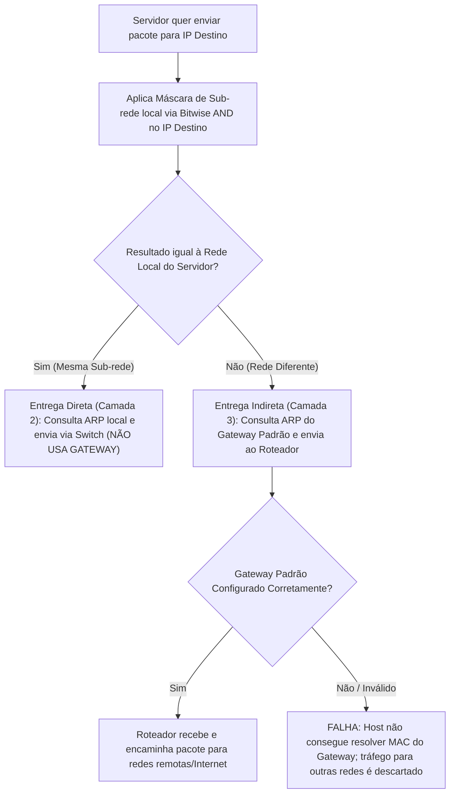

#### 11.3.1 Diagnóstico de Falhas de Configuração IP (Local vs. Remoto)

| Sintoma Observado no Host | Causa Raiz Técnica | Por que ocorre? |
| :--- | :--- | :--- |
| **Acessa a rede local, mas NÃO acessa redes remotas ou Internet** | **Gateway Padrão (*Default Gateway*) inválido, incorreto ou inacessível** | A comunicação local ocorre diretamente via switches L2 e ARP local (sem gateway). O gateway é exigido **exclusivamente** para alcançar sub-redes remotas. |
| Não acessa a rede local e nem redes remotas | Endereço IP inválido, duplicado na rede ou interface desabilitada (*down*) | Sem um IP válido configurado na interface, a pilha TCP/IP não consegue nem responder a requisições ARP locais. |
| Acessa alguns hosts remotos, mas confunde locais com remotos | Máscara de sub-rede (*Subnet Mask*) incorreta | Uma máscara errada altera o cálculo de bitwise AND, fazendo o host achar que destinos locais são remotos (e vice-versa). |
| Queda geral de conectividade por esgotamento de banda | Tempestade de broadcast (*Broadcast Storm*) ou loop L2 | O host envia pacotes em volume excessivo, saturando os buffers dos switches, afetando toda a rede local. |


### 11.4 Características Fundamentais do Protocolo IP (Camada 3)

O protocolo IP (IPv4/IPv6) foi projetado para ser simples, rápido e escalável. Ele possui três características arquiteturais essenciais:

| Característica | O que significa na prática | Como funciona o mecanismo |
| :--- | :--- | :--- |
| **Não Orientado a Conexão (*Connectionless*)** | Nenhuma sessão dedicada ou circuito virtual é estabelecido antes do envio dos pacotes. | O remetente simplesmente encapsula e despacha os datagramas. Cada roteador toma decisões de próximo salto de forma independente; pacotes do mesmo fluxo podem seguir rotas diferentes e chegar fora de ordem. |
| **Melhor Esforço (*Best-Effort / Unreliable*)** | A entrega não é garantida e o cabeçalho IP não possui confirmação de recebimento (*ACK*). | O IP não retransmite pacotes perdidos, corrompidos ou descartados por congestionamento de buffer em roteadores. Ele **depende dos serviços da Camada de Transporte (especificamente o TCP)** para reordenação, controle de fluxo e retransmissão de pacotes ausentes. |
| **Independente do Meio (*Media Independent*)** | O formato e o encapsulamento do pacote IP não mudam em função da mídia física. | O pacote IP é idêntico se trafegar em fibra óptica, cabo de cobre UTP ou ondas de rádio (Wi-Fi). Quem adapta o pacote às particularidades do meio físico é a **Camada de Enlace (L2)** e a **Camada Física (L1)**. |

#### 11.4.1 Comparativo das Afirmações sobre o Protocolo IP

| Afirmação / Característica Analisada | Veredito | Justificativa Técnica |
| :--- | :---: | :--- |
| **`Connectionless` (Sem Conexão)** | **CARACTERÍSTICA BÁSICA DO IP** | Não há estabelecimento prévio de sessão (*handshake*); cada datagrama IP é roteado de forma independente. |
| **"O IP depende dos serviços da camada de transporte para lidar com situações de pacotes ausentes ou fora de ordem"** | **VERDADEIRA** | O IP é *best-effort*; o protocolo **TCP (Camada 4)** utiliza *Sequence Numbers* e *Acks* para detectar perdas e reconstruir o fluxo ordenado para a aplicação. |
| "Dependente de mídia" | Falsa | O IP é *Media Independent*; opera de maneira transparente sobre cobre, fibra ou rádio. |
| "Segmentação de dados do usuário" | Falsa | A segmentação primária de fluxos de dados da aplicação em blocos de transporte é função da **Camada 4 (Transporte)**. |
| "Entrega confiável de ponta a ponta" | Falsa | O IP é inerentemente não confiável (*best-effort*); confiabilidade é provida pelo **TCP**. |
| "Exclusão de frames" | Falsa | Quadros (*frames*) são a PDU da **Camada 2 (Enlace)**; o descarte de quadros com erro de CRC é feito por L2, não pelo IP (L3). |
| "O encapsulamento IP é condicionado e modificado com base no meio físico" | Falsa | O IP é *Media Independent*; o cabeçalho IP permanece inalterado independentemente da mídia física usada. |
| "O IP depende dos protocolos da camada 2 para controle de erros de transmissão" | Falsa | A Camada 2 apenas descarta quadros locais com erro de CRC/FCS; a garantia de entrega ponta a ponta é provida pela Camada 4 (Transporte). |
| "Os endereços MAC são usados durante o encapsulamento do pacote IP" | Falsa | Endereços MAC são inseridos no cabeçalho do **Quadro (Camada 2)**; o pacote IP (Camada 3) utiliza apenas endereços IP de origem e destino. |
| "O IP precisa se comunicar com a camada 1 para construir o seu pacote" | Falsa | A arquitetura em camadas é estritamente modular e adjacente: a Camada 3 comunica-se apenas com a Camada 4 (acima) e a Camada 2 (abaixo). |


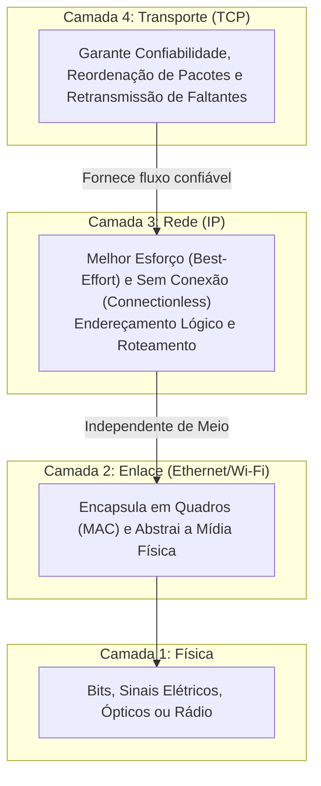

#### 11.4.2 Tabela Comparativa das Alternativas: Resolução de Pacotes Ausentes ou Fora de Ordem no IP

| Alternativa da Questão | Protocolo / Mecanismo | Comportamento Real frente a Pacotes Perdidos / Fora de Ordem | Avaliação |
| :--- | :--- | :--- | :---: |
| **`Camada de transporte com o TCP.`** | **TCP (*Transmission Control Protocol*)** | **Reordena os segmentos usando *Sequence Numbers* (SEQ) e solicita retransmissão de faltantes via *Acknowledgments* (ACK) e temporizadores.** | **CORRETA** |
| `Camada de transporte com o UDP.` | UDP (*User Datagram Protocol*) | Não possui controle de fluxo, retransmissão nem reordenação (*unreliable* / *best-effort*). | Incorreta |
| `Camada de enlace com CRC.` | Enlace (CRC / FCS) | O CRC apenas detecta erros de integridade no salto físico atual e descarta o quadro corrompido, mas não reordena nem recupera perdas ponta a ponta. | Incorreta |
| `Camada física.` | Camada 1 (Física) | Apenas codifica e transmite pulsos elétricos, de luz ou rádio; não tem noção lógica de pacotes ou ordem. | Incorreta |
| `Camada de aplicação.` | Aplicação (HTTP, SMTP, etc.) | Delega o transporte confiável à camada 4 (TCP); não implementa reordenação de rede na arquitetura padrão. | Incorreta |

#### 11.4.3 Estrutura e Vantagens do Cabeçalho IPv6 vs. IPv4


A principal vantagem arquitetural do cabeçalho IPv6 em relação ao IPv4 é o **Processamento de Pacotes Eficiente (*Efficient Packet Handling*)**:

| Parâmetro de Comparação | Cabeçalho IPv4 | Cabeçalho IPv6 | Impacto na Performance |
| :--- | :--- | :--- | :--- |
| **Tamanho do Cabeçalho Base** | **Variável** (20 bytes a 60 bytes) | **Fixo** (**40 bytes**) | Cabeçalho fixo permite que circuitos de hardware (ASICs) dos roteadores leiam campos em posições de memória exatas e constantes. |
| **Quantidade de Campos** | **14 campos** | **8 campos** (simplificado) | Menor sobrecarga (*overhead*) de processamento por pacote em cada nó intermediário. |
| **Campo de Checksum (*Header Checksum*)** | **Presente** (deve ser recalculado por cada roteador a cada salto ao decrementar o TTL) | **Removido** (verificação delegada para as camadas L2 e L4) | **Grande ganho de vazão**: roteadores apenas decrementam o *Hop Limit* sem gastar CPU recalculando checksums matemáticos. |
| **Tamanho dos Endereços IP** | 32 bits (4 bytes cada) | 128 bits (16 bytes cada) | Endereços IPv6 são 4x maiores, garantindo espaço de endereçamento praticamente ilimitado. |
| **Tratamento de Fragmentação** | Feito pelos roteadores intermediários (campos *Identification*, *Flags*, *Fragment Offset*) | **Removido do cabeçalho base**; fragmentação é feita exclusivamente pelo host de origem (*Extension Headers*) | Elimina gargalos de processamento e reempacotamento de fragmentos dentro do núcleo da rede (*Core Routers*). |
| **Campo IHL (*Internet Header Length*)** | Presente (informa o tamanho do cabeçalho devido às opções variáveis) | **Removido** (desnecessário devido ao tamanho fixo de 40 bytes) | Roteador sabe imediatamente onde os dados começam sem ler campos auxiliares. |

#### 11.4.3 Os 8 Campos do Cabeçalho Base do IPv6

```text
 0                   1                   2                   3
 0 1 2 3 4 5 6 7 8 9 0 1 2 3 4 5 6 7 8 9 0 1 2 3 4 5 6 7 8 9 0 1
+-+-+-+-+-+-+-+-+-+-+-+-+-+-+-+-+-+-+-+-+-+-+-+-+-+-+-+-+-+-+-+-+
|Version| Traffic Class |           Flow Label                  |
+-+-+-+-+-+-+-+-+-+-+-+-+-+-+-+-+-+-+-+-+-+-+-+-+-+-+-+-+-+-+-+-+
|         Payload Length        |  Next Header  |   Hop Limit   |
+-+-+-+-+-+-+-+-+-+-+-+-+-+-+-+-+-+-+-+-+-+-+-+-+-+-+-+-+-+-+-+-+
|                                                               |
+                                                               +
|                                                               |
+                         Source Address                        +
|                           (128 bits)                          |
+                                                               +
|                                                               |
+-+-+-+-+-+-+-+-+-+-+-+-+-+-+-+-+-+-+-+-+-+-+-+-+-+-+-+-+-+-+-+-+
|                                                               |
+                                                               +
|                                                               |
+                      Destination Address                      +
|                           (128 bits)                          |
+                                                               +
|                                                               |
+-+-+-+-+-+-+-+-+-+-+-+-+-+-+-+-+-+-+-+-+-+-+-+-+-+-+-+-+-+-+-+-+
```

| Campo IPv6 | Tamanho | Função Técnica | Equivalente no IPv4 |
| :--- | :---: | :--- | :--- |
| **`Version`** | 4 bits | Identifica a versão do protocolo IP (fixo em `0110` = 6). | *Version* (4 bits) |
| **`Traffic Class`** | 8 bits | Marca a classe de prioridade do tráfego (QoS / DiffServ). | *Type of Service (ToS) / DiffServ* |
| **`Flow Label`** | **20 bits** | **Identifica fluxos contínuos de uma mesma conversa/sessão em tempo real.** Informa roteadores e switches para manter o **mesmo caminho de encaminhamento** para todos os pacotes com o mesmo label, evitando reordenação e jitter. | *Não existe no IPv4* |
| **`Payload Length`** | 16 bits | Informa o tamanho dos dados transportados após o cabeçalho base de 40 bytes. | *Total Length* (no v4 inclui o cabeçalho) |
| **`Next Header`** | 8 bits | Especifica o protocolo da camada superior (TCP=6, UDP=17, ICMPv6=58) ou o tipo do próximo cabeçalho de extensão. | *Protocol* (8 bits) |
| **`Hop Limit`** | 8 bits | Contador decrementado por cada roteador que processa o pacote; descarta o pacote quando chega a zero. | *Time To Live (TTL)* |
| **`Source Address`** | 128 bits | Endereço IPv6 do nó de origem da transmissão. | *Source IP Address* (32 bits) |
| **`Destination Address`** | 128 bits | Endereço IPv6 do nó ou grupo de nós de destino. | *Destination IP Address* (32 bits) |

#### 11.4.4 Comparativo das Opções: Aplicações em Tempo Real e Caminho de Roteamento

| Alternativa da Questão | Tamanho | Papel Técnico | Mantém o mesmo caminho para pacotes da mesma conversa? |
| :--- | :---: | :--- | :---: |
| **`Flow Label`** | **20 bits** | Informa roteadores e switches para manter o mesmo caminho (*same path*) e mesmo tratamento para pacotes de uma mesma sequência/conversa em tempo real. | **SIM (Campo Específico)** |
| `Traffic Class` | 8 bits | Define a prioridade ou classe de serviço (QoS) do pacote, mas não vincula pacotes a um caminho fixo de roteamento. | Não (define prioridade, não caminho) |
| `Next Header` | 8 bits | Identifica o protocolo de transporte ou o próximo cabeçalho de extensão. | Não |
| `Differentiated Services` | 8 bits | Nome do campo de prioridade utilizado no **cabeçalho IPv4** (no IPv6 foi renomeado para *Traffic Class*). | Não (campo de IPv4) |
| `Endereço IP de origem` | 128 bits | Identifica o nó remetente, sem diferenciar fluxos ou conversas distintas originadas do mesmo nó. | Não |

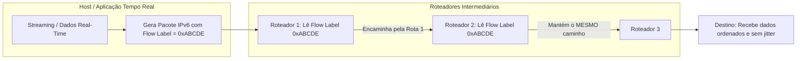


### 11.5 Endereços de Uso Especial no IPv4 (Loopback e APIPA)

O IPv4 reserva blocos de endereços para finalidades específicas que não podem ser roteados na Internet pública ou atribuídos normalmente a hosts convencionais:

| Endereço / Bloco | Tipo / Nome | Finalidade Técnica | Pode ser usado para Ping Local? |
| :--- | :--- | :--- | :---: |
| **`127.0.0.1`** | **Loopback (Host)** | Endereço atribuído à interface virtual de loopback (`lo` / `localhost`). Usado por um host para enviar tráfego para si mesmo e testar se a pilha TCP/IP está operacional. | **SIM (Padrão de teste)** |
| **`127.0.0.0`** | **Identificador de Rede** | Endereço de rede do bloco de loopback `127.0.0.0/8`. Identifica a sub-rede inteira, não um dispositivo/host individual. | Não (é o Network ID) |
| **`126.0.0.1`** | **Unicast Público** | Endereço IP público globalmente roteável (antiga Classe A, intervalo 1.0.0.0 a 126.255.255.255). | Não (é endereço externo) |
| **`126.0.0.0`** | **Identificador de Rede** | Endereço de rede do bloco `126.0.0.0/8`. | Não (é o Network ID) |
| **`128.0.0.1`** | **Unicast Público** | Endereço IP público globalmente roteável (antiga Classe B, intervalo 128.0.0.0 a 191.255.255.255). | Não (é endereço externo) |
| **`169.254.0.0/16`** | **APIPA / Link-Local** | Endereçamento IP Privado Automático gerado pelo próprio SO quando o cliente DHCP não obtém resposta na rede local. | Não (usado para autoconfiguração local) |

#### 11.5.1 Mecanismo Real da Interface de Loopback (`lo`)

1. **Retorno em Laço no Kernel (*Loopback*)**:
   Quando qualquer aplicação ou o utilitário `ping` envia pacotes para `127.0.0.1` (ou qualquer endereço dentro de `127.0.0.0/8` no IPv4 ou `::1` no IPv6), o pacote **não sai para o cabo nem para o transmissor físico da placa de rede (NIC)**.
2. **Curto-circuito de software**:
   O subsistema de rede do sistema operacional intercepta o pacote na camada IP (Camada 3) e o direciona imediatamente para o buffer de recepção da própria máquina.
3. **Diagnóstico da Pilha TCP/IP**:
   Se o comando `ping 127.0.0.1` responder com sucesso, o engenheiro tem a certeza física de que o **driver de rede, os protocolos IP, TCP/UDP e a pilha de software do SO estão intactos e funcionando**.

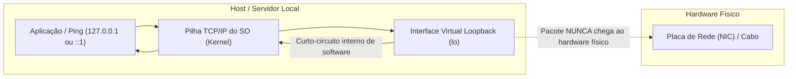

#### 11.5.2 O que o Teste de Loopback Valida vs. O que NÃO Valida

| Alternativa da Questão | Avaliação | Justificativa Técnica |
| :--- | :---: | :--- |
| **`A pilha TCP/IP no dispositivo está funcionando corretamente`** | **CORRETA** | O teste processa o pacote por toda a estrutura lógica de software (IP, ICMP, buffers do kernel), confirmando que a pilha de rede interna do SO está operacional. |
| `O cabo Ethernet está funcionando corretamente` | Incorreta | O pacote faz um curto-circuito em software e **nunca atinge o meio físico**; o teste de loopback responde com sucesso mesmo com o cabo de rede desconectado. |
| `O DHCP está funcionando corretamente` | Incorreta | A interface de loopback possui endereço estático pré-configurado pelo sistema operacional (`127.0.0.1` / `::1`), sem interação com servidores DHCP. |
| `O dispositivo possui o endereço IP correto na rede` | Incorreta | O loopback não valida o IP da interface de rede física (ex.: `192.168.1.50`); valida apenas o IP interno virtual do próprio host. |
| `O dispositivo possui conectividade ponta a ponta` | Incorreta | O teste é estritamente local à máquina; não alcança roteadores, switches ou outros servidores na rede. |

### 11.6 Exemplo Real em Engenharia de Dados


No ecossistema de Engenharia de Dados:
- **Tolerância a Perda em Pipelines de Big Data**: Quando um job Spark transfere gigabytes de dados entre executores distribuídos via rede, centenas de pacotes IP podem ser descartados por saturação de switches no data center. Como o IP é *best-effort*, a camada de **transporte (TCP)** monitora os números de confirmação (*ACK*) e retransmite automaticamente os segmentos ausentes, garantindo que nenhum registro do DataFrame chegue corrompido ou falte na gravação final.
- **Desenvolvimento Local e Contêineres**: A interface de loopback (`127.0.0.1`) permite subir bancos locais (PostgreSQL, ClickHouse, Redis) e conectar aplicações de ingestão em testes unitários sem emitir tráfego externo.
- **Segmentação de Subnets em VPCs**: Subnets `/24` isolam workers Spark de instâncias de banco, garantindo que o tráfego intra-cluster permaneça na camada local L2 e o tráfego inter-redes passe por firewalls no gateway.

### 11.7 Glossário de Siglas

| Sigla | Nome Completo | Significado e Função |
|-------|---------------|----------------------|
| **IP** | *Internet Protocol* | Protocolo de camada de rede responsável pelo endereçamento lógico e roteamento de pacotes. |
| **IPv4** | *Internet Protocol version 4* | Protocolo de endereçamento de 32 bits da Camada de Rede. |
| **TCP** | *Transmission Control Protocol* | Protocolo orientado a conexão da Camada 4 que provê entrega confiável e reordenação de dados. |
| **UDP** | *User Datagram Protocol* | Protocolo não orientado a conexão da Camada 4 que não garante entrega nem reordenação (menor overhead). |
| **APIPA** | *Automatic Private IP Addressing* | Endereçamento automático link-local (169.254.0.0/16) usado quando o DHCP falha. |
| **CIDR** | *Classless Inter-Domain Routing* | Notação de prefixo flexível (ex: `/24`) que substituiu o endereçamento rígido por classes (A, B, C). |
| **DNS** | *Domain Name System* | Sistema hierárquico que traduz nomes legíveis (ex.: `dw.empresa.com`) em endereços IP numéricos. |
| **DHCP** | *Dynamic Host Configuration Protocol* | Protocolo que fornece automaticamente configurações de rede (IP, máscara, gateway, DNS) aos dispositivos. |
| **FTP** | *File Transfer Protocol* | Protocolo de camada de aplicação para transferência de arquivos cliente-servidor (não afeta roteamento IP). |
| **NAT** | *Network Address Translation* | Técnica que mapeia endereços IP privados internos para endereços IP públicos roteáveis na Internet. |
| **NIC** | *Network Interface Card* | Placa de interface de rede física ou virtual instalada no dispositivo. |
| **VLSM** | *Variable Length Subnet Masking* | Técnica de divisão de sub-redes em tamanhos variáveis para otimizar o uso do espaço de endereçamento. |
| **VPC** | *Virtual Private Cloud* | Rede virtual isolada em nuvem pública onde residem instâncias, sub-redes e bancos de dados. |

### 11.8 Exemplo com Código Real (Python / Bash)

**1. Teste no terminal Linux (Bash) para validar a pilha de rede e interface de loopback:**

```bash
# Executa 4 pacotes de ping para o endereço de loopback para verificar a integridade da pilha TCP/IP
ping -c 4 127.0.0.1

# Exibe as configurações da interface virtual de loopback (lo) no Linux
ip addr show lo
```

**2. Script Python em Pipeline de Dados verificando integridade de conexão TCP sobre IP:**


---

## 12. Endereçamento IPv6

### 12.1 Estrutura e Representação do IPv6

O protocolo IPv6 foi desenvolvido pelo IETF para substituir o IPv4 e solucionar em definitivo a escassez de endereços IP na Internet.

- **Comprimento**: **128 bits** (divididos em 8 hextetos de 16 bits cada).
- **Representação**: Notação hexadecimal (32 dígitos hexadecimais de `0` a `F`, separados por dois-pontos `:`).
- **Total de Endereços**: $2^{128} \approx 3,4 \times 10^{38}$ endereços únicos (aproximadamente 340 undecilhões).

```text
Formato Preferencial (32 dígitos):
2001:0db8:0000:00a3:0000:0000:0000:1234

Regras de Compactação:
1. Omissão de Zeros à Esquerda: 2001:db8:0:a3:0:0:0:1234
2. Dois-Pontos Duplo (::) para sequência contínua de zeros (usado apenas 1 vez): 2001:db8:0:a3::1234
```

### 12.2 Por que o NAT NÃO é Necessário no IPv6?

No IPv4, o **NAT (*Network Address Translation*)** foi criado como um mecanismo paliativo de sobrevivência para contornar o esgotamento dos 4,3 bilhões de endereços de 32 bits, permitindo que milhares de hosts com IPs privados (RFC 1918) compartilhem um único IP público.

No **IPv6, o NAT não é mais necessário porque o espaço de endereçamento é gigantesco ($2^{128}$)**:

1. **Endereço Público Global para Qualquer Host**: Qualquer computador, smartphone, sensor IoT ou servidor no planeta pode receber um **Endereço Unicast Global (*Global Unicast Address - GUA*)** público e exclusivo.
2. **Restauração da Conectividade Ponta a Ponta**: A comunicação entre cliente e servidor volta ao modelo original da Internet, sem necessidade de tradução de portas (PAT), tabelas de estado de NAT nos roteadores ou quebra de protocolos que embutem IPs na camada de aplicação.
3. **Segurança Não Depende de NAT**: A segurança em redes IPv6 é provida por **Firewalls de Inspeção de Estado (*Stateful Firewalls*)** que bloqueiam conexões de entrada não autorizadas, e não pela ocultação artificial de IPs via NAT.

#### 12.2.1 Comparativo das Alternativas da Questão

| Alternativa da Questão | Avaliação | Justificativa Técnica |
| :--- | :---: | :--- |
| **`Qualquer host pode obter um endereço de rede IPv6 público porque o número de endereços disponíveis é grande`** | **CORRETA** | Com 128 bits ($3,4 \times 10^{38}$ endereços), há blocos públicos globais suficientes para que cada dispositivo do planeta tenha um IP público roteável exclusivo. |
| `O IPv6 é completamente seguro e por isso não há necessidade de ocultar os endereços IPv6 das redes internas` | Incorreta | O IPv6 possui recursos de segurança nativos (IPsec), mas nenhuma tecnologia é "completamente segura". Ocultar IP com NAT nunca foi substituto de firewall. |
| `Os problemas NAT são resolvidos porque o cabeçalho IPv6 melhora o tratamento de pacotes por roteadores intermediários` | Incorreta | A eficiência do cabeçalho otimiza a velocidade de roteamento, mas não tem relação com a eliminação da necessidade de conservação de endereços. |
| `O IPv6 aumenta o número de rotas disponíveis` | Incorreta | O IPv6 aumenta o **espaço de endereços**, mas o roteamento hierárquico busca **reduzir/agregar** a quantidade de entradas na tabela de rotas global. |
| `O IPv6 é misturado ao NAT` | Incorreta | Afirmação sem fundamento técnico; técnicas de transição como NAT64 existem apenas para interoperabilidade temporária com IPv4 legado. |

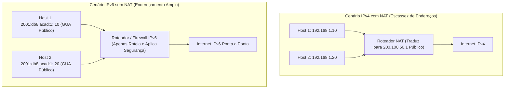

### 12.3 Estrutura de Sub-redes IPv6: Cálculo a partir de um Prefixo `/48`

Diferente do IPv4 (onde o cálculo de sub-redes busca economizar endereços bit a bit), o IPv6 foi projetado para que **toda sub-rede de usuário final seja um bloco `/64`** (recomendação do IETF / RFC 6177):

```text
|<------------------------- 128 bits do Endereço IPv6 ------------------------->|
+------------------------------+--------------------+----------------------------+
| Global Routing Prefix        | Subnet ID          | Interface ID               |
| (Atribuído pelo ISP / RIR)   | (Definido pela Org)| (Host / Dispositivo)       |
| 48 bits (Hextetos 1 a 3)     | 16 bits (Hexteto 4)| 64 bits (Hextetos 5 a 8)   |
+------------------------------+--------------------+----------------------------+
|<---------- 48 bits --------->|<---- 16 bits ----->|<--------- 64 bits -------->|
|<------------------- Prefixo /64 da Sub-rede ------>|
```

#### 12.3.1 Passo a Passo do Cálculo de Sub-redes a partir de um `/48`

1. **Prefixo do ISP recebido**: `2001:0db8::/48` (os primeiros 48 bits são fixos).
2. **Tamanho padrão da Interface ID**: 64 bits (os últimos 64 bits são preservados para endereçamento de hosts e autoconfiguração SLAAC).
3. **Bits dedicados ao Subnet ID**:
   $$\text{Bits de Subnet ID} = 64 - 48 = 16 \text{ bits}$$
4. **Total de sub-redes `/64` possíveis**:
   $$\text{Total de Sub-redes} = 2^{16} = 65.536 \text{ sub-redes}$$
   - Faixa de sub-redes: `2001:db8:0:0000::/64` até `2001:db8:0:ffff::/64`.
   - Cada uma dessas 65.536 sub-redes suporta $2^{64} \approx 18,4 \times 10^{18}$ dispositivos.

#### 12.3.2 Comparativo das Alternativas da Questão

| Alternativa | Valor de Potência | Significado Técnico | Resposta da Questão? |
| :--- | :---: | :--- | :---: |
| `16` | $2^4$ | Quantidade de sub-redes se fossem usados apenas 4 bits (1 dígito hexadecimal) para sub-rede (prefixo `/52`). | Incorreta |
| `256` | $2^8$ | Quantidade de sub-redes se fossem usados 8 bits (prefixo `/56`). | Incorreta |
| `4096` | $2^{12}$ | Quantidade de sub-redes se fossem usados 12 bits (prefixo `/60`). | Incorreta |
| **`65536`** | **$2^{16}$** | **Total exato de sub-redes `/64` geradas a partir de um bloco `/48` ($64 - 48 = 16$ bits de Subnet ID).** | **CORRETA** |
| `1.048.576` | $2^{20}$ | Quantidade de sub-redes se fossem usados 20 bits (prefixo `/68`, violando o padrão `/64`). | Incorreta |

### 12.4 Tipos Principais de Endereço Unicast IPv6

| Tipo de Endereço | Prefixo Típico | Escopo e Finalidade | Roteável na Internet? |
| :--- | :--- | :--- | :---: |
| **GUA (*Global Unicast Address*)** | `2000::/3` (ex: `2001:db8::/32`) | Endereço público global equivalente ao IPv4 público. Exclusivo no mundo todo. | **SIM** |
| **LLA (*Link-Local Address*)** | `fe80::/10` | Usado para comunicação dentro do mesmo segmento local (sub-rede). Não é roteável fora da LAN. | NÃO |
| **ULA (*Unique Local Address*)** | `fc00::/7` a `fdff::/7` | Endereço privado local para redes corporativas isoladas (semelhante ao RFC 1918). | NÃO |
| **Loopback** | `::1/128` | Usado pelo host para enviar tráfego para si mesmo (equivalente ao `127.0.0.1`). | NÃO |

### 12.5 Técnicas de Coexistência e Migração IPv4 / IPv6

| Técnica | Como Funciona | Caso de Uso Prático |
| :--- | :--- | :--- |
| **Dual-Stack** | Dispositivos executam as duas pilhas (IPv4 e IPv6) simultaneamente na mesma interface de rede. | Padrão atual em provedores, data centers e nuvens públicas. |
| **Tunneling (Tunelamento)** | Encapsula pacotes IPv6 dentro de pacotes IPv4 para atravessar redes que suportam apenas IPv4. | Conectar filiais IPv6 através de links legados IPv4. |
| **NAT64** | Traduz pacotes entre hosts que falam exclusivamente IPv6 e servidores legados que falam apenas IPv4. | Redes móveis (4G/5G) puramente IPv6 acessando a Internet legada. |

### 12.6 Exemplo Real em Engenharia de Dados

Em data centers modernos e nuvens públicas (GCP, AWS, Azure):

- **Arquitetura de Microsserviços e Big Data**: Em clusters com dezenas de milhares de pods Kubernetes rodando pipelines Spark, a faixa privada do IPv4 (`10.0.0.0/8`) costuma se esgotar rapidamente (*IP exhaustion*).
- Com a adoção do **IPv6 (sem NAT)**, cada contêiner e worker recebe um prefixo `/64` ou endereço GUA direto, permitindo conexões diretas entre clusters em diferentes regiões sem complexidade de sobreposição de IPs (*overlapping subnets*) e sem sobrecarga de gateways NAT.
- **Divisão de Sub-redes em Pipelines**: Ao receber um bloco `/48` de uma nuvem, o engenheiro aloca sub-redes `/64` dedicadas por squad (ex: `2001:db8:0:0001::/64` para ingestão, `2001:db8:0:0002::/64` para processamento distribuído, etc.), dispondo de até 65.536 sub-redes independentes.

### 12.7 Glossário de Siglas IPv6

| Sigla | Nome Completo | Significado e Função |
| :--- | :--- | :--- |
| **GUA** | *Global Unicast Address* | Endereço IPv6 globalmente exclusivo e roteável na Internet pública. |
| **LLA** | *Link-Local Address* | Endereço IPv6 restrito ao link/sub-rede local (prefixo `fe80::/10`). |
| **ULA** | *Unique Local Address* | Endereço IPv6 privado local (prefixo `fc00::/7`). |
| **SLAAC** | *Stateless Address Autoconfiguration* | Protocolo que permite a um host gerar seu próprio IPv6 dinamicamente via anúncios de roteador (RA). |
| **NAT64** | *Network Address Translation 64* | Mecanismo de tradução de pacotes entre IPv6 e IPv4 para permitir migração de redes. |
| **NDP** | *Neighbor Discovery Protocol* | Protocolo ICMPv6 responsável por resolução de endereços, autoconfiguração e descoberta de roteadores. |

### 12.8 Exemplo com Código Real (Python / Subnetting IPv6)

Script Python para demonstrar a criação e cálculo programático de sub-redes IPv6 `/64` a partir de um bloco `/48`:


---

## 13. Camada de Transporte: TCP vs. UDP

A Camada de Transporte (Camada 4 do modelo OSI / Camada de Transporte no TCP/IP) é responsável pela **comunicação lógica de ponta a ponta entre aplicações/processos** em execução em hosts diferentes.

### 13.1 Portas, Sockets e Alocação de Portas

Para entregar os dados para o processo de aplicação correto, a camada de transporte utiliza **números de portas** (campos de 16 bits, variando de `0` a `65535`).

#### 13.1.1 Faixas de Portas Padronizadas pela IANA

| Categoria de Porta | Faixa Numérica | Descrição e Finalidade | Exemplos |
| :--- | :---: | :--- | :--- |
| **Portas Bem Conhecidas (*Well-Known Ports*)** | `0` a `1023` | Reservadas para serviços e protocolos de servidores padrão de sistema. | DNS (53), DHCP (67/68), HTTP (80), HTTPS (443), NTP (123) |
| **Portas Registradas (*Registered Ports*)** | `1024` a `49151` | Atribuídas pela IANA a processos ou aplicações de fornecedores específicos. | PostgreSQL (5432), MySQL (3306), Redis (6379), ClickHouse (8123) |
| **Portas Dinâmicas / Efêmeras (*Dynamic/Private Ports*)** | `49152` a `65535` | **Alocadas aleatoriamente/dinamicamente pelo sistema operacional do cliente** como porta de origem para cada nova conversa de saída. | Portas de clientes Web, clientes DNS, scripts Python (`52410`, `61002`) |

#### 13.1.2 O Conceito de Socket e Socket Pair

- **Socket**: É a combinação de um **endereço IP e um número de porta**. Ele representa um ponto de terminação de comunicação (*endpoint*) exclusivo para uma aplicação em um host:
  - **Socket de Origem (*Source Socket*)**: $\text{IP}_{\text{origem}} : \text{Porta}_{\text{origem}}$ (ex.: `192.168.1.50:52410`).
  - **Socket de Destino (*Destination Socket*)**: $\text{IP}_{\text{destino}} : \text{Porta}_{\text{destino}}$ (ex.: `192.168.1.7:80`).
  - Portanto, um socket é **a combinação de um endereço IP de origem e número de porta OU um endereço IP de destino e número de porta**.
- **Socket Pair (Par de Soquetes)**: Identifica exclusivamente qualquer conversação bidirecional fim a fim na rede:
  $$(\text{IP}_{\text{origem}} : \text{Porta}_{\text{origem}} \,,\, \text{IP}_{\text{destino}} : \text{Porta}_{\text{destino}})$$

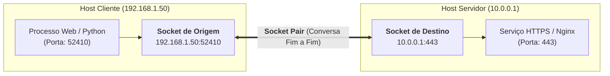

##### Análise das Alternativas da Questão: "O que é um socket?"

| Alternativa da Questão | Avaliação | Justificativa Técnica |
| :--- | :---: | :--- |
| **`A combinação de um endereço IP de origem e número de porta ou um endereço IP de destino e número de porta`** | **CORRETA** | Um socket é definido como a junção de uma camada de rede (IP) e uma camada de transporte (Porta), identificando o host e o processo. |
| `A combinação do endereço IP de origem e destino e o endereço Ethernet de origem e destino` | Incorreta | Mistura camada de rede (IP) com camada de enlace (Ethernet/MAC), sem incluir o número da porta de transporte. |
| `A combinação dos números de sequência de origem e destino e números de porta` | Incorreta | Números de sequência (SEQ) rastreiam bytes no TCP, não compõem a definição de socket. |
| `A combinação da sequência de origem e destino e números de confirmação` | Incorreta | SEQ e ACK são campos de controle de fluxo e confiabilidade do cabeçalho TCP. |
| `A combinação de endereços físicos de origem e destino` | Incorreta | Endereços físicos são endereços MAC da Camada de Enlace (Camada 2). |

##### Comparativo de Identificadores por Camada de Rede

| Camada | PDU | Identificador Utilizado | Função Prática |
| :--- | :---: | :--- | :--- |
| **Camada 2 (Enlace)** | Quadro | **Endereço MAC** (ex.: `00:1A:2B:3C:4D:5E`) | Entrega local entre placas de rede no mesmo segmento físico. |
| **Camada 3 (Rede)** | Pacote | **Endereço IP** (ex.: `192.168.1.7`) | Roteamento global de host a host através de redes distintas. |
| **Camada 4 (Transporte)** | Segmento / Datagrama | **Número de Porta** (ex.: `80`, `5432`) | Identificação do processo/aplicação em execução no host. |
| **Camada 3 + 4 (Interconexão)** | - | **Socket** (`IP:Porta`) | Ponto final exclusivo de comunicação para envio e recepção de dados. |

---

### 13.2 Comunicação com UDP: O que o Cliente Executa?

O **UDP (*User Datagram Protocol*)** é um protocolo **não orientado a conexão (*connectionless*)** e de **melhor esforço (*best-effort*)**:

1. **Seleção da Porta de Origem**: Ao disparar uma mensagem para um servidor (ex.: consulta DNS na porta de destino 53), **o cliente seleciona aleatoriamente um número de porta de origem disponível na faixa efêmera**. Essa porta é gravada no cabeçalho UDP para que o servidor saiba para onde enviar o datagrama de resposta.
2. **Ausência de Sessão e Handshake**: O UDP **não realiza handshake de 3 vias**, não envia números de sequência inicial (*ISN*), não envia mensagens de sincronização (*SYN*) e **não define tamanho de janela (*Window Size*)**.
3. **Disparo Imediato**: O cliente monta o datagrama e o entrega diretamente à camada IP para transmissão imediata sem esperar qualquer autorização do servidor.

```mermaid
sequenceDiagram
    autonumber
    participant Cliente as Cliente (Kernel SO)
    participant Servidor as Servidor UDP (ex: DNS :53)
    
    Note over Cliente: 1. SO aloca porta de origem aleatória (ex: :53120)<br/>2. Monta Datagrama UDP (Src: 53120, Dst: 53)
    Cliente->>Servidor: Datagrama UDP (Sem Handshake / Sem SYN / Sem ISN)
    Note over Servidor: Processa a requisição imediatamente
    Servidor->>Cliente: Datagrama UDP de Resposta (Src: 53, Dst: 53120)
```

#### 13.2.1 Análise Comparativa das Alternativas da Questão

| Alternativa da Questão | Avaliação | Justificativa Técnica |
| :--- | :---: | :--- |
| **`O cliente seleciona aleatoriamente um número de porta de origem`** | **CORRETA** | Para que o servidor consiga devolver a resposta, a pilha do cliente aloca dinamicamente uma porta efêmera aleatória não utilizada (ex.: `53120`) como porta de origem. |
| `O cliente define o tamanho da janela para a sessão` | Incorreta | O campo *Window Size* (Controle de Fluxo por janela deslizante) e o conceito de "sessão" existem **exclusivamente no TCP**. O UDP não possui controle de fluxo. |
| `O cliente envia um ISN ao servidor para iniciar o handshake de 3 vias` | Incorreta | O *Initial Sequence Number* (ISN) e o handshake de 3 vias (SYN, SYN-ACK, ACK) pertencem **apenas ao TCP**. O UDP é *connectionless*. |
| `O cliente envia um segmento de sincronização para iniciar a sessão` | Incorreta | Segmentos de sincronização (flag `SYN`) são usados pelo **TCP** para estabelecer conexão. O UDP não utiliza flags de controle de sessão. |
| `O cliente exclui o pacote` | Incorreta | O cliente transmite o datagrama para a rede; ele não descarta seus próprios pacotes de transmissão. |

---

### 13.3 Estabelecimento de Sessão no TCP: O Handshake de 3 Vias (*3-Way Handshake*)

Para garantir que ambos os hosts estejam prontos para trocar dados de forma confiável, o **TCP** executa obrigatoriamente o **Handshake de 3 vias (*Three-Way Handshake*)** antes de qualquer transmissão de aplicação:

```mermaid
sequenceDiagram
    autonumber
    participant Cliente as Host Cliente
    participant Servidor as Host Servidor (ex: PostgreSQL :5432)
    
    Cliente->>Servidor: 1. SYN (Seq = ISN_cli, Flag SYN=1)
    Note over Servidor: Servidor aloca buffers e recursos de sessão
    Servidor->>Cliente: 2. SYN-ACK (Seq = ISN_srv, Ack = ISN_cli + 1, Flags SYN=1, ACK=1)
    Note over Cliente: Cliente valida a resposta e confirma
    Cliente->>Servidor: 3. ACK (Seq = ISN_cli + 1, Ack = ISN_srv + 1, Flag ACK=1)
    Note over Cliente,Servidor: SESSÃO ESTABELECIDA (Estado: ESTABLISHED)<br/>Pronto para transferência de dados confiável
```

#### 13.3.1 As 3 Etapas do Estabelecimento de Sessão

1. **Passo 1 (SYN - Sincronização)**: O cliente envia um segmento com a flag `SYN=1` e um Número de Sequência Inicial (**ISN** - *Initial Sequence Number*) gerado aleatoriamente (ex.: `Seq = 1000`). Isso informa ao servidor o desejo de abrir uma sessão e estabelece o ponto de partida dos números de sequência do cliente.
2. **Passo 2 (SYN-ACK - Sincronização e Confirmação)**: O servidor responde com as flags `SYN=1` e `ACK=1`. Ele confirma o recebimento do ISN do cliente definindo `Ack = ISN_cli + 1` (ex.: `Ack = 1001`) e envia seu próprio ISN gerado (ex.: `Seq = 5000`).
3. **Passo 3 (ACK - Confirmação Final)**: O cliente envia um segmento com a flag `ACK=1`, confirmando o ISN do servidor (`Ack = ISN_srv + 1` / `Ack = 5001`). A partir deste momento, a sessão está no estado **`ESTABLISHED`** em ambos os lados.

#### 13.3.2 Análise das Alternativas da Questão

| Alternativa da Questão | Avaliação | Justificativa Técnica |
| :--- | :---: | :--- |
| **`Handshake TCP de 3 vias`** | **CORRETA** | É o mecanismo padrão da camada de transporte que sincroniza números de sequência (SYN) e confirmações (ACK) para garantir o estabelecimento da sessão. |
| `Flag UDP SYN` | Incorreta | O protocolo UDP é *connectionless* (sem conexão) e **não possui flags SYN, ACK ou FIN** nem cabeçalhos de controle de sessão. |
| `Flag UDP ACK` | Incorreta | O UDP não realiza confirmações de entrega nem possui flag ACK em seu cabeçalho. |
| `Número de sequência UDP` | Incorreta | O cabeçalho UDP tem apenas 8 bytes (Porta Origem, Porta Destino, Tamanho, Checksum) e **não possui campo de número de sequência**. |
| `Número da porta TCP` | Incorreta | A porta TCP identifica o processo de software no host (multiplexação), mas não estabelece nem garante uma sessão por si só. |

---

### 13.4 Controle de Fluxo: Janela Deslizante (*Window Size*) e Cálculo de Segmentos

O TCP utiliza o mecanismo de **Janela Deslizante (*Sliding Window*)** para controle de fluxo, evitando que um transmissor rápido sobrecarregue os buffers de memória de um receptor mais lento.

- **Window Size (Tamanho da Janela)**: Campo de 16 bits no cabeçalho TCP onde o receptor informa quantos bytes ele pode receber e armazenar em buffer antes de emitir uma confirmação (**ACK**).
- **Mecanismo de Bloqueio**: O transmissor pode enviar dados continuamente até que o volume total de bytes transmitidos sem confirmação atinja o *Window Size*. Ao atingir esse limite, o transmissor **é obrigado a pausar e aguardar o ACK** do receptor.

#### 13.4.1 Fórmula de Cálculo de Segmentos por Janela

$$\text{Quantidade de Segmentos} = \frac{\text{Tamanho da Janela (\textit{Window Size})}}{\text{Tamanho de Cada Segmento (\textit{MSS})}}$$

**Aplicação no problema**:
- $\text{Window Size} = 1000\text{ bytes}$
- $\text{Tamanho do Segmento} = 100\text{ bytes}$
- $\text{Segmentos enviados antes do ACK} = \frac{1000}{100} = \mathbf{10\text{ segmentos}}$

```mermaid
sequenceDiagram
    autonumber
    participant Servidor as Servidor Transmissor
    participant PC as PC Receptor (Buffer: 1000B)
    
    Note over PC: Anuncia Window Size = 1000 bytes
    loop Envio de 10 segmentos de 100B (Total: 1000B)
        Servidor->>PC: Segmento 1 a 10 (100 bytes cada)
    end
    Note over Servidor: Limite da Janela (1000B) atingido!<br/>Transmissor PAUSA e aguarda ACK
    PC->>Servidor: ACK 1001 (Confirma 1000B recebidos e libera nova janela)
    Note over Servidor: Janela desliza. Servidor retoma o envio dos próximos segmentos.
```

#### 13.4.2 Análise das Alternativas da Questão: Cálculo de Segmentos

| Alternativa da Questão | Avaliação | Justificativa do Cálculo |
| :--- | :---: | :--- |
| **`10 segmentos`** | **CORRETA** | $\frac{1000\text{ bytes}}{100\text{ bytes/segmento}} = 10\text{ segmentos}$. O servidor despacha os 10 segmentos e pausa aguardando a confirmação. |
| `1 segmento` | Incorreta | Ocorrerá apenas se a janela do receptor for de 100 bytes (ou se a confirmação for imediata a cada segmento). |
| `100 segmentos` | Incorreta | 100 segmentos de 100 bytes totalizariam 10.000 bytes, estourando a janela anunciada de 1.000 bytes. |
| `1000 segmentos` | Incorreta | Confunde o número de bytes da janela ($1000\text{ B}$) com a contagem de segmentos. |
| `10000 segmentos` | Incorreta | Totalizaria 1.000.000 de bytes ($1\text{ MB}$), valor completamente fora da janela. |

---

#### 13.4.3 O Fator que Determina o Tamanho da Janela TCP

O tamanho da janela (*Window Size* ou *Receive Window - rwnd*) é **determinado exclusivamente pela quantidade de dados que o destino (receptor) pode receber e processar de uma só vez** de forma confiável em sua memória buffer.

1. **Recursos do Destino**: O receptor possui um buffer de recepção limitado alocado pelo sistema operacional. O espaço disponível nesse buffer define o valor do campo *Window Size* anunciado no cabeçalho TCP.
2. **Ajuste Dinâmico em Tempo Real**:
   - Se a aplicação no destino lê e consome os dados do buffer rapidamente, a janela permanece ampla.
   - Se a CPU do destino estiver sobrecarregada e a aplicação demorar para ler o buffer, o espaço livre diminui. O receptor envia um ACK com um *Window Size* reduzido (podendo chegar a 0 - *Zero Window*), forçando a fonte a desacelerar ou pausar a transmissão.

```mermaid
sequenceDiagram
    autonumber
    participant Fonte as Host Fonte (Transmissor)
    participant Destino as Host Destino (Receptor)
    
    Note over Destino: Buffer Livre: 64 KB<br/>Destino define Window Size = 64 KB
    Destino->>Fonte: ACK (Window Size = 64 KB)
    Fonte->>Destino: Envia 64 KB de dados
    Note over Destino: Aplicação lenta: buffer enchendo!<br/>Buffer Livre caiu para 16 KB
    Destino->>Fonte: ACK (Window Size = 16 KB - Reduz janela)
    Note over Fonte: Fonte adapta taxa e envia no máximo 16 KB
```

##### Análise das Alternativas da Questão: "Qual fator determina o tamanho da janela TCP?"

| Alternativa da Questão | Avaliação | Justificativa Técnica |
| :--- | :---: | :--- |
| **`A quantidade de dados que o destino pode processar de uma vez`** | **CORRETA** | O tamanho da janela é estipulado pelo receptor para proteger seu buffer de recepção contra sobrecarga (*overflow*). |
| `A quantidade de dados que a fonte é capaz de enviar de uma só vez` | Incorreta | A fonte pode ter capacidade para 100 Gbps, mas é obrigada a respeitar o limite imposto pelo destino. |
| `A quantidade de dados a serem transmitidos` | Incorreta | O tamanho do arquivo total (ex.: 10 GB) não define a janela de fluxo (que tipicamente varia de KBs a MBs). |
| `O número de serviços incluídos no segmento TCP` | Incorreta | Cada segmento atende a um único serviço/porta por vez. |
| `O número de flags no segmento` | Incorreta | As flags (SYN, ACK, FIN, etc.) controlam o estado da sessão e não possuem relação com o tamanho em bytes do buffer. |

---

#### 13.4.4 Remontagem e Reordenação de Segmentos: O Papel dos Números de Sequência (*SEQ*)

Como a camada IP opera com comutação de pacotes sem conexão (*connectionless*), os pacotes podem percorrer rotas físicas diferentes na rede e chegar ao receptor **fora de ordem** (*out-of-order*) ou duplicados.

- **Números de Sequência (*Sequence Numbers - SEQ*)**: O cabeçalho TCP possui um campo de **32 bits** que numera o primeiro byte de dados de cada segmento transmitido.
- **Buffer de Recepção e Reordenação**: O receptor armazena temporariamente os segmentos no buffer, utiliza os **números de sequência** para ordenar perfeitamente cada byte na ordem original em que foram emitidos e, só então, entrega o fluxo contínuo de dados para a aplicação.

```mermaid
flowchart LR
    subgraph Emissor["Host Emissor"]
        AppEnvio["Mensagem da Aplicação<br/>(Bytes 1 a 3000)"]
        Seg1["Segmento 1 (Seq: 1)"]
        Seg2["Segmento 2 (Seq: 1001)"]
        Seg3["Segmento 3 (Seq: 2001)"]
        AppEnvio --> Seg1 & Seg2 & Seg3
    end

    subgraph RedeIP["Rede IP (Rotas Distintas)"]
        Seg1 -.->|"Rota Curta"| Chegada1["Chega 1º (Seq: 1)"]
        Seg3 -.->|"Rota Média"| Chegada2["Chega 2º (Seq: 2001) - Fora de Ordem!"]
        Seg2 -.->|"Rota Lenta"| Chegada3["Chega 3º (Seq: 1001)"]
    end

    subgraph Receptor["Host Receptor (Buffer TCP)"]
        Buffer["<b>Buffer de Reordenação TCP</b><br/>Reordena via <b>Números de Sequência</b>:<br/>1. Seq: 1 (Bytes 1-1000)<br/>2. Seq: 1001 (Bytes 1001-2000)<br/>3. Seq: 2001 (Bytes 2001-3000)"]
        AppDest["Aplicação de Destino<br/>(Recebe o Fluxo Perfeitamente Ordenado)"]
        Chegada1 & Chegada2 & Chegada3 --> Buffer --> AppDest
    end
```

##### Análise das Alternativas da Questão: "Informações usadas pelo TCP para remontar e reordenar segmentos"

| Alternativa da Questão | Avaliação | Justificativa Técnica |
| :--- | :---: | :--- |
| **`Números de sequência`** | **CORRETA** | O campo *Sequence Number* (SEQ) de 32 bits identifica a posição exata de cada byte no fluxo de dados, permitindo ordenar segmentos fora de ordem. |
| `Números de porta` | Incorreta | Identificam a aplicação/processo em execução no host (multiplexação), mas não fornecem qualquer informação sobre a ordem dos bytes. |
| `Números de confirmação` | Incorreta | O campo *Acknowledgment Number* (ACK) informa ao transmissor qual o próximo byte esperado de volta, confirmando entrega, mas não é o identificador de ordenação dos dados recebidos. |
| `Números de fragmentos` | Incorreta | Fragmentação ocorre na camada de rede (IPv4) com os campos *Identification* e *Fragment Offset*, não sendo o mecanismo de segmentação/ordenação do TCP. |
| `Números de flags` | Incorreta | Flags (SYN, ACK, FIN, RST, PSH, URG) são bits de controle de estado e não possuem sequência numérica para ordenar dados. |

---

### 13.5 Tabela Comparativa Completa: TCP vs. UDP


| Característica | TCP (*Transmission Control Protocol*) | UDP (*User Datagram Protocol*) |
| :--- | :--- | :--- |
| **Orientação a Conexão** | **Orientado a Conexão** (estabelece sessão antes de trafegar dados) | **Sem Conexão (*Connectionless*)** (envia dados imediatamente) |
| **Handshake Inicial** | **Sim (Handshake de 3 Vias: SYN $\rightarrow$ SYN-ACK $\rightarrow$ ACK)** | **Não (Zero Handshake)** |
| **Garantia de Sessão** | **Sim (Handshake TCP de 3 Vias)** | **Não (Sem Sessão / Sem Handshake)** |
| **Confiabilidade** | **Garantida** (retransmissão automática de pacotes perdidos via ACK/SEQ) | **Melhor Esforço (*Best-Effort*)** (sem confirmação de entrega ou retransmissão) |
| **Ordenação de Pacotes** | **Sim** (usa números de sequência para remontar dados fora de ordem) | **Não** (aplicação recebe os datagramas na ordem em que chegarem) |
| **Controle de Fluxo e Janela** | **Sim** (campo *Window Size* e *MSS* evitam sobrecarregar o receptor) | **Não** (não regula taxa de transmissão) |
| **Controle de Congestionamento** | **Sim** (reduz taxa de envio se detectar perda de pacotes na rede) | **Não** (transmite continuamente) |
| **Tamanho do Cabeçalho** | **20 bytes** (mínimo, podendo ter opções) | **8 bytes** (cabeçalho fixo e ultra-leve) |
| **Aplicações Típicas** | HTTP/HTTPS (Web), SSH, Transferência de Arquivos, JDBC/Bancos, Kafka | DNS, DHCP, NTP, VoIP, Streaming de vídeo ao vivo, Telemetria / StatsD |

---

### 13.5 Exemplo Real em Engenharia de Dados

Em pipelines de dados distribuídos:

- **Quando usamos TCP (Confiabilidade Crítica)**:
  - Comunicação entre drivers e executors Spark, queries SQL em bancos (PostgreSQL, BigQuery, ClickHouse) e replicação de tópicos no Apache Kafka. Se um pacote com dados de uma transação financeira for perdido na rede, o **TCP retransmite e garante a integridade dos dados**. O handshake de 3 vias garante que o banco de dados e a aplicação estão em sincronia antes de transacionar queries.
- **Quando usamos UDP (Baixa Latência e Telemetria)**:
  - **Métricas e Telemetria de Pipeline (StatsD / Datadog / Prometheus)**: Agentes de monitoramento emitem métricas de throughput (ex.: "100.000 linhas/s processadas") via **UDP**. Como o cliente UDP apenas seleciona uma porta de origem e cospe o datagrama na rede sem handshake, o impacto de latência e CPU no pipeline é praticamente zero — se 1 métrica de CPU for perdida a cada milhão, não compromete o pipeline.

---

### 13.6 Glossário de Siglas da Camada de Transporte

| Sigla | Nome Completo | Significado e Função |
| :--- | :--- | :--- |
| **TCP** | *Transmission Control Protocol* | Protocolo de transporte confiável e orientado a conexão (Camada 4). |
| **UDP** | *User Datagram Protocol* | Protocolo de transporte leve, sem conexão e de melhor esforço (Camada 4). |
| **ISN** | *Initial Sequence Number* | Número de sequência inicial negociado no handshake de 3 vias do TCP. |
| **SYN** | *Synchronize* | Flag de controle do TCP utilizada para sincronizar números de sequência ao abrir conexão. |
| **ACK** | *Acknowledgment* | Flag de confirmação do TCP indicando que bytes de dados foram recebidos com sucesso. |
| **FIN** | *Finish* | Flag de controle do TCP usada para encerrar ordenadamente uma conexão de 4 vias. |
| **RST** | *Reset* | Flag do TCP usada para abortar imediatamente uma conexão anormal ou recusada. |
| **MSS** | *Maximum Segment Size* | Tamanho máximo de payload que um dispositivo suporta em um segmento TCP. |
| **IANA** | *Internet Assigned Numbers Authority* | Entidade responsável pela padronização global das faixas de portas de rede. |

---

### 13.7 Exemplo com Código Real (Python / Cliente UDP e Conexão TCP)

**1. Cliente UDP (envio direto sem handshake):**


**2. Cliente TCP (executando o Handshake de 3 Vias):**


---

---

## 14. Camada de Aplicação

A Camada de Aplicação (Camada 7 do OSI e Camada 4 do TCP/IP) é a interface direta entre os programas de software utilizados pelos usuários e a rede subjacente.

### 14.1 Divisão de Responsabilidades: Aplicação, Apresentação e Sessão

No modelo OSI, as funções superiores são subdivididas em 3 camadas, que no modelo TCP/IP são consolidadas na Camada de Aplicação:

| Camada OSI | Função Principal | Exemplos Práticos |
| :--- | :--- | :--- |
| **7. Aplicação** | Fornece os protocolos de comunicação para os programas do usuário. | HTTP, SMTP, DNS, DHCP, FTP, IMAP |
| **6. Apresentação** | Formatação de dados, compressão e criptografia/descriptografia. | JSON, XML, JPEG, Gzip, SSL/TLS |
| **5. Sessão** | Inicia, mantém ativa e encerra diálogos/sessões entre aplicações. | Controle de diálogo RPC, sockets persistentes |

---

### 14.2 Protocolos de E-mail: Envio (*SMTP*) vs. Recuperação (*POP3 / IMAP*)

O sistema de correio eletrônico utiliza protocolos distintos para **enviar/transmitir** e para **ler/recuperar** mensagens:

```mermaid
sequenceDiagram
    autonumber
    participant Remetente as Cliente Remetente (MUA)
    participant MTALocal as Servidor SMTP Origem (MTA)
    participant MTADestino as Servidor SMTP Destino (MTA)
    participant Destinatario as Cliente Destinatário (MUA)

    Note over Remetente,MTALocal: 1. ENVIO da Mensagem
    Remetente->>MTALocal: Protocolo SMTP (Porta 587 / 25)
    Note over MTALocal,MTADestino: 2. TRANSFERÊNCIA entre Servidores
    MTALocal->>MTADestino: Protocolo SMTP (Porta 25)
    Note over MTADestino: E-mail armazenado na Caixa Postal
    Note over MTADestino,Destinatario: 3. RECUPERAÇÃO / LEITURA
    Destinatario->>MTADestino: Protocolo IMAP (Porta 993) ou POP3 (Porta 995)
```

#### 14.2.1 Tabela Comparativa dos Protocolos de E-mail

| Protocolo | Nome Completo | Direção / Função | Portas Padrão | Comportamento no Servidor |
| :--- | :--- | :--- | :--- | :--- |
| **SMTP** | *Simple Mail Transfer Protocol* | **ENVIO e TRANSFERÊNCIA** (do cliente para o servidor e de servidor para servidor) | **25** (relaying), **587** (submissão de clientes), **465** (SMTPS) | Enfileira e entrega o e-mail no servidor de destino. |
| **POP3** | *Post Office Protocol v3* | **RECUPERAÇÃO / DOWNLOAD** (do servidor para o cliente) | **110** (padrão), **995** (SSL) | Baixa as mensagens para a máquina local e **apaga do servidor** (por padrão). |
| **IMAP** | *Internet Message Access Protocol* | **ACESSO E SINCRONIZAÇÃO** (do servidor para múltiplos clientes) | **143** (padrão), **993** (SSL) | Mantém as mensagens e pastas **armazenadas no servidor**, sincronizando em múltiplos dispositivos. |
| **HTTP/HTTPS** | *Hypertext Transfer Protocol Secure* | **INTERFACE WEBMAIL** (acesso via navegador: Gmail, Outlook Web) | **80** (HTTP), **443** (HTTPS) | O navegador acessa a interface web, mas os servidores nos bastidores continuam usando SMTP para despachar. |

#### 14.2.2 Análise das Alternativas da Questão: Protocolos de E-mail

| Alternativa da Questão | Avaliação | Justificativa Técnica |
| :--- | :---: | :--- |
| **`SMTP`** | **CORRETA** | O *Simple Mail Transfer Protocol* é o único protocolo padrão utilizado para **enviar e transferir e-mails** na Internet. |
| `HTTP` | Incorreta | Protocolo de transferência de hipertexto para páginas web; embora usado para exibir o front-end de Webmails, não é o protocolo de transporte de e-mail da pilha TCP/IP. |
| `POP` / `POP3` | Incorreta | Protocolo exclusivo para **recebimento/download** de e-mails da caixa postal para o computador do usuário. |
| `IMAP` | Incorreta | Protocolo exclusivo para **leitura, sincronização e gerenciamento** de e-mails diretamente no servidor. |

---

### 14.3 Compartilhamento de Arquivos em Rede: Protocolo SMB (*Server Message Block*)

O **SMB (*Server Message Block*)** é um protocolo cliente/servidor da Camada de Aplicação projetado para permitir o compartilhamento transparente de arquivos, diretórios e impressoras através de uma rede local ou corporativa (executando sobre TCP na porta **445** ou sobre NetBIOS na porta **139**).

#### 14.3.1 Características Fundamentais do SMB

1. **Conexões de Longo Prazo (*Long-Term / Persistent Connection*)**:
   - Diferente de protocolos pontuais como HTTP ou FTP básico (que transferem arquivos individuais e encerram a conexão), o cliente SMB **estabelece uma conexão de longo prazo com o servidor**.
   - Uma vez autenticado e conectado, o compartilhamento remoto é integrado ao sistema operacional do cliente (mapeado como unidade de rede `Z:\` no Windows ou ponto de montagem CIFS/Samba no Linux). O usuário ou aplicação abre, lê, edita e salva arquivos diretamente no servidor remoto **como se fossem arquivos no disco local**.
2. **Formato Uniforme de Mensagens**:
   - Todas as mensagens SMB compartilham a **mesma estrutura padrão**: um cabeçalho fixo (*fixed-size header*) seguido por parâmetros e dados de tamanho variável.
3. **Autenticação e Controle de Sessão**:
   - O protocolo SMB suporta autenticação de sessão integrada (NTLM, Kerberos, assinaturas criptográficas SMBv3) e gerenciamento de travas de arquivo (*file locking*) para evitar que dois usuários sobrescrevam o mesmo documento concorrentemente.

```mermaid
sequenceDiagram
    autonumber
    participant Cliente as Cliente (Host / Worker)
    participant ServidorSMB as Servidor de Arquivos (SMB / Samba)
    
    Note over Cliente,ServidorSMB: 1. Estabelecimento da Conexão de Longo Prazo
    Cliente->>ServidorSMB: Negociação de Dialeto SMB (TCP Porta 445)
    ServidorSMB->>Cliente: Dialeto aceito (SMB 3.1.1)
    Cliente->>ServidorSMB: Autenticação de Sessão (Kerberos / NTLMSSP)
    ServidorSMB->>Cliente: Sessão Autenticada e Autorizada
    Cliente->>ServidorSMB: Tree Connect (Mapeia o compartilhamento //servidor/dados)
    Note over Cliente,ServidorSMB: SESSÃO SMB PERSISTENTE (Conexão de Longo Prazo Ativa)
    
    Note over Cliente,ServidorSMB: 2. Operações de Arquivo Contínuas (como se fosse disco local)
    loop Operações Transparentes
        Cliente->>ServidorSMB: Open File / Read / Write / Lock
        ServidorSMB->>Cliente: File Data / Status OK
    end
```

#### 14.3.2 Tabela Comparativa das Alternativas da Questão

| Alternativa da Questão | Avaliação | Justificativa Técnica |
| :--- | :---: | :--- |
| **`Os clientes estabelecem uma conexão de longo prazo com os servidores`** | **CORRETA** | No SMB, o cliente mantém uma sessão persistente para navegar em pastas, abrir, travar e editar arquivos remotamente como se estivessem no disco local. |
| `Diferentes tipos de mensagens SMB têm um formato diferente` | Incorreta | Todas as mensagens SMB utilizam a mesma estrutura/formato uniforme (cabeçalho de tamanho fixo seguido por dados variáveis). |
| `O SMB usa o protocolo FTP para comunicação` | Incorreta | SMB e FTP são protocolos independentes e concorrentes da Camada de Aplicação; o SMB opera direto sobre TCP na porta 445. |
| `As mensagens SMB não podem autenticar uma sessão` | Incorreta | O SMB possui mecanismos nativos robustos para iniciar, **autenticar** (via Kerberos/NTLM) e encerrar sessões de usuário. |
| `O SMB usa o DNS para comunicação` | Incorreta | O DNS é apenas um serviço auxiliar de resolução de nomes (converte `servidor.local` em IP), não o protocolo de transporte das mensagens SMB. |

---

### 14.4 Tabela Comparativa de Protocolos de Arquivos: SMB vs. FTP vs. NFS

| Característica | SMB (*Server Message Block*) | FTP (*File Transfer Protocol*) | NFS (*Network File System*) |
| :--- | :--- | :--- | :--- |
| **Padrão / Ecossistema** | Nativo no **Windows**, suportado via **Samba** no Linux | Multiplataforma (Internet / RFC 959) | Nativo no **Linux / UNIX** |
| **Tipo de Conexão** | **Conexão de Longo Prazo (*Persistent*)** | Conexões separadas (Controle 21 + Dados 20) por transferência | Conexão persistente / RPC |
| **Acesso ao Arquivo** | Abertura direta, leitura/escrita por offset e *file locking* | Download completo ou Upload do arquivo | Montagem direta no sistema de arquivos POSIX |
| **Porta TCP Padrão** | **445** (TCP direto) / **139** (NetBIOS) | **20 e 21** | **2049** |

---

### 14.5 Sistema de Nomes de Domínio (*DNS*): Uso Híbrido de UDP e TCP

O protocolo **DNS (*Domain Name System*)** opera na **Porta 53** e possui uma arquitetura híbrida única que combina os dois protocolos da Camada de Transporte conforme o cenário de comunicação:

1. **Comunicação Cliente-Servidor $\rightarrow$ UDP (Porta 53)**:
   - **Cenário**: Quando um computador cliente (ou um resolver local) consulta o IP de um domínio (ex.: `google.com`).
   - **Por que UDP?**: As consultas e respostas típicas de clientes são pequenas (menores que 512 bytes). O UDP evita a sobrecarga (*overhead*) do handshake de 3 vias do TCP e a manutenção de estado de sessão nos servidores DNS raiz e autoritativos da Internet, garantindo altíssima velocidade e capacidade de responder a bilhões de consultas por segundo.
2. **Comunicação Servidor-Servidor $\rightarrow$ TCP (Porta 53)**:
   - **Cenário**: Quando dois servidores DNS precisam sincronizar a base inteira de registros de um domínio (**Transferência de Zona / *Zone Transfer*** via comandos `AXFR` ou `IXFR`) ou quando respostas DNSSEC ultrapassam 512 bytes.
   - **Por que TCP?**: Bases de zonas DNS contêm muitos dados críticos. O TCP garante a **entrega confiável**, controle de fluxo e remontagem ordenada de todos os registros sem risco de corrupção ou perda de dados.

```mermaid
flowchart TD
    subgraph ClienteResolucao["1. Resolução Cliente-Servidor (Rápida e Leve)"]
        ClienteHost["Host Cliente / App"]
        ServidorDNS1["Servidor DNS Primário<br/>(Porta 53)"]
        ClienteHost -- "<b>UDP (Porta 53)</b><br/>Consulta Simples: 'IP de db.prod?'<br/>(Sem handshake, resposta < 512B)" --> ServidorDNS1
    end

    subgraph SincronizacaoServidores["2. Sincronização Servidor-Servidor (Confiável e Robusta)"]
        ServidorDNS2["Servidor DNS Secundário<br/>(Porta 53)"]
        ServidorDNS1 <== "<b>TCP (Porta 53)</b><br/>Transferência de Zona (AXFR/IXFR)<br/>(Handshake de 3 vias, garantia de entrega)" ==> ServidorDNS2
    end
```

#### 14.5.1 Tabela Comparativa de Transporte no DNS

| Tipo de Comunicação | Protocolo de Transporte | Porta | Motivo Técnico da Escolha |
| :--- | :---: | :---: | :--- |
| **Cliente $\rightarrow$ Servidor** (Consultas de Nomes) | **UDP** | **53** | Baixíssima latência, sem handshake de 3 vias, pacote pequeno ($< 512$ bytes). |
| **Servidor $\leftrightarrow$ Servidor** (Transferência de Zona) | **TCP** | **53** | Confiabilidade obrigatória, retransmissão de pacotes e tráfego de grandes volumes de dados. |

#### 14.5.2 Análise das Alternativas da Questão: Transporte no DNS

| Alternativa da Questão | Avaliação | Justificativa Técnica |
| :--- | :---: | :--- |
| **`DNS`** | **CORRETA** | Utiliza **UDP** para consultas cliente-servidor (resolução de nomes) e **TCP** para comunicação servidor-servidor (transferência de zona DNS). |
| `HTTP` | Incorreta | Utiliza **TCP** (porta 80/443) tanto entre cliente e servidor quanto entre servidores (ex.: proxies reversos). |
| `FTP` | Incorreta | Utiliza exclusivamente **TCP** (portas 20 e 21) para controle e transferência de dados. |
| `SMTP` | Incorreta | Utiliza exclusivamente **TCP** (porta 25/587) para envio de e-mails tanto do cliente para o servidor quanto entre servidores de correio. |
| `IMAP` | Incorreta | Utiliza exclusivamente **TCP** (porta 143/993) para leitura e sincronização de mensagens. |

---

### 14.6 Mapeamento de Protocolos da Camada de Aplicação: TCP vs. UDP

A Camada de Transporte disponibiliza dois protocolos principais para as aplicações: o **TCP** (orientado a conexão, confiável, com controle de fluxo e reordenação) e o **UDP** (sem conexão, sem confirmação, leve e com latência mínima).

#### 14.6.1 Tabela Comparativa de Protocolos de Aplicação por Protocolo de Transporte

| Protocolo de Aplicação | Camada de Transporte | Portas Típicas | Requisito Principal / Justificativa |
| :--- | :---: | :---: | :--- |
| **HTTP / HTTPS** | **TCP** | **80 / 443** | Exige integridade total dos dados de páginas Web e APIs REST. |
| **FTP** | **TCP** | **20 (dados) / 21 (controle)** | Transferência de arquivos garantida sem tolerância a corrupção. |
| **SMTP** | **TCP** | **25 / 587** | Envio de mensagens de e-mail com entrega confiável e confirmação. |
| **IMAP** | **TCP** | **143 / 993** | Sincronização consistente de pastas e e-mails na nuvem. |
| **POP3** | **TCP** | **110 / 995** | Download confiável e sem perda de mensagens de correio. |
| **SSH / Telnet** | **TCP** | **22 / 23** | Sessão de terminal remoto com garantia de ordem dos comandos digitados. |
| **SMB** | **TCP** | **445** | Sessão persistente de compartilhamento de arquivos e travas de integridade. |
| **TFTP** | **UDP** | **69** | Transferência rápida e simples em LAN (firmware de roteador, boot PXE). |
| **DHCP** | **UDP** | **67 (servidor) / 68 (cliente)** | Atribuição de IP rápida via broadcasts locais sem overhead de conexão. |
| **SNMP** | **UDP** | **161 (polling) / 162 (traps)** | Monitoramento de infraestrutura sem impactar a largura de banda da rede. |
| **NTP** | **UDP** | **123** | Sincronização ultra-rápida de relógios de rede imune a atrasos de handshake. |
| **DNS** | **UDP + TCP** | **53** | **UDP** para consultas normais de clientes; **TCP** para transferências de zona entre servidores. |

#### 14.6.2 Análise das Alternativas da Questão: Protocolos que usam TCP

| Alternativa da Questão | Avaliação | Detalhamento dos Protocolos |
| :--- | :---: | :--- |
| **`SMTP, FTP e HTTP`** | **CORRETA** | **Todos utilizam TCP**. SMTP (envio de e-mail), FTP (transferência de arquivos) e HTTP (páginas web) exigem confiabilidade estrita. |
| `SNMP, FTP e DHCP` | Incorreta | FTP usa TCP, mas **SNMP** e **DHCP** utilizam **UDP**. |
| `TFTP, DHCP e HTTP` | Incorreta | HTTP usa TCP, mas **TFTP** e **DHCP** utilizam **UDP**. |
| `SMTP, TFTP e HTTP` | Incorreta | SMTP e HTTP usam TCP, mas **TFTP** utiliza **UDP**. |
| `SNMP, TFTP e HTTP` | Incorreta | HTTP usa TCP, mas **SNMP** e **TFTP** utilizam **UDP**. |

#### 14.6.3 Por que o HTTP usa o TCP como Protocolo de Transporte?

Conforme destacado por Kurose e Ross (2016), quando um cliente Web requisita uma página, o servidor devolve documentos HTML, folhas de estilo CSS, scripts JavaScript, imagens e objetos estruturados (JSON/XML).

1. **Necessidade de Entrega Confiável (*Reliable Data Transfer*)**:
   - Uma página Web não tolera perda ou corrupção de dados: se um único pedaço de código JavaScript ou tag HTML for descartado por perda na rede, a página quebra com erro de sintaxe ou a renderização visual fica corrompida.
   - Portanto, **o HTTP requer entrega confiável**, delegando integralmente ao **TCP** a responsabilidade de garantir que nenhum byte seja perdido, duplicado ou chegue fora de ordem (através de ACKs, números de sequência e retransmissões).
2. **Inadequação do UDP para Páginas Web**:
   - O UDP opera no modelo de "melhor esforço" (*best-effort*), sem confirmações nem retransmissões. Se o HTTP rodasse sobre UDP básico, qualquer oscilação de roteamento resultaria em páginas web quebradas e incompletas.

#### 14.6.4 Tabela Comparativa das Alternativas da Questão: HTTP sobre TCP

| Alternativa da Questão | Avaliação | Justificativa Técnica |
| :--- | :---: | :--- |
| **`Porque o HTTP requer entrega confiável`** | **CORRETA** | Páginas web, scripts e APIs exigem que todos os dados cheguem íntegros e completos; o TCP provê essa garantia de entrega confiável. |
| `Para garantir a velocidade de download mais rápida possível` | Incorreta | O TCP adiciona sobrecarga de controle (handshake, ACKs, controle de congestionamento), sendo mais lento que o UDP puro. |
| `Porque HTTP é um protocolo de melhor esforço` | Incorreta | "Melhor esforço" (*best-effort*) é o comportamento do IP e do UDP (que não garantem entrega); o HTTP necessita do oposto (garantia estrita). |
| `Porque erros de transmissão podem ser tolerados facilmente` | Incorreta | Páginas web e códigos executáveis **não** toleram perda ou corrupção de caracteres. |
| `Porque HTTP usa método GET` | Incorreta | O método `GET` é apenas um verbo da camada de aplicação do HTTP, sem relação com a decisão arquitetural da camada de transporte. |

#### 14.6.5 Exercício de Fixação Integrado: Atividades do Usuário e seus Protocolos (FCC / SEGEP-MA)

Análise de cada atividade desempenhada pelo usuário e seu protocolo correspondente da Camada de Aplicação:

1. **Atividade I**: *"Fez transferência de arquivos, criou e alterou diretórios da rede"* $\rightarrow$ **FTP (*File Transfer Protocol*)**:
   - Protocolo projetado especificamente para manipulação de arquivos remotos, navegação e criação de diretórios (`MKD`, `CWD`, `DELE`, `STOR`, `RETR`).
2. **Atividade II**: *"Enviou diversas mensagens de e-mail"* $\rightarrow$ **SMTP (*Simple Mail Transfer Protocol*)**:
   - Protocolo padrão para submissão e **envio** de e-mails para servidores de correio.
3. **Atividade III**: *"Utilizou um navegador web para fazer pesquisas em diversas páginas da internet..."* $\rightarrow$ **HTTP (*Hypertext Transfer Protocol*)**:
   - Protocolo de requisição e resposta para recuperação e exibição de páginas e objetos na Web.
4. **Atividade IV**: *"Digitou o endereço IP de um site e obteve o nome deste site na WWW"* $\rightarrow$ **DNS (*Domain Name System*)**:
   - Serviço de diretório de rede responsável por traduzir nomes de domínio em IPs e vice-versa (**Resolução Reversa de DNS / Registro PTR**).

#### 14.6.6 Tabela Comparativa das Alternativas da Questão (FCC)

| Alternativa da Questão | I (Arquivos/Pastas) | II (Envio de E-mail) | III (Navegador Web) | IV (IP $\rightarrow$ Nome) | Avaliação Geral |
| :--- | :---: | :---: | :---: | :---: | :---: |
| **`FTP – SMTP – HTTP – DNS`** | **FTP** ✅ | **SMTP** ✅ | **HTTP** ✅ | **DNS** ✅ | **CORRETA** |
| `TELNET – SNMP – HTTPS – DNS` | TELNET ❌ | SNMP ❌ | HTTPS ⚠️ | DNS ✅ | Incorreta |
| `FTP – IMAP – TLS/SSL – DHCP` | FTP ✅ | IMAP ❌ (Leitura) | TLS/SSL ❌ (Camada 6) | DHCP ❌ (Atribuição IP) | Incorreta |
| `NTP – SMTP – HTTP – DNS` | NTP ❌ (Hora) | SMTP ✅ | HTTP ✅ | DNS ✅ | Incorreta |
| `TELNET – POP3 – TLS/SSL – DHCP` | TELNET ❌ | POP3 ❌ (Leitura) | TLS/SSL ❌ | DHCP ❌ | Incorreta |

---

### 14.7 Exemplo Real em Engenharia de Dados


1. **Acesso a Dados Legados On-Premises via Conexão Persistente SMB**:
   - Em pipelines de dados híbridos (on-premises + cloud), scripts de ingestão montam compartilhamentos remotos Windows via **SMB/CIFS** mantendo conexão persistente de longo prazo para ler arquivos `.csv` e enviar para o BigQuery.
2. **Resolução de Endereços de Bancos e Cluster via DNS**:
   - Quando um job Spark precisa conectar no cluster PostgreSQL (`db-postgres.interno.corp`), a biblioteca cliente dispara uma query **DNS via UDP** na porta 53 para descobrir o IP em milissegundos sem overhead de conexão.
   - Os servidores CoreDNS do cluster Kubernetes sincronizam suas zonas internas entre si via **DNS sobre TCP** na porta 53 para garantir consistência cadastral de todos os pods.

---

### 14.8 Glossário de Siglas da Camada de Aplicação

| Sigla | Nome Completo | Significado e Função |
| :--- | :--- | :--- |
| **DNS** | *Domain Name System* | Serviço que resolve nomes de domínio em IPs (usa UDP na porta 53 para queries e TCP na porta 53 para transferências de zona). |
| **AXFR** | *Authoritative Zone Transfer* | Protocolo/comando DNS executado sobre TCP para replicação completa de uma zona DNS entre servidores. |
| **IXFR** | *Incremental Zone Transfer* | Protocolo/comando DNS executado sobre TCP para replicação incremental de registros modificados. |
| **SMB** | *Server Message Block* | Protocolo de rede cliente/servidor para compartilhamento de arquivos, pastas e impressoras via conexões de longo prazo (TCP 445). |
| **CIFS** | *Common Internet File System* | Dialeto/versão aberta histórica do SMB (SMB 1.0) desenvolvida pela Microsoft. |
| **SAMBA** | *Samba Server Suite* | Implementação open-source compatível com SMB/CIFS para sistemas Linux e UNIX. |
| **SMTP** | *Simple Mail Transfer Protocol* | Protocolo padrão para envio e retransmissão de mensagens de e-mail sobre **TCP** (portas 25/587). |
| **POP3** | *Post Office Protocol version 3* | Protocolo para download e leitura local de mensagens de e-mail sobre **TCP** (portas 110/995). |
| **IMAP** | *Internet Message Access Protocol* | Protocolo para acesso e sincronização de mensagens de e-mail na nuvem sobre **TCP** (portas 143/993). |
| **MUA** | *Mail User Agent* | Aplicativo cliente de e-mail utilizado pelo usuário (ex.: Outlook, Thunderbird, Apple Mail). |
| **MTA** | *Mail Transfer Agent* | Software de servidor responsável por rotear e transferir e-mails via SMTP (ex.: Postfix, Sendmail, Exim). |
| **HTTP** | *Hypertext Transfer Protocol* | Protocolo de comunicação cliente-servidor para transferência de páginas e dados na Web sobre **TCP** (porta 80). |
| **HTTPS** | *Hypertext Transfer Protocol Secure* | Versão criptografada (TLS/SSL) do protocolo HTTP sobre **TCP** (porta 443). |
| **FTP** | *File Transfer Protocol* | Protocolo orientado a conexão para transferência de arquivos em rede sobre **TCP** (portas 20 e 21). |
| **TFTP** | *Trivial File Transfer Protocol* | Protocolo simples e leve sobre **UDP** (porta 69) para transferências básicas de arquivos em rede local. |
| **DHCP** | *Dynamic Host Configuration Protocol* | Protocolo que atribui automaticamente configurações de rede IP aos clientes sobre **UDP** (portas 67 e 68). |
| **SNMP** | *Simple Network Management Protocol* | Protocolo para monitoramento e gerenciamento de dispositivos de rede sobre **UDP** (portas 161 e 162). |
| **NTP** | *Network Time Protocol* | Protocolo para sincronização de relógios de dispositivos na rede sobre **UDP** (porta 123). |
| **SSH** | *Secure Shell* | Protocolo de acesso e administração remota segura via linha de comando sobre **TCP** (porta 22). |
| **Telnet** | *Teletype Network* | Protocolo legado de emulação de terminal remoto em texto puro sobre **TCP** (porta 23). |

---

### 14.9 Exemplo de Código Real (Python / SMTP, SMB e DNS UDP vs TCP)


**1. Consulta DNS de Cliente via UDP (Resolução rápida de IP para conexões de dados):**


**2. Transferência de Zona DNS Servidor-Servidor via TCP (Sincronização completa de registros):**


**3. Envio de e-mail de alerta de pipeline via SMTP:**


**4. Conexão persistente de longo prazo para leitura de arquivos em rede via SMB:**


---

## 15. Aula 15 - Projetando uma Rede

### 15.1 Introdução e Confiabilidade em Projetos de Rede

O projeto de uma rede de computadores envolve equilibrar custo, desempenho, segurança, escalabilidade e, acima de tudo, **confiabilidade e disponibilidade** (TANENBAUM e WETHERALL, 2011; KUROSE e ROSS, 2016).

---

### 15.2 Redundância e Eliminação de Pontos Únicos de Falha (*Single Point of Failure - SPOF*)

Um dos aspectos mais críticos no design de redes corporativas é garantir que a falha de um único dispositivo (roteador, switch, servidor) ou enlace de comunicação (cabo, fibra) não interrompa a operação da empresa.

#### 15.2.1 Como a Redundância Funciona na Prática

1. **Caminhos Múltiplos (*Multipath*) entre Switches e Roteadores**:
   - Projetar a topologia de forma que existam **vários caminhos alternativos entre os switches e roteadores**.
   - Se um enlace físico for rompido ou um switch falhar, o tráfego é automaticamente redirecionado por um caminho redundante sobressalente (usando protocolos como *Spanning Tree Protocol* - STP, ou protocolos de roteamento dinâmico como OSPF e BGP).
2. **Eliminação do Ponto Único de Falha (*SPOF*)**:
   - Duplicação de equipamentos críticos (switches em stack/alta disponibilidade, roteadores com VRRP/HSRP).
   - Duplicação de interfaces de rede nos servidores (*NIC Teaming / Bonding*) conectadas a switches físicos diferentes.
   - Provedores de Internet redundantes (links de operadoras distintas com BGP multi-homed).

```mermaid
graph TD
    subgraph "Topologia SEM Redundância (Ponto Único de Falha)"
        HostA1[Host A] --> SwitchA[Switch Único - SPOF ❌]
        SwitchA --> RouterA[Roteador Único ❌]
        RouterA --> Internet1((Internet))
    end

    subgraph "Topologia COM Redundância (Alta Disponibilidade)"
        HostB1[Host B] --> SwitchB1[Switch 1 Primário]
        HostB1 -. Enlace Redundante .-> SwitchB2[Switch 2 Secundário]
        SwitchB1 <== Link Inter-Switch ==> SwitchB2
        SwitchB1 --> RouterB1[Roteador 1]
        SwitchB2 --> RouterB2[Roteador 2]
        RouterB1 --> ISP1((Link ISP A))
        RouterB2 --> ISP2((Link ISP B))
    end
```

#### 15.2.2 Tabela Comparativa das Alternativas da Questão: Redundância em Redes

| Alternativa da Questão | Avaliação | Justificativa Técnica |
| :--- | :---: | :--- |
| **`Projetar uma rede para usar vários caminhos entre os switches para garantir que não haja um único ponto de falha`** | **CORRETA** | **Definição exata de redundância**: criar enlaces e caminhos múltiplos para que a falha de um switch ou enlace físico não cause indisponibilidade geral. |
| `Configurar um roteador com endereços MAC completos para garantir que todos os frames possam ser encaminhados para o destino correto` | Incorreta | Roteadores operam na Camada 3 (tabelas de roteamento com IPs), e preencher MACs estáticos trata de endereçamento na Camada 2, sem relação com redundância. |
| `Configurar um switch com segurança adequada para garantir que todo o tráfego encaminhado através de uma interface seja filtrado` | Incorreta | Refere-se ao requisito de **Segurança** (ex.: *Port Security*, ACLs, 802.1X), e não à redundância estrutural. |
| `Projetar uma rede para usar vários dispositivos virtuais para garantir que todo o tráfego use o melhor caminho através da internetwork` | Incorreta | A escolha do melhor caminho é função do **Roteamento Dinâmico (QoS / Métricas de Roteamento)**, não o propósito essencial da redundância. |
| `Projetar uma rede para que todos dispositivos passem por um mesmo host` | Incorreta | Cria exatamente o oposto: um **Ponto Único de Falha (*SPOF*)** catastrófico e um gargalo severo de tráfego. |

---

### 15.3 Fatores de Decisão em Projetos de Redes

| Fator de Projeto | Descrição e Impacto |
| :--- | :--- |
| **Custo** | Capacidade de comutação do backplane, quantidade/tipo de portas (cobre/fibra), redundância de fontes de alimentação e licenças de software. |
| **Tipos de Portas** | Escolha entre portas Gigabit (1 Gbps) para estações finais e portas 10G/40G/100G para servidores e uplinks entre switches centrais. |
| **Expansibilidade** | Dispositivos de configuração física fixa (não expansíveis) vs. modulares (com slots para adição futura de novas interfaces e mídias). |
| **Serviços do SO** | Suporte a roteamento Camada 3 (*Layer 3 Switching*), NAT, DHCP, QoS, segurança avançada e VPNs. |
| **Gerenciamento de Tráfego** | Aplicação de QoS para priorizar tráfego em tempo real sensível à latência (Voz sobre IP - VoIP e Vídeo) frente a tráfego comum de dados. |

#### 15.3.1 Gerenciamento de Tráfego e Priorização de Aplicações em Tempo Real (QoS)

Quando ocorre concorrência ou congestionamento na rede, os roteadores e switches precisam decidir quais pacotes encaminhar primeiro e quais podem esperar em filas de buffer:

1. **Aplicações em Tempo Real (*Real-Time Traffic* - Alta Prioridade)**:
   - **Vídeo (Streaming ao vivo / Videoconferência) e Voz (VoIP)**: São extremamente sensíveis a **latência** (*delay*), **variação de atraso** (*jitter*) e **perda de pacotes**. Um atraso superior a 150-200ms torna uma videoconferência incompreensível ou congela a imagem. Por isso, recebem a **mais alta prioridade de encaminhamento**.
2. **Aplicações Interativas / Transacionais (Média Prioridade)**:
   - Consultas a bancos de dados, ERPs e navegação web comum (*HTTP/HTTPS*).
3. **Aplicações em Lote / Não Tempo Real (Baixa Prioridade / *Best-Effort*)**:
   - **E-mail (SMTP/IMAP)**, **Transferência de Arquivos (FTP)** e **Gerenciamento de Rede (SNMP)**: Não sofrem impacto se chegarem com alguns segundos ou minutos de atraso; toleram buffers e retransmissões.

#### 15.3.2 Tabela Comparativa de Classes de Tráfego e Prioridade de Rede

| Classe de Tráfego | Exemplos de Aplicação | Sensibilidade a Latência / Jitter | Prioridade de Fila (QoS) |
| :--- | :--- | :---: | :---: |
| **Tempo Real (*Real-Time*)** | **Vídeo (Conferência / Streaming)** e **Voz (VoIP)** | **Altíssima** (exige $< 150$ ms) | **Alta (Fila Prioritária)** |
| **Transacional / Crítico** | ERPs, APIs de Pagamento, SSH | Média | **Média / Alta** |
| **Dados em Lote (*Batch*)** | **Email**, **FTP**, Backups, Relatórios | Baixa (Tolerante a atrasos) | **Baixa (*Best-Effort*)** |
| **Gerência de Rede** | **SNMP**, Logs de auditoria | Baixa | **Baixa** |

#### 15.3.3 Tabela Comparativa das Alternativas da Questão

| Alternativa da Questão | Avaliação | Justificativa Técnica |
| :--- | :---: | :--- |
| **`Vídeo`** | **CORRETA** | Aplicação em **tempo real** com requisitos estritos de latência mínima e baixo jitter; demanda alta prioridade no QoS. |
| `Email` | Incorreta | Tráfego em **lote** assíncrono; mensagens toleram atrasos de segundos ou minutos sem degradação do serviço. |
| `Mensagem instantânea` | Incorreta | Tráfego leve de texto; embora interativo, tolera pequenos buffers na rede sem perda de sentido comunicativo. |
| `FTP` | Incorreta | Transferência de arquivos em lote sobre TCP; prioriza integridade de dados e tolera atrasos de pacotes. |
| `SNMP` | Incorreta | Protocolo de gerência/monitoramento em segundo plano; opera com prioridade padrão ou baixa. |

---


### 15.4 Ferramentas de Diagnóstico, Análise de Tráfego e Troubleshooting

| Ferramenta / Método | Camada OSI | Protocolo / Tipo | Função Prática |
| :--- | :---: | :---: | :--- |
| **`ping`** | Camada 3 | ICMP (Tipo 8 Request / Tipo 0 Reply) | Testa conectividade fim a fim e mede o tempo de ida e volta (*round-trip time - RTT*). |
| **`traceroute` / `tracert`** | Camada 3 | ICMP / UDP (TTL progressivo) | Identifica cada salto (*hop*) de roteador ao longo do caminho, localizando onde ocorre falha ou latência. |
| **Analisador de Protocolos** (Wireshark, `tcpdump`) | Camadas 2 a 7 | Captura de Pacotes / PCAP | Captura tráfego em tempo real para **documentar e analisar requisitos de tráfego** em cada segmento de rede. |
| **Linha de Base (*Baseline*)** | Todas | Métricas históricas (Zabbix/SNMP) | Registra o comportamento normal da rede para identificar anomalias de latência e consumo de banda. |

#### 15.4.1 Objetivo da Captura de Tráfego com Analisador de Protocolos ao Atualizar uma Rede

Para dimensionar e planejar adequadamente a atualização de uma rede corporativa:

1. **Documentação e Análise de Requisitos Reais por Segmento**:
   - Antes de adquirir novos equipamentos ou reconfigurar enlaces, o administrador utiliza analisadores de protocolo (como Wireshark ou `tcpdump`) para **documentar e analisar os requisitos de tráfego de rede em cada segmento específico**.
   - Isso permite identificar quais protocolos trafegam em cada switch/VLAN, qual o volume gerado nos horários de pico e quais servidores exigem maior capacidade de comutação (*backplane* e portas 10G/40G).
2. **Avaliação de Origem, Destino e Tipos de Fluxo**:
   - Analisar a origem e o destino do tráfego permite realocar serviços e servidores para segmentos mais próximos dos usuários, evitando sobrecarga desnecessária nos roteadores centrais (*core switches*).

#### 15.4.2 Tabela Comparativa das Alternativas da Questão: Analisador de Protocolos

| Alternativa da Questão | Avaliação | Justificativa Técnica |
| :--- | :---: | :--- |
| **`Para documentar e analisar os requisitos de tráfego de rede em cada segmento de rede`** | **CORRETA** | **Objetivo primário de planejamento**: dimensionar a rede com base nos tipos de aplicações, volumes e fluxos reais capturados em cada segmento antes do upgrade. |
| `Para identificar a origem e o destino do tráfego da rede local` | Incorreta | A identificação de IPs de origem/destino é apenas um dado bruto intermediário da captura, e não o objetivo final de projeto. |
| `Para capturar o requisito de largura de banda de conexão à Internet` | Incorreta | A análise é feita nos segmentos internos da rede local (LAN), não se limitando ao link WAN/Internet. |
| `Para estabelecer um baseline para a análise de segurança após a rede ser atualizada` | Incorreta | O objetivo antes da atualização é o dimensionamento de capacidade e tráfego; a análise de segurança posterior é uma atividade distinta. |
| `Para associar os endereçamentos devidos` | Incorreta | A atribuição e o planejamento de endereços IP são feitos na fase de desenho topológico, não dependendo de analisador de pacotes para atualização. |

#### 15.4.3 As 6 Etapas Metodológicas do Processo de Troubleshooting (Solução de Problemas)

Conforme a metodologia padrão de engenharia de redes e sistemas (TANENBAUM e WETHERALL, 2011; KUROSE e ROSS, 2016; CompTIA / Cisco):

```mermaid
graph TD
    P1["1. Identificação do Problema<br><i>(Coletar sintomas e escopo)</i>"] --> P2["2. Estabelecimento de Teoria de Causas Prováveis<br><i>(Levantar hipóteses do que causou)</i>"]
    P2 --> P3["3. Teste da Teoria para Determinar a Causa<br><i>(Validar ou refutar a hipótese)</i>"]
    P3 -- "Hipótese não confirmada" --> P2
    P3 -- "Causa confirmada" --> P4["4. Estabelecimento de Plano de Ação e Implementação<br><i>(Executar a solução)</i>"]
    P4 --> P5["5. Verificação da Funcionalidade Total e Prevenção<br><i>(Garantir que o sistema opera sem efeitos colaterais)</i>"]
    P5 --> P6["6. Documentação de Achados, Ações e Resultados<br><i>(Post-mortem e base de conhecimento)</i>"]
```

| Ordem | Etapa do Troubleshooting | Ação Principal |
| :---: | :--- | :--- |
| **Passo 1** | **Identificação do problema** (*Identify the problem*) | Coletar sintomas com usuários, determinar o escopo (um único host ou a rede inteira) e verificar alterações recentes. |
| **Passo 2** | **Estabelecimento de uma teoria das causas prováveis** (*Establish theory of probable cause*) | **Executado imediatamente após o Passo 1**: formular hipóteses lógicas e questionar o óbvio. |
| **Passo 3** | **Teste da teoria para determinar a causa** (*Test theory*) | Realizar diagnósticos (`ping`, `traceroute`, logs, cabos) para confirmar ou refutar a hipótese. |
| **Passo 4** | **Estabelecimento de um plano de ação e solução** (*Plan and implement*) | Planejar a correção minimizando impactos e aplicar a solução técnica. |
| **Passo 5** | **Verificação da funcionalidade total do sistema** (*Verify functionality*) | Testar se todos os serviços voltaram ao normal e aplicar medidas preventivas para não reincidir. |
| **Passo 6** | **Documentação dos achados, ações e resultados** (*Document*) | Registrar a causa raiz e a solução no histórico de incidentes (*Post-mortem*). |

#### 15.4.4 Tabela Comparativa das Alternativas da Questão: Próximo Passo do Troubleshooting

| Alternativa da Questão | Ordem / Posição | Avaliação | Justificativa Técnica |
| :--- | :---: | :---: | :--- |
| **`Estabelecimento de uma teoria das causas prováveis`** | **Passo 2** | **CORRETA** | **Passo imediato após o Passo 1 (Identificação)**: criar hipóteses técnicas sobre a causa raiz do problema. |
| `Teste da teoria para determinar a causa` | Passo 3 | Incorreta | Executado somente após a teoria ter sido estabelecida. |
| `Estabelecimento de um plano de ação para resolver o problema` | Passo 4 | Incorreta | Executado somente após a causa ter sido confirmada no teste. |
| `Verificação da funcionalidade total do sistema` | Passo 5 | Incorreta | Executado após a implementação da solução para validar que tudo funciona. |
| `Mitigação do problema` | N/A | Incorreta | Ação paliativa emergencial; não constitui o passo metodológico estruturado após a identificação. |

---


### 15.5 Exemplo Real em Engenharia de Dados

No desenho de arquitetura de dados de alta escala:

1. **Redundância de Redes em Clusters Kubernetes / Hadoop / Spark**:
   - Nós de processamento de dados (trabalhando com petabytes) possuem placas de rede duplas em modo *LACP / Bonding* conectadas a dois switches *Top-of-Rack (ToR)* independentes.
   - Se um dos switches ToR queimar durante um job de processamento de 8 horas, o tráfego de dados é chaveado instantaneamente para o segundo switch sem derrubar o pipeline.
2. **Topologia Multi-AZ e Multi-Região em Cloud (AWS / GCP / Azure)**:
   - Bancos analíticos e brokers Kafka são distribuídos em pelo menos 3 Zonas de Disponibilidade (*Availability Zones - AZs*) com conexões redundantes de fibra dedicada (*Cloud Interconnect / Direct Connect*), eliminando pontos únicos de falha de data center.

---

### 15.6 Glossário de Siglas de Projeto de Redes

| Sigla | Nome Completo | Significado e Função |
| :--- | :--- | :--- |
| **SPOF** | *Single Point of Failure* | Ponto Único de Falha; qualquer componente cuja quebra cause a indisponibilidade de todo o sistema. |
| **STP** | *Spanning Tree Protocol* | Protocolo de camada 2 que previne loops em redes com caminhos redundantes entre switches. |
| **LACP** | *Link Aggregation Control Protocol* | Protocolo que agrupa múltiplos links físicos entre switches em um único canal lógico redundante. |
| **QoS** | *Quality of Service* | Conjunto de mecanismos que prioriza tráfego crítico (voz/vídeo) em caso de congestionamento. |
| **RTT** | *Round-Trip Time* | Tempo total decorrido entre o envio de um pacote e o recebimento de sua confirmação. |
| **ICMP** | *Internet Control Message Protocol* | Protocolo da camada de rede usado para mensagens de controle, diagnóstico e teste (`ping`/`traceroute`). |
| **VoIP** | *Voice over IP* | Transmissão de voz e comunicações multimídia através de redes IP. |

---

### 15.7 Exemplo de Código Real (Terraform / Infraestrutura como Código com Redundância e Alta Disponibilidade)


---

## 16. Aula 16 - Tópicos Avançados de Redes

### 16.1 Novas Tendências e Modelos de Rede

As redes modernas evoluíram para acomodar novas dinâmicas de trabalho, automação e computação distribuída (TANENBAUM e WETHERALL, 2011; KUROSE e ROSS, 2016):

| Tendência / Conceito | Descrição e Aplicação Prática |
| :--- | :--- |
| **BYOD (*Bring Your Own Device*)** | Liberdade para colaboradores e estudantes utilizarem seus próprios dispositivos pessoais (laptops, smartphones, tablets) para acessar recursos da rede corporativa/acadêmica com segurança. |
| **Colaboração e Vídeo** | Prioridade estratégica de comunicação corporativa em tempo real (videoconferências, chamadas de voz), exigindo redes com baixo jitter e QoS configurado. |
| **Computação em Nuvem (*Cloud Computing*)** | Acesso sob demanda a recursos computacionais (processamento, armazenamento, bancos de dados e redes) hospedados em *Data Centers* distribuídos, reduzindo o Custo Total de Propriedade (*Total Cost of Ownership - TCO*). |
| **Casas Inteligentes (*Smart Home*)** | Integração de eletrodomésticos, iluminação, sensores e sistemas de segurança domésticos conectados à Internet e automatizados via IoT. |

#### 16.1.1 BYOD (*Bring Your Own Device* - Traga Seu Próprio Dispositivo)

1. **Conceito e Mecanismo**:
   - O **BYOD** descreve a política e a capacidade técnica que permite aos usuários (funcionários, estudantes, parceiros) utilizarem seus **dispositivos pessoais** (smartphones, notebooks, tablets particulares) para se conectarem à rede corporativa e acessarem informações e ferramentas de trabalho.
   - O mantra do BYOD é: *"qualquer dispositivo, de qualquer propriedade, usado em qualquer lugar"*.
2. **Impacto na Arquitetura de Rede e Segurança**:
   - Para suportar o BYOD com segurança sem expor dados confidenciais da empresa, os administradores de rede implementam:
     - **VLANs Isoladas para Visitantes/BYOD (*Guest Networks*)**: impedem que um dispositivo pessoal infectado escaneie servidores internos.
     - **Controle de Acesso à Rede (*NAC - Network Access Control*)** e **MDM (*Mobile Device Management*)**: autenticam o usuário e verificam se o dispositivo atende a requisitos mínimos de segurança (antivírus ativo, SO atualizado).

#### 16.1.2 Tabela Comparativa das Alternativas da Questão: Dispositivos Pessoais na Rede Corporativa

| Alternativa da Questão | Definição Real | Foco da Tecnologia / Conceito | Avaliação |
| :--- | :--- | :--- | :---: |
| **`BYOD`** | **Capacidade e política que permite aos usuários conectarem seus dispositivos pessoais à rede da empresa.** | **Uso de dispositivos pessoais em ambiente corporativo** | **CORRETA** |
| `Extranet` | Rede controlada que estende serviços da intranet para parceiros, clientes e fornecedores externos autorizados. | Escopo de rede interorganizacional | Incorreta |
| `Intranet` | Rede privada e exclusiva para colaboradores de uma organização compartilharem informações internas. | Escopo de rede interna privada | Incorreta |
| `Internet` | Malha pública global de redes interconectadas sob a pilha TCP/IP. | Infraestrutura pública mundial | Incorreta |
| `Peer-to-peer` (P2P) | Modelo de software descentralizado onde cada nó funciona simultaneamente como cliente e servidor. | Topologia de aplicação cliente/servidor | Incorreta |

#### 16.1.3 Escopos de Rede: Intranet vs Extranet vs Internet

As redes corporativas são categorizadas pelo seu nível de isolamento, público-alvo e perímetro de acesso:

```mermaid
graph TD
    subgraph "Mundo Externo / Público"
        Internet["🌍 INTERNET<br><i>(Acesso público global - qualquer pessoa)</i>"]
    end

    subgraph "Perímetro Controlado Intermediário"
        Extranet["🤝 EXTRANET<br><i>(Acesso seguro a indivíduos de <b>organizações diferentes</b>:<br>Fornecedores, Parceiros, Clientes, Terceiros)</i>"]
    end

    subgraph "Núcleo Privado da Empresa"
        Intranet["🏢 INTRANET<br><i>(Acesso exclusivo para funcionários da <b>mesma organização</b>)</i>"]
    end

    Internet --> Extranet
    Extranet --> Intranet
```

| Tipo de Rede | Público-Alvo e Abrangência | Acesso e Segurança | Exemplos Práticos |
| :--- | :--- | :--- | :--- |
| **Intranet** | Exclusiva para **colaboradores da mesma organização**. | Altamente restrita; fechada para o público externo; acessada via LAN local ou VPN corporativa. | Portal de RH interno, folha de pagamento, repositórios de código internos. |
| **Extranet** | Fornece **acesso seguro e protegido a indivíduos que trabalham para uma organização diferente** (parceiros comerciais, clientes, fornecedores de matéria-prima, prestadores de serviço terceirizados). | Protegida por autenticação dedicada (mTLS, VPN B2B, portal seguro com SSO restrito). | Portal de fornecedores para upload de notas fiscais, acesso seguro de clientes a relatórios analíticos, integrações B2B de dados. |
| **Internet** | **Público global** sem restrições institucionais. | Acesso aberto a qualquer dispositivo conectado; depende de segurança na camada de aplicação (HTTPS). | Sites de comércio eletrônico, Wikipédia, Google, blogs. |

#### 16.1.4 Tabela Comparativa das Alternativas da Questão: Acesso de Organizações Diferentes

| Alternativa da Questão | Definição Real | Atende ao Acesso de Outra Organização? | Avaliação |
| :--- | :--- | :---: | :---: |
| **`Extranet`** | **Rede que provê acesso seguro e protegido a parceiros e indivíduos que trabalham para organizações diferentes.** | **SIM** | **CORRETA** |
| `Cloud` | Modelo de fornecimento sob demanda de recursos computacionais via data centers na Internet/privados. | Não | Incorreta |
| `BYOD` | Política de conexão de aparelhos particulares de funcionários à rede. | Não | Incorreta |
| `Peer-to-peer` | Arquitetura distribuída de software cliente/servidor mútuo. | Não | Incorreta |
| `Escalabilidade` | Propriedade de uma rede de crescer sem perder desempenho. | Não | Incorreta |

#### 16.1.5 Computação em Nuvem e Terceirização (*Outsourcing*) de TI (ENADE 2017)

A computação em nuvem (*Cloud Computing*) transformou a gestão de TI ao viabilizar um novo patamar de terceirização (*outsourcing*) de infraestrutura e serviços (KUROSE e ROSS, 2016):

1. **Asserção I (Verdadeira)**:
   - A computação em nuvem é uma ferramenta central para o *outsourcing* de TI, pois permite que as empresas contratem capacidade de computação, armazenamento e software como serviços gerenciados (IaaS, PaaS, SaaS) fornecidos por terceiros especializados (AWS, GCP, Azure, etc.).
2. **Asserção II (Verdadeira e Justificativa Correta da I)**:
   - Ao adotar o *outsourcing* em nuvem, a empresa passa a dispor de infraestrutura e computadores de ponta com alta disponibilidade sem precisar construir ou manter data centers físicos locais (*on-premises*).
   - Isso desonera a equipe interna de TI da manutenção operacional rotineira de hardware, conferindo **agilidade operacional** e permitindo que o time foque seus esforços em **inovações estratégicas e soluções voltadas ao núcleo do negócio (*core business*)**.

| Elemento Analisado | Proposição | Status | Justificativa |
| :--- | :--- | :---: | :--- |
| **Asserção I** | *A computação em nuvem é uma ferramenta importante para o outsourcing de TI.* | **Verdadeira** | A nuvem permite terceirizar servidores, redes e plataformas sob demanda. |
| **Asserção II** | *O outsourcing de cloud coloca computadores de ponta à disposição, favorece a agilidade e permite que a TI promova inovações.* | **Verdadeira** | Elimina a sobrecarga de gerenciar infraestrutura física e libera a equipe para focar no negócio. |
| **Relação Lógica** | *A asserção II justifica a asserção I?* | **SIM (Justifica)** | A asserção I ocorre exatamente pelos benefícios de ponta e foco estratégico expostos na asserção II. |

---


### 16.2 Tecnologias de Conectividade Alternativa e Residencial

#### 16.2.1 Rede Powerline (*Power Line Communication - PLC*)

A tecnologia **Powerline** permite que dispositivos de rede se comuniquem e transmitam dados **utilizando a própria fiação elétrica existente** do imóvel:

1. **Como Funciona na Prática**:
   - Conecta-se um **adaptador Powerline** em uma tomada elétrica comum perto do roteador principal (ligado via cabo Ethernet RJ-45).
   - Conecta-se um segundo adaptador Powerline em qualquer outra tomada elétrica da casa ou escritório.
   - O adaptador modula os sinais de dados em frequências muito mais altas do que a corrente elétrica alternada (50/60 Hz), transformando a rede elétrica em um barramento de rede local (LAN).
2. **Vantagens e Casos de Uso**:
   - Não requer instalação de novos cabos de rede (furação de paredes/conduítes).
   - Resolve problemas de cobertura onde o sinal Wi-Fi sofre atenuação severa (paredes espessas de concreto, múltiplos andares/lajes).
   - Não consome energia elétrica adicional significativa.

```mermaid
graph LR
    subgraph "Cômodo 1 (Roteador)"
        Router[Roteador Internet] -->|Cabo RJ-45| PLC1[Adaptador Powerline 1]
        PLC1 -->|Plugado na Tomada| Tomada1((Tomada Elétrica 1))
    end

    Tomada1 <== "Fiação Elétrica Existente na Parede (Rede Elétrica)" ==> Tomada2((Tomada Elétrica 2))

    subgraph "Cômodo 2 (Dispositivo Remoto)"
        Tomada2 --> PLC2[Adaptador Powerline 2]
        PLC2 -->|Cabo RJ-45 ou Wi-Fi| PC[PC / Smart TV / Servidor]
    end
```

#### 16.2.2 Tabela Comparativa das Alternativas da Questão: Tecnologias e Conceitos de Rede

| Alternativa da Questão | Definição / Função Real | Usa a Rede Elétrica? | Avaliação |
| :--- | :--- | :---: | :---: |
| **`Powerline`** | **Tecnologia que utiliza a fiação elétrica existente para transmitir pacotes de dados de rede entre dispositivos.** | **SIM** | **CORRETA** |
| `Peer-to-peer` (P2P) | Modelo de arquitetura de software onde os nós atuam simultaneamente como clientes e servidores (ex.: BitTorrent). | Não | Incorreta |
| `Internet` | Rede pública mundial de computadores interconectados pela pilha de protocolos TCP/IP. | Não | Incorreta |
| `Intranet` | Rede privada e restrita acessível apenas por membros autorizados de uma organização. | Não | Incorreta |
| `Extranet` | Extensão privada e controlada da Intranet permitindo acesso seguro a parceiros, fornecedores e clientes externos. | Não | Incorreta |

---

### 16.3 Segurança em Redes Avançadas: Ameaças e Mecanismos de Proteção

| Categoria | Tipo de Ameaça / Solução | Mecanismo e Impacto |
| :--- | :--- | :--- |
| **Ameaças Passivas** | Espionagem (*Sniffing*) e Interceptação | Captura silenciosa de tráfego sem alterar os pacotes (mitigada por criptografia/TLS). |
| **Ameaças Ativas** | *Zero-day*, DoS, Spoofing, Malware | Alteração de mensagens, personificação de hosts e indisponibilidade de serviços. |
| **Defesa Doméstica** | Antivírus, Antispyware e Firewall básico | Proteção de endpoints e bloqueio de portas não solicitadas no roteador de borda. |
| **Defesa Corporativa** | Firewalls Dedicados, ACLs, IPS e VPNs | Filtragem em massa por IP/porta (ACLs), inspeção profunda de pacotes (*IPS/NGFW*) e túneis criptografados (*VPN*). |

---

### 16.4 Exemplo Real em Engenharia de Dados

Em projetos de **Smart Grids e Indústria 4.0**:

- **Telemetria de Medidores Inteligentes via Powerline (PLC)**: Medidores de energia elétrica em indústrias e prédios utilizam protocolos Powerline (como *PRIME* ou *G3-PLC*) para enviar leituras de consumo elétrico, tensão e falhas através dos próprios cabos elétricos de alta/baixa tensão até uma subestação concentradora.
- **Pipeline de Dados**: Da subestação, esses fluxos de dados são encapsulados em mensagens JSON e enviados para tópicos do Apache Kafka e ingeridos em um Data Lake (BigQuery / S3) para monitoramento em tempo real e previsão de sobrecarga na rede elétrica.

---

### 16.5 Glossário de Siglas de Tópicos Avançados de Redes

| Sigla | Nome Completo | Significado e Função |
| :--- | :--- | :--- |
| **PLC** | *Power Line Communication* | Comunicação via rede elétrica; tecnologia de transmissão de dados usando a infraestrutura de energia elétrica. |
| **BYOD** | *Bring Your Own Device* | Política corporativa que autoriza o uso de dispositivos pessoais no ambiente de trabalho. |
| **WISP** | *Wireless Internet Service Provider* | Provedor de serviços de Internet que atende assinantes via rádio/enlace sem fio (comum em áreas rurais). |
| **TCO** | *Total Cost of Ownership* | Custo Total de Propriedade; soma de todos os custos diretos e indiretos de aquisição e operação de TI. |
| **DoS** | *Denial of Service* | Ataque de Negação de Serviço que busca sobrecarregar um sistema para torná-lo indisponível. |
| **IPS** | *Intrusion Prevention System* | Sistema de prevenção de intrusões que inspeciona o tráfego em tempo real para bloquear ataques ativos. |
| **ACL** | *Access Control List* | Lista de controle de acesso configurada em roteadores e switches para permitir ou negar tráfego. |
| **GPON** | *Gigabit Passive Optical Network* | Tecnologia de rede óptica passiva para distribuição de banda larga de alta velocidade. |

---

### 16.6 Exemplo de Código Real (Python / Ingestão de Dados de Sensores Powerline/PLC em Pipeline Kafka)


---

## 17. Resumão rápido (colinha final)

### 17.1 Perguntas essenciais

| Pergunta | Resposta |
|----------|----------|
| Requisitos de rede confiável? | Tolerância a falhas, Escalabilidade, QoS, Segurança |
| Qual lida com acesso não autorizado? | Segurança (tríade CIA) |
| Qual prioriza tráfego? | QoS |
| Alta disponibilidade se alcança com? | Redundância |
| Quem fornece acesso à Internet? | ISPs |
| Roteamento no TCP/IP / OSI? | Internet / Rede (3) |
| PDU da camada 4 / 3 / 2? | Segmento / Pacote / Quadro |
| Quadro recebe qual endereço? | MAC (enlace) |
| Segmento recebe qual endereço? | Porta (transporte) |
| Pacote recebe quais endereços? | IP de origem e destino (rede) |
| Característica importante da fibra? | Imunidade a EMI/RFI e transmissão por pulsos de luz |
| O que é largura de banda? | Capacidade máxima do meio de transportar dados por tempo |
| Qual propriedade identifica a rede e o host no IPv4? | Máscara de sub-rede (*Subnet Mask*) |
| Qual endereço IPv4 testa a interface de loopback? | 127.0.0.1 (bloco 127.0.0.0/8) |
| Qual camada resolve pacotes IP perdidos ou fora de ordem? | Camada de Transporte (especialmente TCP) |
| Acessa a rede local mas não acessa outras redes/Internet? | Gateway padrão (*Default Gateway*) inválido ou incorreto |
| Quais as 3 características básicas do IP? | *Connectionless* (sem conexão), *Best-Effort* (melhor esforço) e *Media Independent* (independente do meio) |
| Mensagem IPv6 equivalente ao ARP para resolução de MAC? | *Neighbor Solicitation* (ICMPv6 NS) |
| Qual a principal vantagem do cabeçalho IPv6 sobre o IPv4? | Processamento de pacotes eficiente (tamanho fixo de 40 bytes, menos campos e sem checksum) |
| Campo IPv6 que mantém o mesmo caminho em tempo real? | *Flow Label* (20 bits) |
| O teste de loopback (127.0.0.1 ou ::1) confirma o quê? | Que a pilha TCP/IP do dispositivo está funcionando corretamente (em software) |
| Por que o NAT não é necessário no IPv6? | Porque qualquer host pode ter um IP público global devido ao imenso espaço de endereços (128 bits) |
| Quantas sub-redes /64 podem ser criadas de um prefixo /48? | 65.536 sub-redes (16 bits de Subnet ID: 64 - 48 = 16) |
| Ao comunicar com servidor via UDP, o que o cliente faz? | Seleciona aleatoriamente um número de porta de origem (efêmera) |
| Qual recurso garante o estabelecimento da sessão? | Handshake TCP de 3 vias (SYN, SYN-ACK, ACK) |
| O que é um socket? | Combinação de endereço IP e número de porta (origem ou destino) |
| Janela de 1000 bytes e segmentos de 100 bytes envia quantos antes do ACK? | 10 segmentos (1000 / 100 = 10) |
| Qual fator determina o tamanho da janela TCP? | A quantidade de dados que o destino pode processar de uma vez (buffer do receptor) |
| O que o TCP usa para remontar e reordenar segmentos? | Números de sequência (*Sequence Numbers* - SEQ) |
| Qual protocolo é usado na aplicação que ENVIA e-mail? | SMTP (*Simple Mail Transfer Protocol*) |
| Afirmação verdadeira sobre o protocolo SMB? | Os clientes estabelecem uma conexão de longo prazo com os servidores |
| Qual protocolo usa UDP cliente-servidor e TCP servidor-servidor? | DNS (*Domain Name System* - Porta 53) |
| Quais são três protocolos da camada de aplicação que usam TCP? | SMTP, FTP e HTTP |
| Por que o HTTP usa o TCP como transporte? | Porque o HTTP requer entrega confiável (sem perda de dados) |
| Protocolos para Arquivos, Envio de E-mail, Navegador e IP $\rightarrow$ Nome? | FTP – SMTP – HTTP – DNS |
| Qual é uma associação adequada à redundância? | Projetar a rede para usar vários caminhos entre os switches para garantir que não haja um único ponto de falha |
| Qual serviço demanda alta prioridade ao tráfego em tempo real? | Vídeo (e Voz sobre IP / VoIP) |
| Objetivo de usar analisador de protocolo na atualização de rede? | Documentar e analisar os requisitos de tráfego de rede em cada segmento de rede |
| Qual passo é executado após a identificação do problema no troubleshooting? | Estabelecimento de uma teoria das causas prováveis (Passo 2) |
| Tecnologia que permite conectar dispositivos usando a rede elétrica? | Powerline (PLC - Power Line Communication) |
| Capacidade de usar dispositivos pessoais em rede corporativa? | BYOD (Bring Your Own Device) |
| Rede que dá acesso seguro a indivíduos de organização diferente? | Extranet |
| Cloud Computing e Outsourcing de TI (ENADE 2017)? | As asserções I e II são proposições verdadeiras, e a II é uma justificativa correta da I |
| Que tipo de endereço MAC é 01-00-5E-00-00-03? | Multicast (IPv4 Multicast MAC) |
| Descobrir o endereço MAC de um host na rede local é função do? | ARP (Address Resolution Protocol) |


