# Aprendizados — Redes e Cloud

👋 Bem-vindo ao teu caderno de revisão de **Redes e Cloud**! Aqui estão, de forma resumida e visual, os conceitos que a gente foi aprendendo nas aulas. A ideia é que este doc seja teu **parceiro de provas**: direto, com diagramas e tabelas pra fixar rápido. Vamos lá? 🚀

---

## 1. Requisitos de uma rede confiável

### 1.1 Os quatro requisitos

Uma rede confiável atende a quatro requisitos. Cada um resolve um problema diferente:

| Requisito | O que resolve | Como funciona | **Analogística dos Correios** |
|-----------|---------------|---------------|--------------------------------|
| **Tolerância a falhas** | Falha de dispositivos/caminhos | Limita os dispositivos afetados; se um caminho falha, as mensagens são desviadas por outro enlace (redundância) | **Uma agência dos correios danificada** — se uma agência pegar fogo, o serviço de entrega desvia cartas por outra agência próxima. O endereço de entrega (IP) permanece o mesmo, só muda o rótulo da agência intermediária (MAC). |
| **Escalabilidade** | Crescimento sem degradar | Suporta novos usuários/aplicações sem perder desempenho, seguindo padrões e protocolos aceitos | **Rede de agências crescendo** — à medida que mais casas são adicionadas ao território de entrega, novas agências são abertas ou existentes expandem. O sistema continua funcionando porque o protocolo (formato do endereço) é padronizado. |
| **QoS** | Congestionamento de tráfego | Prioriza o tráfego sensível ao atraso; importa o **tipo** de tráfego, não o conteúdo | **Cartas prioritárias** — o serviço de correios oferece "mail class": Priority Mail (entrega rápida), First Class (entrega padrão), Media Mail (lento, barato). O conteúdo da carta não muda, apenas o tipo de serviço/rótulo colado. |
| **Segurança** | Acesso não autorizado | Protege fisicamente os dispositivos e impede acesso não autorizado; baseia-se na tríade CIA | **Selos e franqueadores seguros** — assim como cartas seladas com lacres de segurança, os dados na rede têm proteções. A tríade CIA mapeia-se: Confidencialidade = carta selada apenas para destinatário; Integridade = carta sem rasuras; Disponibilidade = serviço de correios funcionando sempre. |

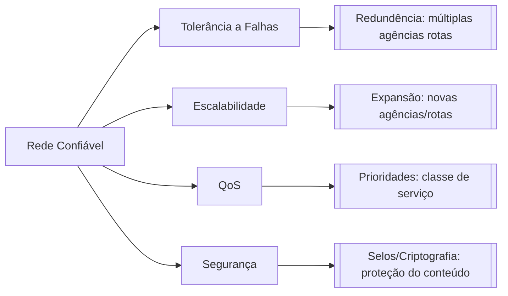

> 🧠 **Dica para memorizar (estilo caderno):** "Pense nos 4 requisitos da rede como serviços dos correios: **tolerância a falhas** = se uma agência cair, entrega por outra; **escalabilidade** = mais agências surgindo; **QoS** = classe de serviço (priority mail vs. comum); **segurança** = carta selada e lacrada."

### 1.2 Tolerância a falhas, redundância e disponibilidade

A **tolerância a falhas** e a **disponibilidade** andam juntas: uma rede de **alta disponibilidade** é a que permanece operacional e acessível quase o tempo todo, mesmo diante de falhas — isso se alcança por **redundância** de caminhos e equipamentos.

### 1.3 Segurança e tríade CIA

A **segurança** se apoia na tríade CIA:

| Pilar | Significado |
|-------|-------------|
| **C** — Confidencialidade | Só autorizados acessam os dados |
| **I** — Integridade | Dados não são alterados no caminho |
| **A** — Disponibilidade | O serviço está acessível quando precisar |

> 🧠 **Dica para memorizar:** "Rede confiável tem **T-E-S-Q** (**T**olerância a falhas, **E**scalabilidade, **S**egurança, **Q**oS). Traduzindo pro seu mundo de dados: **tolerância a falhas** é o seu pipeline que **retenta e desvia** quando um job falha (redundância → alta disponibilidade); **escalabilidade** é a tabela que **cresce em partições** sem travar; **QoS** é dar **prioridade ao job do dashboard executivo** quando o cluster congestiona; **segurança** é **só quem tem permissão no warehouse** acessa os dados de RH."

### 1.4 Exemplo de alta disponibilidade em cloud

**Exemplo com código (Terraform)** — redundância e alta disponibilidade, na prática:

```hcl
# Duas réplicas do banco de RH em zonas/AZs diferentes.
# Se uma zona cair, a outra continua servindo (tolerância a falhas).

resource "google_sql_database_instance" "rh" { # declara um recurso: uma instância de banco do GCP
  name             = "rh-db"                    # dá um nome pra essa instância: "rh-db"
  database_version = "POSTGRES_15"              # diz qual versão do banco usar (Postgres 15)
  region           = "us-central1"              # define a região onde o banco vai ficar

  settings {                                    # abre o bloco de configurações da instância
    tier              = "db-custom-2-7680"       # define o tamanho da máquina (2 vCPU, 7,5 GB RAM)
    availability_type = "REGIONAL"              # ATENÇÃO: cria réplica automática em OUTRA zona (redundância!)
    backup_configuration {                      # configura o backup automático do banco
      enabled                        = true     # liga o backup (deve estar ligado pra restaurar se algo der errado)
      point_in_time_recovery_enabled = true     # permite restaurar em qualquer minuto (PITR), não só no horário do backup
    }
  }
}

# Releitura da aplicação: se o job de RH não achar a instância primária,
# ele faz autofailover pra réplica — o "desvio de caminho" da rede confiável.
```

**Verificação com Bash** — consultar o estado da instância criada:

```bash
gcloud sql instances describe rh-db  # consulta no GCP a configuração e o estado atual da instância de banco
```

O Terraform declara a redundância; o comando Bash ajuda a verificar o que foi realmente provisionado no ambiente.

---

## 2. Conexão com a Internet: ISPs e meios de acesso

### 2.1 ISP e CSP

A conexão dos usuários com a Internet é feita por **ISPs** (Internet Service Providers). As WANs são gerenciadas por **CSPs** (operadoras tradicionais) ou ISPs.


### 2.2 Meios de acesso residenciais e pequenos escritórios

| Meio | Como funciona | Característica |
|------|---------------|----------------|
| Dial-up | Linha telefônica + modem | Banda pequena (kbits/s), econômico |
| DSL | Linha telefônica | Maior banda e disponibilidade; conexão sempre ativa; ADSL é assimétrico (download > upload) |
| Cable Modem | Mesmo cabo da TV a cabo | Maior banda e disponibilidade |
| Celular | Rede de telefonia celular | Limitado pela tecnologia da rede |
| Satélite | Antena parabólica | Útil em áreas de difícil implantação; precisa de visada direta |

### 2.3 Meios de acesso empresariais

- **Linhas dedicadas**: circuitos alugados que conectam escritórios geograficamente separados
- **Metro Ethernet**: estende a tecnologia de LAN para a MAN
- **Business DSL**: como o SDSL, simétrico (upload = download)

### 2.4 Comparativo: residencial vs. empresarial

| Critério | Residencial/pequenos escritórios | Empresas |
|----------|----------------------------------|----------|
| Exemplos | Dial-up, DSL, cable modem, celular, satélite | Linhas dedicadas, Metro Ethernet, Business DSL |
| Simetria | Em geral assimétrico (ADSL: download > upload) | Pode ser simétrico (SDSL: upload = download) |
| Foco | Custo e praticidade pro dia a dia | Confiabilidade e ligação entre sedes |

### 2.5 Enlace direto entre dois PCs e peer-to-peer

Ligar uma interface Ethernet de um PC diretamente à de outro cria um **enlace físico ponto a ponto** entre dois hosts, sem switch ou roteador no meio. Isso **não transforma automaticamente** a conexão em uma rede peer-to-peer: peer-to-peer é uma arquitetura em que os dois computadores podem atuar como cliente e servidor um do outro. Se os dois compartilharem arquivos, por exemplo, e cada um puder solicitar/oferecer recursos, então a rede direta estará sendo usada de modo par-a-par.

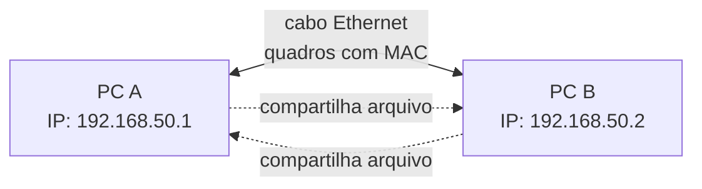

| Pergunta | Resposta |
|----------|----------|
| O cabo sozinho cria uma rede funcional? | Cria o enlace físico; ainda é preciso configurar/obter IPs compatíveis e permitir o tráfego no firewall |
| Vira peer-to-peer automaticamente? | Não. Vira P2P quando ambos os PCs oferecem e consomem serviços/recursos diretamente |
| Tem Internet automaticamente? | Não. Sem roteador/gateway, a comunicação fica restrita aos dois PCs; um deles teria de compartilhar sua conexão para fornecer Internet ao outro |
| Precisa de switch? | Não para apenas dois PCs; o cabo liga as duas interfaces diretamente |
| Cabo comum funciona? | Em NICs modernas, normalmente sim, por Auto MDI-X; equipamentos antigos podem exigir cabo crossover |

**Fluxo real após conectar:** o link Ethernet negocia a conexão física; os dois PCs precisam estar na mesma sub-rede (por exemplo, `192.168.50.1/24` e `192.168.50.2/24`); então cada um descobre o MAC do outro na rede local e envia quadros diretamente. Não há roteador no meio para encaminhar pacotes a outras redes.

**Exemplo com código (Linux)** — atribuir IPs estáticos temporários ao enlace direto:

```bash
# Execute estas duas linhas no PC A; substitua enp0s31f6 pelo nome da interface Ethernet real.
sudo ip addr add 192.168.50.1/24 dev enp0s31f6  # atribui ao PC A o IP 192.168.50.1 na rede 192.168.50.0/24
sudo ip link set enp0s31f6 up                   # liga a interface para que ela comece a transmitir e receber sinais

# Execute estas duas linhas no PC B; use o nome da interface Ethernet real desse PC.
sudo ip addr add 192.168.50.2/24 dev enp0s31f6  # atribui ao PC B o IP 192.168.50.2 na mesma rede local do PC A
sudo ip link set enp0s31f6 up                   # liga a interface Ethernet do PC B

# Execute esta linha no PC A depois de configurar os dois lados.
ping 192.168.50.2                               # envia pacotes ICMP ao PC B para confirmar que o enlace e os IPs funcionam
```

---

### 2.6 Intranet, Internet e Extranet

Uma **intranet** é o conjunto privado de LANs e enlaces WAN pertencentes a uma organização. Ela usa tecnologias semelhantes às da Internet, como TCP/IP, mas o acesso é restrito à empresa e aos usuários autorizados. A aula 01 define a intranet como uma conexão privada de LANs e WANs que pertence a uma organização (`01-introducao-as-redes.md:102`).

| Termo | Escopo | Quem pode acessar | Exemplo em engenharia de dados |
|-------|--------|-------------------|----------------------------|
| **Internet** | Rede mundial pública de redes | Usuários conforme os controles de cada serviço | Acessar a documentação pública de um provedor cloud |
| **Intranet** | LANs e WANs privadas da organização | Funcionários e sistemas autorizados | Airflow, warehouse e APIs internas de RH |
| **Extranet** | Parte controlada da rede privada exposta a externos | Parceiros/clientes autorizados | Provedor de benefícios acessando uma API específica |

**Exemplo com código (Terraform)** — representar uma rede privada interna:

```hcl
resource "google_compute_network" "intranet_rh" { # cria uma rede virtual privada para os sistemas internos de RH
  name                    = "intranet-rh" # define o nome usado para identificar a rede privada
  auto_create_subnetworks = false # impede a criação automática de sub-redes para manter o desenho sob controle
}

resource "google_compute_subnetwork" "dados" { # cria uma sub-rede privada para os componentes de dados
  name          = "subnet-dados-rh" # dá um nome à sub-rede usada pelos serviços de dados
  ip_cidr_range = "10.30.0.0/24" # reserva endereços privados para os recursos dessa sub-rede
  region        = "us-central1" # coloca a sub-rede em uma região específica
  network       = google_compute_network.intranet_rh.id # conecta a sub-rede à intranet criada acima
}
```

Esse código representa a infraestrutura privada, mas uma intranet completa também depende de conexões entre redes, controles de acesso, DNS interno, VPN ou Interconnect e regras de firewall.

**Verificação com Bash** — testar o caminho até um serviço interno:

```bash
ip route get 10.30.0.10  # mostra qual interface e qual rota o sistema usaria para alcançar um endereço privado
nc -vz 10.30.0.10 5432  # testa se a porta 5432 do banco está acessível a partir desta máquina
```

O Terraform cria a rede privada; os comandos Bash ajudam a investigar se um worker realmente consegue chegar ao serviço.

---

## 3. Protocolos de rede

### 3.1 Definição e papel

Definição (KUROSE e ROSS, 2016): um protocolo define o **formato** e a **ordem** das mensagens trocadas entre duas ou mais entidades comunicantes, bem como as **ações** realizadas na transmissão e/ou no recebimento de uma mensagem. Em resumo: o protocolo define **como** as mensagens são trocadas entre origem e destino.

> 🧠 **Dica para memorizar (versão correios):** "Um protocolo de rede é como o **regulamento da agência dos correios** que dita: (1) **formato** da carta (tamanho do envelope, tipo de papel), (2) **ordem** em que os campos devem ser preenchidos (endereço do remetente antes do destinatário), e (3) **ações** ao receber/entregar (verificar selo, registrar chegada). Não define se o carteiro usa carro ou bicicleta (esse é o meio físico)."

A analogia se estende: assim como diferentes tipos de correspondência seguem regulamentos diferentes (uma carta padronizada vs. um envelope expresso vs. um pacote registado), diferentes protocolos de rede têm suas próprias regras de formatação e troca de mensagens.

### 3.2 O que protocolos fazem e não fazem

Pontos importantes:

- São implementados por dispositivos finais e intermediários em **software, hardware ou ambos**
- Cada protocolo tem sua **própria camada**, função, formato e regras de comunicação
- Funcionam tanto em redes locais quanto remotas

O que protocolos **NÃO** fazem (pegadinhas de prova):

- Não definem o tipo de hardware usado
- Não funcionam apenas em uma camada (ex.: só no acesso à rede)
- Não se restringem a redes locais ou remotas

### 3.3 Tipos de protocolos

| Tipo | O que faz | Exemplos |
|------|-----------|----------|
| **Comunicação** | Permitem a troca de dados entre dispositivos | IP, TCP, HTTP |
| **Segurança** | Protegem a comunicação (criptografia, acesso) | SSH, SSL, TLS |
| **Roteamento** | Escolhem o melhor caminho pela rede | RIP, OSPF, BGP |
| **Descoberta de serviço** | "Descobrem"/atribuem recursos (IP, nomes) | DHCP, DNS |

---

## 4. Modelos de referência: OSI e TCP/IP

### 4.1 Equivalência entre OSI e TCP/IP

As redes são organizadas em camadas. Os dois modelos principais conversam mesmo com quantidades diferentes de camadas:

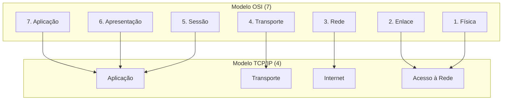

No modelo TCP/IP, a camada **Acesso à Rede** reúne as funções das camadas **Física** e **Enlace** do modelo OSI. Para entender por meio da analogia dos correios:

> **Modelo OSI** = Um serviço de correios completo com 7 estações de trabalho:
> 1. **Estação de Redação** (Aplicação) — onde a carta é escrita
> 2. **Estação de Embalagem** (Apresentação) — onde a carta é colocada no envelope adequado
> 3. **Estação de Registro** (Sessão) — onde a carta é registrada para rastreamento
> 4. **Estação de Pesagem e Cobrança** (Transporte) — onde o peso e custo são calculados
> 5. **Central de Triagem Regional** (Rede) — onde o roteamento entre cidades ocorre
> 6. **Estação de Carteiro Local** (Enlace) — onde a carta é preparada para entrega no bairro
> 7. **Mochila de Correios** (Física) — o transporte físico pelos correios

> **Modelo TCP/IP** = Um serviço de correios simplificado com 4 estações:
> 1. **Mostruário de Envios** (Aplicação) — onde tudo começa
> 2. **Cálculo de Frete** (Transporte) — peso e custo
> 3. **Central de Roteamento** (Internet) — o núcleo que decide o caminho
> 4. **Entrega Final** (Acesso à Rede) — entrega na caixa do destinatário

No modelo TCP/IP, a camada **Acesso à Rede** reúne as funções das camadas **Física** e **Enlace** do modelo OSI. A camada OSI Física trata dos **carros e caminhões dos correios** (meios de transmissão); a camada OSI Enlace trata do **manuseio de envelopes e rótulos** (quadros e endereços MAC). O TCP/IP agrupa essas duas responsabilidades em uma única camada: **"Deixar a carta pronta para ser entregue"**.

| Modelo OSI | Modelo TCP/IP | Responsabilidade principal | Analogística dos Correios |
|------------|---------------|----------------------------|---------------------------|
| Física (1) | Acesso à Rede | Transmitir bits como sinais no meio físico | O **caminhão dos correios** que transporta as cartas |
| Enlace (2) | Acesso à Rede | Montar e entregar quadros usando MAC | O **carteiro** que manuseia envelope e coloca o rótulo de entrega |
| Rede (3) | Internet | Encaminhar pacotes usando IP | A **central de triagem** que decide qual caminho a carta toma |
| Transporte (4) | Transporte | Comunicação entre aplicações usando portas | O **gerente de expediente** que organiza o que vai para cada caixa/serviço |
| Sessão, Apresentação e Aplicação (5-7) | Aplicação | Serviços e dados das aplicações | Diferentes **tipos de correspondência**: carta, pacote, expresso |

> 🧠 **Dica para memorizar (estilo caderno):** "No serviço de correios: **Física = caminhão**, **Enlace = carteiro**, **Rede = central de triagem**, **Transporte = gerente de frete**. No TCP/IP, o caminhão e o carteiro ficam num só bloco 'Acesso à Rede', enquanto o OSI os mantém separados. O IP é o endereço de destino que a central de triagem usa para encaminhar."

### 4.2 Funções das camadas TCP/IP

Função de cada camada do **TCP/IP**:

- **Aplicação**: representa os dados para o usuário, além de codificação e controle de diálogo
- **Transporte**: suporta a comunicação entre vários dispositivos em diversas redes
- **Internet**: **determina o melhor caminho pela rede** — é onde acontece o roteamento, feito pelo protocolo **IP**
- **Acesso à Rede**: controla os dispositivos de hardware e mídia

### 4.3 Roteamento na camada Internet/Rede

> **Roteamento**: no TCP/IP é a camada **Internet**; no OSI corresponde à camada **Rede** (3). É o protocolo IP, usado pelos roteadores, que encaminha as mensagens por uma internetwork.


### 4.4 Exemplo de roteamento em cloud

**Exemplo com código (Terraform)** — a camada de rede decidindo o caminho (roteamento):

```hcl
# A camada Internet/Redes "decide o melhor caminho" — aqui, via tabela de rotas.

resource "google_compute_network" "rh" { # cria uma rede (VPC) chamada "vpc-rh"
  name                    = "vpc-rh"     # nome da rede no GCP
  auto_create_subnetworks = false        # NÃO cria sub-redes automaticamente; a gente cria manual
}

# Rota padrão: tudo que não é local vai pro gateway da internet
resource "google_compute_route" "default" {    # cria uma rota (regra de caminho) na rede
  name             = "rota-internet"           # nome dessa rota: "rota-internet"
  network          = google_compute_network.rh.name # qual rede essa rota pertence (a vpc-rh criada acima)
  dest_range       = "0.0.0.0/0"               # para QUALQUER destino (0.0.0.0/0 = todo endereço) — "rota padrão"
  next_hop_gateway = "default-internet-gateway" # sai pelo gateway da internet (o "portão" da rede pro mundo)
}

# Rota específica: tráfego pro datacenter de RH vai pelo túnel VPN (caminho preferido)
# = "roteamento dinâmico escolhe o melhor caminho" (aula: camada de rede / roteamento)
resource "google_compute_route" "to_dc" {          # cria outra rota específica
  name             = "rota-datacenter-rh"          # nome dessa rota: "rota-datacenter-rh"
  network          = google_compute_network.rh.name # mesma rede da anterior (vpc-rh)
  dest_range       = "10.20.0.0/16"                # só para a rede interna do datacenter de RH (10.20.x.x)
  next_hop_ip = "10.30.0.1"                         # manda para o IP do appliance/roteador VPN que encaminha ao datacenter
}
# Resumo: roteamento = "qual caminho cada pacote segue" — a camada de rede decide isso
```

**Verificação com Bash** — consultar a rota escolhida pelo host:

```bash
ip route get 10.20.0.15  # mostra a interface, o próximo salto e a rota usada para chegar ao datacenter de RH
traceroute 10.20.0.15  # lista os saltos percorridos até o destino, quando a rede permite essa descoberta
```

O Terraform descreve a rota desejada na infraestrutura cloud; o Bash mostra o caminho que o sistema está usando de fato a partir daquele host.

---

## 5. Encapsulamento, pacotes e frames

### 5.1 PDUs e encapsulamento

Cada camada acrescenta seu cabeçalho à **PDU** (Protocol Data Unit) recebida da camada superior. As PDUs mudam de nome conforme a camada:

O processo de colocar uma PDU dentro de outra PDU é chamado de **encapsulamento**. Durante o envio, a camada inferior recebe a PDU da camada superior, acrescenta suas próprias informações de controle e cria uma nova PDU. No destino, ocorre o processo inverso, chamado **desencapsulamento**: cada camada remove e interpreta seu cabeçalho até entregar os dados à aplicação.

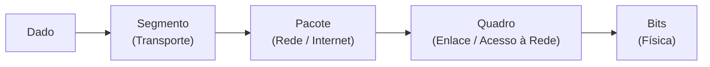

| PDU | Camada | Endereço usado | Alcance | **Analogística dos Correios** |
|-----|--------|----------------|---------|--------------------------------|
| **Data** | Aplicação/Apresentação/Sessão (7/6/5) | — | O dado do usuário como entra na pilha | A **carta escrita** pelo remetente, com a história que será enviada |
| **Segmento** | Transporte (4) | **Porta** (qual aplicação no destino) | Processo a processo — conversas individuais | O **rótulo de classe de serviço**: "Priority Mail", "First Class", indicando qual serviço será usado |
| **Pacote** | Rede (3) | **IP** (destino final) | Internetwork — viaja de roteador a roteador | O **envelope endereçado** com o CEP (destino final), que permanecerá igual durante toda a jornada |
| **Quadro (Frame)** | Enlace (2) | **MAC** (próximo salto) | Mesma mídia — vai de vizinho a vizinho | O **rótulo da agência de destino** colado no envelope naquele momento (será trocado ao passar de agência) |
| **Bits** | Física (1) | — | Transmissão pelo meio físico | Os **sinais no caminhão/carro** dos correios que levam o envelope de um lugar a outro |

**Exemplo com código (Scapy)** — visualizar uma PDU carregada dentro de outra:

```python
from scapy.all import Ether, IP, TCP, Raw  # importa as camadas usadas para montar a comunicação
dados = Raw(load=b"consulta de colaboradores")  # cria os dados da aplicação como bytes
segmento = TCP(sport=50000, dport=443) / dados  # coloca os dados dentro de um segmento TCP com portas
pacote = IP(src="192.168.50.10", dst="10.20.0.15") / segmento  # coloca o segmento dentro de um pacote IP
quadro = Ether(src="00:11:22:33:44:55", dst="aa:bb:cc:dd:ee:ff") / pacote  # coloca o pacote dentro de um quadro Ethernet
quadro.show()  # exibe a estrutura para visualizar o encapsulamento camada por camada
```

Neste exemplo, `dados` está dentro de `segmento`, que está dentro de `pacote`, que está dentro de `quadro`. O `/` do Scapy representa essa composição das camadas; em uma comunicação real, o kernel e a NIC fazem esse trabalho.

> 🧠 **Dica visual para memorizar (estilo caderno):** "Pense no encapsulamento como **encher envelopes na cadeia logística dos correios**: 
> 1. Você começa com a **carta** (Data) — sua mensagem original
> 2. Aplica-se o **rótulo da classe de serviço** (Segmento) — indica o tipo de entrega
> 3. Coloca-se a carta dentro do **envelope** (Pacote/IP) — com o endereço de destino final escrito
> 4. Na parte de fora do envelope, cola-se o **rótulo da agência local** (Quadro/MAC) — indica onde entregar naquele trecho
> 5. O carteiro (NIC) transporta o envelope (Bits) pelo caminhão
> 
> No destino, o processo é inverso: abre-se o envelope, retira-se a carta, e se descarta o rótulo da agência local."

---

### 5.2 Segmentação e remontagem

A mensagem longa é quebrada em pedaços (segmentos) que cabem nos limites de tamanho do quadro. Cada segmento é numerado (sequenciamento) para o destino conseguir remontar a mensagem original mesmo se chegarem fora de ordem.

> 🧠 **Dica para memorizar (estilo caderno):** "Semelhante a uma ** carta muito grande que precisa ser dobrada para caber no envelope**: se a carta não couber, ela é dobrada em partes numeradas. No destino, as partes são reestruturadas na ordem correta antes de ser entregue ao destinatário."

### 5.2 Segmentação e remontagem

A mensagem longa é quebrada em pedaços (segmentos) que cabem nos limites de tamanho do quadro. Cada segmento é numerado (sequenciamento) para o destino conseguir remontar a mensagem original mesmo se chegarem fora de ordem.

### 5.3 Segmentação TCP vs. chunks de ETL

Os dois processos quebram dados em partes, mas resolvem problemas diferentes e ocorrem em camadas diferentes. Quando um job lê um CSV de 20 GB em chunks de 100 MB, essa é uma decisão da **sua aplicação** para limitar memória, controlar paralelismo e facilitar retentativas. Depois que o job envia esses 100 MB por uma conexão TCP, o sistema operacional ainda divide esse fluxo em segmentos menores, adequados à rede, sem o código Python precisar controlar o tamanho de cada pacote.

| Aspecto | Chunk de ETL | Segmentação TCP |
|---------|--------------|-----------------|
| Camada | Aplicação | Transporte (4) |
| Quem decide | Seu código/job | Sistema operacional e pilha TCP |
| Unidade típica | Arquivo, lote de registros, partição de tabela | Segmento de rede, limitado pelo caminho/enlace |
| Objetivo | Não estourar memória; paralelizar; retomar processamento | Transmitir dados com controle de fluxo e remontar corretamente |
| Retentativa | Seu pipeline precisa ser idempotente | TCP retransmite o trecho perdido da conexão |

Em uma conexão TCP, a aplicação entrega um **fluxo de bytes**, não uma lista de pacotes: os limites de uma chamada `send()` ou de um chunk de ETL não são preservados como limites de pacote. Vários segmentos podem ficar "em voo" ao mesmo tempo; se chegarem fora de ordem, o TCP os ordena antes de entregar os bytes ao processo de destino. Vários workers/threads podem abrir várias conexões e gerar fluxos concorrentes, mas isso é diferente de o TCP usar um "ID de núcleo" para enviar dados.

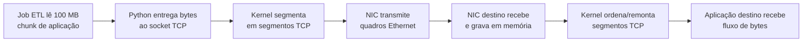

### 5.4 Fluxo de encapsulamento: a descida obrigatória pela pilha

Para enviar dados pela rede, a mensagem desce pelas camadas. Cada camada acrescenta informações de controle próprias; por isso a PDU muda de nome. No destino, o caminho é o inverso: as camadas removem seus cabeçalhos até entregar os dados à aplicação.

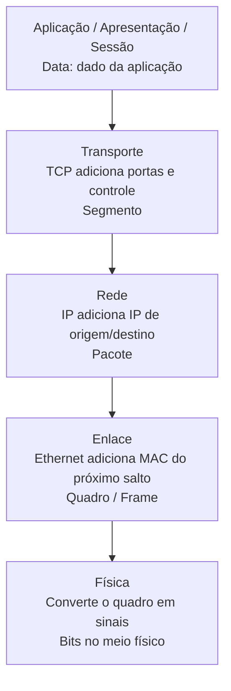

| Etapa | O que a camada acrescenta | PDU após a etapa |
|-------|----------------------------|------------------|
| Aplicação, apresentação e sessão | Dados e regras da aplicação | Data |
| Transporte | Portas, controle de fluxo, sequenciamento e confiabilidade (TCP) | Segmento |
| Rede | IP de origem e destino para encaminhar entre redes | Pacote |
| Enlace | MAC de origem e do próximo salto para entrega no enlace local | Quadro/Frame |
| Física | Representação dos bits como sinal elétrico, luz ou ondas de rádio | Bits/sinais |

**A regra geral está certa:** em uma comunicação de rede, os serviços necessários de cada camada participam do envio e do recebimento; não se entrega um dado HTTP diretamente no cabo sem transporte, endereçamento e enlace. Mas há três detalhes importantes:

1. O modelo **OSI é conceitual**. Na pilha TCP/IP real, apresentação e sessão não aparecem como camadas separadas: suas responsabilidades ficam dentro da camada de aplicação.
2. Nem todo transporte é TCP. Com **UDP**, a PDU da camada de transporte é um **datagrama**, não um segmento, e não há a mesma garantia de entrega/ordem do TCP.
3. Na camada física, não trafegam "zeros e uns" abstratos: os bits são codificados em **sinais elétricos** (cabo), **pulsos de luz** (fibra) ou **ondas de rádio** (Wi-Fi). O receptor interpreta esses sinais de volta como bits.

**Eletricidade não é protocolo.** Ela é um dos meios físicos que pode transportar um sinal. Um protocolo/padrão define as regras de como o sinal deve ser gerado e interpretado: níveis ou transições de tensão, velocidade, sincronização, tipo de cabo e conectores. Em uma rede Ethernet cabeada, por exemplo, o equipamento transforma bits em sinais elétricos no cabo; em fibra, transforma bits em pulsos de luz; no Wi-Fi, em ondas de rádio. O padrão físico permite que os dois lados leiam o mesmo sinal com o mesmo significado.

| Conceito | O que é | Exemplo |
|----------|---------|---------|
| Meio físico | Por onde o sinal viaja | Cabo de cobre, fibra óptica, ar no Wi-Fi |
| Sinal | A representação física de bits | Variação de tensão, pulso de luz, onda de rádio |
| Protocolo/padrão físico | Regras para codificar e interpretar o sinal | Ethernet/IEEE 802.3, Wi-Fi/IEEE 802.11 |

### 5.5 CPU, NIC e endereçamento

**Ponto que confunde (e costuma cair em prova): a CPU e seus núcleos NÃO têm "ID" usado no endereçamento da rede — mas a CPU É quem executa o software que segmenta/remonta.** Há dois papéis diferentes: o de **processamento** (executar o código) e o de **endereçamento** (identificar na rede).

| Quem | Qual papel | O que faz |
|------|-----------|-----------|
| CPU / núcleos | **Processamento** | Executa o código dos protocolos (segmentar/remontar); **não vira endereço** na rede |
| NIC (placa de rede) | Enlace local | Coloca/lê o quadro com MAC no trecho físico; não administra a entrega à CPU destino |
| IP | **Endereçamento** | Identifica a máquina destino |
| Porta | **Endereçamento** | Identifica a aplicação dentro da máquina |

> O software de transporte **precisa de CPU para rodar** (todo programa precisa), mas o **endereço na rede é IP + porta** — nunca o "número do núcleo".

### 5.6 Exemplo de encapsulamento com Scapy

**Exemplo com código (Scapy)** — montar um pacote camada a camada e ver o encapsulamento:

```python
from scapy.all import Ether, IP, TCP  # importa as "camadas" que iremos empilhar

# CONCEITO: cada linha abaixo é UMA camada embrulhando a anterior.
# É exatamente o "cada camada adiciona seu cabeçalho" da teoria.

pacote = Ether()                  # camada 2 (Enlace): cria um quadro Ethernet vazio
pacote = Ether()/IP()             # embrulha o quadro dentro de um pacote IP (camada 3 / Rede)
pacote = Ether()/IP()/TCP()       # embrulha o pacote IP num segmento TCP (camada 4 / Transporte)

# Agora preenchemos os endereços que "cada camada sabe" (que vimos na tabela de PDUs):
pacote[Ether].dst = "aa:bb:cc:dd:ee:ff"  # MAC de destino (o próximo salto no enlace) — Ethernet responde pelo MAC
pacote[Ether].src = "00:11:22:33:44:55"  # MAC de origem (minha placa de rede)
pacote[IP].dst    = "8.8.8.8"            # IP de destino (a máquina final) — camada de Rede responde pelo IP
pacote[IP].src    = "192.168.1.10"       # IP de origem (meu computador)
pacote[TCP].dport = 443                  # porta de destino (HTTPS) — camada de Transporte responde pela porta
pacote[TCP].sport = 50000                # porta de origem (aleatória, pra resposta chegar de volta)

# Repare: cada camada só conhece o "endereço" dela (MAC / IP / porta).
# Empilhadas, elas formam uma PDU com cabeçalhos de enlace, rede e transporte.

# Para ver o resultado encapsulado (mostra os cabeçalhos hexadecimais na ordem):
# pacote.show()   # descomente p/ exibir a estrutura em texto
```

> ⚙️ **Por baixo dos panos:** esse "empilhamento" que o Scapy monta pra você é, no mundo real, feito em **baixo nível** — o kernel grava esses cabeçalhos direto na memória usando **raw sockets / eBPF (XDP)** em C, e a placa de rede (NIC) transmite os bytes. O Scapy só **revela** o conceito de forma legível; a implementação de verdade é low-level.

### 5.7 Aplicabilidade para engenharia de dados

Em um time de dados que apenas consome recursos gerenciados pela plataforma, normalmente não é responsabilidade do engenheiro de dados configurar VPCs, VPNs, regras de firewall, roteamento ou investigar pacotes com Scapy. Esse trabalho tende a ficar com as equipes de plataforma, cloud/SRE e segurança. Ainda assim, entender redes ajuda a separar um defeito do pipeline de um problema de infraestrutura: um timeout do Airflow ao acessar o warehouse pode ser DNS, rota, firewall, endpoint privado ou porta bloqueada — não necessariamente falha no código ou no SQL.

| Situação | Profundidade de redes esperada para dados | Time normalmente responsável |
|----------|--------------------------------------------|-----------------------------|
| Consumir API, banco, bucket ou fila | Saber endpoint, DNS, porta, TLS, timeout, retry e limites de conexão | Engenharia de dados |
| Diagnosticar timeout/intermitência | Coletar logs, identificar se o erro é de rede e acionar o time certo com evidências | Engenharia de dados + plataforma |
| Configurar VPC, VPN, firewall, rotas ou balanceador | Entender o impacto, mas não necessariamente implementar | Plataforma/cloud/SRE ou segurança |
| Analisar pacotes ou usar Scapy | Usar apenas em laboratório, testes controlados ou investigação especializada | Segurança, rede ou plataforma |

O conhecimento de camadas, IP, portas, DNS, controle de fluxo, disponibilidade e retries continua valioso para projetar pipelines resilientes e conversar objetivamente com as equipes que gerenciam a infraestrutura. Em uma empresa mais híbrida, com dados on-premise, redes privadas, alta escala ou responsabilidade de data platform, essa fronteira pode mudar e esses conceitos passam a aparecer muito mais no trabalho diário.

### 5.8 Comunicação web de ponta a ponta

O processo completo, do clique no navegador até a resposta do servidor:

```mermaid
sequenceDiagram
    participant App as Aplicação (HTTP)
    participant Transp as Transporte (TCP)
    participant Net as Internet (IP)
    participant Link as Acesso à Rede (Ethernet)
    participant Srv as Servidor

    Note over App: Usuário pede uma página<br>no navegador
    App->>Transp: Dado (requisição HTTP)
    Note over Transp: + cabeçalho TCP<br>(entrega confiável,<br>controle de fluxo)
    Transp->>Net: Segmento TCP
    Note over Net: + cabeçalho IP<br>(endereço do destino final)
    Net->>Link: Pacote IP
    Note over Link: + cabeçalho Ethernet<br>(MAC do próximo salto)
    Link->>Srv: Quadro vira bits<br>pelo meio físico
    Note over Srv: Processo inverso:<br>remove os cabeçalhos<br>de cada camada até a aplicação
    Srv-->>App: Resposta HTTP (página)
```

Na **ida**, cada camada "embrulha" o dado com seu cabeçalho (encapsulamento); na **chegada**, o servidor "desembrulha" camada por camada até chegar à aplicação. Na volta, o mesmo processo se repete com a resposta.

**Analogística completa dos Correios (ida e volta):**

> **📤 Ida (Enviando a carta):**
> 1. **Você escreve a carta** (Aplicação/HTTP) — seu pedido de página web
> 2. **O sistema coloca a carta num envelope da classe de serviço** (Transporte/TCP) — adiciona confiabilidade e controle de fluxo, tipo "Priority Mail"
> 3. **Escreve-se o endereço completo do destinatário no envelope** (Internet/IP) — o CEP/endereço final que não mudará
> 4. **Na parte de fora do envelope, cola-se um rótulo "Agência de Origem"** (Enlace/Ethernet) — o próximo salto, tipo "Agência Centro"
> 5. **O carteiro (NIC) coloca o envelope no caminhão** (Física) — transmite os bits pelo meio físico
> 6. **O caminhão chega na central de triagem** (Roteador 1) — remove o rótulo "Agência de Origem" e cola um novo: "Agência de Rota"
> 7. **Segue para a próxima central** (Roteador 2) — novamente remove e cola um novo rótulo
> 8. **Finalmente, entrega na caixa do destinatário** (Servidor) — após desencapsulamento completo

> **📥 Volta (Resposta do servidor):**
> O mesmo processo se repete: o servidor embala a resposta HTTP, o TCP adiciona o segmento, o IP o pacote, o Ethernet o quadro, e os bits voltam pelo caminho inverso, com cada roteador trocando os rótulos MAC a cada salto.

> 🧠 **Dica para memorizar (estilo caderno):** "Enviar dados pela rede é como **enviar uma carta pelos correios com entrega confirmada**: 
> - **HTTP** = o conteúdo da carta (o que você quer pedir ou receber)
> - **TCP** = o envelope selado com número de rastreamento (garante que tudo chegue junto e na ordem certa)
> - **IP** = o endereço de entrega escrito no envelope (fica do início ao fim, não importa quantas agências o pacote passe)
> - **Ethernet/MAC** = o rótulo colado na parte de fora do envelope (muda a cada agência/roteador que o pacote passa)
> - **Bits** = o caminhão que transporta o envelope pelo país"

---

### 5.9 Papel dos protocolos em uma comunicação web

| Protocolo | Camada | Papel | **Analogística dos Correios** |
|-----------|--------|-------|--------------------------------|
| **HTTP** | Aplicação | Governa a interação cliente-servidor web | A **carta em si** — o conteúdo da sua solicitação ou resposta |
| **TCP** | Transporte | Gerencia as conversas, garante entrega confiável e controla o fluxo | O **envelope selado com número de rastreamento** — garante que nenhuma página se perca no correio |
| **IP** | Internet/Rede | Entrega as mensagens; os roteadores o usam para encaminhar | O **endereço de entrega (CEP)** escrito no envelope — o destino final, que permanece igual durante toda a jornada |
| **Ethernet** | Acesso à Rede/Enlace | Entrega o quadro de um NIC a outro na mesma mídia | O **rótulo da agência de destino** colado no envelope no momento — indica onde entregar o próximo trecho |

> 🧠 **Dica para memorizar (estilo caderno):** "Na comunicação web: **HTTP = a carta**, **TCP = o envelope com rastreamento**, **IP = o endereço de entrega**, **Ethernet = o rótulo da agência**. A carta sai com o endereço do destinatário escrito, mas com o rótulo da agência local — e a cada agência que passa, o carteiro cola um novo rótulo, mas o endereço de destino final não muda."

---

## 6. MAC vs IP: a diferença essencial

### 6.1 Conceitos e glossário

É na **camada de enlace (2)** que o endereço MAC de destino é adicionado ao pacote, transformando-o em **quadro**. O roteador olha o **IP** para decidir o caminho, mas quem entrega o dado ao próximo vizinho é o **frame com o MAC**.

**Glossário:**

| Termo | O que é |
|-------|---------|
| **NIC** | Placa de rede; a interface física do dispositivo |
| **MAC** | Endereço físico gravado de fábrica no NIC, único, usado na camada de enlace |
| **IP** | Endereço lógico da camada de rede, muda conforme a rede |
| **Vizinho** | Dispositivo diretamente conectado na mesma mídia (próximo salto) |
| **Roteador** | Dispositivo intermediário que roteia o pacote pelo melhor caminho |

### 6.2 Como MAC e IP atuam na prática

Quando você manda uma mensagem, o dispositivo de origem monta o quadro com **dois endereços**: o **MAC de destino** (gravado de fábrica no NIC do equipamento que está fisicamente na mesma rede — o próximo salto) e o **IP de destino** (o endereço lógico da máquina, que muda conforme a rede onde ela está). Como o MAC vem de fábrica e é único por interface, ele serve pra entrega local (mesmo enlace); o IP, por mudar com a rede, é o que viaja entre redes. Ex.: um notebook com **Wi-Fi e cabo** tem **dois MACs** (um por placa), e pela internet é encontrado pelo seu **IP**, não pelo MAC.

| | MAC | IP |
|--|-----|-----|
| Natureza | Físico (de fábrica no NIC) | Lógico (atribuído pela rede) |
| Camada | Enlace (2) | Rede (3) |
| Onde é usado | Mesmo enlace (vizinho próximo) | Entre redes (internetwork) |
| Muda de rede? | Não | Sim |

### 6.3 Comparativo: porta, IP e MAC

| Informação | Camada | PDU | Identifica | Alcance |
|------------|--------|-----|------------|---------|
| Porta | Transporte (4) | Segmento | Serviço/aplicação no destino | Processo a processo |
| IP | Rede (3) | Pacote | Máquina destino | Entre redes |
| MAC | Enlace (2) | Quadro | Próximo salto no enlace | Rede local/enlace |

> 🧠 **Dica para memorizar (os 3 endereços):** "Pense numa consulta ao seu warehouse: a **porta** (camada 4) indica *qual serviço*, tipo a **conexão do Airflow pro Postgres na porta 5432**; o **IP** (camada 3) indica *qual servidor*, tipo o **endpoint da instância de banco**; o **MAC** (camada 2) indica o *nó físico vizinho*, tipo o **MAC do switch dentro do cluster**. Cada camada etiqueta a mensagem com um desses dados conforme ela desce a pilha.

### 6.4 Frame destinatário em comunicação remota (ex.: SA → HB)

Quando um host envia dados para outro host em rede **remota** (em outro subnet ou VLAN), o frame Ethernet que ele gera tem como destino **o MAC do gateway/router padrão**, não o MAC do host final. Isso ocorre porque:

- O host não conhece o endereço MAC do destino final (ele está em outra rede)
- O ARP é usado apenas para descobrir o MAC do próximo salto (gateway)
- O router então encaminha o pacote para a próxima rede

| Cenário | Endereço MAC de destino do frame Ethernet |
|---------|-------------------------------------------|
| **Mesma rede (local)** | MAC do host destinatário direto |
| **Rede remota** | MAC do **gateway/roteador padrão** |
| **Após router** | O router troca o MAC e encaminha para a próxima rede |

> 🧠 **Dica para memorizar (eng. de dados):** "É como querer enviar um documento pro cliente de outro escritório. Você endereça o envelope pro **gerente do escritório** (gateway/roteador), não pro cliente final. O gerente abre, vê o endereço real e reenvia. Na rede: o SA gera frame com dest. = Router 1, o Router 1 remove isso, coloca o MAC do Router 2, e assim por diante."

| | MAC de destino do frame SA |
|---|---|
| SA → HB (mesma rede) | MAC do HB |
| SA → HB (rede remota) | MAC do **Router 1** (gateway) |
| Router 1 → HB (próximo salto) | MAC do **Router 2** |

**Exemplo prático (engenheiro de dados):**
No Airflow acessando um warehouse GCP: o worker gera frame com dest. = gateway da VPC. O gateway removes o MAC antigo, adiciona o próximo MAC (do próximo roteador ou da instância destino na mesma subnet) e encaminha. O IP permanece o mesmo durante toda a jornada; só o MAC muda a cada salto.

### 6.5 Analogia da Central dos Correios (Cartas e Envelopes)

Essa é uma das analogias mais usadas e eficazes para entender a diferença entre IP e MAC em redes de computadores. Pense no processo de enviar uma carta física:

| Campo da Carta | Analogia de Rede | O que representa |
|----------------|------------------|------------------|
| **Endereço completo de entrega** (Rua, Número, Bairro, Cidade, CEP) escrito no envelope | **Endereço IP de destino** | É o endereço lógico final da máquina destinatária. Esse endereço permanece **igual do início ao fim** da jornada, independentemente de quantos roteadores o pacote passar. |
| **Rótulo da agência de destino deste trecho** colado no envelope no momento da postagem | **Endereço MAC de destino** (do próximo salto) | Indica **qual agência/roteador** deve receber/encaminhar aquela carta no próximo trecho físico. Quando a carta chega em uma agência, o funcionário remove o rótulo antigo e coloca um novo rótulo (próxima agência) para o próximo trecho. |

---

### Fluxo da analogia: carta SA → HB (em rede remota)

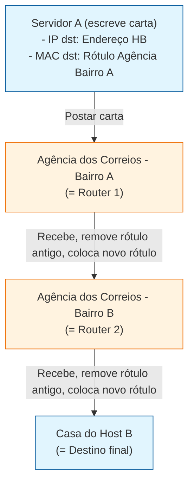

---

### Detalhe do processo em cada "agência" (roteador):

| Etapa | O que acontece com a carta | O que acontece no pacote de rede |
|-------|----------------------------|-----------------------------------|
| **1. SA envia** | Carta sai com: <br>• Endereço completo HB (IP) <br>• Rótulo "Agência Bairro A" (MAC) | Pacote sai de SA com: <br>• IP dst = HB <br>• MAC dst = Router 1 |
| **2. Router 1 recebe** | Remove o rótulo "Agência Bairro A" e cola um **novo rótulo**: "Agência Bairro B" | Remove o MAC dst = Router 1 e coloca o MAC dst = Router 2. **O IP continua sendo o do HB.** |
| **3. Router 2 recebe** | Remove o rótulo "Agência Bairro B" e cola um **novo rótulo**: "Casa HB" | Remove o MAC dst = Router 2 e coloca o MAC dst = HB (ou da porta Switch final). **O IP continua sendo o do HB.** |
| **4. Entrega final** | Carta é entregue na casa do HB usando o endereço completo | Aplica o desencapsulamento: remove os cabeçalhos de camada 2 até entregar os dados à aplicação do HB. |

---

### 🧠 Dica para memorizar (estilo "caderno de revisão")

> **"IP = Endereço completo de entrega na carta (nunca muda). MAC = Rótulo da agência de destino deste trecho (muda a cada agência)."**
>
> Pense assim no seu dia a dia de engenheiro de dados:
> - Quando um **worker Airflow** acessa um **warehouse GCP**, o worker gera o "envelope" (packet) com:
>   - **IP de destino:** O endpoint do warehouse (ex.: `10.20.0.15`) — **fica igual do início ao fim**
>   - **MAC de destino:** O gateway da VPC (endereço do próximo salto) — **é trocado a cada roteador** até chegar na subnet da instância de banco

---

### 🔄 Comparação resumida: IP vs MAC na jornada da carta

| Pergunta | Resposta (Analogia dos Correios) | Resposta (Rede Computer) |
|----------|----------------------------------|--------------------------|
| O endereço de entrega muda de agência para agência? | **Não** — o endereço completo da cidade permanece o mesmo | **Não** — o IP de destino permanece o mesmo |
| O rótulo da agência muda de agência para agência? | **Sim** — cada agência posta um novo rótulo para o próximo trecho | **Sim** — cada roteador substitui o MAC dst pelo próximo salto |
| Quem define o endereço de entrega final? | Quem escreveu a carta (o remetente) | O protocolo IP e o software de aplicação |
| Quem define o rótulo da agência corrente? | O carteiro no momento da postagem | A pilha de rede (ARP, tabela MAC do switch, configuração do gateway) |

---

### 💡 Exemplo prático Engenheiro de Dados

Imagine um job do **Airflow** rodando em um worker que precisa consultar um banco de dados no **Google Cloud Warehouse**:

1. **O worker gera o pacote IP** com:
   - `src_ip = 10.30.0.50` (IP do worker)
   - `dst_ip = 10.20.0.10` (IP do warehouse) ← **esse IP nunca muda**

2. **A pilha de rede do worker adiciona o frame Ethernet** com:
   - `src_mac = AA:BB:CC:DD:EE:FF` (MAC da NIC do worker)
   - `dst_mac = 10.30.0.1` (MAC do gateway/roteador da VPC) ← **esse MAC será trocado**

3. **O gateway da VPC recebe, troca o MAC dst** pelo próximo salto (MAC do roteador de egresso da VPC), e encaminha o pacote IP para a internet da Google.

4. **O pacote chega na instância do Cloud SQL** com o IP de destino original (`10.20.0.10`), e o sistema operacional do destino entrega os dados à aplicação usando esse IP.

> **Resumo:** O IP é o **endereço da cidade** onde o warehouse está localizado. O MAC é o **rótulo da agência** onde o carteiro (roteador) deve entregar o próximo trecho. A carta (pacote) sai do remetente com o endereço da cidade escrito, mas com o rótulo da agência local — e a cada agência que passa, o roteador cola um novo rótulo, mas o endereço da cidade destino permanece o mesmo do início ao fim.

---

## 7. Sistemas de numeração e endereçamento de rede

### 7.1 Bases numéricas usadas em redes

Os dispositivos processam **binário** (base 2), mas os humanos representam endereços de formas mais curtas. Cada base tem um papel específico em redes:

| Base | Nome | Símbolos | Uso principal em redes |
|------|------|----------|------------------------|
| **2** | Binário | `0`, `1` | Idioma real dos endereços IP e MAC dentro da máquina |
| **10** | Decimal | `0` a `9` | Representação dos octetos do IPv4 para humanos |
| **16** | Hexadecimal | `0` a `9`, `A` a `F` | Representação dos endereços MAC e IPv6 |

> O sistema é **posicional**: o valor de cada algarismo depende da posição que ocupa. Em binário, cada posição vale uma potência de 2; em hexadecimal, uma potência de 16.

### 7.2 IPv4: decimal na tela, binário na máquina

Um **IPv4** tem **32 bits**, divididos em **4 octetos** de 8 bits cada. Nós escrevemos cada octeto em **decimal**, mas o computador interpreta e processa tudo em **binário**:

```text
Decimal:  192.168.11.10
Binário:  11000000.10101000.00001011.00001010
```

Cada ponto separa **8 bits** (um octeto), não um número qualquer. Por isso cada octeto só pode ir de `0` a `255` — é o intervalo de 8 bits (`00000000` a `11111111`).

### 7.3 IPv6: 128 bits em hexadecimal

O **IPv6** tem **128 bits**, muito grande para escrever em decimal ou binário. Para encurtar, cada grupo de **4 bits** vira **um dígito hexadecimal**, totalizando **32 dígitos hexadecimais**. Esses 32 dígitos são agrupados em **8 hextetos** de 16 bits cada, separados por `:`:

```text
2001:0DB8:0000:0000:0000:FF00:0042:8329
```

Pode ser encurtado omitindo zeros à esquerda e blocos consecutivos de zeros (`::`), desde que haja apenas uma omissão por endereço.

### 7.4 MAC: endereço físico em hexadecimal

O **endereço MAC** (ou endereço físico) identifica a **NIC** (*Network Interface Card*) de fábrica. Ele tem **48 bits**, divididos em **6 octetos** de 8 bits. Cada octeto é representado por **dois dígitos hexadecimais**, totalizando **12 dígitos hexadecimais**, normalmente separados por `:` ou `-`:

```text
00:1A:2B:3C:4D:5E
```

- Os **primeiros 24 bits** (3 octetos / 6 dígitos hex) identificam o **fabricante** (OUI).
- Os **últimos 24 bits** identificam a interface específica.

### 7.5 Tabela comparativa: IPv4, IPv6 e MAC

| Característica | IPv4 | IPv6 | MAC |
|----------------|------|------|-----|
| **Tamanho** | 32 bits | 128 bits | 48 bits |
| **Divisão** | 4 octetos de 8 bits | 8 hextetos de 16 bits | 6 octetos de 8 bits |
| **Base de exibição humana** | Decimal | Hexadecimal | Hexadecimal |
| **Base real da máquina** | Binário | Binário | Binário |
| **Tipo de endereço** | Lógico (camada 3) | Lógico (camada 3) | Físico (camada 2) |
| **Muda de rede?** | Sim | Sim | Não |
| **Exemplo** | `192.168.1.10` | `2001:db8::ff00:42:8329` | `00:1A:2B:3C:4D:5E` |

### 7.6 Análise das afirmativas do ENADE 2021

A questão traz três afirmativas sobre sistemas numéricos em redes. Vamos checar uma a uma:

| Afirmativa | Avaliação | Justificativa |
|------------|-----------|---------------|
| **I** — "IPv4 é expresso na base decimal, mas dividido em conjuntos de oito bits e interpretado pelo computador usando a base octal" | ❌ **Errada** | A primeira parte é verdadeira (decimal na tela, octetos de 8 bits), mas o computador interpreta em **binário**, não em octal. Octal (base 8) não é a base usada internamente para IPv4. |
| **II** — "IPv6 são compostos de 128 bits e para facilitar sua representação é utilizado o sistema hexadecimal" | ✅ **Correta** | IPv6 tem 128 bits e é representado em hexadecimal para encurtar a notação. |
| **III** — "Endereços físicos são compostos de 6 octetos representados por 12 dígitos no sistema hexadecimal" | ✅ **Correta** | MAC tem 48 bits = 6 octetos = 12 dígitos hexadecimais. |

**Resposta correta:** **Apenas II e III estão corretas.**

### 7.7 Conversão prática: decimal ↔ binário para IPv4

Para converter um octeto decimal para binário, basta decompor em potências de 2. Por exemplo, `168`:

```text
128 + 32 + 8 = 168
 1   0   1   0   1   0   0   0
128  64  32  16   8   4   2   1
```

Resultado: `10101000`.

### 7.8 Exemplo com código (Python) — converter IPv4 entre decimal e binário

```python
# Recebe um IP decimal e mostra o binário de cada octeto.
# Útil pra entender que, por trás do que vemos na tela, tudo vira 0 e 1.

ip_decimal = "192.168.11.10"  # endereço IPv4 no formato que humanos leem
octetos = ip_decimal.split(".")  # separa a string nos 4 octetos, usando o ponto como divisor

binarios = []  # lista que vai guardar cada octeto convertido para binário
for octeto in octetos:  # percorre cada um dos 4 octetos
    numero = int(octeto)  # transforma o texto do octeto em número inteiro
    binario = format(numero, "08b")  # converte para binário com 8 dígitos (preenche com zeros à esquerda)
    binarios.append(binario)  # adiciona o resultado na lista

print(".".join(binarios))  # junta os 4 octetos binários com pontos e imprime
# Saída: 11000000.10101000.00001011.00001010
```

> ⚙️ **Por baixo dos panos:** quando você pinga `192.168.11.10`, o sistema operacional não envia "192" para a placa de rede. Ele converte cada octeto para 8 bits e monta o pacote IP com essa sequência binária. A placa Ethernet, por sua vez, lê e transmite bits — sejam eles de IPv4, IPv6 ou MAC.

### 7.9 O que é um octeto? É 8 bits? É 1 byte?

Resposta curta: **octeto = 8 bits**. Na prática, **1 byte também vale 8 bits** na grande maioria dos sistemas modernos, então octeto e byte são frequentemente tratados como sinônimos — especialmente em redes.

| Termo | Definição | Observação |
|-------|-----------|------------|
| **bit** | Menor unidade de informação: `0` ou `1` | Base de tudo na computação |
| **octeto** | Grupo de **8 bits** | Termo técnico comum em redes e telecomunicações |
| **byte** | Unidade de 8 bits na maioria das arquiteturas atuais | Em alguns contextos históricos, byte podia ter tamanhos diferentes; hoje é padronizado como 8 bits |

#### Por que redes preferem dizer "octeto" em vez de "byte"?

Porque **byte** já teve tamanhos diferentes em arquiteturas antigas (7, 8, 9, 12 bits...). O termo **octeto** deixa claro que são **exatamente 8 bits**, sem ambiguidade. Por isso os protocolos de rede — como IPv4 e MAC — usam "octeto" nas especificações técnicas.

```text
1 octeto  = 8 bits
2 octetos = 16 bits
4 octetos = 32 bits
6 octetos = 48 bits
```

#### Octeto na prática: IPv4 e MAC

No IPv4 `192.168.1.10`, cada número entre os pontos é um octeto:

```text
192  →  11000000   (8 bits)
168  →  10101000   (8 bits)
1    →  00000001   (8 bits)
10   →  00001010   (8 bits)
```

Total: 4 octetos × 8 bits = **32 bits**.

No MAC `00:1A:2B:3C:4D:5E`, cada par de dígitos hexadecimais representa um octeto:

```text
00 → 00000000  (8 bits)
1A → 00011010  (8 bits)
2B → 00101011  (8 bits)
3C → 00111100  (8 bits)
4D → 01001101  (8 bits)
5E → 01011110  (8 bits)
```

Total: 6 octetos × 8 bits = **48 bits**.

#### Exemplo com código (Python) — explorar bits, octetos e bytes

```python
# Mostra como 8 bits formam 1 octeto/1 byte.
# Útil pra ver que, em redes, "octeto" e "byte" significam a mesma coisa: 8 bits.

numero = 168  # escolhe um valor de exemplo (um octeto qualquer, de 0 a 255)

bits = format(numero, "08b")  # converte o número para binário com 8 dígitos
print(f"Decimal: {numero}")  # imprime o valor em decimal
print(f"Binário: {bits}")    # imprime os 8 bits
print(f"Quantidade de bits: {len(bits)}")  # conta: deve dar 8

# Em Python, 1 byte é representado por bytes() com um único elemento.
um_byte = numero.to_bytes(1, "big")  # transforma o número em 1 byte (8 bits)
print(f"Representação como byte: {um_byte}")  # mostra o objeto byte
print(f"Tamanho em bytes: {len(um_byte)}")    # deve dar 1
```

> ⚙️ **Por baixo dos panos:** quando você transfere um arquivo CSV de 100 MB, o "B" maiúsculo significa **bytes**. Como cada byte tem 8 bits, o arquivo tem 800 milhões de bits. Quando a rede diz "link de 1 Gbit/s", ela mede em bits. Dividir por 8 é o que converte a capacidade da rede na mesma unidade do arquivo.

### 7.10 Dica para memorizar

> **"IP decimal é a máscara de maquiagem; binário é o rosto real da máquina."** IPv4 usa decimal só pra gente não enlouquecer, mas por baixo tudo é binário. IPv6 e MAC usam hexadecimal porque são grandes demais pra decimal — cada dígito hex resume 4 bits. No seu dia a dia de dados: quando você vê um bucket S3 `s3://rh-dados-prod` ou um endpoint `10.30.0.10:5432`, lembre que o DNS resolve o nome, o IP viaja no pacote e o MAC entrega o quadro ao vizinho. O binário está lá, mesmo que você nunca precise digitá-lo.

---

## 8. Largura de banda e desempenho

### 8.1 O que é largura de banda

**Largura de banda** é a capacidade máxima de um meio ou enlace de transportar dados em determinado intervalo de tempo. Ela é normalmente medida em **bits por segundo**: Kbit/s, Mbit/s ou Gbit/s. A aula 04 define a largura de banda como a capacidade de um meio transportar dados entre dois pontos (`04-comunicacao-e-camada-fisica.md:142-148`).

Uma conexão de **1 Gbit/s** tem capacidade teórica de transportar 1 bilhão de bits por segundo. Como 8 bits formam 1 byte, isso equivale teoricamente a cerca de **125 MB/s**, antes de descontar cabeçalhos, confirmações, retransmissões, latência e outras limitações.

No seu contexto, se um worker precisa enviar um arquivo Parquet de 10 GB para o warehouse por um enlace de 1 Gbit/s, os 125 MB/s são um limite teórico do caminho. O tempo real pode ser maior por causa do tráfego concorrente, do limite do storage, da CPU, da criptografia, da latência e de algum enlace mais lento no caminho.

| Conceito | O que significa | Exemplo no pipeline de dados |
|----------|-----------------|-----------------------------|
| **Largura de banda** | Capacidade máxima teórica do enlace | Link de 1 Gbit/s entre worker e serviço cloud |
| **Throughput** | Taxa efetivamente transferida pelo meio | Job consegue transferir 700 Mbit/s |
| **Goodput** | Taxa de dados úteis, descontando overhead e retransmissões | Registros úteis gravados no destino por segundo |
| **Latência** | Tempo para os dados viajarem entre origem e destino | Tempo de ida até o warehouse e retorno da resposta |

### 8.2 Gargalo e caminho completo

O throughput de uma comunicação não pode superar o enlace mais lento do caminho. Se o worker tem uma interface de 10 Gbit/s, mas existe um trecho de 100 Mbit/s entre ele e o warehouse, esse trecho vira o **gargalo**.

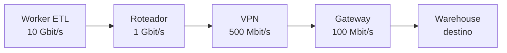

| Trecho | Capacidade |
|--------|------------|
| Worker → roteador | 10 Gbit/s |
| Roteador → VPN | 1 Gbit/s |
| VPN → gateway | 500 Mbit/s |
| Gateway → warehouse | **100 Mbit/s — gargalo** |

### 8.3 Exemplo prático de cálculo

```python
tamanho_gb = 10  # define o tamanho do arquivo Parquet que o pipeline precisa enviar, em gigabytes
banda_gbps = 1  # define a capacidade teórica do enlace, em gigabits por segundo
tamanho_gbits = tamanho_gb * 8  # converte gigabytes em gigabits, porque a banda é medida em bits
tempo_teorico_segundos = tamanho_gbits / banda_gbps  # calcula o tempo ideal, sem overhead, latência ou concorrência
print(tempo_teorico_segundos)  # exibe o tempo teórico aproximado da transferência
```

Esse cálculo é apenas uma estimativa. Em produção, ferramentas como `iperf3`, métricas do storage, logs do job e observabilidade cloud ajudam a medir o throughput real. A largura de banda informa o **limite de capacidade**; ela não garante que o pipeline atingirá esse valor.

### 8.4 Por que dividir bits por 8

Um **byte** é formado por **8 bits**. O bit é a menor unidade binária (`0` ou `1`); o byte é um grupo de 8 bits usado para representar um valor ou, frequentemente, um caractere. Por isso, dividir uma taxa em bits por segundo por 8 apenas converte a unidade:

```text
1 Gbit/s = 1.000.000.000 bits/s
1.000.000.000 bits/s ÷ 8 = 125.000.000 bytes/s
125.000.000 bytes/s = 125 MB/s
```

Redes costumam anunciar a capacidade em **bits por segundo** porque a comunicação física transmite uma sequência de bits e o setor de telecomunicações padronizou essa medida para enlaces. Aplicações, arquivos, memória e storage normalmente usam **bytes**, então um engenheiro de dados frequentemente converte a banda para estimar o tempo de transferência de um arquivo.

| Unidade | Significado | Uso comum |
|---------|-------------|-----------|
| **bit (b)** | `0` ou `1` | Transmissão de rede |
| **byte (B)** | 8 bits | Arquivos, memória e storage |
| **Mbit/s** | Milhões de bits por segundo | Velocidade anunciada de rede |
| **MB/s** | Milhões de bytes por segundo | Taxa observada em arquivos/storage |

A conversão por 8 não representa a velocidade real da aplicação. Depois dela ainda podem existir cabeçalhos, confirmações, retransmissões, criptografia, latência e gargalos. Por isso, um enlace de 1 Gbit/s oferece no máximo cerca de 125 MB/s teóricos, e o goodput de um pipeline tende a ser menor.

> **Dica para memorizar:** no envio de um arquivo de RH, largura de banda é o limite do canal; throughput é o que realmente passou; goodput é o que chegou como dado útil; latência é o tempo de espera. Um link de 1 Gbit/s pode entregar menos quando há gargalo, overhead ou concorrência.

---

## 9. Cabeamento de fibra óptica

### 9.1 Características da fibra

A fibra óptica transmite dados como **pulsos de luz**, geralmente infravermelha. Por não usar corrente elétrica para transportar os dados, ela é **imune a EMI** (interferência eletromagnética) e **RFI** (interferência de radiofrequência). Também apresenta baixa atenuação e alta capacidade de transmissão, sendo usada em backbones, WANs, FTTH e interconexões de alta velocidade (`05-cabeamentos-e-conexoes.md:114-118`).

| Alternativa | Está correta? | Motivo |
|-------------|---------------|--------|
| Não é afetado por EMI ou RFI | **Sim** | A fibra transmite pulsos de luz, não sinais elétricos |
| Cada par é envolvido em folha metálica | Não | Descreve blindagem de cabos metálicos, não fibra |
| Combina cancelamento, blindagem e torção | Não | Técnicas usadas em cabos de cobre, especialmente para reduzir interferência |
| Contém 4 pares de fios | Não | Essa é uma característica comum do UTP; fibra usa núcleo, casca e revestimento |
| É mais barato que UTP | Não | Em geral, fibra e seus componentes têm custo maior que UTP |

| Característica | Fibra óptica | Cobre/UTP |
|----------------|--------------|-----------|
| Sinal | Pulsos de luz | Pulsos elétricos |
| Interferência EMI/RFI | Imune | Suscetível |
| Capacidade e distância | Muito altas, especialmente em longas distâncias | Menores e limitadas pela atenuação/interferência |
| Estrutura | Núcleo, casca e revestimento | Pares de fios de cobre trançados |
| Uso comum | Backbone, WAN, FTTH e links de alta velocidade | LANs e conexões de menor distância |

**Glossário de siglas:**

| Sigla | Nome completo | Significado |
|-------|---------------|-------------|
| **EMI** | *Electromagnetic Interference* | Interferência eletromagnética que pode distorcer sinais elétricos |
| **RFI** | *Radio-Frequency Interference* | Interferência de radiofrequência que pode afetar sinais em cabos de cobre |
| **UTP** | *Unshielded Twisted Pair* | Par trançado não blindado, comum em redes LAN |
| **FTTH** | *Fiber To The Home* | Fibra óptica instalada até a residência ou pequeno escritório |
| **LAN** | *Local Area Network* | Rede local em uma área geográfica limitada |
| **WAN** | *Wide Area Network* | Rede de longa distância que interliga redes locais |

**Exemplo prático (Linux `ethtool`)** — verificar se uma interface está usando uma porta óptica:

```bash
sudo ethtool eth0  # exibe as características físicas e a velocidade negociada pela interface eth0
```

Na saída, procure campos como `Port: FIBRE` e `Speed: 10000Mb/s`. O comando apenas identifica a interface e o link; ele não transforma um cabo UTP em fibra.

### 9.2 Exemplo no contexto de dados

Um link de fibra entre o cluster de processamento e o storage pode transportar grandes volumes de dados com alta taxa de bits e sem sofrer interferência de motores, lâmpadas ou cabos elétricos próximos. Isso é útil para pipelines que movimentam grandes tabelas, arquivos Parquet ou dados entre regiões e datacenters.

### 9.3 Especificações físicas de redes sem fio

As especificações da camada física wireless definem como os bits serão transformados em sinais de rádio. Elas abrangem a **codificação do sinal**, frequência, potência de transmissão, requisitos de recepção/decodificação e projeto da antena (`05-cabeamentos-e-conexoes.md:224-226`).

| Função | Camada responsável | Exemplo |
|--------|--------------------|---------|
| Codificar bits em sinal de rádio | Física | Modulação e frequência do Wi-Fi |
| Identificar a interface no enlace | Enlace | Endereço MAC |
| Identificar a rede/dispositivo | Rede | Endereço IP |
| Escolher o caminho dos pacotes | Rede | Roteamento IP |
| Controlar acesso ao meio compartilhado | Enlace | CSMA/CA no Wi-Fi |

**Exemplo prático (Linux `iw`)** — consultar informações físicas da interface wireless:

```bash
iw phy  # mostra os recursos físicos da rádio Wi-Fi, como bandas, frequências e taxas suportadas
```

O comando ajuda a observar a camada física; ele não mostra a rota IP nem substitui a configuração de endereços MAC/IP.

### 9.4 Categorias de cabo UTP e taxa de transmissão

A **Categoria 8** é a que oferece suporte a até **40 Gbit/s**, conforme a aula 05 (`05-cabeamentos-e-conexoes.md:88-94`). A categoria indica a capacidade de transmissão prevista pelo padrão do cabo, mas a taxa realmente alcançada também depende das interfaces, conectores, distância, instalação e equipamentos nas duas pontas.

| Categoria UTP | Uso ou capacidade citada na aula |
|---------------|-----------------------------------|
| Categoria 3 | Originalmente comunicação de voz |
| Categoria 5 | Até 100 Mbit/s |
| Categoria 5E | Até 1 Gbit/s |
| Categoria 6 | Até 10 Gbit/s |
| Categoria 7 | Até 10 Gbit/s |
| **Categoria 8** | **Até 40 Gbit/s** |

**Exemplo prático (Linux `ethtool`)** — verificar a velocidade negociada pela interface:

```bash
sudo ethtool eth0  # mostra a velocidade que a placa e o equipamento do outro lado negociaram na interface eth0
```

Esse comando mostra a velocidade do link atual, mas não identifica sozinho a categoria física do cabo. Para confirmar a categoria, é necessário consultar a marcação do cabo, a documentação ou testar a instalação com equipamentos compatíveis.

### 9.5 Acesso ao canal no Wi-Fi

O Wi-Fi, baseado no padrão **IEEE 802.11**, usa o **CSMA/CA** (*Carrier Sense Multiple Access with Collision Avoidance*) para controlar o acesso ao canal sem fio (`05-cabeamentos-e-conexoes.md:230-235`). Antes de transmitir, a NIC verifica se o canal está livre. Se o canal estiver ocupado, o dispositivo espera um tempo aleatório antes de tentar novamente. O objetivo é **evitar colisões**, porque vários dispositivos compartilham o mesmo meio sem fio.

| Protocolo | Expansão | Uso principal |
|-----------|----------|---------------|
| **CSMA/CA** | *Carrier Sense Multiple Access with Collision Avoidance* | Wi-Fi; evita colisões em meio sem fio |
| **CSMA/CD** | *Carrier Sense Multiple Access with Collision Detection* | Ethernet antigo compartilhado; detectava colisões |
| **TDMA** | *Time Division Multiple Access* | Divide o acesso em intervalos de tempo |
| **GSM** | *Global System for Mobile Communications* | Padrão de comunicação celular |
| **CDMA** | *Code Division Multiple Access* | Separa transmissões por códigos diferentes |

**Exemplo prático (Linux `iw`)** — consultar informações da interface Wi-Fi:

```bash
iw dev wlan0 info  # mostra detalhes da interface wireless, que usa o mecanismo de acesso definido pelo padrão Wi-Fi
```

O comando consulta a interface, mas a espera pelo canal e a prevenção de colisões são executadas pela combinação da NIC, do driver e do padrão IEEE 802.11.

### 9.6 Cabo crossover entre roteadores sem Auto-MDIX

Dois roteadores são dispositivos do mesmo tipo. Em portas Fast Ethernet antigas, a porta de um roteador transmite por um par de pinos e recebe por outro. Para conectar dois dispositivos do mesmo tipo, o cabo precisa cruzar os pares de transmissão e recepção. Por isso, quando os roteadores **não possuem Auto-MDIX**, uma ponta deve seguir a norma **EIA/TIA-568A** e a outra deve seguir a norma **EIA/TIA-568B**. A resposta correta da questão é a terceira alternativa (`05-cabeamentos-e-conexoes.md:99-105`).

| Situação | Cabo esperado sem Auto-MDIX |
|----------|-----------------------------|
| PC → switch | Direto: mesma norma nas duas pontas |
| Switch → roteador | Direto: mesma norma nas duas pontas |
| Roteador → roteador | **Crossover: uma ponta 568A e outra 568B** |
| PC → PC | Crossover: uma ponta 568A e outra 568B |

Em Fast Ethernet, os pinos 1 e 2 formam um par de transmissão e os pinos 3 e 6 formam um par de recepção. Um cabo direto conecta transmissão com transmissão e recepção com recepção quando dois dispositivos iguais são ligados. O cabo crossover troca esses pares, conectando transmissão de um roteador à recepção do outro.

| Pino usado em Fast Ethernet | Ponta T568A | Ponta T568B |
|-----------------------------|-------------|-------------|
| 1 | Branco/verde — transmissão | Branco/laranja — recepção |
| 2 | Verde — transmissão | Laranja — recepção |
| 3 | Branco/laranja — recepção | Branco/verde — transmissão |
| 6 | Laranja — recepção | Verde — transmissão |

**Glossário de siglas:**

| Sigla | Nome completo | Significado |
|-------|---------------|-------------|
| **EIA** | *Electronic Industries Alliance* | Organização associada a padrões de cabeamento e conectores |
| **TIA** | *Telecommunications Industry Association* | Organização que participa da definição de padrões de telecomunicações e cabeamento |
| **MDIX** | *Medium-Dependent Interface Crossover* | Função que identifica/adapta automaticamente os pares de transmissão e recepção |
| **Auto-MDIX** | *Automatic Medium-Dependent Interface Crossover* | Recurso que permite usar cabo direto ou crossover sem montagem manual específica |
| **Cat5E** | *Category 5 Enhanced* | Categoria de cabo UTP com suporte citado de até 1 Gbit/s |
| **Cat6** | *Category 6* | Categoria de cabo UTP com suporte citado de até 10 Gbit/s |

**Exemplo prático (Linux `ethtool`)** — verificar se o enlace negociou conexão:

```bash
sudo ethtool eth0  # mostra se a interface detectou o cabo e qual velocidade foi negociada
```

Se os roteadores não tiverem Auto-MDIX e o cabo estiver montado incorretamente, normalmente o link não sobe. O problema não é resolvido escolhendo Cat5E ou Cat6: a categoria define desempenho, enquanto 568A/568B define a ordem dos fios e o cruzamento dos pares.

---

## 10. Camada de enlace de dados (Data Link Layer)

### 10.1 Propósito e papel na pilha OSI/TCP-IP

A **camada de enlace de dados** (camada 2 do modelo OSI ou parte da camada de Acesso à Rede do TCP/IP) prepara os pacotes da camada de rede (IP) para serem transmitidos pela mídia física (cabo elétrico, fibra óptica ou ondas de rádio no Wi-Fi).

Sua principal função é **abstrair o meio físico** para as camadas superiores: a camada IP não precisa saber se o dado vai trafegar por fibra, cabo de cobre UTP ou Wi-Fi. A camada de enlace aceita o pacote IP (camada 3), adiciona o cabeçalho de enlace (com o endereço MAC do próximo nó) e um trailer de verificação de erros (CRC), gerando a PDU chamada **quadro (frame)**. Na recepção, ela lê o quadro, valida se houve corrupção pelo CRC (descartando se houver erro) e entrega o pacote desencapsulado para a camada de rede.

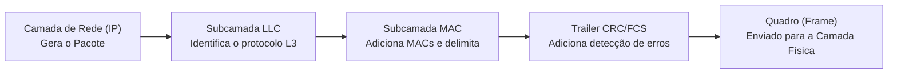

### 10.2 As duas subcamadas (LLC e MAC)

Padrões como o IEEE 802 dividem a camada de enlace de dados em duas subcamadas bem definidas:

| Subcamada | Nome Completo | Papel e Responsabilidades |
|-----------|---------------|---------------------------|
| **LLC** | *Logical Link Control* | Faz a ponte com as camadas superiores em software. Insere no quadro a informação de qual protocolo de camada 3 (IPv4, IPv6) está sendo transportado. |
| **MAC** | *Media Access Control* | Gerencia a Placa de Interface de Rede (NIC) e o hardware. Cuida do encapsulamento (delimitadores, endereçamento físico MAC) e do controle de acesso ao meio físico compartilhado. |

### 10.3 Estrutura do quadro (Frame)

Diferente de todas as outras camadas que adicionam apenas um cabeçalho no início da PDU, a camada de enlace adiciona um **cabeçalho (Header)** no início e um **trailer** no final do pacote IP:

```text
+---------------------+-------------------+-------------------+-------------------+-------------------+
| Cabeçalho Enlace    | Cabeçalho IP      | Cabeçalho TCP     | Dados Aplicação   | Trailer Enlace    |
| (MAC Origem/Destino)| (IP Origem/Destino)| (Portas Orig/Dest)| (Mensagem HTTP)   | (CRC / FCS)       |
+---------------------+-------------------+-------------------+-------------------+-------------------+
|<--------------------------------------- QUADRO (FRAME) ------------------------------------------>|
```

- **Delimitação de quadro**: Marcadores binários que indicam início e fim do quadro para sincronizar transmissor e receptor.
- **Endereçamento local (MAC)**: Indica a NIC de origem e a NIC de destino na mesma rede local/enlace.
- **Detecção de erros (CRC)**: Cálculo matemático no trailer. Se os bits forem alterados pelo ruído no cabo/ar, o receptor detecta a divergência e descarta o quadro imediatamente.

### 10.4 Modos de comunicação e controle de acesso ao meio

Em redes multiacesso (vários computadores disputando a mesma mídia), o meio precisa de regras para evitar interferência ou colisões:

| Conceito / Método | Como funciona passo a passo | Exemplo prático / Tecnologia |
|-------------------|----------------------------|------------------------------|
| **Half-Duplex** | Um dispositivo transmite de cada vez. Transmite e recebe, mas **nunca simultaneamente**. | Hubs Ethernet antigos, redes Wi-Fi (802.11) |
| **Full-Duplex** | Transmite e recebe **simultaneamente** sem colisões. A mídia fica disponível a todo momento. | Switches Ethernet modernos em cabo UTP/Fibra |
| **CSMA/CD** (*Collision Detection*) | Dispositivo "escuta" a rede. Se estiver livre, transmite. Se dois transmitirem juntos, ocorre colisão (alteração na voltagem); ambos detectam, cancelam e esperam um tempo aleatório antes de retransmitir. | Ethernet em barramento/hub (meio com fio legado) |
| **CSMA/CA** (*Collision Avoidance*) | Dispositivo "escuta" o meio sem fio. Como não consegue detectar colisão no ar, ele envia a duração desejada da transmissão. Outros dispositivos aguardam esse tempo acabar antes de tentar enviar. | Wi-Fi residencial/corporativo (meio sem fio) |
| **Acesso Controlado** | Cada nó espera estritamente a sua vez em uma fila/token determinístico para transmitir. | Token Ring / FDDI (legados) |

#### 10.4.1 O porquê do tempo aleatório (Exponential Backoff)

- **Quebrar a sincronia**: Se duas placas de rede colidissem e aguardassem um tempo fixo (ex.: exatamente 10 ms), ambas tentariam retransmitir no exato mesmo milissegundo, gerando um **loop infinito de colisões**.
- **Descongestionamento adaptativo**: O algoritmo escolhe um tempo aleatório em um intervalo. A cada colisão consecutiva, o limite máximo desse intervalo **dobra** (*Exponential Backoff*).
- **Relação com Cibersegurança**: O tempo aleatório não tem a ver com criptografia ou autenticação, mas evita um estado de **Negação de Serviço (DoS) não intencional** que travaria a rede local.

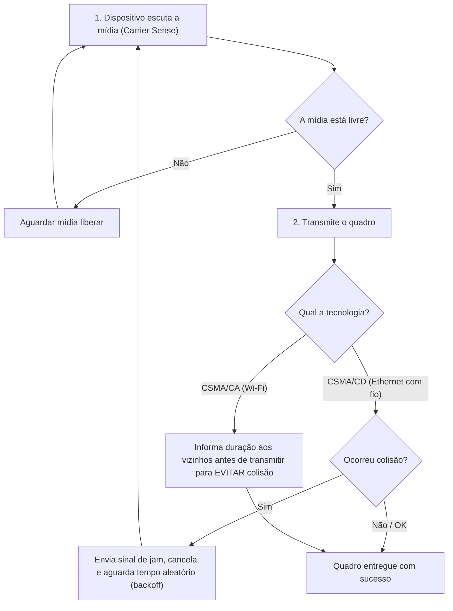

### 10.5 Transição de quadros a cada salto (Hop-by-Hop)

Enquanto o **endereço IP de destino permanece o mesmo** do cliente até o servidor final em toda a Internet, o **quadro da camada de enlace é destruído e recriado a cada roteador** pelo caminho:

1. O Roteador A recebe o quadro Ethernet do cabo local na interface de entrada.
2. O Roteador A desencapsula o quadro, descartando os cabeçalhos de enlace do trecho anterior.
3. O Roteador A lê o pacote IP (Camada 3) e consulta sua tabela de rotas para decidir a interface de saída.
4. O Roteador A encapsula o mesmo pacote IP em um **novo quadro** com o endereço MAC de saída e o MAC da interface do Roteador B (próximo salto).

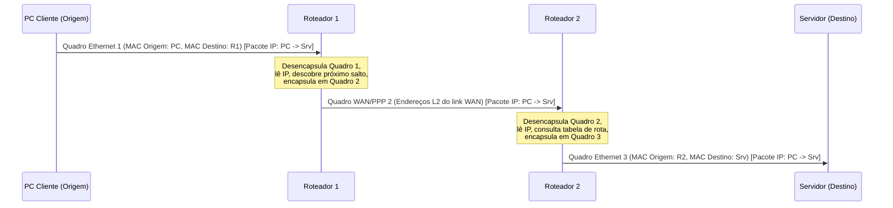

### 10.6 Topologias físicas e lógicas

- **Topologia Física**: Refere-se à disposição física de cabos, placas e equipamentos na rede.
- **Topologia Lógica**: Refere-se à forma como os quadros trafegam internamente de nó para nó pela camada de enlace.

| Topologia Física | Definição e Funcionamento |
| :--- | :--- |
| **Estrela (*Star*)** | Todos os dispositivos finais se conectam diretamente a um único dispositivo intermediário central (switch). |
| **Estrela Estendida (*Extended Star*)** | Os dispositivos finais se conectam a um dispositivo intermediário central (switch de acesso), que por sua vez se conecta a outro dispositivo intermediário central (switch core/distribuição). |
| **Barramento (*Bus*)** | Todos os sistemas finais são encadeados em um cabo compartilhado (coaxial) com terminadores nas pontas. |
| **Anel (*Ring*)** | Os dispositivos são conectados em formato de círculo/anel com seus vizinhos diretos (Token Ring). |
| **Ponto a Ponto** | Conexão direta e exclusiva entre apenas dois endpoints. |
| **Hub-and-Spoke** | Topologia WAN em estrela onde um site central conecta várias filiais (filiais não se falam diretamente sem passar pelo centro). |
| **Malha (*Mesh*)** | Todos os nós se conectam a todos os outros (alta disponibilidade e alto custo). |

### 10.7 Glossário de siglas da camada de enlace

| Sigla | Termo em Inglês | Significado e Explicação |
|-------|-----------------|--------------------------|
| **LLC** | *Logical Link Control* | Subcamada de controle de enlace lógico (padrão IEEE 802.2). |
| **MAC** | *Media Access Control* | Subcamada de controle de acesso ao meio e endereço físico gravado na placa de rede. |
| **NIC** | *Network Interface Card* | Placa de interface de rede (física ou virtual) onde habita o endereço MAC. |
| **CRC** | *Cyclic Redundancy Check* | Checagem de redundância cíclica usada no trailer do quadro para detectar corrupção de bits. |
| **FCS** | *Frame Check Sequence* | Sequência de verificação de quadro, o campo do trailer onde o valor do CRC é armazenado. |
| **CSMA/CD** | *Carrier Sense Multiple Access with Collision Detection* | Protocolo de acesso ao meio com detecção de colisão usado em redes Ethernet half-duplex. |
| **CSMA/CA** | *Carrier Sense Multiple Access with Collision Avoidance* | Protocolo de acesso ao meio com prevenção de colisão usado em Wi-Fi (IEEE 802.11). |
| **PPP** | *Point-to-Point Protocol* | Protocolo de enlace camada 2 para links diretos de longa distância (WAN). |
| **HDLC** | *High-Level Data Link Control* | Protocolo síncrono de camada de enlace para conexões ponto a ponto WAN. |

#### 10.7.1 Análise de questão ENADE 2017 (Padrões IEEE 802.3 vs 802.11)

- **IEEE 802.3 (Ethernet)**: Padroniza redes locais cabeadas e utiliza o método de acesso ao meio **CSMA/CD** (*Collision Detection*).
- **IEEE 802.11 (Wi-Fi)**: Padroniza redes locais sem fio e utiliza o método de acesso ao meio **CSMA/CA** (*Collision Avoidance*).
- **Frequências do Wi-Fi**: 802.11a opera em 5 GHz; 802.11b e 802.11g operam em 2.4 GHz (não usam a mesma frequência).
- **Coexistência**: Padrões 802.3 e 802.11 coexistem na mesma rede local em harmonia (ex.: um notebook Wi-Fi acessando um servidor via cabo Ethernet).

### 10.8 Exemplo real em engenharia de dados

Imagine um pipeline de dados em engenharia de dados onde um worker Python em container Kubernetes extrai um grande volume de dados de uma API e insere no PostgreSQL/BigQuery:

1. Quando seu job Python faz um `INSERT` em lote com 50.000 registros, ele gera bytes no nível da aplicação.
2. O sistema operacional agrupa esses bytes em **segmentos TCP** e **pacotes IP** destinados ao banco (`10.30.0.10`).
3. Ao enviar para a placa de rede da máquina virtual, a **camada de enlace** adiciona o cabeçalho Ethernet com o endereço MAC da interface da VM e o MAC do switch/gateway virtual do cluster.
4. Se o cabo ou a rede virtual sofresse ruído e alterasse um bit dos dados transmitidos, o cálculo de **CRC** na camada de enlace do destino falharia e o quadro corrompido seria **descartado imediatamente pelo hardware da placa de rede**, sem deixar chegar dado truncado ao seu banco.

### 10.9 Exemplo de código em Terraform (Infraestrutura de Rede e Interfaces L2/L3)

O exemplo abaixo em Terraform demonstra a criação de uma interface de rede virtual (vNIC) onde a camada de enlace opera, associando o endereço MAC virtual à máquina do worker de dados:

```hcl
# Declara a criação de uma interface de rede virtual (vNIC - Camada 2 / Enlace) no Google Cloud
resource "google_compute_instance" "worker_dados" {
  name         = "worker-etl-pipeline"                  # Define o nome da máquina virtual que rodará o pipeline de dados
  machine_type = "e2-standard-4"                        # Especifica o porte do hardware virtual (4 vCPUs e 16 GB de RAM)
  zone         = "us-central1-a"                        # Define a zona física do data center onde a instância será provisionada

  boot_disk {                                           # Bloco de configuração do disco de inicialização do sistema operacional
    initialize_params {                                 # Define os parâmetros de criação do disco boot
      image = "debian-cloud/debian-11"                  # Define a imagem do sistema operacional Linux Debian 11
    }                                                   # Fecha o bloco de parâmetros do disco
  }                                                     # Fecha o bloco de configuração do boot_disk

  network_interface {                                   # Bloco que cria a vNIC (Interface de Rede / Camada de Enlace / MAC virtual)
    network    = "default"                              # Associa a interface de rede à VPC padrão do projeto
    subnetwork = "default"                              # Associa a interface à sub-rede padrão da região escolhida
    # A plataforma Cloud atribui automaticamente um Endereço MAC (Camada 2) e um IP privado (Camada 3) a esta vNIC
  }                                                     # Fecha o bloco da interface de rede
}                                                       # Fecha a declaração do recurso de instância computacional
```

**Verificação no terminal Linux (Bash)** — inspecionar a camada de enlace (endereços MAC, estatísticas de CRC/erros) na placa de rede do worker:

```bash
# Exibe todas as interfaces de rede com seus endereços MAC (link/ether) e estado da camada de enlace
ip link show

# Exibe estatísticas detalhadas de transmissão/recepção, incluindo quadros descartados (dropped) e erros de CRC
ip -s link show eth0
```

---

## 11. Endereçamento CIDR, Sub-redes e Roteamento em Cloud

### 11.1 Conceito de CIDR e Cálculo de Hosts
O roteamento inter-domínios sem classe (CIDR - *Classless Inter-Domain Routing*) substituiu o antigo sistema de classes fixas (A, B, C), permitindo alocar blocos IP com tamanhos flexíveis definidos por um prefixo (ex: `/20`).
- O número após a barra indica quantos bits pertencem à **rede**.
- O restante ($32 - \text{prefixo}$) pertence aos **hosts**.
- O total de endereços IP é $2^{\text{bits de host}}$. Destes, 2 são reservados (o primeiro é o endereço de rede e o último é o broadcast), restando $2^{\text{bits de host}} - 2$ endereços utilizáveis para máquinas/instâncias.

### 11.2 Identificação de Broadcast e Gateway
- **Endereço de rede:** Todos os bits de host zerados (`0`).
- **Endereço de broadcast:** Todos os bits de host em um (`1`).
- **Encaminhamento inter-redes:** Se o destino IP pertence a outra sub-rede (verificado aplicando a máscara de sub-rede), o pacote obrigatoriamente é encaminhado ao roteador (gateway padrão) através do MAC do roteador, e não via ARP direto para o host destino.

### 11.3 Glossário de siglas:
| Sigla | Nome completo | Significado |
|-------|---------------|-------------|
| **CIDR** | *Classless Inter-Domain Routing* | Roteamento inter-domínios sem classe, baseado em prefixos de sub-rede |
| **VPC** | *Virtual Private Cloud* | Nuvem privada virtual que isola recursos de rede na nuvem |

### 11.4 Exemplo com código (Python) — Validar se um IP pertence a uma VPC CIDR
```python
import ipaddress  # Importa a biblioteca padrão do Python para manipulação de endereços IP e redes CIDR

# Define o bloco CIDR da VPC corporativa onde rodam os pipelines de dados e clusters Spark
bloco_vpc = ipaddress.ip_network("10.200.64.0/20", strict=False)

# Define o endereço IP de um worker ou banco de dados que queremos testar
ip_alvo = ipaddress.ip_address("10.200.79.255")

# Verifica se o IP alvo está dentro do intervalo da VPC (True ou False)
pertence = ip_alvo in bloco_vpc

# Exibe o resultado da validação no console
print(f"O IP {ip_alvo} pertence à VPC {bloco_vpc}? {pertence}")
```

---

## 12. Resumão rápido (colinha final)

### 12.1 Perguntas essenciais

| Pergunta | Resposta |
|----------|----------|
| Requisitos de rede confiável? | Tolerância a falhas, Escalabilidade, QoS, Segurança |
| Qual lida com acesso não autorizado? | Segurança (tríade CIA) |
| Qual prioriza tráfego? | QoS |
| Alta disponibilidade se alcança com? | Redundância |
| Quem fornece acesso à Internet? | ISPs |
| Roteamento no TCP/IP / OSI? | Internet / Rede (3) |
| PDU da camada 4 / 3 / 2? | Segmento / Pacote / Quadro |
| Quadro recebe qual endereço? | MAC (enlace) |
| Segmento recebe qual endereço? | Porta (transporte) |
| Pacote recebe quais endereços? | IP de origem e destino (rede) |
| Característica importante da fibra? | Imunidade a EMI/RFI e transmissão por pulsos de luz |
| O que é largura de banda? | Capacidade máxima do meio de transportar dados por tempo |

