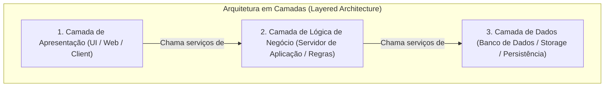
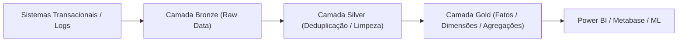
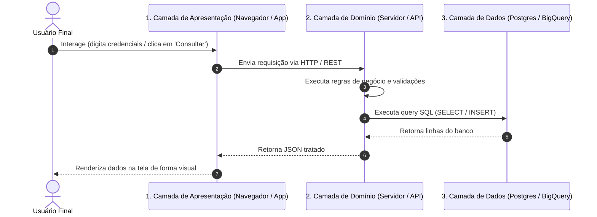
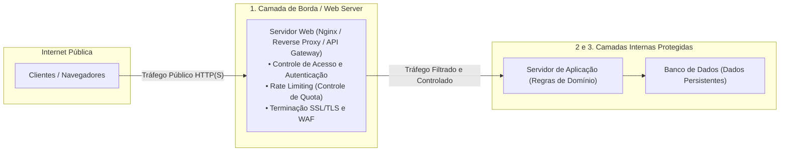
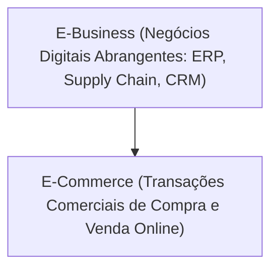

# Aprendizados — Fundamentos de Computação em Nuvem

👋 Bem-vindo ao teu caderno de revisão de **Fundamentos de Computação em Nuvem**! Aqui ficam registrados, de forma resumida, estruturada e visual, os conceitos aprendidos nas aulas para servir como material de revisão ágil e preparação para provas.

---

## Glossário de Siglas

| Sigla | Termo em Inglês | Significado / Tradução no Contexto |
|---|---|---|
| **ACL** | Access Control List | Lista de Controle de Acesso; regras que definem quem pode acessar determinado recurso |
| **API** | Application Programming Interface | Interface de Programação de Aplicações; contrato de comunicação entre camadas ou serviços |
| **B2B** | Business to Business | Negócios realizados eletronicamente de empresa para empresa (ex.: Cloud Providers vendendo para empresas) |
| **B2C** | Business to Consumer | Negócios eletrônicos de empresa para o consumidor final (ex.: lojas virtuais) |
| **C2C** | Consumer to Consumer | Negócios eletrônicos entre pessoas físicas (ex.: Marketplaces como Mercado Livre) |
| **CDN** | Content Delivery Network | Rede de Distribuição de Conteúdo; servidores distribuídos para entrega rápida de estáticos |
| **DMZ** | Demilitarized Zone | Zona Desmilitarizada; sub-rede de borda exposta à internet para filtragem antes da rede interna |
| **EDI** | Electronic Data Interchange | Intercâmbio Eletrônico de Dados; padronização de documentos entre sistemas de diferentes empresas |
| **EFT** | Electronic Funds Transfer | Transferência Eletrônica de Fundos; movimentação digital de dinheiro entre contas |
| **e-Gov** | Electronic Government | Governo Eletrônico; serviços públicos digitais prestados pelo Estado aos cidadãos e empresas |
| **ERP** | Enterprise Resource Planning | Planejamento dos Recursos da Empresa; sistema integrado de gestão corporativa |
| **FTP** | File Transfer Protocol | Protocolo de Transferência de Arquivos na camada de aplicação |
| **HTTP** | Hypertext Transfer Protocol | Protocolo de Transferência de Hipertexto; base da comunicação web |
| **HTTPS** | Hypertext Transfer Protocol Secure | Versão segura e criptografada do protocolo HTTP |
| **IaaS** | Infrastructure as a Service | Infraestrutura como Serviço (computação, rede e storage brutos) |
| **IP** | Internet Protocol | Protocolo de Internet; endereçamento e roteamento de pacotes |
| **PaaS** | Platform as a Service | Plataforma como Serviço (ambiente pronto para deploy e execução de código) |
| **RDBMS** | Relational Database Management System | Sistema Gerenciador de Banco de Dados Relacional |
| **SaaS** | Software as a Service | Software como Serviço (aplicação final entregue ao usuário pela nuvem) |
| **SLA** | Service Level Agreement | Acordo de Nível de Serviço |
| **SSH** | Secure Shell | Protocolo de comunicação segura via terminal remoto |
| **SSL** | Secure Sockets Layer | Protocolo de segurança criptográfica (antecessor do TLS) |
| **TCP** | Transmission Control Protocol | Protocolo de Controle de Transmissão com garantia de entrega |
| **TLS** | Transport Layer Security | Protocolo de Segurança na Camada de Transporte (sucessor do SSL) |
| **UI** | User Interface | Interface do Usuário (camada de apresentação visual) |
| **WAF** | Web Application Firewall | Firewall de Aplicação Web; inspeciona tráfego HTTP na camada de borda |

---

## 1. Arquitetura de Software e o Modelo em Camadas

### 1.1 O Conceito de Arquitetura em Camadas
A arquitetura em camadas decompõe um sistema complexo em partes menores e organizadas hierarquicamente. Cada camada possui uma responsabilidade bem definida e se comunica apenas com as camadas vizinhas imediatas: a camada superior consome os serviços da camada imediatamente inferior, ocultando os detalhes internos de implementação.



### 1.2 Benefícios da Arquitetura em Camadas
De acordo com Martin Fowler (2007), os principais benefícios observados na abordagem em camadas são:

1. **Baixa Dependência e Baixo Acoplamento**: Uma camada pode ser totalmente reconstruída ou substituída por outra tecnologia sem a necessidade de reconstruir as demais, desde que a interface pública (contrato) seja mantida.
2. **Abstração e Compreensão Isolada**: É possível compreender e manter uma camada como um todo coerente sem precisar dominar as tecnologias internas das outras camadas (ex.: criar um serviço HTTP sem precisar saber como o cabo de rede ou driver de placa funciona).
3. **Substituição e Intercambiabilidade**: Implementações alternativas de um mesmo serviço podem ser trocadas sem alterar as camadas clientes (ex.: trocar o banco Postgres por MySQL mantendo a mesma camada de negócio).
4. **Padronização**: Define pontos claros e padronizados de comunicação e contratos.
5. **Reusabilidade de Camadas Inferiores**: Uma camada de serviços ou de dados já construída pode atender a múltiplos clientes de camadas superiores simultaneamente (ex.: a mesma lógica de negócio atende app mobile, portal web e integrações de terceiros).

### 1.3 Regra do Acoplamento e Distanciamento entre Camadas
O distanciamento entre onde o cliente opera e onde os dados residem é fruto direto da regra fundamental da arquitetura em camadas:
- **A camada superior usa serviços da camada imediatamente inferior a ela**.
- **Camadas não vizinhas não se comunicam diretamente**: O cliente (camada de apresentação) não abre conexões diretas de banco de dados; toda a comunicação é intermediada obrigatoriamente pela camada de aplicação/domínio.

### 1.4 Comparativo: Evolução das Arquiteturas de Aplicação

| Modelo Arquitetural | Estrutura | Vantagens | Desvantagens / Gargalos |
|---|---|---|---|
| **Processamento em Lote (Batch)** | Execução sequencial de rotinas sem interação em tempo real | Alto volume de processamento de uma vez | Sem interatividade; atraso no feedback para o usuário |
| **Cliente-Servidor (2 Camadas)** | Cliente (UI + parte das regras) + Servidor de Banco de Dados | Simples para sistemas locais pequenos | Regras espalhadas no cliente (fat client); difícil manutenção e atualização de regras |
| **3 Camadas (Three-Tier)** | Apresentação (UI) $\rightarrow$ Servidor de Aplicações (Regras) $\rightarrow$ Banco de Dados | Regras de negócio centralizadas; cliente leve; segurança no acesso aos dados | Servidor de aplicação monolítico pode se tornar gargalo se mal dimensionado |
| **4 Camadas (Web Tier)** | Navegador $\rightarrow$ Servidor Web $\rightarrow$ Servidor de Aplicações $\rightarrow$ Banco de Dados | Centraliza a entrega da interface; uso de navegadores web universais | Dependência de latência de rede e configuração de servidores web |
| **Multicamadas (N-Tier / N Camadas)** | UI $\rightarrow$ Gateway/Web $\rightarrow$ Serviços Especializados $\rightarrow$ Caching $\rightarrow$ Persistência | Alta escalabilidade independente, alta resiliência, isolamento físico e lógico | Maior complexidade de rede, latência entre saltos e esforço de orquestração |

### 1.5 Ponto de Vista da Engenharia de Sistemas e Cloud
Do ponto de vista de um **arquiteto de soluções em nuvem**, a separação em camadas permite desacoplar os ciclos de vida e escalabilidade de cada componente:
- A camada de apresentação (front-end) escala horizontalmente por demanda de acessos via CDN e instâncias sem estado (*stateless*).
- A camada de lógica de aplicação pode escalar de forma elástica em containers ou funções serverless.
- A camada de dados pode ser protegida em sub-redes privadas sem acesso público, mantendo réplicas e backups isolados.
- Se uma equipe decide reescrever a camada de apresentação de Angular para React, ou migrar o backend de Java para Go, **nenhuma outra camada precisa ser descartada**, desde que os contratos de API sejam preservados.

### 1.6 Exemplo Real em Engenharia de Dados: A Arquitetura Medallion
Na engenharia de dados, o conceito de camadas é aplicado diretamente na **Arquitetura Medallion (Bronze $\rightarrow$ Silver $\rightarrow$ Gold)** e no desacoplamento entre armazenamento e processamento:



- **Mecanismo real**: A camada **Gold** serve as métricas para a diretoria. Se você precisar reescrever a lógica de ingestão na camada **Bronze** (trocando um script Python por um job Spark distribuído), a camada **Gold** e os dashboards dos usuários continuam funcionando sem alteração alguma, porque a camada intermediária e a final mantêm os esquemas e contratos estáveis.

### 1.7 Exemplo com Código (Terraform)
Declaração de infraestrutura em nuvem demonstrando o desacoplamento das camadas de banco/persistência e aplicação, permitindo substituir ou recriar a camada de aplicação sem tocar na camada de dados:

```hcl
# Definição da Camada 3: Banco de Dados Relacional (Persistência)
resource "google_sql_database_instance" "app_database" { # Declara a instância de banco de dados no Google Cloud
  name             = "production-db-instance"            # Nome identificador único da instância de banco
  database_version = "POSTGRES_15"                       # Especifica o motor e versão do banco de dados
  region           = "us-east1"                          # Define a região geográfica onde os dados ficarão armazenados

  settings {                                             # Inicia o bloco de configurações operacionais da instância
    tier = "db-custom-4-16384"                           # Define a capacidade de hardware do banco (4 vCPUs, 16 GB RAM)
  }                                                      # Fecha o bloco de configurações do banco
}                                                        # Fecha a declaração do recurso de banco de dados

# Definição da Camada 2: Aplicação Backend (Pode ser destruída/recriada de forma independente)
resource "google_cloud_run_v2_service" "app_backend" {   # Declara o serviço de backend que roda na camada de aplicação
  name     = "core-business-api"                         # Nome identificador do serviço de negócio
  location = "us-east1"                                  # Região onde os containers da aplicação serão executados

  template {                                             # Especifica o modelo de implantação dos containers
    containers {                                         # Abre a definição do container da aplicação
      image = "gcr.io/my-project/api-service:v2.1"       # Imagem do container com a lógica de negócio compilada
      env {                                              # Configura as variáveis de ambiente necessárias para a API
        name  = "DATABASE_HOST"                          # Nome da variável que aponta para a camada de dados
        value = google_sql_database_instance.app_database.ip_address.0.ip_address # Conecta dinamicamente na Camada 3 pelo IP
      }                                                  # Fecha o bloco da variável de ambiente
    }                                                    # Fecha o bloco de containers
  }                                                      # Fecha o template de execução
}                                                        # Fecha a declaração do serviço de backend
```

---

## 2. O Modelo de Três Camadas (Apresentação, Domínio e Dados)

### 2.1 Papel de Cada Camada e Ponto de Interação
No modelo clássico de três camadas (*Three-Tier Architecture*), as responsabilidades são estritamente particionadas:

1. **Camada de Apresentação (User Interface / UI)**: É a camada mais externa do sistema e o **único ponto onde o usuário final interage diretamente**. Ela é responsável por renderizar as telas, capturar cliques, comandos e preenchimento de formulários, enviando as requisições para a camada de domínio e exibindo as respostas formatadas.
2. **Camada de Domínio / Lógica de Negócio (Servidor de Aplicação)**: Centraliza as regras operacionais, validações de integridade, cálculos e permissões. Não interage com o usuário final diretamente; recebe comandos da camada de apresentação e decide quais dados buscar ou alterar.
3. **Camada de Fonte de Dados (Banco de Dados / Persistência)**: Armazena e recupera os dados persistentes (tabelas, índices, arquivos). É acessada exclusivamente pela camada de domínio, garantindo segurança e integridade transacional.



### 2.2 Tabela Comparativa das 3 Camadas

| Camada | Nome Alternativo | O que faz no sistema | Usuário final acessa direto? | Exemplo de tecnologia |
|---|---|---|:---:|---|
| **Apresentação** | Front-end / UI / Cliente | Renderiza interface visual e captura ações do usuário | **SIM (Único ponto de interação)** | React, Vue, HTML/CSS, Flutter, Streamlit |
| **Domínio** | Lógica de Negócio / Application Server | Valida regras de negócio, calcula métricas e processa comandos | **NÃO** (acessada pela Apresentação) | FastAPI, Node.js, Spring Boot, Go |
| **Fonte de Dados** | Persistência / RDBMS / Data Layer | Grava, indexa e mantém a durabilidade dos registros | **NÃO** (acessada apenas pelo Domínio) | PostgreSQL, BigQuery, MySQL, Cloud Storage |

### 2.3 Exemplo Real em Engenharia de Dados: Consumo de Métricas
Em uma plataforma analítica corporativa moderna:
- **Camada de Apresentação**: Um painel no **Metabase**, **Power BI** ou **Streamlit**, onde o analista de negócios clica em filtros de data e visualiza gráficos.
- **Camada de Domínio**: Uma API intermediária ou o motor de consulta semântica (**Trino / Cube.js**) que aplica regras de governança, restrições de linha por filial (*Row-Level Security*) e calcula KPIs.
- **Camada de Dados**: O **Data Warehouse / Lakehouse** (**BigQuery / Snowflake / Delta Lake**) onde as tabelas Silver e Gold residem particionadas.
- **Mecanismo**: O analista nunca digita comandos de conexão direta com os clusters de banco; ele interage apenas com a interface gráfica da camada de apresentação.

### 2.4 Exemplo com Código (HTML e JavaScript Frontend)
Trecho da camada de apresentação (front-end) demonstrando a captura da interação do usuário e o repasse para a camada de domínio via API:

```html
<!-- Camada de Apresentação: Interface onde o usuário final clica e digita -->
<!DOCTYPE html>                                                  <!-- Declaração do tipo de documento HTML5 -->
<html lang="pt-BR">                                              <!-- Início da página web configurada em português -->
<head>                                                           <!-- Cabeçalho com metadados da página -->
  <meta charset="UTF-8">                                         <!-- Codificação de caracteres padrão UTF-8 -->
  <title>Consulta de Pedidos</title>                             <!-- Título exibido na aba do navegador -->
</head>                                                          <!-- Fechamento do cabeçalho -->
<body>                                                           <!-- Início do corpo visual da página -->
  <h2>Consultar Status de Processamento</h2>                     <!-- Título visual da tela para o usuário -->
  <input type="text" id="pipelineId" placeholder="ID do Job">    <!-- Campo de texto onde o usuário digita a entrada -->
  <button id="btnConsultar">Consultar</button>                   <!-- Botão onde o usuário clica para interagir -->
  <p id="resultado"></p>                                         <!-- Parágrafo onde a resposta visual será exibida -->

  <script>                                                       <!-- Início do script JavaScript da camada de apresentação -->
    document.getElementById("btnConsultar").onclick = async () => { <!-- Escuta o evento de clique do usuário no botão -->
      const jobId = document.getElementById("pipelineId").value; <!-- Captura o valor digitado pelo usuário na tela -->
      const resposta = await fetch(`/api/v1/jobs/${jobId}`);      <!-- Envia a requisição para a Camada 2 (Domínio/API) -->
      const dados = await resposta.json();                       <!-- Converte a resposta recebida em formato JSON -->
      document.getElementById("resultado").innerText = dados.status; <!-- Renderiza o resultado na tela para o usuário ver -->
    };                                                           <!-- Fecha a função de clique -->
  </script>                                                      <!-- Fecha o script -->
</body>                                                          <!-- Fecha o corpo da página -->
</html>                                                          <!-- Fecha a estrutura HTML -->
```

---

## 3. A 4ª Camada e Modelos Multicamadas (N-Tier)

### 3.1 O Papel da 4ª Camada: Centralização e Padronização Web
Com a expansão da internet, o modelo tradicional de 3 camadas evoluiu para 4 camadas ao introduzir o **Servidor Web** (*Web Server*):
- **Retirada da Apresentação do Cliente**: No modelo de 2 e 3 camadas original, era necessário instalar um software cliente específico (*fat client*) em cada máquina da rede.
- **Padronização Universal**: Ao centralizar a entrega da interface no Servidor Web, a aplicação passa a ser acessada diretamente por **navegadores web padronizados** (Chrome, Firefox, Edge). Elimina-se o custo de desenvolver navegadores ou programas proprietários para cada cliente da rede.

### 3.2 A Camada de Servidor Web: Controle de Acesso e Proteção do Provedor
Nas arquiteturas corporativas e em nuvem, a camada de Servidor Web atua como a **borda de segurança (*perimeter/DMZ*)** e ponto de controle do provedor:



**Principais mecanismos de controle de acesso do Servidor Web:**
1. **Ponto Único de Entrada**: Impede que clientes externos acessem os servidores de aplicação ou o banco diretamente.
2. **Autenticação e Rate Limiting**: Valida tokens, certificados e aplica limites de requisição por segundo antes de acionar a lógica de negócio interna.
3. **Terminação TLS/SSL**: Descriptografa e inspeciona o tráfego seguro na borda, protegendo o backend contra ataques e sobrecarga.

### 3.3 Tabela Comparativa: Servidor Web vs. Servidor de Aplicação

| Atributo | Camada de Servidor Web (Web Server) | Camada de Servidor de Aplicação (App Server) |
|---|---|---|
| **Posição na Rede** | Borda pública / DMZ (*Edge*) | Rede privada interna (VPC / Subnet privada) |
| **Função Principal** | **Controle de acesso**, terminação SSL, roteamento e entrega de estáticos | Execução das regras de negócio, cálculos e lógica de domínio |
| **Acesso Externo** | Aberto para os clientes da internet | Acessível **apenas** pelo Servidor Web |
| **Foco de Gestão** | Controle de tráfego, segurança de perímetro e taxa de conexões | Transações de negócio e comunicação com o banco |

### 3.4 Exemplo Real em Engenharia de Dados: Ingress Controller e API Gateways
Em plataformas de engenharia de dados em nuvem:
- Ferramentas como o **Airflow Webserver**, **Metabase** ou APIs de ingestão de dados em streaming nunca são expostas abertamente na internet.
- Um **API Gateway / Nginx Ingress Controller** é colocado na frente (camada de servidor web) para realizar **controle de acesso**: autentica o usuário via Single Sign-On (SSO/OAuth), verifica quotas de envio e barra tráfego malicioso antes que ele atinja os workers de processamento ou o data warehouse.

### 3.5 Exemplo com Código (Configuração Nginx de Servidor Web)
Configuração prática de uma camada de Servidor Web (Nginx) aplicando controle de acesso e repasse para o servidor de aplicação interno:

```nginx
# Bloco de configuração da Camada de Servidor Web (Nginx)
http {                                                        # Abre o bloco de configurações HTTP globais
  limit_req_zone $binary_remote_addr zone=api_limit:10m rate=10r/s; # Cria zona de controle de acesso limitando taxa de requisições

  server {                                                    # Declara o servidor virtual da camada web
    listen 443 ssl;                                           # Ouve na porta 443 segura (HTTPS) exposta aos clientes
    server_name api.dataplatform.com;                         # Nome de domínio público acessado pelo cliente

    ssl_certificate /etc/ssl/certs/cert.pem;                  # Certificado para criptografar e autenticar a conexão
    ssl_certificate_key /etc/ssl/private/key.pem;             # Chave privada do certificado SSL

    location / {                                              # Define as regras de controle de acesso para as rotas
      allow 192.168.1.0/24;                                   # Permite apenas clientes de redes corporativas autorizadas
      deny all;                                               # Bloqueia qualquer outro cliente desconhecido da internet
      limit_req zone=api_limit burst=20 nodelay;              # Aplica o controle de taxa de requisições por cliente

      proxy_pass http://backend-application-server:8080;     # Repassa a requisição aprovada para a Camada de Aplicação interna
      proxy_set_header Host $host;                            # Preserva o cabeçalho original da requisição
      proxy_set_header X-Real-IP $remote_addr;                # Envia o IP real do cliente para auditoria no backend
    }                                                         # Fecha o bloco da rota
  }                                                           # Fecha o bloco do servidor
}                                                             # Fecha o bloco HTTP
```

---

## 4. Padrões de E-Business e Modelos de Comércio Eletrônico

### 4.1 Diferença entre E-Business e E-Commerce
- **E-Business (Conceito Amplo)**: Abrange toda e qualquer atividade e processo de negócios mediado por meios eletrônicos (integração de cadeia de suprimentos, ERPs, CRM, automação interna de processos, colaboração entre parceiros). Não se restringe à venda de produtos.
- **E-Commerce (Subconjunto do E-Business)**: Foca especificamente nas **transações comerciais de compra e venda** de produtos e serviços realizadas via internet.



### 4.2 Modelos de Negócio Eletrônico: B2B, B2C, C2C e E-Gov

| Modelo | Significado | Participantes | Exemplo do Mundo Real | Relação com Cloud Computing |
|---|---|---|---|---|
| **B2B** | *Business to Business* | Empresa $\leftrightarrow$ Empresa | Provedores Cloud (AWS, GCP, Snowflake) vendendo infraestrutura para empresas | **Principal caso de uso da Nuvem**: Serviços IaaS, PaaS e SaaS corporativos consumidos via web por empresas de todos os ramos |
| **B2C** | *Business to Consumer* | Empresa $\leftrightarrow$ Consumidor Final | Amazon, Magazine Luiza, Netflix | Aplicações hospedadas na nuvem para atender milhões de clientes pessoa física |
| **C2C** | *Consumer to Consumer* | Pessoa Física $\leftrightarrow$ Pessoa Física | Mercado Livre, OLX, eBay | Marketplaces em nuvem que fornecem o ambiente para pessoas físicas negociarem |
| **e-Gov** | *Electronic Government* | Governo $\leftrightarrow$ Cidadão / Empresa | Receitanet, ConecteSUS, Portal Gov.br | Serviços públicos digitalizados hospedados em infraestrutura de nuvem pública/híbrida |

### 4.3 Por que a Computação em Nuvem é o Maior Exemplo de B2B?
A computação em nuvem é essencialmente um ecossistema **B2B (Business to Business)** porque:
1. **Ofertados e Consumidos em Ambiente Web**: Grandes provedores de tecnologia (empresas fornecedoras) disponibilizam recursos de computação, armazenamento, redes e plataformas via web para outras empresas contratantes.
2. **Aplicações Multissetoriais**: Empresas de todos os ramos da economia (bancos, varejistas, hospitais, operadoras de telecomunicação, indústrias) utilizam serviços de nuvem corporativos para sustentar suas operações e construir seus próprios produtos digitais.
3. **Cadeia de Suprimento Digital**: O modelo B2B cloud acelera o provisionamento de recursos tecnológicos, eliminando compras lentas de hardware físico (*supply chain* tradicional) e substituindo por contratação de serviços sob demanda.

### 4.4 Padrões de Execução e Integração (EDI e EFT)
Para que transações B2B ocorram com segurança e sem intervenção humana manual:
- **EDI (Electronic Data Interchange)**: Padronização do intercâmbio de dados e documentos (pedidos, notas fiscais, faturas) entre os sistemas ERP de duas empresas parceiras.
- **EFT (Electronic Funds Transfer)**: Padronização da liquidação e transferência financeira eletrônica entre instituições financeiras e empresas.

### 4.5 Exemplo Real em Engenharia de Dados: Ingestão e Compartilhamento B2B
Em plataformas de engenharia de dados, transações B2B em nuvem são vistas diariamente:
- **Data Sharing B2B (Snowflake Marketplace / BigQuery Analytics Hub)**: Uma empresa fornecedora de dados de crédito (ex.: Serasa) compartilha tabelas Gold via nuvem diretamente com o data warehouse de bancos parceiros, sem troca manual de arquivos.
- **APIs de Ingestão B2B**: Pipelines que recebem streams de dados de vendas de parceiros de marketplace em formato JSON padronizado via API protegida por chaves de serviço corporativas (*Service Accounts*).

### 4.6 Exemplo com Código (API B2B com Autenticação de Empresa Parceira)
Exemplo prático de uma API em **Python/FastAPI** consumida por outra empresa (B2B) para envio de dados de inventário:

```python
from fastapi import FastAPI, Header, HTTPException, status # Importa classes do framework web FastAPI para construir APIs

app = FastAPI(title="B2B Supply Chain Ingestion API")      # Inicializa a aplicação FastAPI com título corporativo

VALID_PARTNER_API_KEYS = {                                # Dicionário simulando chaves de acesso de empresas clientes (B2B)
    "partner-corp-key-123": "Empresa Logistica Alfa S.A.", # Mapeia a chave de API para a razão social da empresa parceira
    "partner-corp-key-456": "Varejista Beta Ltda."        # Mapeia outra empresa autorizada
}                                                          # Fecha o dicionário de parceiros autorizados

@app.post("/api/v1/b2b/inventory/sync")                    # Rota HTTP POST para sincronização de dados B2B
async def sync_partner_inventory(                          # Função assíncrona que processa a requisição do parceiro
    payload: dict,                                         # Corpo da requisição recebendo os dados do estoque em JSON
    x_api_key: str = Header(...)                           # Exige o envio da chave da empresa parceira no cabeçalho HTTP
):
    if x_api_key not in VALID_PARTNER_API_KEYS:            # Valida se a empresa solicitante possui contrato B2B ativo
        raise HTTPException(                               # Lança erro HTTP se a chave for inválida ou não autorizada
            status_code=status.HTTP_401_UNAUTHORIZED,      # Retorna código de status 401 (Não Autorizado)
            detail="Credencial B2B inválida ou inativa."   # Mensagem explicativa do erro de autenticação
        )

    partner_name = VALID_PARTNER_API_KEYS[x_api_key]       # Identifica o nome da empresa parceira autenticada
    items_count = len(payload.get("items", []))            # Conta quantos itens de inventário foram enviados no lote

    return {                                               # Retorna confirmação estruturada em JSON para o parceiro
        "status": "sucesso",                               # Indica que o lote foi aceito para processamento
        "parceiro": partner_name,                          # Retorna o nome da empresa identificada
        "itens_recebidos": items_count                     # Confirma a quantidade de registros aceitos na ingestão
    }
```
