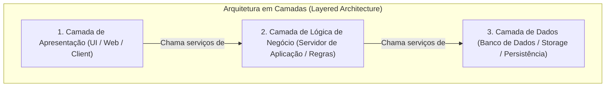
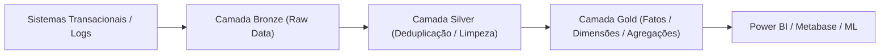

# Aprendizados — Fundamentos de Computação em Nuvem

👋 Bem-vindo ao teu caderno de revisão de **Fundamentos de Computação em Nuvem**! Aqui ficam registrados, de forma resumida, estruturada e visual, os conceitos aprendidos nas aulas para servir como material de revisão ágil e preparação para provas.

---

## Glossário de Siglas

| Sigla | Termo em Inglês | Significado / Tradução no Contexto |
|---|---|---|
| **API** | Application Programming Interface | Interface de Programação de Aplicações; contrato de comunicação entre camadas ou serviços |
| **FTP** | File Transfer Protocol | Protocolo de Transferência de Arquivos na camada de aplicação |
| **HTTP** | Hypertext Transfer Protocol | Protocolo de Transferência de Hipertexto; base da comunicação web |
| **IaaS** | Infrastructure as a Service | Infraestrutura como Serviço (computação, rede e storage brutos) |
| **IP** | Internet Protocol | Protocolo de Internet; endereçamento e roteamento de pacotes |
| **PaaS** | Platform as a Service | Plataforma como Serviço (ambiente pronto para deploy e execução de código) |
| **RDBMS** | Relational Database Management System | Sistema Gerenciador de Banco de Dados Relacional |
| **SaaS** | Software as a Service | Software como Serviço (aplicação final entregue ao usuário pela nuvem) |
| **SLA** | Service Level Agreement | Acordo de Nível de Serviço |
| **SSH** | Secure Shell | Protocolo de comunicação segura via terminal remoto |
| **TCP** | Transmission Control Protocol | Protocolo de Controle de Transmissão com garantia de entrega |
| **UI** | User Interface | Interface do Usuário (camada de apresentação visual) |

---

## 1. Arquitetura de Software e o Modelo em Camadas

### 1.1 O Conceito de Arquitetura em Camadas
A arquitetura em camadas decompõe um sistema complexo em partes menores e organizadas hierarquicamente. Cada camada possui uma responsabilidade bem definida e se comunica apenas com as camadas vizinhas imediatas: a camada superior consome os serviços da camada imediatamente inferior, ocultando os detalhes internos de implementação.



### 1.2 Benefícios da Arquitetura em Camadas
De acordo com Martin Fowler (2007), os principais benefícios observados na abordagem em camadas são:

1. **Baixa Dependência e Baixo Acoplamento**: Uma camada pode ser totalmente reconstruída ou substituída por outra tecnologia sem a necessidade de reconstruir as demais, desde que a interface pública (contrato) seja mantida.
2. **Abstração e Compreensão Isolada**: É possível compreender e manter uma camada como um todo coerente sem precisar dominar as tecnologias internas das outras camadas (ex.: criar um serviço HTTP sem precisar saber como o cabo de rede ou driver de placa funciona).
3. **Substituição e Intercambiabilidade**: Implementações alternativas de um mesmo serviço podem ser trocadas sem alterar as camadas clientes (ex.: trocar o banco Postgres por MySQL mantendo a mesma camada de negócio).
4. **Padronização**: Define pontos claros e padronizados de comunicação e contratos.
5. **Reusabilidade de Camadas Inferiores**: Uma camada de serviços ou de dados já construída pode atender a múltiplos clientes de camadas superiores simultaneamente (ex.: a mesma lógica de negócio atende app mobile, portal web e integrações de terceiros).

### 1.3 Comparativo: Evolução das Arquiteturas de Aplicação

| Modelo Arquitetural | Estrutura | Vantagens | Desvantagens / Gargalos |
|---|---|---|---|
| **Processamento em Lote (Batch)** | Execução sequencial de rotinas sem interação em tempo real | Alto volume de processamento de uma vez | Sem interatividade; atraso no feedback para o usuário |
| **Cliente-Servidor (2 Camadas)** | Cliente (UI + parte das regras) + Servidor de Banco de Dados | Simples para sistemas locais pequenos | Regras espalhadas no cliente (fat client); difícil manutenção e atualização de regras |
| **3 Camadas (Three-Tier)** | Apresentação (UI) $\rightarrow$ Servidor de Aplicações (Regras) $\rightarrow$ Banco de Dados | Regras de negócio centralizadas; cliente leve; segurança no acesso aos dados | Servidor de aplicação monolítico pode se tornar gargalo se mal dimensionado |
| **Multicamadas (N-Tier / N Camadas)** | UI $\rightarrow$ Gateway/Web $\rightarrow$ Serviços Especializados $\rightarrow$ Caching $\rightarrow$ Persistência | Alta escalabilidade independente, alta resiliência, isolamento físico e lógico | Maior complexidade de rede, latência entre saltos e esforço de orquestração |

### 1.4 Ponto de Vista da Engenharia de Sistemas e Cloud
Do ponto de vista de um **arquiteto de soluções em nuvem**, a separação em camadas permite desacoplar os ciclos de vida e escalabilidade de cada componente:
- A camada de apresentação (front-end) escala horizontalmente por demanda de acessos via CDN e instâncias sem estado (*stateless*).
- A camada de lógica de aplicação pode escalar de forma elástica em containers ou funções serverless.
- A camada de dados pode ser protegida em sub-redes privadas sem acesso público, mantendo réplicas e backups isolados.
- Se uma equipe decide reescrever a camada de apresentação de Angular para React, ou migrar o backend de Java para Go, **nenhuma outra camada precisa ser descartada**, desde que os contratos de API sejam preservados.

### 1.5 Exemplo Real em Engenharia de Dados: A Arquitetura Medallion
Na engenharia de dados, o conceito de camadas é aplicado diretamente na **Arquitetura Medallion (Bronze $\rightarrow$ Silver $\rightarrow$ Gold)** e no desacoplamento entre armazenamento e processamento:



- **Mecanismo real**: A camada **Gold** serve as métricas para a diretoria. Se você precisar reescrever a lógica de ingestão na camada **Bronze** (trocando um script Python por um job Spark distribuído), a camada **Gold** e os dashboards dos usuários continuam funcionando sem alteração alguma, porque a camada intermediária e a final mantêm os esquemas e contratos estáveis.

### 1.6 Exemplo com Código (Terraform)
Declaração de infraestrutura em nuvem demonstrando o desacoplamento das camadas de banco/persistência e aplicação, permitindo substituir ou recriar a camada de aplicação sem tocar na camada de dados:

```hcl
# Definição da Camada 3: Banco de Dados Relacional (Persistência)
resource "google_sql_database_instance" "app_database" { # Declara a instância de banco de dados no Google Cloud
  name             = "production-db-instance"            # Nome identificador único da instância de banco
  database_version = "POSTGRES_15"                       # Especifica o motor e versão do banco de dados
  region           = "us-east1"                          # Define a região geográfica onde os dados ficarão armazenados

  settings {                                             # Inicia o bloco de configurações operacionais da instância
    tier = "db-custom-4-16384"                           # Define a capacidade de hardware do banco (4 vCPUs, 16 GB RAM)
  }                                                      # Fecha o bloco de configurações do banco
}                                                        # Fecha a declaração do recurso de banco de dados

# Definição da Camada 2: Aplicação Backend (Pode ser destruída/recriada de forma independente)
resource "google_cloud_run_v2_service" "app_backend" {   # Declara o serviço de backend que roda na camada de aplicação
  name     = "core-business-api"                         # Nome identificador do serviço de negócio
  location = "us-east1"                                  # Região onde os containers da aplicação serão executados

  template {                                             # Especifica o modelo de implantação dos containers
    containers {                                         # Abre a definição do container da aplicação
      image = "gcr.io/my-project/api-service:v2.1"       # Imagem do container com a lógica de negócio compilada
      env {                                              # Configura as variáveis de ambiente necessárias para a API
        name  = "DATABASE_HOST"                          # Nome da variável que aponta para a camada de dados
        value = google_sql_database_instance.app_database.ip_address.0.ip_address # Conecta dinamicamente na Camada 3 pelo IP
      }                                                  # Fecha o bloco da variável de ambiente
    }                                                    # Fecha o bloco de containers
  }                                                      # Fecha o template de execução
}                                                        # Fecha a declaração do serviço de backend
```

---

## 2. O Modelo de Três Camadas (Apresentação, Domínio e Dados)

### 2.1 Papel de Cada Camada e Ponto de Interação
No modelo clássico de três camadas (*Three-Tier Architecture*), as responsabilidades são estritamente particionadas:

1. **Camada de Apresentação (User Interface / UI)**: É a camada mais externa do sistema e o **único ponto onde o usuário final interage diretamente**. Ela é responsável por renderizar as telas, capturar cliques, comandos e preenchimento de formulários, enviando as requisições para a camada de domínio e exibindo as respostas formatadas.
2. **Camada de Domínio / Lógica de Negócio (Servidor de Aplicação)**: Centraliza as regras operacionais, validações de integridade, cálculos e permissões. Não interage com o usuário final diretamente; recebe comandos da camada de apresentação e decide quais dados buscar ou alterar.
3. **Camada de Fonte de Dados (Banco de Dados / Persistência)**: Armazena e recupera os dados persistentes (tabelas, índices, arquivos). É acessada exclusivamente pela camada de domínio, garantindo segurança e integridade transacional.

```mermaid
sequenceDiagram
    autonumber
    actor Usuario as Usuário Final
    participant UI as 1. Camada de Apresentação (Navegador / App)
    participant Backend as 2. Camada de Domínio (Servidor / API)
    participant DB as 3. Camada de Dados (Postgres / BigQuery)

    Usuario->>UI: Interage (digita credenciais / clica em 'Consultar')
    UI->>Backend: Envia requisição via HTTP / REST
    Backend->>Backend: Executa regras de negócio e validações
    Backend->>DB: Executa query SQL (SELECT / INSERT)
    DB-->>Backend: Retorna linhas do banco
    Backend-->>UI: Retorna JSON tratado
    UI-->>Usuario: Renderiza dados na tela de forma visual
```



### 2.2 Tabela Comparativa das 3 Camadas

| Camada | Nome Alternativo | O que faz no sistema | Usuário final acessa direto? | Exemplo de tecnologia |
|---|---|---|:---:|---|
| **Apresentação** | Front-end / UI / Cliente | Renderiza interface visual e captura ações do usuário | **SIM (Único ponto de interação)** | React, Vue, HTML/CSS, Flutter, Streamlit |
| **Domínio** | Lógica de Negócio / Application Server | Valida regras de negócio, calcula métricas e processa comandos | **NÃO** (acessada pela Apresentação) | FastAPI, Node.js, Spring Boot, Go |
| **Fonte de Dados** | Persistência / RDBMS / Data Layer | Grava, indexa e mantém a durabilidade dos registros | **NÃO** (acessada apenas pelo Domínio) | PostgreSQL, BigQuery, MySQL, Cloud Storage |

### 2.3 Exemplo Real em Engenharia de Dados: Consumo de Métricas
Em uma plataforma analítica corporativa moderna:
- **Camada de Apresentação**: Um painel no **Metabase**, **Power BI** ou **Streamlit**, onde o analista de negócios clica em filtros de data e visualiza gráficos.
- **Camada de Domínio**: Uma API intermediária ou o motor de consulta semântica (**Trino / Cube.js**) que aplica regras de governança, restrições de linha por filial (*Row-Level Security*) e calcula KPIs.
- **Camada de Dados**: O **Data Warehouse / Lakehouse** (**BigQuery / Snowflake / Delta Lake**) onde as tabelas Silver e Gold residem particionadas.
- **Mecanismo**: O analista nunca digita comandos de conexão direta com os clusters de banco; ele interage apenas com a interface gráfica da camada de apresentação.

### 2.4 Exemplo com Código (HTML e JavaScript Frontend)
Trecho da camada de apresentação (front-end) demonstrando a captura da interação do usuário e o repasse para a camada de domínio via API:

```html
<!-- Camada de Apresentação: Interface onde o usuário final clica e digita -->
<!DOCTYPE html>                                                  <!-- Declaração do tipo de documento HTML5 -->
<html lang="pt-BR">                                              <!-- Início da página web configurada em português -->
<head>                                                           <!-- Cabeçalho com metadados da página -->
  <meta charset="UTF-8">                                         <!-- Codificação de caracteres padrão UTF-8 -->
  <title>Consulta de Pedidos</title>                             <!-- Título exibido na aba do navegador -->
</head>                                                          <!-- Fechamento do cabeçalho -->
<body>                                                           <!-- Início do corpo visual da página -->
  <h2>Consultar Status de Processamento</h2>                     <!-- Título visual da tela para o usuário -->
  <input type="text" id="pipelineId" placeholder="ID do Job">    <!-- Campo de texto onde o usuário digita a entrada -->
  <button id="btnConsultar">Consultar</button>                   <!-- Botão onde o usuário clica para interagir -->
  <p id="resultado"></p>                                         <!-- Parágrafo onde a resposta visual será exibida -->

  <script>                                                       <!-- Início do script JavaScript da camada de apresentação -->
    document.getElementById("btnConsultar").onclick = async () => { <!-- Escuta o evento de clique do usuário no botão -->
      const jobId = document.getElementById("pipelineId").value; <!-- Captura o valor digitado pelo usuário na tela -->
      const resposta = await fetch(`/api/v1/jobs/${jobId}`);      <!-- Envia a requisição para a Camada 2 (Domínio/API) -->
      const dados = await resposta.json();                       <!-- Converte a resposta recebida em formato JSON -->
      document.getElementById("resultado").innerText = dados.status; <!-- Renderiza o resultado na tela para o usuário ver -->
    };                                                           <!-- Fecha a função de clique -->
  </script>                                                      <!-- Fecha o script -->
</body>                                                          <!-- Fecha o corpo da página -->
</html>                                                          <!-- Fecha a estrutura HTML -->
```
