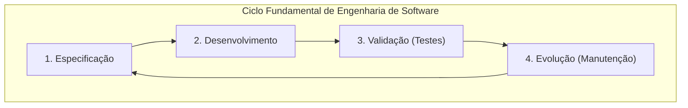
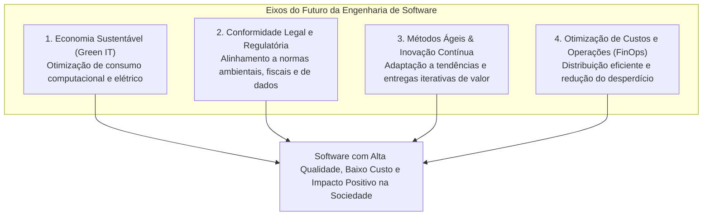
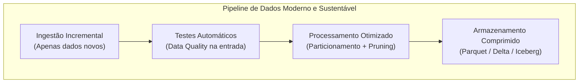

# Aprendizados — Metodologias de Desenvolvimento de Software

👋 Bem-vindo ao teu caderno de revisão de **Metodologias de Desenvolvimento de Software**! Aqui ficam registrados, de forma resumida, estruturada e visual, os conceitos aprendidos nas aulas para servir como material de consulta ágil e preparação para provas.

---

## Glossário de Siglas

| Sigla | Termo em Inglês | Significado / Tradução no Contexto |
|---|---|---|
| **CI/CD** | Continuous Integration / Continuous Deployment | Integração Contínua e Entrega Contínua; automação de testes, build e deploy de software |
| **DataOps** | Data Operations | Metodologia que aplica princípios ágeis e DevOps à criação e manutenção de pipelines de dados |
| **DevOps** | Development and Operations | Cultura e conjunto de práticas que integra desenvolvimento e operações de infraestrutura |
| **ES** | Engenharia de Software | Software Engineering; área da computação voltada à produção sistemática, controlada e eficiente de software |
| **FinOps** | Financial Operations | Prática de governança financeira e otimização contínua de custos em ambientes de nuvem |
| **Green IT** | Green Information Technology | Tecnologia da Informação Verde; práticas focadas em eficiência energética e sustentabilidade computacional |
| **IaC** | Infrastructure as Code | Infraestrutura como Código; provisionamento de recursos de TI via arquivos de configuração declarativos |
| **QA** | Quality Assurance | Garantia de Qualidade; processos sistemáticos para garantir que o software atenda aos requisitos e padrões |
| **SLA** | Service Level Agreement | Acordo de Nível de Serviço; contrato que define metas de disponibilidade, performance e entrega |
| **TCO** | Total Cost of Ownership | Custo Total de Propriedade; soma de todos os custos diretos e indiretos de criação, execução e manutenção de software |

---

## 1. Engenharia de Software e suas Perspectivas Futuras

### 1.1 O Conceito e os Objetivos Centrais da Engenharia de Software
A **Engenharia de Software (ES)** é o ramo da ciência da computação dedicado ao estudo, criação e aplicação de metodologias, ferramentas e técnicas sistemáticas para:
1. **Especificar**: Compreender a fundo as regras de negócio e necessidades reais dos usuários.
2. **Desenvolver**: Construir o código de maneira estruturada, padronizada e modular.
3. **Validar**: Garantir por meio de testes rigorosos que o produto atende ao que foi planejado com alta confiabilidade.
4. **Evoluir (Manutenção)**: Permitir que o sistema seja adaptado, corrigido e expandido ao longo do tempo sem degradação arquitetural.

Os dois grandes pilares de valor da disciplina são:
- **Maximizar a Qualidade**: Entregar software funcional, robusto, seguro e que resolva o problema real.
- **Minimizar os Custos e Prazos**: Eliminar retrabalho, evitar desperdício computacional e de equipe, otimizando o Custo Total de Propriedade (TCO).



---

### 1.2 O Futuro da Engenharia de Software: Sustentabilidade, Legislação e Métodos Ágeis
Conforme observado nas tendências tecnológicas e metodológicas modernas, o futuro da engenharia de software é orientado por quatro eixos centrais:

1. **Economia Sustentável e Computação Verde (Green Computing)**:
   - A relação entre a fabricação de software e o consumo de energia/hardware tornou-se crítica.
   - O desenvolvimento futuro exige algoritmos energeticamente eficientes, arquiteturas serverless e alocação elástica sob demanda, diminuindo a pegada de carbono dos data centers.
2. **Conformidade Regulatória e Governança Legal**:
   - Legislações globais e nacionais (leis de privacidade de dados, normas de descarte, relatórios de emissões e governança corporativa) passam a exigir que o software seja concebido com conformidade por padrão (*Compliance-by-Design*).
3. **Novas Formas de Distribuição, Fabricação e Otimização**:
   - Uso intensivo de automação de testes, CI/CD, observabilidade e telemetria preditiva.
   - Otimização contínua de recursos humanos e computacionais para entregar o máximo valor com o menor custo de execução.
4. **Métodos Ágeis e Ciclos Curtos de Feedback**:
   - Adoção contínua de iterações rápidas para testar hipóteses, adaptar requisitos em tempo real e evitar a construção de softwares obsoletos ou que não atendam às reais necessidades do cliente.



---

### 1.3 Tabela Comparativa: Engenharia Tradicional vs. Engenharia de Software do Futuro

| Critério de Comparação | Abordagem Tradicional (Passado) | Abordagem Moderna e Futura (Tendências) |
|---|---|---|
| **Consumo de Recursos e Infraestrutura** | Alocação fixa e superdimensionada (*over-provisioning*), com servidores ligados 24/7 gerando desperdício financeiro e energético. | Alocação sob demanda, computação *serverless*, arquitetura em containers elásticos e otimização orientada a *Green IT*. |
| **Postura frente a Custos** | Custos de infraestrutura vistos como despesa fixa pós-projeto. | Cultura *FinOps* integrada ao desenvolvimento: medição contínua de custo por transação, query ou pipeline. |
| **Ciclo de Entrega e Validação** | Validação tardia ao final de longos meses de desenvolvimento (alto risco de retrabalho caro). | Entregas frequentes com métodos ágeis, testes automatizados imediatos (CI/CD) e ciclo contínuo de feedback do usuário. |
| **Conformidade e Legislação** | Adequações normativas e legais tratadas como remendos após a entrega do produto. | Conformidade e sustentabilidade exigidas por lei integradas desde a fase de arquitetura e especificação. |
| **Foco na Resolução do Problema** | Foco estrito em cumprir documentos e contratos extensos assinados no início. | Foco empírico no valor real entregue ao usuário, refinando requisitos conforme as tendências e o mercado evoluem. |

---

### 1.4 Ponto de Vista da Engenharia de Sistemas, Hardware e Redes
Para um engenheiro projetando sistemas de grande porte ou firmwares de equipamentos de telecomunicação:
- **Mecanismo real**: Desenvolver software no futuro não é apenas escrever código que executa uma função lógica, mas projetar rotinas que minimizem ciclos de clock da CPU, reduzam o tráfego desnecessário de rede e liberem memória imediatamente.
- **Impacto prático**: Em dispositivos IoT ou roteadores de borda, um algoritmo ineficiente drena baterias rapidamente e superaquece componentes físicos. No nível de data centers de provedores em nuvem, algoritmos otimizados reduzem o custo de refrigeração e a demanda de usinas termoelétricas.

---

### 1.5 Exemplo Real em Engenharia de Dados: FinOps, DataOps e Otimização Energética
Na engenharia de dados corporativa, a convergência entre qualidade, redução de custo e futuro sustentável é evidente em três práticas essenciais:



1. **Ingestão Incremental com *Partition Pruning***:
   - Em vez de reprocessar uma tabela de 50 Terabytes inteira diariamente (consumindo centenas de dólares e gigawatts de processamento), o pipeline lê apenas a partição de data do dia anterior (`WHERE data = CURRENT_DATE - 1`).
2. **Data Quality como Código (*Shift-Left Testing*)**:
   - Validações automáticas (ex.: verificar se há valores nulos em chaves primárias) barram dados corrompidos logo na camada Bronze. Isso evita reprocessamentos em cascata em lote (*backfills*) que custam milhares de dólares de computação em nuvem.
3. **Formatos Colunares Eficientes (Parquet/Iceberg)**:
   - Armazenar dados colunares e comprimidos reduz o espaço em disco em até 85% e permite que queries leiam somente as colunas necessárias, reduzindo os custos de varredura no BigQuery ou Athena.

---

### 1.6 Exemplo com Código: Pipeline em Python com Validação de Qualidade e Otimização FinOps

O exemplo abaixo ilustra uma rotina de engenharia de dados que exemplifica os objetivos da engenharia de software moderna: validação preventiva de qualidade de dados (evitando retrabalho e bugs) e processamento incremental eficiente (reduzindo custo de computação e energia):

```python
import pandas as pd  # Importa a biblioteca pandas para manipulação eficiente de tabelas de dados em memória
from datetime import date, timedelta  # Importa classes para cálculo e controle de datas no calendário

def processar_dados_incrementais_com_qualidade(data_execucao: date) -> pd.DataFrame: # Declara a função do pipeline recebendo a data alvo
    caminho_origem = f"gs://bucket-raw/eventos/ano={data_execucao.year}/mes={data_execucao.month:02d}/dia={data_execucao.day:02d}/" # Monta o caminho particionado para ler apenas a fatia necessária
    
    # 1. Leitura Otimizada (FinOps e Sustentabilidade: evita ler todo o Data Lake)
    df = pd.read_parquet(caminho_origem, columns=["id_transacao", "id_usuario", "valor_transacao", "status"]) # Carrega apenas as colunas úteis em formato colunar comprimido
    
    # 2. Validação de Qualidade de Software (Garantia de Qualidade Preventiva)
    assert not df["id_transacao"].isnull().any(), "Erro de Qualidade: id_transacao não pode conter valores nulos" # Interrompe a execução caso existam registros sem identificador único
    assert (df["valor_transacao"] >= 0).all(), "Erro de Qualidade: valor_transacao não pode ser negativo" # Garante integridade das regras financeiras antes da gravação
    
    # 3. Transformação e Agregação (Foco em resolver o problema do negócio)
    df_aprovadas = df[df["status"] == "CONCLUIDO"].copy() # Filtra em memória apenas as transações finalizadas com sucesso
    df_resultado = df_aprovadas.groupby("id_usuario", as_index=False)["valor_transacao"].sum() # Agrupa o volume financeiro total por cliente
    
    caminho_destino = f"gs://bucket-curated/metricas_diarias/data={data_execucao.isoformat()}/dados.parquet" # Define o caminho de saída particionado por data
    df_resultado.to_parquet(caminho_destino, index=False, compression="snappy") # Salva o resultado final comprimido para baratear queries analíticas futuras
    
    return df_resultado # Retorna o dataframe processado e validado
```
