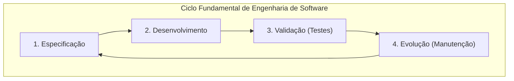
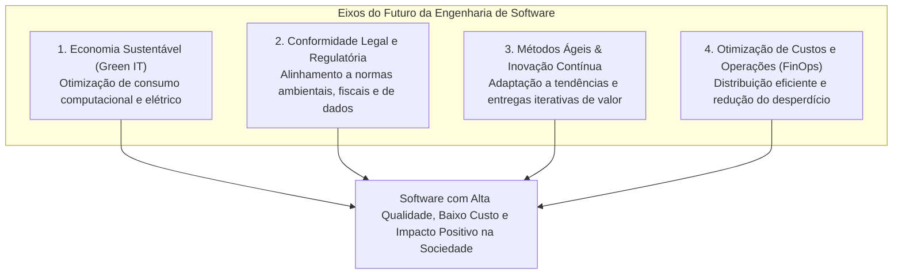
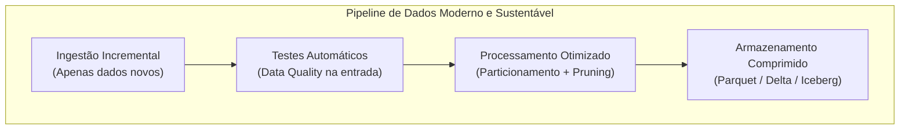
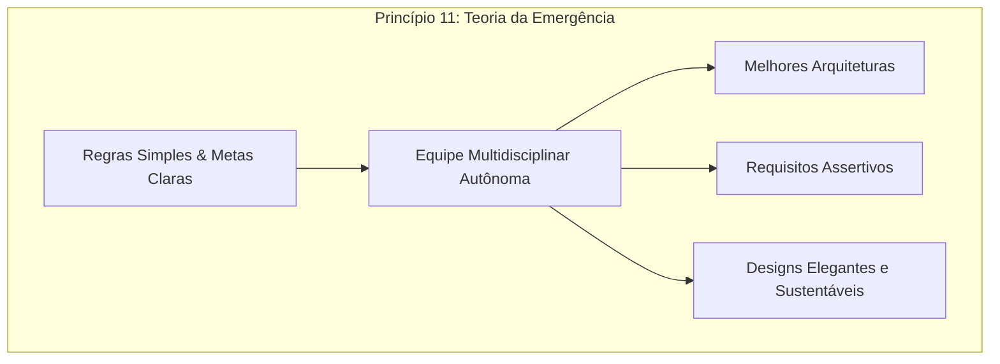

# Aprendizados — Metodologias de Desenvolvimento de Software

👋 Bem-vindo ao teu caderno de revisão de **Metodologias de Desenvolvimento de Software**! Aqui ficam registrados, de forma resumida, estruturada e visual, os conceitos aprendidos nas aulas para servir como material de consulta ágil e preparação para provas.

---

## Glossário de Siglas

| Sigla | Termo em Inglês | Significado / Tradução no Contexto |
|---|---|---|
| **CI/CD** | Continuous Integration / Continuous Deployment | Integração Contínua e Entrega Contínua; automação de testes, build e deploy de software |
| **DataOps** | Data Operations | Metodologia que aplica princípios ágeis e DevOps à criação e manutenção de pipelines de dados |
| **DevOps** | Development and Operations | Cultura e conjunto de práticas que integra desenvolvimento e operações de infraestrutura |
| **ES** | Engenharia de Software | Software Engineering; área da computação voltada à produção sistemática, controlada e eficiente de software |
| **FinOps** | Financial Operations | Prática de governança financeira e otimização contínua de custos em ambientes de nuvem |
| **Green IT** | Green Information Technology | Tecnologia da Informação Verde; práticas focadas em eficiência energética e sustentabilidade computacional |
| **IaC** | Infrastructure as Code | Infraestrutura como Código; provisionamento de recursos de TI via arquivos de configuração declarativos |
| **QA** | Quality Assurance | Garantia de Qualidade; processos sistemáticos para garantir que o software atenda aos requisitos e padrões |
| **SLA** | Service Level Agreement | Acordo de Nível de Serviço; contrato que define metas de disponibilidade, performance e entrega |
| **TCO** | Total Cost of Ownership | Custo Total de Propriedade; soma de todos os custos diretos e indiretos de criação, execução e manutenção de software |

---

## 1. Engenharia de Software e suas Perspectivas Futuras

### 1.1 O Conceito e os Objetivos Centrais da Engenharia de Software
A **Engenharia de Software (ES)** é o ramo da ciência da computação dedicado ao estudo, criação e aplicação de metodologias, ferramentas e técnicas sistemáticas para:
1. **Especificar**: Compreender a fundo as regras de negócio e necessidades reais dos usuários.
2. **Desenvolver**: Construir o código de maneira estruturada, padronizada e modular.
3. **Validar**: Garantir por meio de testes rigorosos que o produto atende ao que foi planejado com alta confiabilidade.
4. **Evoluir (Manutenção)**: Permitir que o sistema seja adaptado, corrigido e expandido ao longo do tempo sem degradação arquitetural.

Os dois grandes pilares de valor da disciplina são:
- **Maximizar a Qualidade**: Entregar software funcional, robusto, seguro e que resolva o problema real.
- **Minimizar os Custos e Prazos**: Eliminar retrabalho, evitar desperdício computacional e de equipe, otimizando o Custo Total de Propriedade (TCO).



---

### 1.2 O Futuro da Engenharia de Software: Sustentabilidade, Legislação e Métodos Ágeis
Conforme observado nas tendências tecnológicas e metodológicas modernas, o futuro da engenharia de software é orientado por quatro eixos centrais:

1. **Economia Sustentável e Computação Verde (Green Computing)**:
   - A relação entre a fabricação de software e o consumo de energia/hardware tornou-se crítica.
   - O desenvolvimento futuro exige algoritmos energeticamente eficientes, arquiteturas serverless e alocação elástica sob demanda, diminuindo a pegada de carbono dos data centers.
2. **Conformidade Regulatória e Governança Legal**:
   - Legislações globais e nacionais (leis de privacidade de dados, normas de descarte, relatórios de emissões e governança corporativa) passam a exigir que o software seja concebido com conformidade por padrão (*Compliance-by-Design*).
3. **Novas Formas de Distribuição, Fabricação e Otimização**:
   - Uso intensivo de automação de testes, CI/CD, observabilidade e telemetria preditiva.
   - Otimização contínua de recursos humanos e computacionais para entregar o máximo valor com o menor custo de execução.
4. **Métodos Ágeis e Ciclos Curtos de Feedback**:
   - Adoção contínua de iterações rápidas para testar hipóteses, adaptar requisitos em tempo real e evitar a construção de softwares obsoletos ou que não atendam às reais necessidades do cliente.



---

### 1.3 Tabela Comparativa: Engenharia Tradicional vs. Engenharia de Software do Futuro

| Critério de Comparação | Abordagem Tradicional (Passado) | Abordagem Moderna e Futura (Tendências) |
|---|---|---|
| **Consumo de Recursos e Infraestrutura** | Alocação fixa e superdimensionada (*over-provisioning*), com servidores ligados 24/7 gerando desperdício financeiro e energético. | Alocação sob demanda, computação *serverless*, arquitetura em containers elásticos e otimização orientada a *Green IT*. |
| **Postura frente a Custos** | Custos de infraestrutura vistos como despesa fixa pós-projeto. | Cultura *FinOps* integrada ao desenvolvimento: medição contínua de custo por transação, query ou pipeline. |
| **Ciclo de Entrega e Validação** | Validação tardia ao final de longos meses de desenvolvimento (alto risco de retrabalho caro). | Entregas frequentes com métodos ágeis, testes automatizados imediatos (CI/CD) e ciclo contínuo de feedback do usuário. |
| **Conformidade e Legislação** | Adequações normativas e legais tratadas como remendos após a entrega do produto. | Conformidade e sustentabilidade exigidas por lei integradas desde a fase de arquitetura e especificação. |
| **Foco na Resolução do Problema** | Foco estrito em cumprir documentos e contratos extensos assinados no início. | Foco empírico no valor real entregue ao usuário, refinando requisitos conforme as tendências e o mercado evoluem. |

---

### 1.4 Ponto de Vista da Engenharia de Sistemas, Hardware e Redes
Para um engenheiro projetando sistemas de grande porte ou firmwares de equipamentos de telecomunicação:
- **Mecanismo real**: Desenvolver software no futuro não é apenas escrever código que executa uma função lógica, mas projetar rotinas que minimizem ciclos de clock da CPU, reduzam o tráfego desnecessário de rede e liberem memória imediatamente.
- **Impacto prático**: Em dispositivos IoT ou roteadores de borda, um algoritmo ineficiente drena baterias rapidamente e superaquece componentes físicos. No nível de data centers de provedores em nuvem, algoritmos otimizados reduzem o custo de refrigeração e a demanda de usinas termoelétricas.

---

### 1.5 Exemplo Real em Engenharia de Dados: FinOps, DataOps e Otimização Energética
Na engenharia de dados corporativa, a convergência entre qualidade, redução de custo e futuro sustentável é evidente em três práticas essenciais:



1. **Ingestão Incremental com *Partition Pruning***:
   - Em vez de reprocessar uma tabela de 50 Terabytes inteira diariamente (consumindo centenas de dólares e gigawatts de processamento), o pipeline lê apenas a partição de data do dia anterior (`WHERE data = CURRENT_DATE - 1`).
2. **Data Quality como Código (*Shift-Left Testing*)**:
   - Validações automáticas (ex.: verificar se há valores nulos em chaves primárias) barram dados corrompidos logo na camada Bronze. Isso evita reprocessamentos em cascata em lote (*backfills*) que custam milhares de dólares de computação em nuvem.
3. **Formatos Colunares Eficientes (Parquet/Iceberg)**:
   - Armazenar dados colunares e comprimidos reduz o espaço em disco em até 85% e permite que queries leiam somente as colunas necessárias, reduzindo os custos de varredura no BigQuery ou Athena.

---

### 1.6 Exemplo com Código: Pipeline em Python com Validação de Qualidade e Otimização FinOps

O exemplo abaixo ilustra uma rotina de engenharia de dados que exemplifica os objetivos da engenharia de software moderna: validação preventiva de qualidade de dados (evitando retrabalho e bugs) e processamento incremental eficiente (reduzindo custo de computação e energia):

```python
import pandas as pd  # Importa a biblioteca pandas para manipulação eficiente de tabelas de dados em memória
from datetime import date, timedelta  # Importa classes para cálculo e controle de datas no calendário

def processar_dados_incrementais_com_qualidade(data_execucao: date) -> pd.DataFrame: # Declara a função do pipeline recebendo a data alvo
    caminho_origem = f"gs://bucket-raw/eventos/ano={data_execucao.year}/mes={data_execucao.month:02d}/dia={data_execucao.day:02d}/" # Monta o caminho particionado para ler apenas a fatia necessária
    
    # 1. Leitura Otimizada (FinOps e Sustentabilidade: evita ler todo o Data Lake)
    df = pd.read_parquet(caminho_origem, columns=["id_transacao", "id_usuario", "valor_transacao", "status"]) # Carrega apenas as colunas úteis em formato colunar comprimido
    
    # 2. Validação de Qualidade de Software (Garantia de Qualidade Preventiva)
    assert not df["id_transacao"].isnull().any(), "Erro de Qualidade: id_transacao não pode conter valores nulos" # Interrompe a execução caso existam registros sem identificador único
    assert (df["valor_transacao"] >= 0).all(), "Erro de Qualidade: valor_transacao não pode ser negativo" # Garante integridade das regras financeiras antes da gravação
    
    # 3. Transformação e Agregação (Foco em resolver o problema do negócio)
    df_aprovadas = df[df["status"] == "CONCLUIDO"].copy() # Filtra em memória apenas as transações finalizadas com sucesso
    df_resultado = df_aprovadas.groupby("id_usuario", as_index=False)["valor_transacao"].sum() # Agrupa o volume financeiro total por cliente
    
    caminho_destino = f"gs://bucket-curated/metricas_diarias/data={data_execucao.isoformat()}/dados.parquet" # Define o caminho de saída particionado por data
    df_resultado.to_parquet(caminho_destino, index=False, compression="snappy") # Salva o resultado final comprimido para baratear queries analíticas futuras
    
    return df_resultado # Retorna o dataframe processado e validado
```

---

## 2. Princípios do Manifesto Ágil e Equipes Auto-Organizáveis

### 2.1 Os Fundamentos dos Princípios Ágeis
O **Manifesto Ágil (2001)** estabeleceu 4 valores fundamentais desdobrados em **12 princípios práticos**. Dentre eles, destaca-se a autonomia e a colaboração técnica:
- **Princípio 4**: Pessoas de negócio e desenvolvedores devem trabalhar juntos diariamente ao longo do projeto.
- **Princípio 7**: Software funcionando é a medida primária de progresso (e não métricas de vaidade ou relatórios de defeitos).
- **Princípio 8**: Os patrocinadores, desenvolvedores e usuários devem ser capazes de manter um ritmo sustentável e constante indefinidamente.
- **Princípio 9**: A contínua atenção à excelência técnica e ao bom design aumenta a agilidade (a simplicidade não é desculpa para código mal estruturado).
- **Princípio 11**: **As melhores arquiteturas, requisitos e designs emergem de equipes auto-organizáveis**.
- **Princípio 12**: Em intervalos regulares, a equipe reflete sobre como se tornar mais eficaz e refina seu comportamento.



---

### 2.2 O Princípio 11 e a Teoria da Emergência
Conforme a aula `08-principios-9-a-12-do-manifesto-agil.md`:
- **Teoria da Emergência**: Em sistemas complexos de desenvolvimento, soluções robustas não surgem de imposições centralizadas de comando-e-controle ou microgerenciamento de tarefas.
- **Mecanismo real**: Fornece-se à equipe um conjunto restrito e simples de regras claras (critérios de aceitação, padrões de código e metas da sprint). A própria equipe decide a melhor forma de organizar o trabalho técnico, escolher as ferramentas e desenhar a arquitetura para atingir a meta.
- **Evitar a Sistematização Excessiva**: Tentar prescrever antecipadamente cada passo e microtarefa burocrática engessa a inovação e aumenta as chances de falhas arquiteturais.

---

### 2.3 Tabela Comparativa: Princípios Reais vs. Distorções Comuns em Avaliações

| Princípio Ágil Real (Canônico) | Conceito Técnico Correto | Distorção / Pegadinha Comum de Prova |
|---|---|---|
| **Software Funcionando (Princípio 7)** | A entrega de software operacional em produção que gera valor é o termômetro de avanço do projeto. | *Dizer que "defeitos no software são a medida primária de progresso"* (Incorreto). |
| **Colaboração Diária (Princípio 4)** | Especialistas de negócio e engenheiros interagem diariamente em ciclos curtos de alinhamento. | *Dizer que "devem trabalhar isoladamente e se reunir apenas ao final"* (Incorreto). |
| **Excelência Técnica (Princípio 9)** | Código limpo, testes automatizados e refatoração contínua viabilizam a velocidade no longo prazo. | *Dizer que "excelência técnica deve ser evitada para não atrasar a agilidade"* (Incorreto). |
| **Ritmo Sustentável (Princípio 8)** | Evita sobrecarga e horas extras crônicas (*burnout*), garantindo previsibilidade estável. | *Dizer que o ritmo constante deve ocorrer "evitando intervalos regulares de descanso/reflexão"* (Incorreto). |
| **Equipes Auto-Organizáveis (Princípio 11)** | As melhores soluções técnicas, requisitos e designs nascem da autonomia do time próximo ao problema. | **Princípio Legítimo e Verdadeiro do Manifesto Ágil.** |

---

### 2.4 Ponto de Vista da Engenharia de Sistemas e Plataforma
Para um líder de engenharia de infraestrutura ou sistemas distribuídos:
- **Mecanismo real**: Um time auto-organizado possui liberdade técnica para definir o particionamento de microsserviços, a topologia de mensageria e o fluxo de CI/CD sem precisar de aprovações burocráticas centralizadas para cada linha de código, desde que respeitem os guardrails de segurança e SLAs da plataforma.

---

### 2.5 Exemplo Real em Engenharia de Dados: Autonomia em Squads e Data Mesh
Na engenharia de dados moderna:
- Em vez de um modelo antigo centralizado onde um único "comitê de arquitetura" ditava como cada tabela deveria ser criada, adota-se o modelo de **Data Mesh / Squads Auto-Organizadas**:
  - A squad de Logística ou Pagamentos tem total autonomia para modelar suas tabelas *Silver* e *Gold*, definir partições e criar transformações SQLX/Dataform.
  - A equipe responde diretamente pela qualidade do dado e pela escolha das melhores estratégias de compressão e indexação para o caso de uso real de negócio.

---

### 2.6 Exemplo com Código: Pipeline Declarativo Autogerenciado (Dataform / SQLX)

No exemplo abaixo, uma equipe de engenharia de dados auto-organizada define declarativamente o contrato, a documentação e os testes de qualidade de sua própria tabela dimensional, sem intervenção burocrática externa:

```sql
-- Definição declarativa da tabela na camada Gold gerenciada pela squad autônoma
config {
  type: "table", -- Define que o Dataform irá materializar este modelo como uma tabela física no BigQuery
  schema: "gold_vendas", -- Especifica o dataset de destino com governança definida pelo próprio time
  description: "Tabela dimensional de clientes ativos modelada pela equipe de dados", -- Documenta a finalidade do modelo para toda a organização
  columns: { -- Inicia a definição e documentação de cada coluna da tabela
    id_cliente: "Identificador exclusivo do cliente no sistema", -- Documenta a chave primária da entidade
    total_compras: "Valor acumulado de compras realizadas pelo cliente", -- Documenta a métrica de negócio calculada
    data_ultima_compra: "Data da transação mais recente do cliente" -- Documenta a data de controle analítico
  }, -- Fecha o bloco de metadados das colunas
  assertions: { -- Bloco de testes automatizados autogerenciados pela equipe
    uniqueKey: ["id_cliente"], -- Garante automaticamente que não existem registros duplicados para o mesmo cliente
    nonNull: ["id_cliente", "total_compras"] -- Valida que colunas obrigatórias jamais contenham valores nulos
  } -- Fecha o bloco de testes de qualidade
}

SELECT
  c.id_cliente, -- Seleciona o identificador do cliente vindo da camada limpa Silver
  COALESCE(SUM(v.valor), 0.0) AS total_compras, -- Soma o total vendido substituindo nulos por zero
  MAX(v.data_venda) AS data_ultima_compra -- Obtém a data da compra mais recente
FROM
  ${ref("silver_clientes")} AS c -- Faz referência à tabela Silver de clientes gerenciada no projeto
LEFT JOIN
  ${ref("silver_vendas")} AS v -- Realiza a junção com a tabela Silver de vendas
  ON c.id_cliente = v.id_cliente -- Condição de relacionamento através do identificador do cliente
GROUP BY
  c.id_cliente -- Agrupa os registros por cliente para consolidação das métricas
```
